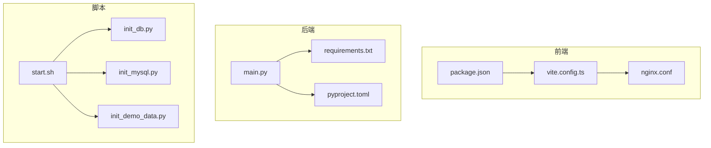
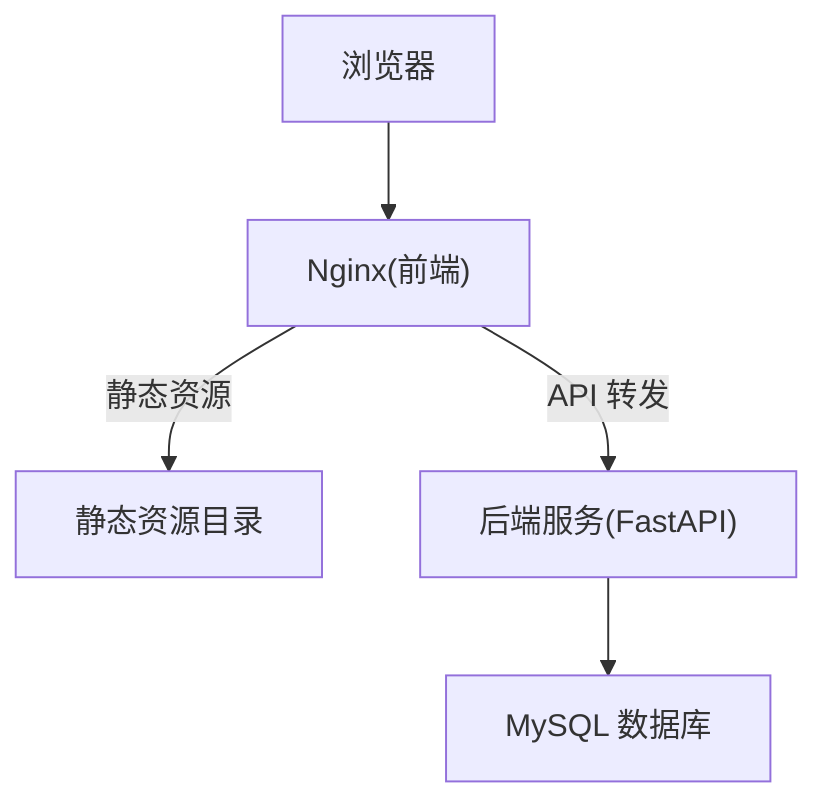
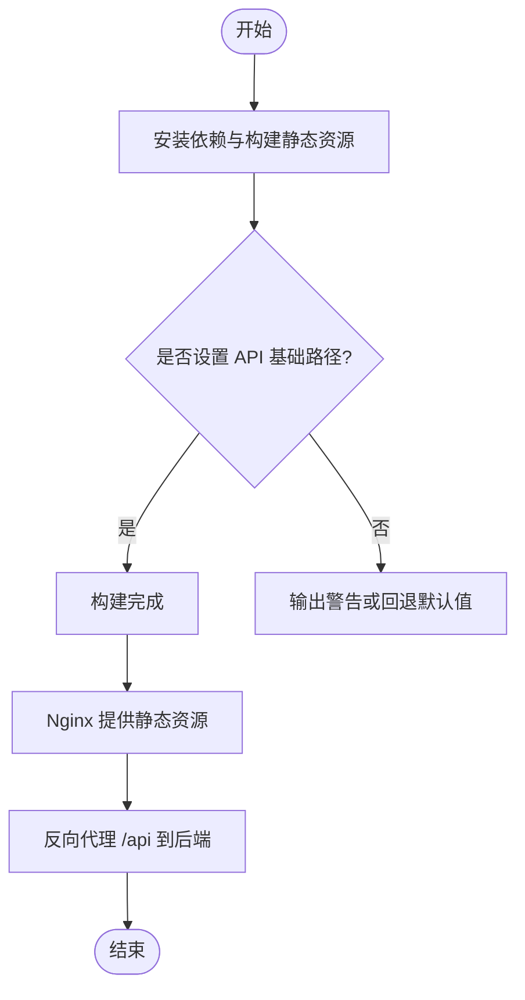
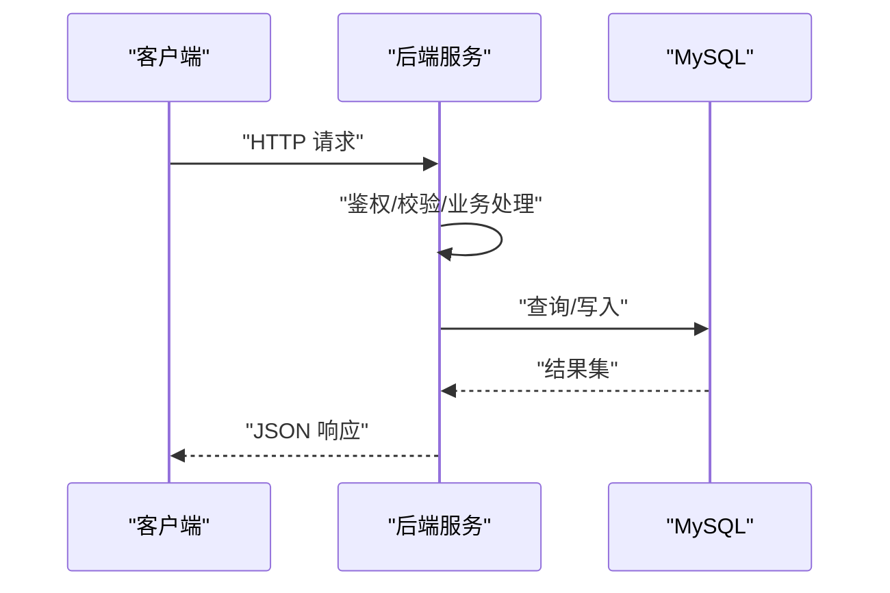
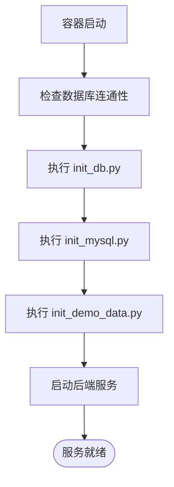
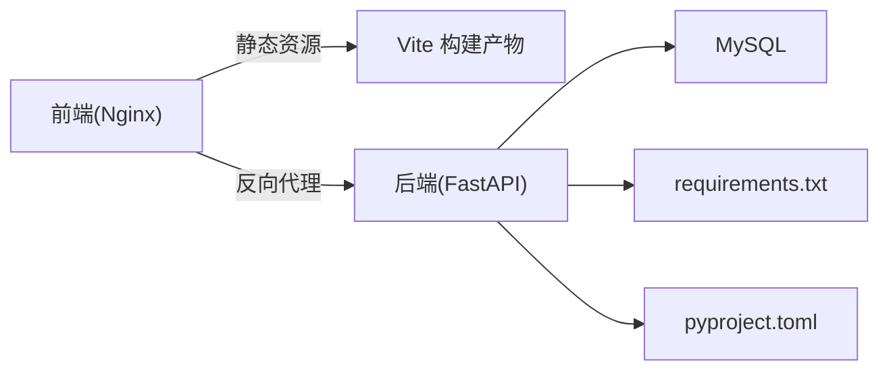

# 容器化部署

<cite>
**本文引用的文件**   
- [frontend/nginx.conf](file://frontend/nginx.conf)
- [frontend/package.json](file://frontend/package.json)
- [frontend/vite.config.ts](file://frontend/vite.config.ts)
- [src/loopse/main.py](file://src/loopse/main.py)
- [requirements.txt](file://requirements.txt)
- [pyproject.toml](file://pyproject.toml)
- [start.sh](file://start.sh)
- [scripts/init_db.py](file://scripts/init_db.py)
- [scripts/init_mysql.py](file://scripts/init_mysql.py)
- [scripts/init_demo_data.py](file://scripts/init_demo_data.py)
</cite>

## 目录
1. [简介](#简介)
2. [项目结构](#项目结构)
3. [核心组件](#核心组件)
4. [架构总览](#架构总览)
5. [详细组件分析](#详细组件分析)
6. [依赖关系分析](#依赖关系分析)
7. [性能考虑](#性能考虑)
8. [故障排查指南](#故障排查指南)
9. [结论](#结论)
10. [附录](#附录)

## 简介
本文件面向生产与本地开发环境，提供 Socrates-Cube 的完整容器化部署方案。内容覆盖：
- Docker 镜像构建策略（前端静态资源、后端服务）
- 容器编排与服务编排配置（Docker Compose、Kubernetes）
- 前后端服务的网络配置与数据持久化方案
- Kubernetes 部署清单、负载均衡与扩缩容策略
- 云服务平台部署指南与本地开发环境的容器化方案

## 项目结构
仓库采用前后端分离结构：
- 前端：基于 Vite + Vue 的静态站点，使用 Nginx 作为反向代理与静态资源服务器
- 后端：Python FastAPI 应用，入口位于 src/loopse/main.py，依赖通过 requirements.txt 管理
- 脚本：数据库初始化与演示数据填充等运维脚本位于 scripts/ 目录
- 启动脚本：根目录 start.sh 用于统一启动流程

图表来源
- [frontend/package.json](file://frontend/package.json)
- [frontend/vite.config.ts](file://frontend/vite.config.ts)
- [frontend/nginx.conf](file://frontend/nginx.conf)
- [src/loopse/main.py](file://src/loopse/main.py)
- [requirements.txt](file://requirements.txt)
- [pyproject.toml](file://pyproject.toml)
- [scripts/init_db.py](file://scripts/init_db.py)
- [scripts/init_mysql.py](file://scripts/init_mysql.py)
- [scripts/init_demo_data.py](file://scripts/init_demo_data.py)
- [start.sh](file://start.sh)

章节来源
- [frontend/package.json](file://frontend/package.json)
- [frontend/vite.config.ts](file://frontend/vite.config.ts)
- [frontend/nginx.conf](file://frontend/nginx.conf)
- [src/loopse/main.py](file://src/loopse/main.py)
- [requirements.txt](file://requirements.txt)
- [pyproject.toml](file://pyproject.toml)
- [scripts/init_db.py](file://scripts/init_db.py)
- [scripts/init_mysql.py](file://scripts/init_mysql.py)
- [scripts/init_demo_data.py](file://scripts/init_demo_data.py)
- [start.sh](file://start.sh)

## 核心组件
- 前端服务
  - 构建产物为静态资源，由 Nginx 提供服务
  - 通过环境变量注入 API 基础地址，便于多环境切换
- 后端服务
  - Python 应用，暴露 HTTP API
  - 依赖外部数据库（MySQL），并提供初始化与演示数据脚本
- 共享脚本
  - 统一的启动与初始化流程，便于在容器内执行

章节来源
- [frontend/nginx.conf](file://frontend/nginx.conf)
- [frontend/vite.config.ts](file://frontend/vite.config.ts)
- [src/loopse/main.py](file://src/loopse/main.py)
- [requirements.txt](file://requirements.txt)
- [scripts/init_db.py](file://scripts/init_db.py)
- [scripts/init_mysql.py](file://scripts/init_mysql.py)
- [scripts/init_demo_data.py](file://scripts/init_demo_data.py)
- [start.sh](file://start.sh)

## 架构总览
下图展示容器化后的整体架构：浏览器访问 Nginx 提供的静态页面，Nginx 将 API 请求转发到后端服务；后端读写 MySQL 数据库。

图表来源
- [frontend/nginx.conf](file://frontend/nginx.conf)
- [src/loopse/main.py](file://src/loopse/main.py)

## 详细组件分析

### 前端容器化策略
- 构建阶段
  - 使用 Node 镜像安装依赖并构建静态资源
  - 通过环境变量注入 API 基础路径，避免硬编码
- 运行阶段
  - 使用 Nginx 镜像提供静态资源与反向代理
  - 挂载 nginx.conf 以自定义路由与健康检查
- 关键配置位置
  - 构建脚本与依赖定义：[frontend/package.json](file://frontend/package.json)
  - 构建配置与环境变量注入：[frontend/vite.config.ts](file://frontend/vite.config.ts)
  - Nginx 反向代理与健康检查：[frontend/nginx.conf](file://frontend/nginx.conf)

章节来源
- [frontend/package.json](file://frontend/package.json)
- [frontend/vite.config.ts](file://frontend/vite.config.ts)
- [frontend/nginx.conf](file://frontend/nginx.conf)

### 后端容器化策略
- 运行时依赖
  - Python 应用依赖通过 requirements.txt 管理
  - 可选元数据与工具定义在 pyproject.toml
- 应用入口
  - 主入口位于 src/loopse/main.py，负责注册路由与中间件
- 数据库连接
  - 通过环境变量配置数据库连接信息
  - 提供初始化脚本确保表结构与初始数据就绪

图表来源
- [src/loopse/main.py](file://src/loopse/main.py)
- [requirements.txt](file://requirements.txt)
- [pyproject.toml](file://pyproject.toml)

章节来源
- [src/loopse/main.py](file://src/loopse/main.py)
- [requirements.txt](file://requirements.txt)
- [pyproject.toml](file://pyproject.toml)

### 数据持久化与初始化
- 数据库持久化
  - 使用 MySQL 卷持久化数据文件，避免容器重启丢失
- 初始化流程
  - 数据库结构初始化：[scripts/init_db.py](file://scripts/init_db.py)
  - MySQL 用户与权限初始化：[scripts/init_mysql.py](file://scripts/init_mysql.py)
  - 演示数据填充：[scripts/init_demo_data.py](file://scripts/init_demo_data.py)
- 统一启动
  - 根目录启动脚本协调初始化与进程启动：[start.sh](file://start.sh)

图表来源
- [scripts/init_db.py](file://scripts/init_db.py)
- [scripts/init_mysql.py](file://scripts/init_mysql.py)
- [scripts/init_demo_data.py](file://scripts/init_demo_data.py)
- [start.sh](file://start.sh)

章节来源
- [scripts/init_db.py](file://scripts/init_db.py)
- [scripts/init_mysql.py](file://scripts/init_mysql.py)
- [scripts/init_demo_data.py](file://scripts/init_demo_data.py)
- [start.sh](file://start.sh)

### 网络配置
- 前端 Nginx
  - 监听端口对外暴露
  - 将 /api 路径反向代理至后端服务域名与端口
- 后端服务
  - 仅在内网暴露端口，供 Nginx 访问
- 环境变量
  - 前端通过环境变量注入 API 基础路径
  - 后端通过环境变量配置数据库连接参数

章节来源
- [frontend/nginx.conf](file://frontend/nginx.conf)
- [frontend/vite.config.ts](file://frontend/vite.config.ts)
- [src/loopse/main.py](file://src/loopse/main.py)

### 容器编排（Docker Compose）
- 服务定义
  - 前端服务：构建静态资源并运行 Nginx
  - 后端服务：构建 Python 应用镜像并运行
  - 数据库服务：运行 MySQL 并挂载数据卷
- 网络与端口
  - 前端对外暴露 80/443
  - 后端仅内部通信
- 环境变量
  - 前端：API_BASE_URL
  - 后端：数据库连接相关变量
- 数据卷
  - MySQL 数据目录持久化
- 健康检查
  - 对后端 API 进行健康探测
- 启动顺序
  - 先启动数据库，再初始化，最后启动后端与前端

章节来源
- [frontend/nginx.conf](file://frontend/nginx.conf)
- [frontend/vite.config.ts](file://frontend/vite.config.ts)
- [src/loopse/main.py](file://src/loopse/main.py)
- [scripts/init_db.py](file://scripts/init_db.py)
- [scripts/init_mysql.py](file://scripts/init_mysql.py)
- [scripts/init_demo_data.py](file://scripts/init_demo_data.py)
- [start.sh](file://start.sh)

### Kubernetes 部署清单
- Deployment
  - 前端 Deployment：副本数可配置，探针指向 Nginx 健康端点
  - 后端 Deployment：副本数可配置，探针指向后端健康端点
- Service
  - 前端 Service：NodePort 或 LoadBalancer 暴露
  - 后端 Service：ClusterIP 仅供内部访问
- Ingress
  - 将 / 路由到前端，/api 路由到后端
- ConfigMap/Secret
  - 前端 API_BASE_URL 通过 ConfigMap 注入
  - 数据库密码等敏感信息通过 Secret 注入
- HorizontalPodAutoscaler
  - 根据 CPU/内存或自定义指标自动扩缩容
- PersistentVolumeClaim
  - 为 MySQL 提供持久存储

章节来源
- [frontend/nginx.conf](file://frontend/nginx.conf)
- [src/loopse/main.py](file://src/loopse/main.py)

### 负载均衡与扩缩容策略
- 负载均衡
  - 前端 Service 与 Ingress 实现流量分发
  - 后端 Service 结合 HPA 实现水平扩展
- 扩缩容策略
  - 基于 CPU/内存阈值的自动扩缩容
  - 针对长连接或高并发场景，可引入自定义指标（如 QPS、延迟）
- 滚动更新
  - 使用 RollingUpdate 策略保证零停机发布

章节来源
- [frontend/nginx.conf](file://frontend/nginx.conf)
- [src/loopse/main.py](file://src/loopse/main.py)

### 云服务平台部署指南
- 通用步骤
  - 准备镜像仓库（私有或公有）
  - 创建命名空间与密钥（数据库密码等）
  - 创建 ConfigMap（前端 API 基础路径）
  - 创建 PVC（MySQL 数据持久化）
  - 创建 Deployment、Service、Ingress、HPA
- 平台差异
  - 不同云平台 Ingress 控制器与证书管理方式可能不同
  - 建议使用平台托管的数据库服务替代自建 MySQL

章节来源
- [frontend/nginx.conf](file://frontend/nginx.conf)
- [src/loopse/main.py](file://src/loopse/main.py)

### 本地开发环境的容器化方案
- 快速启动
  - 使用 docker-compose 一键拉起前端、后端与数据库
- 热重载
  - 前端开发模式可通过挂载源码目录实现热更新
  - 后端可使用开发服务器并挂载源码目录
- 数据初始化
  - 首次启动时自动执行初始化脚本与演示数据填充

章节来源
- [scripts/init_db.py](file://scripts/init_db.py)
- [scripts/init_mysql.py](file://scripts/init_mysql.py)
- [scripts/init_demo_data.py](file://scripts/init_demo_data.py)
- [start.sh](file://start.sh)

## 依赖关系分析
- 前端依赖
  - 构建期：Node 包管理器与 Vite 构建链
  - 运行期：Nginx 静态资源服务与反向代理
- 后端依赖
  - Python 运行时与第三方库（requirements.txt）
  - 外部数据库（MySQL）
- 脚本依赖
  - 数据库驱动与命令行工具

图表来源
- [frontend/nginx.conf](file://frontend/nginx.conf)
- [frontend/vite.config.ts](file://frontend/vite.config.ts)
- [src/loopse/main.py](file://src/loopse/main.py)
- [requirements.txt](file://requirements.txt)
- [pyproject.toml](file://pyproject.toml)

章节来源
- [frontend/nginx.conf](file://frontend/nginx.conf)
- [frontend/vite.config.ts](file://frontend/vite.config.ts)
- [src/loopse/main.py](file://src/loopse/main.py)
- [requirements.txt](file://requirements.txt)
- [pyproject.toml](file://pyproject.toml)

## 性能考虑
- 镜像体积优化
  - 多阶段构建减少最终镜像大小
  - 清理缓存与临时文件
- 资源限制
  - 为容器设置 CPU/内存请求与限制
- 连接池与超时
  - 合理配置数据库连接池与请求超时
- 缓存策略
  - 利用浏览器缓存与 CDN 加速静态资源
- 监控与日志
  - 集中收集日志与指标，便于定位瓶颈

## 故障排查指南
- 常见问题
  - 前端无法访问后端 API：检查 API_BASE_URL 与 Nginx 反向代理规则
  - 后端无法连接数据库：检查数据库连接参数与网络可达性
  - 初始化失败：查看初始化脚本日志与数据库权限
- 诊断步骤
  - 进入容器查看环境变量与配置文件
  - 检查健康检查端点返回状态
  - 查看容器日志与数据库日志

章节来源
- [frontend/nginx.conf](file://frontend/nginx.conf)
- [src/loopse/main.py](file://src/loopse/main.py)
- [scripts/init_db.py](file://scripts/init_db.py)
- [scripts/init_mysql.py](file://scripts/init_mysql.py)
- [scripts/init_demo_data.py](file://scripts/init_demo_data.py)

## 结论
通过上述容器化与编排方案，Socrates-Cube 可在本地与云端稳定运行。建议在生产环境启用 HPA、PVC 与集中式日志监控，并结合 CI/CD 流水线实现自动化构建与发布。

## 附录
- 术语
  - HPA：Horizontal Pod Autoscaler
  - PVC：PersistentVolumeClaim
  - Ingress：Kubernetes 七层负载均衡
- 参考文件
  - 前端构建与代理配置：[frontend/package.json](file://frontend/package.json)、[frontend/vite.config.ts](file://frontend/vite.config.ts)、[frontend/nginx.conf](file://frontend/nginx.conf)
  - 后端入口与依赖：[src/loopse/main.py](file://src/loopse/main.py)、[requirements.txt](file://requirements.txt)、[pyproject.toml](file://pyproject.toml)
  - 初始化与启动脚本：[scripts/init_db.py](file://scripts/init_db.py)、[scripts/init_mysql.py](file://scripts/init_mysql.py)、[scripts/init_demo_data.py](file://scripts/init_demo_data.py)、[start.sh](file://start.sh)