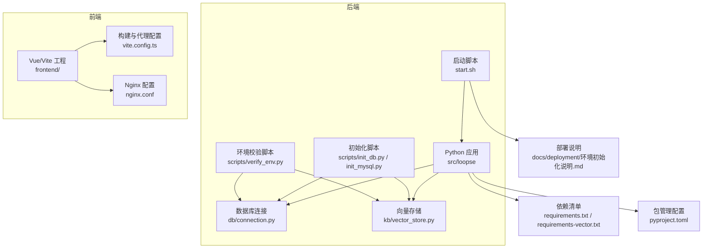
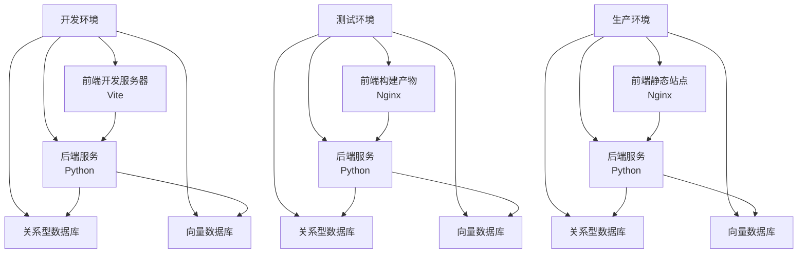
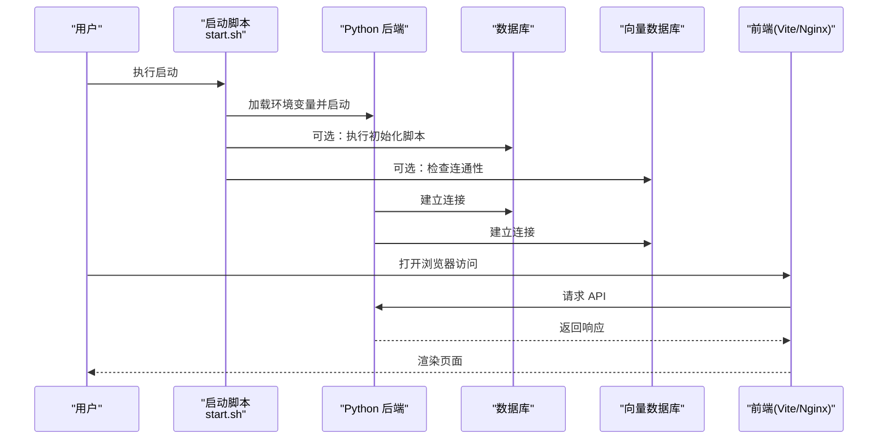
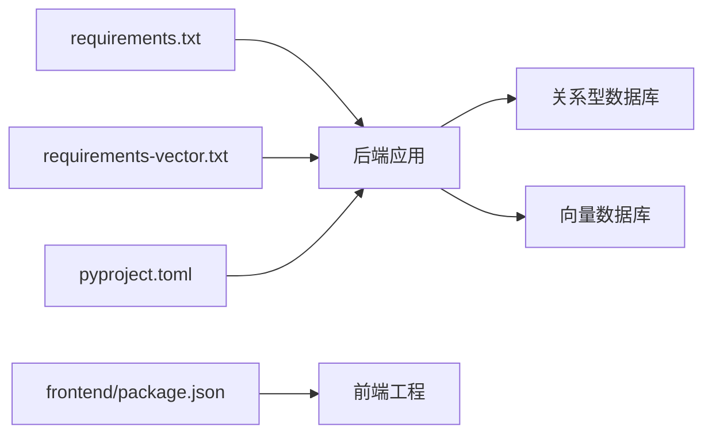

# 环境搭建与配置

<cite>
**本文引用的文件**   
- [requirements.txt](file://requirements.txt)
- [requirements-vector.txt](file://requirements-vector.txt)
- [pyproject.toml](file://pyproject.toml)
- [start.sh](file://start.sh)
- [scripts/init_db.py](file://scripts/init_db.py)
- [scripts/init_mysql.py](file://scripts/init_mysql.py)
- [scripts/verify_env.py](file://scripts/verify_env.py)
- [src/loopse/db/connection.py](file://src/loopse/db/connection.py)
- [src/loopse/kb/vector_store.py](file://src/loopse/kb/vector_store.py)
- [frontend/package.json](file://frontend/package.json)
- [frontend/vite.config.ts](file://frontend/vite.config.ts)
- [frontend/nginx.conf](file://frontend/nginx.conf)
- [docs/deployment/环境初始化说明.md](file://docs/deployment/环境初始化说明.md)
</cite>

## 目录
1. [简介](#简介)
2. [项目结构](#项目结构)
3. [核心组件](#核心组件)
4. [架构总览](#架构总览)
5. [详细组件分析](#详细组件分析)
6. [依赖关系分析](#依赖关系分析)
7. [性能考虑](#性能考虑)
8. [故障排查指南](#故障排查指南)
9. [结论](#结论)
10. [附录](#附录)

## 简介
本指南面向开发者、测试工程师与运维人员，提供从本地开发到生产部署的完整环境搭建与配置说明。内容覆盖：
- Python 与 Node.js 环境准备
- 数据库与向量数据库初始化
- 环境变量与配置文件模板
- 常见环境问题定位与解决
- 环境验证与服务启动流程

## 项目结构
本项目采用前后端分离架构：
- 后端服务基于 Python，使用脚本进行数据库与知识库初始化，并通过统一入口启动服务
- 前端基于 Vue + Vite，通过 Nginx 或开发服务器提供服务
- 文档与部署说明位于 docs/deployment 下

图表来源
- [start.sh](file://start.sh)
- [scripts/init_db.py](file://scripts/init_db.py)
- [scripts/init_mysql.py](file://scripts/init_mysql.py)
- [scripts/verify_env.py](file://scripts/verify_env.py)
- [src/loopse/db/connection.py](file://src/loopse/db/connection.py)
- [src/loopse/kb/vector_store.py](file://src/loopse/kb/vector_store.py)
- [frontend/vite.config.ts](file://frontend/vite.config.ts)
- [frontend/nginx.conf](file://frontend/nginx.conf)
- [requirements.txt](file://requirements.txt)
- [requirements-vector.txt](file://requirements-vector.txt)
- [pyproject.toml](file://pyproject.toml)
- [docs/deployment/环境初始化说明.md](file://docs/deployment/环境初始化说明.md)

章节来源
- [start.sh](file://start.sh)
- [docs/deployment/环境初始化说明.md](file://docs/deployment/环境初始化说明.md)

## 核心组件
- Python 运行环境与依赖
  - 使用 requirements.txt 与 requirements-vector.txt 管理基础与向量库依赖
  - pyproject.toml 提供项目元数据与可选依赖声明
- 数据库与向量存储
  - 数据库连接由 db/connection.py 负责
  - 向量存储由 kb/vector_store.py 负责
- 初始化与校验
  - scripts/init_db.py 与 scripts/init_mysql.py 用于数据库与种子数据初始化
  - scripts/verify_env.py 用于环境自检（Python、依赖、外部服务连通性）
- 服务启动
  - start.sh 作为统一启动入口，协调后端服务与必要前置步骤
- 前端工程
  - frontend/package.json 定义 Node.js 依赖与脚本
  - frontend/vite.config.ts 配置开发代理与构建选项
  - frontend/nginx.conf 提供生产静态资源与反向代理配置

章节来源
- [requirements.txt](file://requirements.txt)
- [requirements-vector.txt](file://requirements-vector.txt)
- [pyproject.toml](file://pyproject.toml)
- [src/loopse/db/connection.py](file://src/loopse/db/connection.py)
- [src/loopse/kb/vector_store.py](file://src/loopse/kb/vector_store.py)
- [scripts/init_db.py](file://scripts/init_db.py)
- [scripts/init_mysql.py](file://scripts/init_mysql.py)
- [scripts/verify_env.py](file://scripts/verify_env.py)
- [start.sh](file://start.sh)
- [frontend/package.json](file://frontend/package.json)
- [frontend/vite.config.ts](file://frontend/vite.config.ts)
- [frontend/nginx.conf](file://frontend/nginx.conf)

## 架构总览
下图展示开发、测试与生产环境的通用组件与交互关系。不同环境在端口、域名、密钥与外部服务地址上存在差异。

[此图为概念性架构图，不直接映射具体源码文件]

## 详细组件分析

### Python 环境与依赖安装
- 版本要求
  - 建议使用与 requirements.txt 兼容的 Python 版本（参考依赖声明）
- 虚拟环境
  - 创建并激活虚拟环境后，分别安装基础依赖与向量库依赖
- 依赖清单
  - requirements.txt：后端核心依赖
  - requirements-vector.txt：向量检索相关依赖
- 项目配置
  - pyproject.toml：包含项目元数据与可选依赖

章节来源
- [requirements.txt](file://requirements.txt)
- [requirements-vector.txt](file://requirements-vector.txt)
- [pyproject.toml](file://pyproject.toml)

### Node.js 环境与前端构建
- 版本要求
  - 根据 frontend/package.json 中的引擎约束选择 Node.js 版本
- 依赖安装与脚本
  - 使用 package.json 中定义的脚本执行安装、开发与构建
- 开发代理
  - frontend/vite.config.ts 配置开发时 API 代理至后端服务
- 生产部署
  - frontend/nginx.conf 提供静态资源托管与反向代理示例

章节来源
- [frontend/package.json](file://frontend/package.json)
- [frontend/vite.config.ts](file://frontend/vite.config.ts)
- [frontend/nginx.conf](file://frontend/nginx.conf)

### 数据库初始化
- 目标
  - 建立关系型数据库实例与必要表结构
  - 填充演示数据（如需要）
- 工具与脚本
  - scripts/init_db.py：通用数据库初始化逻辑
  - scripts/init_mysql.py：MySQL 特定初始化逻辑
- 注意事项
  - 确保数据库连接参数正确（主机、端口、用户名、密码、库名）
  - 首次运行建议先执行建库与建表，再执行种子数据

章节来源
- [scripts/init_db.py](file://scripts/init_db.py)
- [scripts/init_mysql.py](file://scripts/init_mysql.py)

### 向量数据库配置
- 目标
  - 配置向量存储客户端与索引策略
- 关键实现
  - src/loopse/kb/vector_store.py：封装向量存储连接、写入与检索接口
- 配置项
  - 连接地址、认证信息、索引维度与相似度度量等（以实际代码为准）
- 验证
  - 可通过 verify_env.py 检查向量库连通性与基本读写能力

章节来源
- [src/loopse/kb/vector_store.py](file://src/loopse/kb/vector_store.py)
- [scripts/verify_env.py](file://scripts/verify_env.py)

### 环境变量与配置文件
- 环境变量
  - 数据库连接、向量库地址、LLM 服务密钥等应通过环境变量注入
  - 建议在 .env 文件中维护本地变量，并在启动脚本中加载
- 配置文件模板
  - 可参考现有脚本与配置位置，复制为模板并根据环境修改
- 安全建议
  - 生产环境避免将敏感信息提交到仓库，使用密钥管理服务或容器编排注入

章节来源
- [scripts/verify_env.py](file://scripts/verify_env.py)
- [start.sh](file://start.sh)

### 服务启动流程
- 统一入口
  - start.sh：协调依赖检查、数据库初始化（可选）、启动后端服务
- 前端访问
  - 开发模式：通过 Vite 开发服务器访问
  - 生产模式：通过 Nginx 托管静态资源并反向代理至后端
- 健康检查
  - 结合 verify_env.py 与后端健康接口确认服务就绪

图表来源
- [start.sh](file://start.sh)
- [scripts/init_db.py](file://scripts/init_db.py)
- [src/loopse/db/connection.py](file://src/loopse/db/connection.py)
- [src/loopse/kb/vector_store.py](file://src/loopse/kb/vector_store.py)
- [frontend/vite.config.ts](file://frontend/vite.config.ts)
- [frontend/nginx.conf](file://frontend/nginx.conf)

章节来源
- [start.sh](file://start.sh)
- [frontend/vite.config.ts](file://frontend/vite.config.ts)
- [frontend/nginx.conf](file://frontend/nginx.conf)

## 依赖关系分析
- Python 依赖
  - requirements.txt：核心运行时依赖
  - requirements-vector.txt：向量检索扩展依赖
  - pyproject.toml：项目元数据与可选依赖
- 前端依赖
  - frontend/package.json：Node.js 依赖与脚本命令
- 外部服务
  - 关系型数据库与向量数据库的连接由后端模块负责

图表来源
- [requirements.txt](file://requirements.txt)
- [requirements-vector.txt](file://requirements-vector.txt)
- [pyproject.toml](file://pyproject.toml)
- [frontend/package.json](file://frontend/package.json)
- [src/loopse/db/connection.py](file://src/loopse/db/connection.py)
- [src/loopse/kb/vector_store.py](file://src/loopse/kb/vector_store.py)

章节来源
- [requirements.txt](file://requirements.txt)
- [requirements-vector.txt](file://requirements-vector.txt)
- [pyproject.toml](file://pyproject.toml)
- [frontend/package.json](file://frontend/package.json)

## 性能考虑
- 数据库连接池
  - 合理设置连接池大小与超时，避免连接耗尽
- 向量检索优化
  - 调整索引维度、批量写入与分页查询策略
- 前端缓存
  - 合理使用浏览器缓存与 CDN，减少重复请求
- 资源限制
  - 在生产环境为后端进程设置 CPU/内存上限，防止资源争用

[本节为通用指导，无需源码引用]

## 故障排查指南
- 环境校验
  - 使用 scripts/verify_env.py 检查 Python 版本、依赖安装情况与外部服务连通性
- 数据库问题
  - 检查 scripts/init_db.py 与 scripts/init_mysql.py 的参数与权限
  - 确认连接字符串、端口与防火墙规则
- 向量库问题
  - 检查 src/loopse/kb/vector_store.py 的配置项与网络可达性
- 前端代理问题
  - 核对 frontend/vite.config.ts 的代理目标与跨域设置
- 启动失败
  - 查看 start.sh 的执行日志，确认环境变量是否生效

章节来源
- [scripts/verify_env.py](file://scripts/verify_env.py)
- [scripts/init_db.py](file://scripts/init_db.py)
- [scripts/init_mysql.py](file://scripts/init_mysql.py)
- [src/loopse/kb/vector_store.py](file://src/loopse/kb/vector_store.py)
- [frontend/vite.config.ts](file://frontend/vite.config.ts)
- [start.sh](file://start.sh)

## 结论
通过本指南，您可以完成从本地开发到生产部署的环境搭建与配置。建议在不同环境严格区分配置与密钥，并使用自动化脚本与校验工具保障一致性。

[本节为总结性内容，无需源码引用]

## 附录
- 快速检查清单
  - Python 与 Node.js 版本满足要求
  - 依赖安装成功（基础与向量库）
  - 数据库与向量库连通性正常
  - 环境变量已正确注入
  - 前端代理与后端服务可互相访问
  - 使用 verify_env.py 与环境健康接口完成最终验证
- 参考文档
  - docs/deployment/环境初始化说明.md：部署与环境初始化补充说明

章节来源
- [docs/deployment/环境初始化说明.md](file://docs/deployment/环境初始化说明.md)