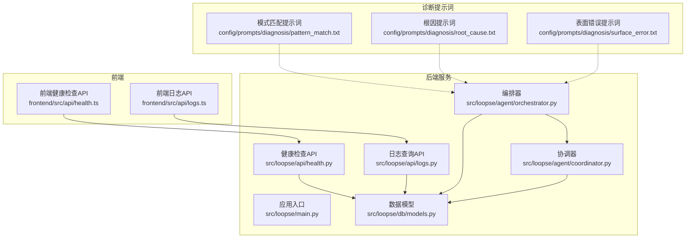
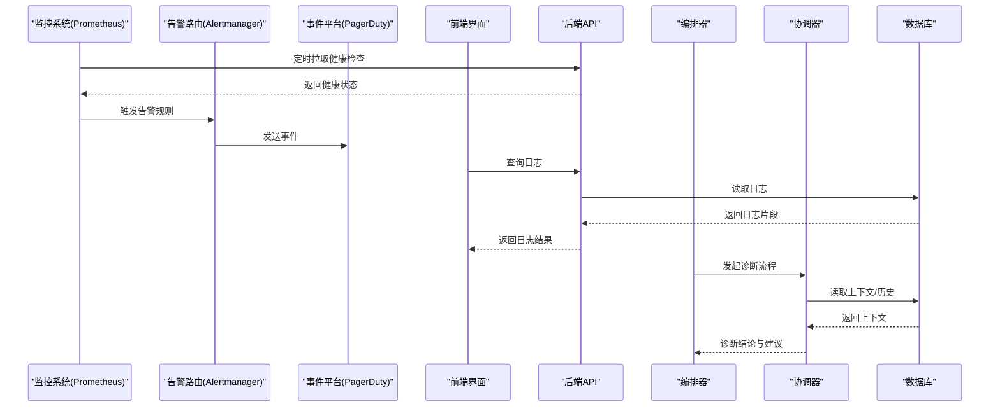
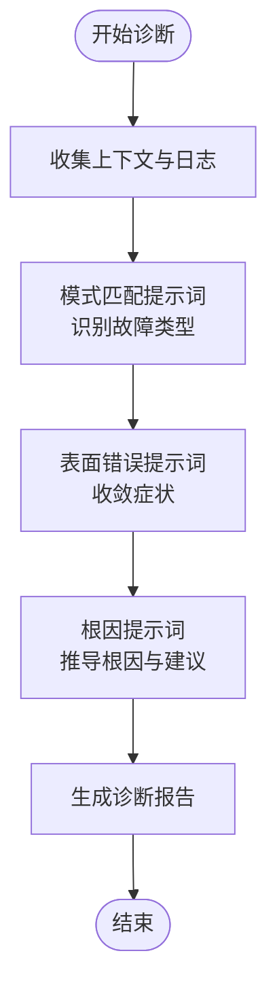
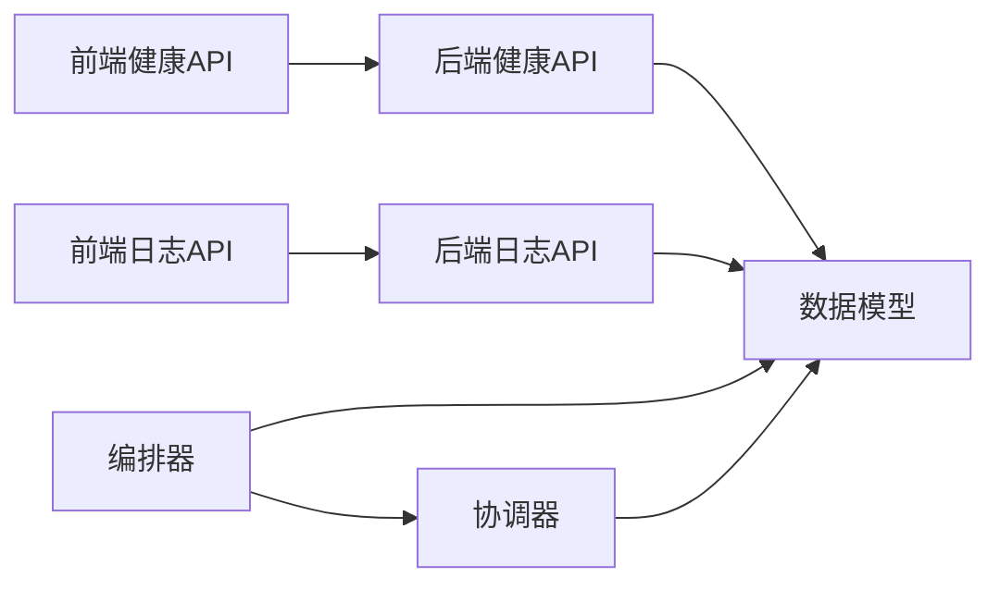
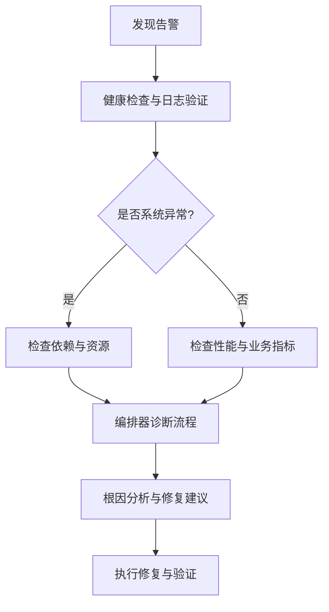

# 告警与故障诊断

<cite>
**本文引用的文件**   
- [src/loopse/api/health.py](file://src/loopse/api/health.py)
- [src/loopse/api/logs.py](file://src/loopse/api/logs.py)
- [frontend/src/api/health.ts](file://frontend/src/api/health.ts)
- [frontend/src/api/logs.ts](file://frontend/src/api/logs.ts)
- [config/prompts/diagnosis/pattern_match.txt](file://config/prompts/diagnosis/pattern_match.txt)
- [config/prompts/diagnosis/root_cause.txt](file://config/prompts/diagnosis/root_cause.txt)
- [config/prompts/diagnosis/surface_error.txt](file://config/prompts/diagnosis/surface_error.txt)
- [src/loopse/agent/orchestrator.py](file://src/loopse/agent/orchestrator.py)
- [src/loopse/agent/coordinator.py](file://src/loopse/agent/coordinator.py)
- [src/loopse/db/models.py](file://src/loopse/db/models.py)
- [src/loopse/main.py](file://src/loopse/main.py)
- [start.sh](file://start.sh)
</cite>

## 目录
1. [简介](#简介)
2. [项目结构](#项目结构)
3. [核心组件](#核心组件)
4. [架构总览](#架构总览)
5. [详细组件分析](#详细组件分析)
6. [依赖关系分析](#依赖关系分析)
7. [性能考量](#性能考量)
8. [故障排查指南](#故障排查指南)
9. [结论](#结论)
10. [附录](#附录)

## 简介
本实践指南面向运维、SRE与研发工程师，围绕“告警系统与故障诊断”的目标，结合仓库中已有的健康检查、日志接口与诊断提示词等能力，给出：
- 告警规则设计原则与阈值设定方法（系统异常、性能退化、业务指标异常）
- Prometheus Alertmanager 与 PagerDuty 的集成配置要点
- 常见故障场景的诊断流程、根因分析方法与定位技巧
- 通知渠道（邮件、短信、企业微信等）与告警升级机制设置方案

说明：本项目未内置专用监控采集器或告警引擎，但提供了健康检查与日志查询接口，以及用于诊断的提示词模板。本文基于这些能力进行扩展与实践指导。

## 项目结构
从代码组织看，后端提供健康检查与日志查询 API；前端封装对应客户端；诊断相关提示词位于配置目录；编排与协调逻辑位于 agent 层；数据库模型定义在 db 层；应用入口与启动脚本位于顶层。

图表来源
- [src/loopse/api/health.py](file://src/loopse/api/health.py)
- [src/loopse/api/logs.py](file://src/loopse/api/logs.py)
- [frontend/src/api/health.ts](file://frontend/src/api/health.ts)
- [frontend/src/api/logs.ts](file://frontend/src/api/logs.ts)
- [src/loopse/agent/orchestrator.py](file://src/loopse/agent/orchestrator.py)
- [src/loopse/agent/coordinator.py](file://src/loopse/agent/coordinator.py)
- [src/loopse/db/models.py](file://src/loopse/db/models.py)
- [config/prompts/diagnosis/pattern_match.txt](file://config/prompts/diagnosis/pattern_match.txt)
- [config/prompts/diagnosis/root_cause.txt](file://config/prompts/diagnosis/root_cause.txt)
- [config/prompts/diagnosis/surface_error.txt](file://config/prompts/diagnosis/surface_error.txt)

章节来源
- [src/loopse/main.py](file://src/loopse/main.py)
- [src/loopse/api/health.py](file://src/loopse/api/health.py)
- [src/loopse/api/logs.py](file://src/loopse/api/logs.py)
- [frontend/src/api/health.ts](file://frontend/src/api/health.ts)
- [frontend/src/api/logs.ts](file://frontend/src/api/logs.ts)
- [src/loopse/agent/orchestrator.py](file://src/loopse/agent/orchestrator.py)
- [src/loopse/agent/coordinator.py](file://src/loopse/agent/coordinator.py)
- [src/loopse/db/models.py](file://src/loopse/db/models.py)
- [config/prompts/diagnosis/pattern_match.txt](file://config/prompts/diagnosis/pattern_match.txt)
- [config/prompts/diagnosis/root_cause.txt](file://config/prompts/diagnosis/root_cause.txt)
- [config/prompts/diagnosis/surface_error.txt](file://config/prompts/diagnosis/surface_error.txt)

## 核心组件
- 健康检查接口：对外暴露服务可用性探针，供外部监控系统拉取，作为系统异常类告警的基础信号。
- 日志查询接口：提供结构化日志检索能力，便于快速定位问题上下文与时间线。
- 诊断提示词：为自动化诊断提供模式匹配、根因分析与表面错误归因的提示词模板，可被编排器调用以辅助排障。
- 编排与协调：编排器负责任务调度与子代理协作，协调器负责跨模块协同，二者共同支撑复杂诊断流程的执行。
- 数据模型：统一的数据实体定义，为健康状态、日志记录与诊断结果提供持久化基础。

章节来源
- [src/loopse/api/health.py](file://src/loopse/api/health.py)
- [src/loopse/api/logs.py](file://src/loopse/api/logs.py)
- [config/prompts/diagnosis/pattern_match.txt](file://config/prompts/diagnosis/pattern_match.txt)
- [config/prompts/diagnosis/root_cause.txt](file://config/prompts/diagnosis/root_cause.txt)
- [config/prompts/diagnosis/surface_error.txt](file://config/prompts/diagnosis/surface_error.txt)
- [src/loopse/agent/orchestrator.py](file://src/loopse/agent/orchestrator.py)
- [src/loopse/agent/coordinator.py](file://src/loopse/agent/coordinator.py)
- [src/loopse/db/models.py](file://src/loopse/db/models.py)

## 架构总览
下图展示从外部监控系统到后端服务的告警与诊断链路，包括健康检查、日志查询与编排式诊断的交互。

图表来源
- [src/loopse/api/health.py](file://src/loopse/api/health.py)
- [src/loopse/api/logs.py](file://src/loopse/api/logs.py)
- [src/loopse/agent/orchestrator.py](file://src/loopse/agent/orchestrator.py)
- [src/loopse/agent/coordinator.py](file://src/loopse/agent/coordinator.py)
- [src/loopse/db/models.py](file://src/loopse/db/models.py)

## 详细组件分析

### 健康检查与健康探针
- 职责：提供轻量级健康检查端点，输出服务可用性与关键依赖状态，供外部监控系统周期性探测。
- 使用方式：Prometheus 通过 HTTP 拉取该端点，若连续失败则判定服务不可用，触发系统异常类告警。
- 建议指标：进程存活、依赖可达性（如数据库连接）、资源水位（CPU/内存/磁盘）。

章节来源
- [src/loopse/api/health.py](file://src/loopse/api/health.py)
- [frontend/src/api/health.ts](file://frontend/src/api/health.ts)

### 日志查询与上下文收集
- 职责：提供日志检索接口，支持按时间范围、关键字、级别过滤，便于快速构建问题时间线与上下文。
- 使用方式：前端或诊断工具调用日志接口，聚合多源日志，形成排障视图。
- 建议字段：时间戳、级别、模块、请求ID、用户标识、错误码、堆栈摘要。

章节来源
- [src/loopse/api/logs.py](file://src/loopse/api/logs.py)
- [frontend/src/api/logs.ts](file://frontend/src/api/logs.ts)

### 诊断提示词与自动化诊断
- 模式匹配提示词：用于将原始错误信息映射到已知故障模式，加速分类与分流。
- 表面错误提示词：聚焦于直接可见的错误现象，帮助收敛搜索空间。
- 根因提示词：引导深入分析，结合上下文与历史数据推导根本原因与修复建议。
- 编排器与协调器：编排器负责任务拆分与执行顺序，协调器负责跨模块协作与状态同步。

图表来源
- [config/prompts/diagnosis/pattern_match.txt](file://config/prompts/diagnosis/pattern_match.txt)
- [config/prompts/diagnosis/surface_error.txt](file://config/prompts/diagnosis/surface_error.txt)
- [config/prompts/diagnosis/root_cause.txt](file://config/prompts/diagnosis/root_cause.txt)
- [src/loopse/agent/orchestrator.py](file://src/loopse/agent/orchestrator.py)
- [src/loopse/agent/coordinator.py](file://src/loopse/agent/coordinator.py)

章节来源
- [config/prompts/diagnosis/pattern_match.txt](file://config/prompts/diagnosis/pattern_match.txt)
- [config/prompts/diagnosis/surface_error.txt](file://config/prompts/diagnosis/surface_error.txt)
- [config/prompts/diagnosis/root_cause.txt](file://config/prompts/diagnosis/root_cause.txt)
- [src/loopse/agent/orchestrator.py](file://src/loopse/agent/orchestrator.py)
- [src/loopse/agent/coordinator.py](file://src/loopse/agent/coordinator.py)

### 数据模型与持久化
- 作用：定义健康状态、日志条目、诊断结果等实体的结构与约束，确保一致性。
- 关注点：索引策略（时间、级别、模块）、分页与限流、敏感字段脱敏。

章节来源
- [src/loopse/db/models.py](file://src/loopse/db/models.py)

### 应用入口与启动
- 作用：初始化服务、注册路由、加载配置、启动监听端口。
- 建议：在启动阶段注入健康检查与日志中间件，确保早期可观测性。

章节来源
- [src/loopse/main.py](file://src/loopse/main.py)
- [start.sh](file://start.sh)

## 依赖关系分析
- 前端依赖后端健康与日志接口，实现可视化监控与排障。
- 后端健康与日志接口依赖数据模型进行读写。
- 编排器与协调器依赖数据模型获取上下文与历史记录，并可能调用提示词模板驱动诊断。

图表来源
- [frontend/src/api/health.ts](file://frontend/src/api/health.ts)
- [frontend/src/api/logs.ts](file://frontend/src/api/logs.ts)
- [src/loopse/api/health.py](file://src/loopse/api/health.py)
- [src/loopse/api/logs.py](file://src/loopse/api/logs.py)
- [src/loopse/agent/orchestrator.py](file://src/loopse/agent/orchestrator.py)
- [src/loopse/agent/coordinator.py](file://src/loopse/agent/coordinator.py)
- [src/loopse/db/models.py](file://src/loopse/db/models.py)

## 性能考量
- 健康检查应轻量且幂等，避免引入额外开销；建议仅检查必要依赖与关键资源。
- 日志查询需分页与限流，防止大查询导致数据库压力；对高频字段建立索引。
- 编排式诊断应避免长时阻塞，采用异步任务与超时控制；必要时引入缓存与去抖。
- 告警风暴抑制：在 Alertmanager 中启用分组、抑制与静默策略，减少重复与噪声。

[本节为通用指导，不直接分析具体文件]

## 故障排查指南

### 告警规则设计与阈值设定
- 系统异常类
  - 健康检查连续失败次数阈值（例如连续3次失败）
  - 进程崩溃与重启频率（例如5分钟内重启超过2次）
  - 依赖不可达（数据库、消息队列、外部服务）
- 性能退化类
  - 响应时间P95/P99超阈（例如P95>500ms）
  - 错误率上升（例如5xx比例>1%）
  - 资源水位（CPU>80%持续5分钟、内存>85%、磁盘>90%）
- 业务指标异常类
  - 关键转化率下降（例如下单成功率<95%）
  - 活跃用户数突降（例如环比下降>30%）
  - 任务积压（例如队列长度>阈值且持续增长）

建议：
- 分层阈值：预警（Warning）与严重（Critical）两级，配合不同通知渠道与升级策略。
- 动态基线：对季节性波动明显的指标使用同比/环比基线，降低误报。
- 关联告警：将系统异常与性能退化关联，避免孤立告警造成噪音。

[本节为通用指导，不直接分析具体文件]

### Prometheus 与 Alertmanager 集成要点
- 在 Prometheus 中定义告警规则，指向健康检查与日志聚合指标。
- 在 Alertmanager 中配置路由、分组、抑制与静默策略。
- 对接 PagerDuty：配置 Service Key 与路由规则，将 Critical 告警映射至 PagerDuty 事件。

[本节为通用指导，不直接分析具体文件]

### 通知渠道与升级机制
- 邮件：适用于非紧急告警与日报汇总。
- 短信：适用于高优先级告警，确保及时触达。
- 企业微信/钉钉/Slack：适用于团队即时沟通与协作。
- 升级机制：
  - 首次通知：低优先级渠道（邮件/IM）
  - 未处理超时：升级至短信/电话
  - 持续未解决：升级至更高级别负责人或值班经理

[本节为通用指导，不直接分析具体文件]

### 常见故障场景与诊断流程
- 场景一：服务不可用
  - 步骤：确认健康检查失败 → 查看最近日志 → 检查依赖可达性 → 编排器触发诊断流程 → 根据根因提示词输出修复建议
- 场景二：性能退化
  - 步骤：观察P95/P99与错误率 → 定位热点接口与慢查询 → 检查资源水位与GC情况 → 调整参数或扩容
- 场景三：业务指标异常
  - 步骤：对比基线与趋势 → 关联系统异常与变更事件 → 使用模式匹配提示词归类问题 → 制定回滚或补偿策略

[本节为通用指导，不直接分析具体文件]

### 根因分析方法与定位技巧
- 五问法：连续追问“为什么”，直至找到可控的根本原因。
- 时间线还原：基于日志与事件序列重建故障发生过程。
- 假设-验证：提出可能原因，逐一验证并排除。
- 回归测试：修复后复测关键路径，确保问题不再重现。

[本节为通用指导，不直接分析具体文件]

## 结论
本项目已具备健康检查与日志查询能力，并配有诊断提示词与编排式诊断框架。在此基础上，结合 Prometheus、Alertmanager 与 PagerDuty 等工具，可构建完整的告警与故障诊断体系。建议优先完善健康探针与日志聚合，随后逐步引入性能与业务指标告警，并通过升级机制与多渠道通知提升响应效率。

[本节为总结性内容，不直接分析具体文件]

## 附录
- 启动与服务管理：参考应用入口与启动脚本，确保健康检查与日志中间件在启动阶段正确注入。
- 前端监控面板：利用前端健康与日志接口，构建可视化监控与排障页面。

章节来源
- [src/loopse/main.py](file://src/loopse/main.py)
- [start.sh](file://start.sh)
- [frontend/src/api/health.ts](file://frontend/src/api/health.ts)
- [frontend/src/api/logs.ts](file://frontend/src/api/logs.ts)