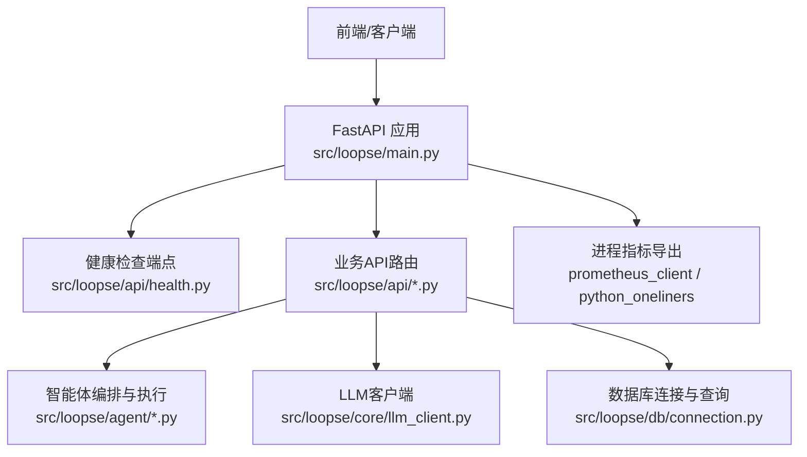
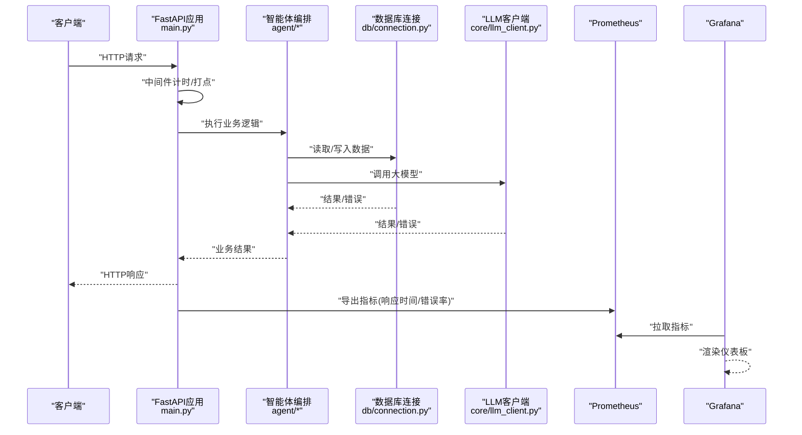
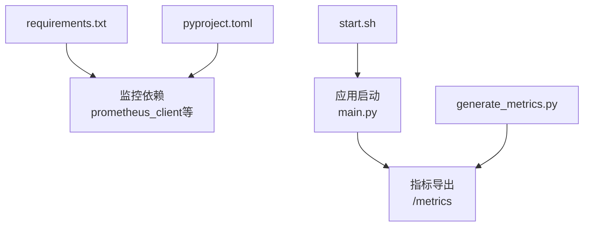

# 性能监控

<cite>
**本文引用的文件**   
- [src/loopse/main.py](file://src/loopse/main.py)
- [src/loopse/api/health.py](file://src/loopse/api/health.py)
- [src/loopse/db/connection.py](file://src/loopse/db/connection.py)
- [src/loopse/core/llm_client.py](file://src/loopse/core/llm_client.py)
- [generate_metrics.py](file://generate_metrics.py)
- [start.sh](file://start.sh)
- [requirements.txt](file://requirements.txt)
- [pyproject.toml](file://pyproject.toml)
</cite>

## 目录
1. [简介](#简介)
2. [项目结构](#项目结构)
3. [核心组件](#核心组件)
4. [架构总览](#架构总览)
5. [详细组件分析](#详细组件分析)
6. [依赖分析](#依赖分析)
7. [性能考虑](#性能考虑)
8. [故障排查指南](#故障排查指南)
9. [结论](#结论)
10. [附录](#附录)

## 简介
本文件面向Socrates-Cube系统的性能监控与可观测性建设，目标是：
- 明确关键性能指标(KPI)定义与采集方法，包括API响应时间、智能体执行效率、数据库查询性能等。
- 给出Prometheus与Grafana的配置建议与自定义仪表板搭建步骤。
- 提供性能瓶颈识别、内存使用监控、CPU利用率分析的实现方案。
- 制定性能测试基准与持续监控的最佳实践。

## 项目结构
从仓库结构看，后端服务位于src/loopse下，包含API路由、数据库连接、LLM客户端等模块；根目录存在脚本与启动入口。为便于落地监控，建议在以下位置埋点：
- API层：统一拦截器或中间件记录请求耗时、状态码、路径与方法。
- 业务层（智能体）：在编排器与子代理调用处记录执行时长与成功率。
- 数据层：对数据库连接池与查询进行耗时统计。
- LLM调用：对外部大模型接口调用进行延迟与错误率统计。
- 进程级指标：暴露Python运行时指标（如内存、GC、线程）。

图表来源
- [src/loopse/main.py](file://src/loopse/main.py)
- [src/loopse/api/health.py](file://src/loopse/api/health.py)
- [src/loopse/core/llm_client.py](file://src/loopse/core/llm_client.py)
- [src/loopse/db/connection.py](file://src/loopse/db/connection.py)

章节来源
- [src/loopse/main.py](file://src/loopse/main.py)
- [src/loopse/api/health.py](file://src/loopse/api/health.py)
- [src/loopse/core/llm_client.py](file://src/loopse/core/llm_client.py)
- [src/loopse/db/connection.py](file://src/loopse/db/connection.py)

## 核心组件
本节聚焦于与性能监控密切相关的核心组件及其埋点建议。

- 应用入口与中间件
  - 在应用初始化阶段注册全局中间件，统一收集HTTP请求的起止时间、路径、方法、状态码、异常信息，并输出到指标系统。
  - 参考路径：[src/loopse/main.py](file://src/loopse/main.py)

- 健康检查端点
  - 提供健康探针，用于负载均衡与健康检查。建议同时返回依赖项（数据库、外部服务）的状态摘要。
  - 参考路径：[src/loopse/api/health.py](file://src/loopse/api/health.py)

- 数据库连接与查询
  - 在连接建立、事务提交/回滚、查询执行前后记录耗时与错误计数，区分慢查询阈值。
  - 参考路径：[src/loopse/db/connection.py](file://src/loopse/db/connection.py)

- LLM客户端
  - 封装外部大模型调用，记录请求耗时、重试次数、失败原因、Token用量（若可用），并支持熔断与退避策略。
  - 参考路径：[src/loopse/core/llm_client.py](file://src/loopse/core/llm_client.py)

- 指标导出脚本
  - 根目录存在指标生成脚本，可用于补充自定义指标或集成第三方采集器。
  - 参考路径：[generate_metrics.py](file://generate_metrics.py)

章节来源
- [src/loopse/main.py](file://src/loopse/main.py)
- [src/loopse/api/health.py](file://src/loopse/api/health.py)
- [src/loopse/db/connection.py](file://src/loopse/db/connection.py)
- [src/loopse/core/llm_client.py](file://src/loopse/core/llm_client.py)
- [generate_metrics.py](file://generate_metrics.py)

## 架构总览
下图展示从请求进入、经过API层、智能体编排、数据库与LLM调用，到指标采集与导出的整体流程。

图表来源
- [src/loopse/main.py](file://src/loopse/main.py)
- [src/loopse/api/health.py](file://src/loopse/api/health.py)
- [src/loopse/core/llm_client.py](file://src/loopse/core/llm_client.py)
- [src/loopse/db/connection.py](file://src/loopse/db/connection.py)

## 详细组件分析

### API响应时间监控
- 目标KPI
  - 请求总数、成功/失败数、P50/P90/P99延迟、按路径与方法的分布、错误率。
- 采集方法
  - 在应用入口注册中间件，记录每个请求的开始与结束时间，计算耗时并写入指标。
  - 结合状态码与路径维度进行聚合。
- 配置要点
  - 设置合理的分位数桶，避免过度细分导致指标爆炸。
  - 对长尾请求单独标记，便于定位热点接口。
- 可视化
  - Grafana中创建“API延迟分布”、“错误率趋势”、“Top N接口”面板。

章节来源
- [src/loopse/main.py](file://src/loopse/main.py)

### 智能体执行效率监控
- 目标KPI
  - 各智能体任务完成时长、成功率、重试次数、队列积压量（如有）。
- 采集方法
  - 在编排器与各子代理调用边界埋点，记录开始/结束时间与异常信息。
  - 对关键路径（诊断、资源生成、检索）分别打标。
- 优化建议
  - 引入并发控制与超时保护，避免单点阻塞。
  - 对慢任务进行采样日志与上下文追踪。
- 可视化
  - “智能体任务耗时直方图”、“成功率热力图”、“任务队列深度”。

章节来源
- [src/loopse/main.py](file://src/loopse/main.py)

### 数据库查询性能监控
- 目标KPI
  - 连接池大小、活跃连接数、等待时间、查询耗时分布、慢查询数量、事务失败率。
- 采集方法
  - 在连接建立、查询执行、事务提交/回滚处打点，记录耗时与错误。
  - 对慢查询阈值进行告警。
- 配置要点
  - 合理设置连接池上限与空闲回收策略。
  - 对高频查询增加索引与缓存。
- 可视化
  - “连接池使用率”、“查询延迟分布”、“慢查询TOP N”。

章节来源
- [src/loopse/db/connection.py](file://src/loopse/db/connection.py)

### LLM调用性能监控
- 目标KPI
  - 外部大模型调用延迟、成功率、重试次数、限流/熔断触发次数、Token消耗（若可用）。
- 采集方法
  - 在客户端封装层记录请求起止时间、状态码、错误类型与重试次数。
  - 对上游限流与降级事件进行计数。
- 配置要点
  - 实现指数退避与熔断，防止雪崩。
  - 对敏感信息进行脱敏后再上报。
- 可视化
  - “LLM延迟分布”、“错误类型占比”、“熔断开关状态”。

章节来源
- [src/loopse/core/llm_client.py](file://src/loopse/core/llm_client.py)

### 进程级指标与资源使用
- 目标KPI
  - CPU利用率、内存占用、GC次数与停顿、线程数、文件描述符使用。
- 采集方法
  - 使用Python运行时指标库（如prometheus_client）暴露进程指标。
  - 结合系统工具（psutil）采集更细粒度信息。
- 配置要点
  - 限制指标标签基数，避免高基导致存储压力。
  - 定期清理无用标签值。
- 可视化
  - “CPU使用率”、“内存使用曲线”、“GC活动”。

章节来源
- [src/loopse/main.py](file://src/loopse/main.py)

### 健康检查与就绪探针
- 目标KPI
  - 服务存活、依赖可用性（数据库、外部服务）、自检通过状态。
- 采集方法
  - 提供健康检查端点，返回综合状态与依赖详情。
- 配置要点
  - 将健康检查纳入容器编排与负载均衡的健康探测。
- 可视化
  - “服务健康状态”、“依赖可用性矩阵”。

章节来源
- [src/loopse/api/health.py](file://src/loopse/api/health.py)

## 依赖分析
- 运行时依赖
  - 监控相关依赖可能存在于requirements或pyproject中，需确认是否已引入prometheus_client或其他指标库。
- 启动与部署
  - start.sh用于服务启动，可在其中注入环境变量以启用监控导出端口。
- 指标生成脚本
  - generate_metrics.py可作为自定义指标的补充采集手段。

图表来源
- [requirements.txt](file://requirements.txt)
- [pyproject.toml](file://pyproject.toml)
- [start.sh](file://start.sh)
- [src/loopse/main.py](file://src/loopse/main.py)
- [generate_metrics.py](file://generate_metrics.py)

章节来源
- [requirements.txt](file://requirements.txt)
- [pyproject.toml](file://pyproject.toml)
- [start.sh](file://start.sh)
- [generate_metrics.py](file://generate_metrics.py)

## 性能考虑
- 指标设计原则
  - 选择有业务意义的指标，避免过度打点造成开销。
  - 控制标签基数，避免高基导致存储与查询压力。
- 采样与聚合
  - 对高频指标采用滑动窗口与分位数近似算法。
  - 对慢查询与异常进行采样日志，减少全量记录。
- 异步与批处理
  - 指标上报采用异步批量发送，降低主链路影响。
- 容量规划
  - 根据QPS与指标基数估算Prometheus存储需求，预留扩容空间。

## 故障排查指南
- 常见问题
  - 指标缺失：检查中间件是否注册、导出端口是否开放、权限是否正确。
  - 延迟突增：查看P99延迟面板与慢查询列表，定位热点接口与SQL。
  - 错误率上升：关注错误类型分布与重试次数，检查下游依赖健康状态。
- 快速定位
  - 使用Grafana的“Top N接口”与“错误类型占比”面板缩小范围。
  - 结合智能体任务耗时与重试情况，判断是否为编排层问题。
- 恢复建议
  - 临时扩容或降级非关键功能。
  - 调整连接池与超时参数，缓解拥塞。

## 结论
通过在API层、智能体编排、数据库与LLM调用等关键路径埋点，并结合Prometheus与Grafana构建统一的监控体系，可以全面掌握系统性能表现，快速定位瓶颈并采取优化措施。建议持续完善指标字典与告警规则，形成闭环的性能治理机制。

## 附录

### Prometheus与Grafana配置建议
- 指标采集
  - 在应用启动时暴露/metrics端点，确保Prometheus可抓取。
  - 如需额外指标，可通过generate_metrics.py补充。
- 抓取配置
  - 在Prometheus配置中添加服务发现或静态目标，设置合适的抓取间隔。
- 仪表板
  - 创建“API延迟分布”、“错误率趋势”、“智能体任务耗时”、“数据库连接池使用率”、“LLM调用延迟”等面板。
  - 为关键指标设置阈值告警，如P99延迟、错误率、连接池饱和。

### 性能测试基准与持续监控最佳实践
- 基准测试
  - 定义典型场景的负载模型（QPS、并发、混合读写比例）。
  - 在压测环境中运行，记录关键KPI作为基线。
- 持续监控
  - 将压测与线上指标对比，设定回归阈值。
  - 在CI/CD流水线中加入自动化性能校验。
- 告警策略
  - 基于多指标组合告警，减少误报。
  - 分级告警（警告、严重），并配套应急预案。