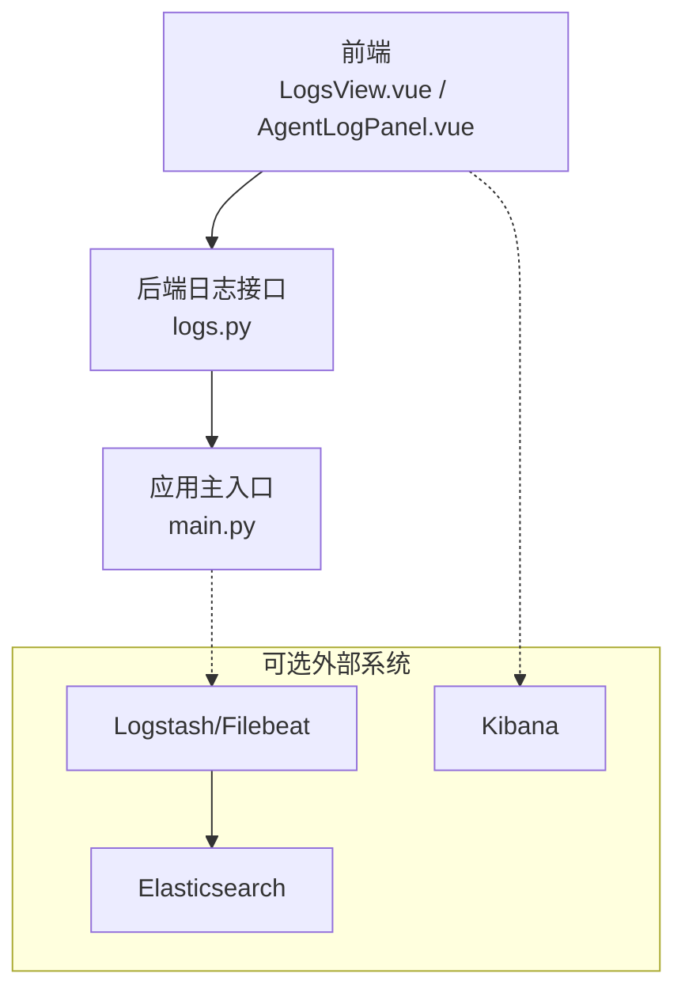
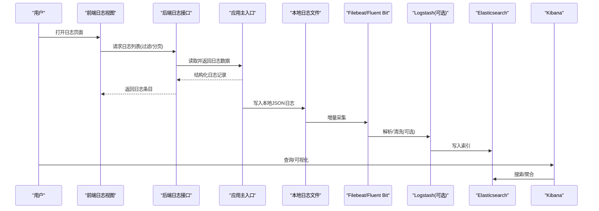
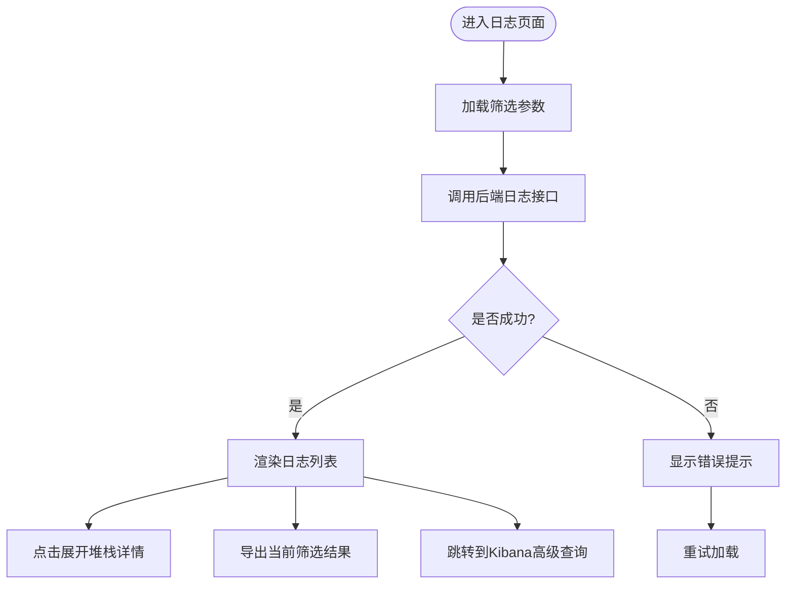

# 日志收集与分析

<cite>
**本文引用的文件**   
- [src/loopse/api/logs.py](file://src/loopse/api/logs.py)
- [frontend/src/api/logs.ts](file://frontend/src/api/logs.ts)
- [frontend/src/views/LogsView.vue](file://frontend/src/views/LogsView.vue)
- [frontend/src/components/AgentLogPanel.vue](file://frontend/src/components/AgentLogPanel.vue)
- [src/loopse/main.py](file://src/loopse/main.py)
</cite>

## 目录
1. [简介](#简介)
2. [项目结构](#项目结构)
3. [核心组件](#核心组件)
4. [架构总览](#架构总览)
5. [详细组件分析](#详细组件分析)
6. [依赖关系分析](#依赖关系分析)
7. [性能考虑](#性能考虑)
8. [故障排查指南](#故障排查指南)
9. [结论](#结论)
10. [附录](#附录)

## 简介
本指南面向“Socrates-Cube”项目的日志收集与分析，目标是：
- 设计结构化日志格式、统一日志级别与上下文字段
- 覆盖智能体执行日志、API调用日志、错误堆栈日志的采集策略
- 提供ELK Stack（Elasticsearch、Logstash、Kibana）或同类系统的部署与接入方案
- 给出查询语法、聚合分析与可视化报表制作方法
- 说明日志轮转、压缩存储与长期归档配置

## 项目结构
本项目在前后端均具备日志相关能力：
- 后端提供日志查询接口，用于检索系统运行日志
- 前端提供日志查看页面与智能体日志面板，便于交互式排障
- 应用主入口负责服务启动与中间件挂载，为后续接入外部日志系统预留扩展点

图表来源
- [src/loopse/api/logs.py](file://src/loopse/api/logs.py)
- [frontend/src/views/LogsView.vue](file://frontend/src/views/LogsView.vue)
- [frontend/src/components/AgentLogPanel.vue](file://frontend/src/components/AgentLogPanel.vue)
- [src/loopse/main.py](file://src/loopse/main.py)

章节来源
- [src/loopse/api/logs.py](file://src/loopse/api/logs.py)
- [frontend/src/api/logs.ts](file://frontend/src/api/logs.ts)
- [frontend/src/views/LogsView.vue](file://frontend/src/views/LogsView.vue)
- [frontend/src/components/AgentLogPanel.vue](file://frontend/src/components/AgentLogPanel.vue)
- [src/loopse/main.py](file://src/loopse/main.py)

## 核心组件
- 后端日志接口：提供按条件检索日志的能力，供前端展示与导出
- 前端日志视图：以表格/列表形式呈现日志条目，支持筛选与分页
- 智能体日志面板：聚焦智能体执行过程的关键事件与状态变化
- 应用主入口：承载全局中间件与生命周期钩子，便于集中注入上下文信息

章节来源
- [src/loopse/api/logs.py](file://src/loopse/api/logs.py)
- [frontend/src/views/LogsView.vue](file://frontend/src/views/LogsView.vue)
- [frontend/src/components/AgentLogPanel.vue](file://frontend/src/components/AgentLogPanel.vue)
- [src/loopse/main.py](file://src/loopse/main.py)

## 架构总览
建议采用“应用本地结构化日志 + 外部日志系统”的分层架构：
- 应用层：输出JSON结构化日志，包含时间戳、级别、模块、请求ID、用户ID、智能体ID等上下文
- 采集层：通过Filebeat/Fluent Bit将本地日志文件投递到Logstash或直接写入Elasticsearch
- 存储层：Elasticsearch索引按日期分片，保留策略由ILM管理
- 展示层：Kibana进行查询、聚合与可视化；同时保留前端日志面板用于快速定位问题

图表来源
- [src/loopse/api/logs.py](file://src/loopse/api/logs.py)
- [frontend/src/views/LogsView.vue](file://frontend/src/views/LogsView.vue)
- [frontend/src/components/AgentLogPanel.vue](file://frontend/src/components/AgentLogPanel.vue)
- [src/loopse/main.py](file://src/loopse/main.py)

## 详细组件分析

### 后端日志接口
职责
- 接收前端日志查询参数（时间范围、级别、模块、关键字、分页等）
- 从本地日志文件或已持久化的日志源中检索并返回结果
- 保证返回字段一致且可被Kibana直接消费

关键要点
- 输入校验与边界处理：时间范围合法性、分页参数上限、关键字转义
- 性能优化：只返回必要字段、使用游标分页、对高频字段建立映射
- 安全控制：鉴权、最小权限访问、敏感字段脱敏

章节来源
- [src/loopse/api/logs.py](file://src/loopse/api/logs.py)

### 前端日志视图
职责
- 渲染日志列表，支持筛选、排序、分页
- 提供跳转至Kibana高级查询的快捷方式
- 展示错误堆栈的可折叠详情

交互流程

章节来源
- [frontend/src/views/LogsView.vue](file://frontend/src/views/LogsView.vue)
- [frontend/src/api/logs.ts](file://frontend/src/api/logs.ts)

### 智能体日志面板
职责
- 聚焦智能体执行链路的关键事件：规划、检索、生成、评估、记忆更新等
- 提供按智能体实例、会话ID、任务类型筛选
- 高亮异常路径与耗时热点

章节来源
- [frontend/src/components/AgentLogPanel.vue](file://frontend/src/components/AgentLogPanel.vue)

### 应用主入口
职责
- 初始化全局中间件，注入请求级上下文（如请求ID、用户ID、租户ID）
- 统一异常捕获与错误日志输出
- 为后续接入外部日志系统提供扩展点

章节来源
- [src/loopse/main.py](file://src/loopse/main.py)

## 依赖关系分析
- 前端日志视图依赖日志API封装模块
- 日志API依赖应用主入口提供的上下文与日志基础设施
- 外部采集器依赖本地日志文件路径与格式规范

图表来源
- [frontend/src/views/LogsView.vue](file://frontend/src/views/LogsView.vue)
- [frontend/src/api/logs.ts](file://frontend/src/api/logs.ts)
- [src/loopse/api/logs.py](file://src/loopse/api/logs.py)
- [src/loopse/main.py](file://src/loopse/main.py)

章节来源
- [frontend/src/api/logs.ts](file://frontend/src/api/logs.ts)
- [src/loopse/api/logs.py](file://src/loopse/api/logs.py)
- [src/loopse/main.py](file://src/loopse/main.py)

## 性能考虑
- 日志写入
  - 异步落盘与批量写入，避免阻塞主线程
  - 控制单条日志大小，避免大对象序列化
- 查询性能
  - 合理设置索引映射与分片策略
  - 使用滚动窗口与冷热分层，减少热节点压力
- 前端体验
  - 分页与懒加载，避免一次性渲染大量日志
  - 缓存常用筛选条件与最近查询

[本节为通用指导，不直接分析具体文件]

## 故障排查指南
常见问题与建议
- 无法获取日志
  - 检查后端日志接口连通性与鉴权
  - 确认本地日志文件存在且可读
  - 核对采集器状态与索引写入情况
- 日志缺失或不完整
  - 检查应用异常捕获是否生效
  - 确认上下文注入是否在所有分支完成
  - 验证采集器增量读取偏移量
- 查询缓慢
  - 调整时间范围与过滤条件
  - 检查索引映射与分片数量
  - 启用Kibana查询缓存与预聚合

章节来源
- [src/loopse/api/logs.py](file://src/loopse/api/logs.py)
- [frontend/src/views/LogsView.vue](file://frontend/src/views/LogsView.vue)

## 结论
通过统一的JSON结构化日志、完善的上下文字段与分层采集架构，可实现从应用端到Kibana的全链路可观测性。结合智能体日志面板与前端日志视图，既能满足日常运维与排障需求，也为后续引入更复杂的分析模型奠定基础。

[本节为总结性内容，不直接分析具体文件]

## 附录

### 结构化日志字段规范（建议）
- 基础字段
  - timestamp：ISO8601时间戳
  - level：日志级别（DEBUG/INFO/WARN/ERROR/FATAL）
  - logger：模块名或类名
  - service：服务名
  - instance：实例标识
- 业务上下文
  - request_id：请求唯一ID
  - user_id：用户ID
  - tenant_id：租户ID
  - session_id：会话ID
  - agent_id：智能体实例ID
  - task_type：任务类型
- 结果与度量
  - duration_ms：耗时毫秒
  - status：状态码或结果标志
  - error_code：错误码
  - message：人类可读消息
  - stack_trace：仅ERROR及以上时携带
- 资源与追踪
  - trace_id：分布式追踪ID
  - span_id：跨度ID
  - tags：键值标签集合

[本节为通用规范，不直接分析具体文件]

### ELK Stack 部署与接入（建议）
- Elasticsearch
  - 版本选择与集群规模规划
  - 索引模板与映射定义（时间字段、字符串keyword、数值字段）
  - ILM策略：滚动索引、冷热分层、过期清理
- Logstash/Filebeat
  - Filebeat采集本地JSON日志文件
  - Logstash解析与清洗（可选）：提取字段、脱敏、丰富上下文
  - 输出至Elasticsearch索引
- Kibana
  - 创建索引模式（按日期后缀）
  - 构建仪表盘：错误率、P95/P99延迟、智能体任务成功率
  - 保存常用查询与告警规则

[本节为通用部署指导，不直接分析具体文件]

### 日志轮转、压缩与归档（建议）
- 轮转策略
  - 按大小或时间切分，保留N份历史文件
  - 限制单文件大小，避免影响采集器与磁盘IO
- 压缩与归档
  - 冷数据压缩存储（GZIP/ZSTD）
  - 归档至对象存储（S3/OSS），设置生命周期策略
- 恢复与审计
  - 定期演练恢复流程
  - 保留审计日志以满足合规要求

[本节为通用运维指导，不直接分析具体文件]

### 查询语法与可视化（建议）
- 基本查询
  - 时间范围过滤、级别过滤、关键字匹配
  - 多字段组合查询与正则表达式
- 聚合分析
  - 按模块/智能体/用户维度统计错误数
  - 计算P95/P99延迟分布
  - 趋势图与同比环比分析
- 可视化报表
  - 仪表盘布局：概览、异常、性能、智能体专项
  - 指标卡片与热力图结合，突出热点与异常

[本节为通用分析方法，不直接分析具体文件]