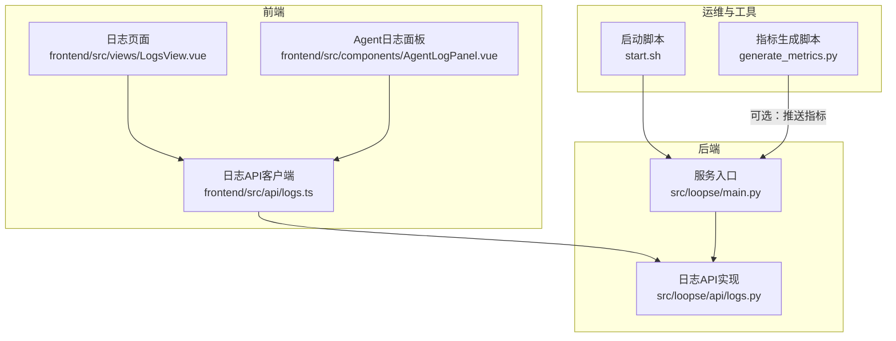
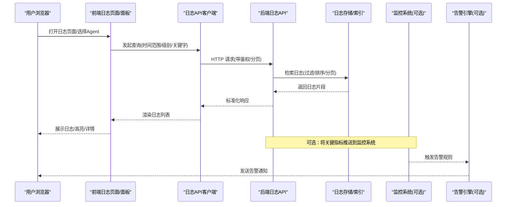
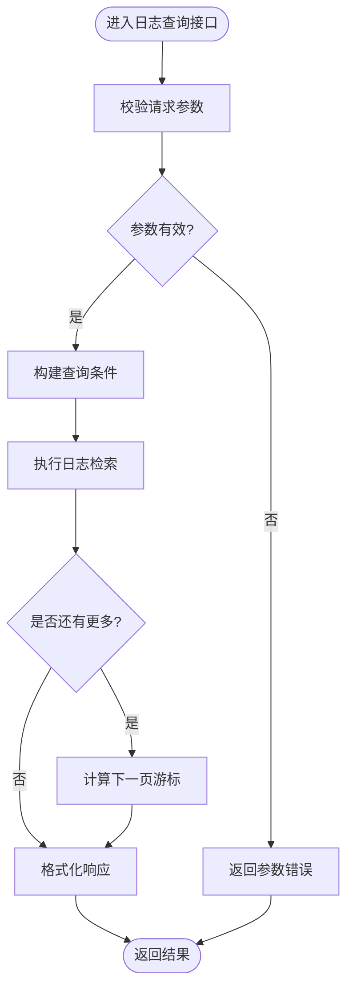
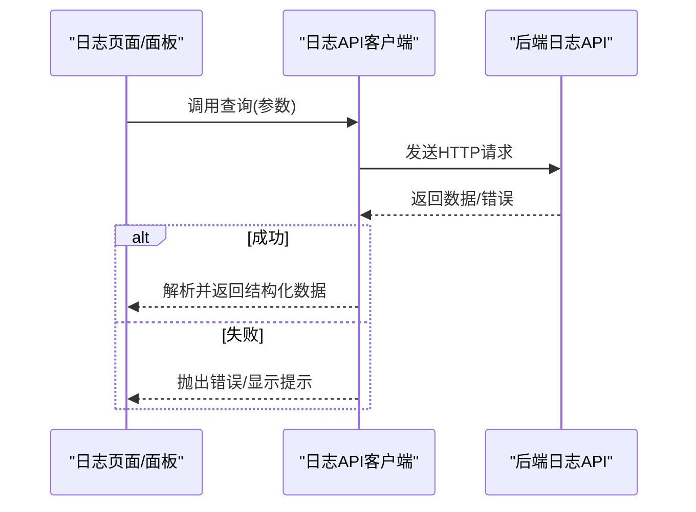
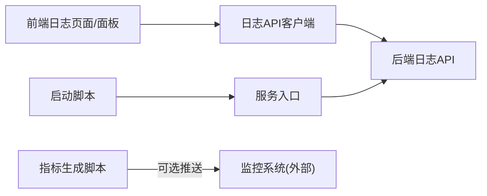

# 监控与日志管理

<cite>
**本文引用的文件**   
- [src/loopse/api/logs.py](file://src/loopse/api/logs.py)
- [frontend/src/api/logs.ts](file://frontend/src/api/logs.ts)
- [frontend/src/views/LogsView.vue](file://frontend/src/views/LogsView.vue)
- [frontend/src/components/AgentLogPanel.vue](file://frontend/src/components/AgentLogPanel.vue)
- [src/loopse/main.py](file://src/loopse/main.py)
- [start.sh](file://start.sh)
- [generate_metrics.py](file://generate_metrics.py)
</cite>

## 目录
1. [简介](#简介)
2. [项目结构](#项目结构)
3. [核心组件](#核心组件)
4. [架构总览](#架构总览)
5. [详细组件分析](#详细组件分析)
6. [依赖关系分析](#依赖关系分析)
7. [性能考虑](#性能考虑)
8. [故障排查指南](#故障排查指南)
9. [结论](#结论)
10. [附录](#附录)

## 简介
本指南面向运维、研发与产品团队，提供一套可落地的“监控与日志管理”方案。内容覆盖：
- 系统性能监控指标定义与采集
- 应用日志收集、查询与分析工具配置
- 错误追踪、告警规则与可视化仪表板搭建
- 日志轮转、存储策略与合规性要求
- 基于监控数据的故障诊断与性能优化实践

本仓库已具备前后端日志接口与前端展示能力，本文在此基础上给出端到端的落地建议与最佳实践。

## 项目结构
围绕监控与日志相关的关键位置如下：
- 后端日志 API：提供日志查询与导出能力
- 前端日志页面与面板：用于查看 Agent 运行日志与全局日志
- 启动脚本与入口：便于集成外部监控与日志采集器
- 指标生成脚本：可用于补充自定义指标或演示数据

图表来源
- [src/loopse/api/logs.py](file://src/loopse/api/logs.py)
- [frontend/src/api/logs.ts](file://frontend/src/api/logs.ts)
- [frontend/src/views/LogsView.vue](file://frontend/src/views/LogsView.vue)
- [frontend/src/components/AgentLogPanel.vue](file://frontend/src/components/AgentLogPanel.vue)
- [src/loopse/main.py](file://src/loopse/main.py)
- [start.sh](file://start.sh)
- [generate_metrics.py](file://generate_metrics.py)

章节来源
- [src/loopse/api/logs.py](file://src/loopse/api/logs.py)
- [frontend/src/api/logs.ts](file://frontend/src/api/logs.ts)
- [frontend/src/views/LogsView.vue](file://frontend/src/views/LogsView.vue)
- [frontend/src/components/AgentLogPanel.vue](file://frontend/src/components/AgentLogPanel.vue)
- [src/loopse/main.py](file://src/loopse/main.py)
- [start.sh](file://start.sh)
- [generate_metrics.py](file://generate_metrics.py)

## 核心组件
- 日志 API（后端）
  - 职责：暴露日志查询、过滤、分页与导出等接口；对接内部日志源或外部日志系统。
  - 关键点：统一响应格式、支持按时间范围/级别/模块过滤、避免大结果集阻塞。
- 日志 API 客户端（前端）
  - 职责：封装请求参数、重试与错误处理、分页加载。
  - 关键点：统一错误提示、超时控制、取消重复请求。
- 日志页面与面板（前端）
  - 职责：渲染日志列表、关键字高亮、上下文展开、Agent 维度筛选。
  - 关键点：虚拟滚动、增量刷新、用户权限控制。
- 服务入口与启动脚本
  - 职责：初始化中间件（如访问日志）、挂载路由、注入健康检查。
  - 关键点：优雅启动/关闭、进程信号处理、资源清理。
- 指标生成脚本
  - 职责：生成示例指标或聚合统计，供监控平台消费。
  - 关键点：幂等、可观测、输出格式稳定。

章节来源
- [src/loopse/api/logs.py](file://src/loopse/api/logs.py)
- [frontend/src/api/logs.ts](file://frontend/src/api/logs.ts)
- [frontend/src/views/LogsView.vue](file://frontend/src/views/LogsView.vue)
- [frontend/src/components/AgentLogPanel.vue](file://frontend/src/components/AgentLogPanel.vue)
- [src/loopse/main.py](file://src/loopse/main.py)
- [start.sh](file://start.sh)
- [generate_metrics.py](file://generate_metrics.py)

## 架构总览
下图展示了从前端到后端的日志查询链路，以及可扩展的监控与告警集成点。

图表来源
- [frontend/src/views/LogsView.vue](file://frontend/src/views/LogsView.vue)
- [frontend/src/components/AgentLogPanel.vue](file://frontend/src/components/AgentLogPanel.vue)
- [frontend/src/api/logs.ts](file://frontend/src/api/logs.ts)
- [src/loopse/api/logs.py](file://src/loopse/api/logs.py)

## 详细组件分析

### 后端日志 API 分析
- 设计要点
  - 输入校验：时间窗口、级别、模块、关键字、分页参数。
  - 查询优化：游标/基于时间戳的分页，避免深分页。
  - 安全与审计：鉴权、脱敏、最小化字段返回。
  - 扩展点：适配多种日志后端（本地文件、ELK、云日志）。
- 典型流程
  - 接收请求 → 参数校验 → 构建查询 → 执行检索 → 格式化响应 → 记录访问日志。

图表来源
- [src/loopse/api/logs.py](file://src/loopse/api/logs.py)

章节来源
- [src/loopse/api/logs.py](file://src/loopse/api/logs.py)

### 前端日志 API 客户端分析
- 设计要点
  - 统一封装：请求头、鉴权、重试、取消、超时。
  - 错误处理：网络异常、业务错误码、降级策略。
  - 性能：防抖搜索、分页预取、去重请求。
- 使用模式
  - 调用日志查询接口 → 解析响应 → 更新状态 → 驱动视图渲染。

图表来源
- [frontend/src/api/logs.ts](file://frontend/src/api/logs.ts)
- [frontend/src/views/LogsView.vue](file://frontend/src/views/LogsView.vue)
- [frontend/src/components/AgentLogPanel.vue](file://frontend/src/components/AgentLogPanel.vue)
- [src/loopse/api/logs.py](file://src/loopse/api/logs.py)

章节来源
- [frontend/src/api/logs.ts](file://frontend/src/api/logs.ts)
- [frontend/src/views/LogsView.vue](file://frontend/src/views/LogsView.vue)
- [frontend/src/components/AgentLogPanel.vue](file://frontend/src/components/AgentLogPanel.vue)

### 服务入口与启动脚本
- 服务入口
  - 负责注册路由、中间件、生命周期钩子、健康检查。
  - 建议接入访问日志、慢请求统计、异常上报。
- 启动脚本
  - 设置环境变量、启动命令、进程守护、日志输出重定向。
  - 建议配合容器编排与探针（liveness/readiness）。

章节来源
- [src/loopse/main.py](file://src/loopse/main.py)
- [start.sh](file://start.sh)

### 指标生成脚本
- 用途
  - 生成示例指标或聚合统计，便于演示或测试监控链路。
- 建议
  - 输出稳定格式（JSON/文本），支持定时任务调度。
  - 与监控系统对接（Push/Pull 模型均可）。

章节来源
- [generate_metrics.py](file://generate_metrics.py)

## 依赖关系分析
- 前端依赖
  - 日志页面/面板依赖日志 API 客户端进行数据获取与交互。
- 后端依赖
  - 日志 API 由服务入口挂载并提供对外能力。
- 运维依赖
  - 启动脚本负责拉起服务与基础环境准备。
  - 指标脚本可作为独立任务运行，向监控系统推送数据。

图表来源
- [frontend/src/views/LogsView.vue](file://frontend/src/views/LogsView.vue)
- [frontend/src/components/AgentLogPanel.vue](file://frontend/src/components/AgentLogPanel.vue)
- [frontend/src/api/logs.ts](file://frontend/src/api/logs.ts)
- [src/loopse/api/logs.py](file://src/loopse/api/logs.py)
- [src/loopse/main.py](file://src/loopse/main.py)
- [start.sh](file://start.sh)
- [generate_metrics.py](file://generate_metrics.py)

章节来源
- [frontend/src/api/logs.ts](file://frontend/src/api/logs.ts)
- [frontend/src/views/LogsView.vue](file://frontend/src/views/LogsView.vue)
- [frontend/src/components/AgentLogPanel.vue](file://frontend/src/components/AgentLogPanel.vue)
- [src/loopse/api/logs.py](file://src/loopse/api/logs.py)
- [src/loopse/main.py](file://src/loopse/main.py)
- [start.sh](file://start.sh)
- [generate_metrics.py](file://generate_metrics.py)

## 性能考虑
- 查询性能
  - 采用基于时间戳的游标分页，避免深分页带来的数据库压力。
  - 对高频过滤字段建立索引（时间、级别、模块）。
- 传输与渲染
  - 前端启用分页与增量加载，必要时开启压缩与缓存。
  - 大数据量场景使用虚拟滚动减少 DOM 节点数量。
- 稳定性
  - 客户端增加重试与退避策略，服务端限制单次最大返回条数。
  - 引入熔断与降级，当日志后端不可用时返回部分可用数据或友好提示。

[本节为通用指导，不直接分析具体文件]

## 故障排查指南
- 常见问题定位
  - 日志无法加载：检查鉴权、跨域、网络连通性与后端可用性。
  - 查询缓慢：确认时间范围过大、缺少索引或后端负载过高。
  - 数据缺失：核对日志采集链路、时区与同步延迟。
- 快速验证步骤
  - 通过健康检查接口确认服务存活。
  - 缩小时间范围与过滤条件复现问题。
  - 对比不同 Agent 维度的日志差异，定位特定模块问题。
- 告警与追踪
  - 结合错误率、延迟、吞吐等指标设定阈值告警。
  - 在关键路径埋点 TraceID，串联前后端日志与调用链。

章节来源
- [src/loopse/api/logs.py](file://src/loopse/api/logs.py)
- [frontend/src/api/logs.ts](file://frontend/src/api/logs.ts)
- [frontend/src/views/LogsView.vue](file://frontend/src/views/LogsView.vue)
- [frontend/src/components/AgentLogPanel.vue](file://frontend/src/components/AgentLogPanel.vue)

## 结论
本项目已具备日志查询的前后端能力与基本入口。建议在现有基础上完善：
- 统一的指标体系与采集规范
- 完善的告警规则与通知渠道
- 可视化的监控与日志仪表板
- 日志轮转、归档与合规策略
- 基于监控数据的持续优化闭环

[本节为总结性内容，不直接分析具体文件]

## 附录

### 监控指标建议清单
- 系统级
  - CPU、内存、磁盘、网络 I/O、连接数、进程存活
- 应用级
  - QPS、P95/P99 延迟、错误率、慢请求比例、队列积压
- 业务级
  - 各 Agent 调用成功率、耗时分布、资源生成成功率
- 日志级
  - 日志写入速率、查询延迟、索引大小、保留天数

[本节为概念性内容，不直接分析具体文件]

### 告警规则建议
- 错误率突增：超过阈值持续 N 分钟
- 延迟升高：P95/P99 超过目标值
- 资源不足：磁盘/内存使用率超阈值
- 日志中断：日志写入停滞或延迟异常

[本节为概念性内容，不直接分析具体文件]

### 日志轮转与存储策略
- 轮转策略
  - 按大小/时间切分，保留最近 N 天热数据，历史数据冷归档
- 存储分层
  - 热数据：近实时检索（秒级）
  - 温数据：小时/天级聚合
  - 冷数据：低成本对象存储，按需恢复
- 合规与安全
  - 敏感信息脱敏、访问审计、加密存储、最小权限

[本节为概念性内容，不直接分析具体文件]

### 可视化仪表板建议
- 概览页：核心指标与健康状态
- 日志页：多维过滤、关键字高亮、上下文跳转
- 性能页：延迟分布、错误趋势、容量水位
- 业务页：Agent 维度成功率与耗时

[本节为概念性内容，不直接分析具体文件]