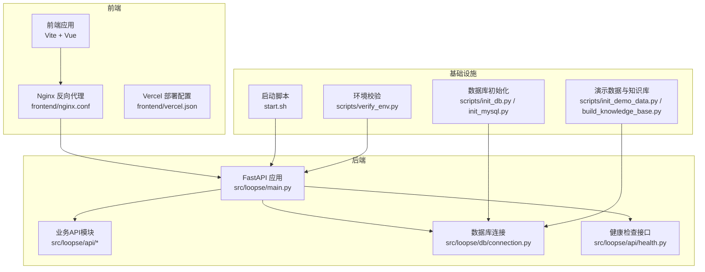
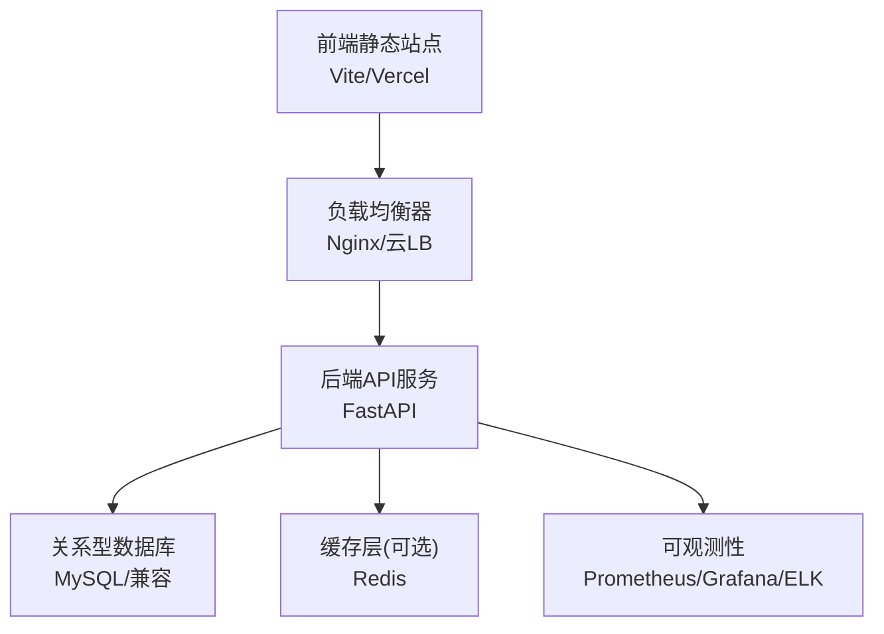
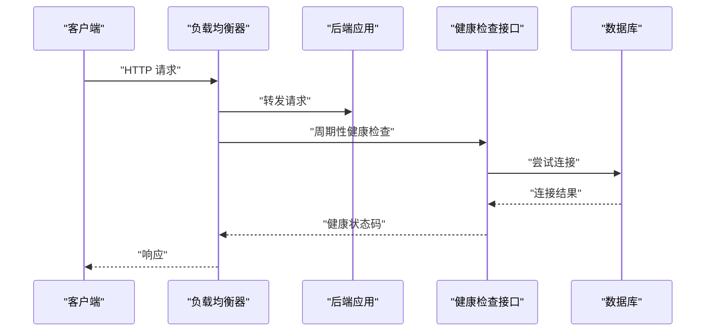
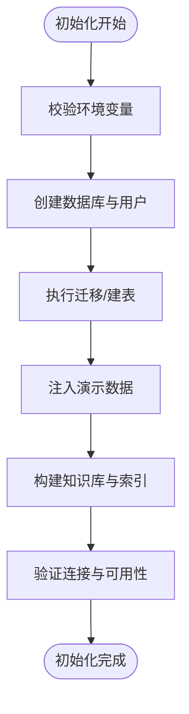
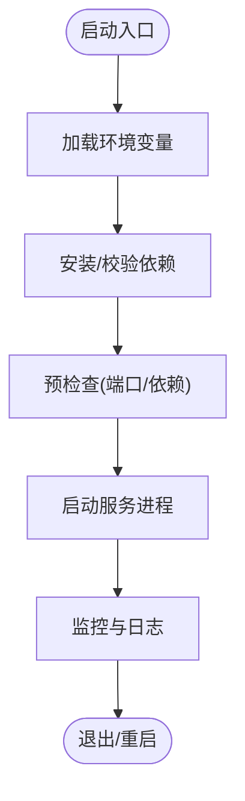
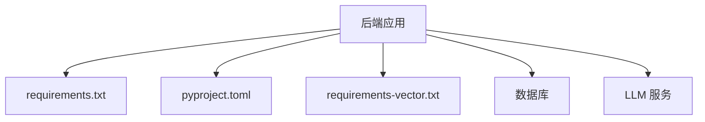

# 部署与运维

<cite>
**本文引用的文件**   
- [start.sh](file://start.sh)
- [pyproject.toml](file://pyproject.toml)
- [requirements.txt](file://requirements.txt)
- [requirements-vector.txt](file://requirements-vector.txt)
- [src/loopse/main.py](file://src/loopse/main.py)
- [src/loopse/db/connection.py](file://src/loopse/db/connection.py)
- [src/loopse/api/health.py](file://src/loopse/api/health.py)
- [frontend/nginx.conf](file://frontend/nginx.conf)
- [frontend/vercel.json](file://frontend/vercel.json)
- [scripts/init_db.py](file://scripts/init_db.py)
- [scripts/init_mysql.py](file://scripts/init_mysql.py)
- [scripts/init_demo_data.py](file://scripts/init_demo_data.py)
- [scripts/build_knowledge_base.py](file://scripts/build_knowledge_base.py)
- [scripts/verify_env.py](file://scripts/verify_env.py)
- [config/api_schema.yaml](file://config/api_schema.yaml)
- [docs/deployment/环境初始化说明.md](file://docs/deployment/环境初始化说明.md)
- [docs/deployment/操作手册_v1.md](file://docs/deployment/操作手册_v1.md)
- [docs/deployment/官方硬指标核对清单.md](file://docs/deployment/官方硬指标核对清单.md)
- [docs/deployment/开源组件与AI工具说明.md](file://docs/deployment/开源组件与AI工具说明.md)
</cite>

## 目录
1. [简介](#简介)
2. [项目结构](#项目结构)
3. [核心组件](#核心组件)
4. [架构总览](#架构总览)
5. [详细组件分析](#详细组件分析)
6. [依赖分析](#依赖分析)
7. [性能考虑](#性能考虑)
8. [故障排查指南](#故障排查指南)
9. [结论](#结论)
10. [附录](#附录)

## 简介
本指南面向开发与运维团队，提供从开发、测试到生产的完整部署与运维方案。内容涵盖：
- 多环境配置差异与部署策略
- 容器化与云服务部署、负载均衡
- 监控告警、日志收集与性能观测
- 安全加固、备份恢复与灾难恢复
- CI/CD流水线、自动化测试与发布管理
- 扩展新部署目标与优化运维效率

## 项目结构
仓库采用前后端分离与脚本驱动的基础设施组织方式：
- 后端服务入口位于 src/loopse/main.py，API 路由在 src/loopse/api/*，数据库连接在 src/loopse/db/connection.py
- 前端静态资源与 Nginx 配置位于 frontend/，并提供 Vercel 部署配置
- 启动脚本 start.sh 用于本地或容器内快速拉起服务
- 数据初始化与知识库构建脚本集中在 scripts/
- 文档集中于 docs/deployment/，包含环境初始化、操作手册与硬性指标核对清单

**图示来源**
- [src/loopse/main.py](file://src/loopse/main.py)
- [src/loopse/api/health.py](file://src/loopse/api/health.py)
- [src/loopse/db/connection.py](file://src/loopse/db/connection.py)
- [frontend/nginx.conf](file://frontend/nginx.conf)
- [frontend/vercel.json](file://frontend/vercel.json)
- [start.sh](file://start.sh)
- [scripts/init_db.py](file://scripts/init_db.py)
- [scripts/init_mysql.py](file://scripts/init_mysql.py)
- [scripts/init_demo_data.py](file://scripts/init_demo_data.py)
- [scripts/build_knowledge_base.py](file://scripts/build_knowledge_base.py)
- [scripts/verify_env.py](file://scripts/verify_env.py)

**章节来源**
- [start.sh](file://start.sh)
- [src/loopse/main.py](file://src/loopse/main.py)
- [src/loopse/api/health.py](file://src/loopse/api/health.py)
- [src/loopse/db/connection.py](file://src/loopse/db/connection.py)
- [frontend/nginx.conf](file://frontend/nginx.conf)
- [frontend/vercel.json](file://frontend/vercel.json)
- [scripts/init_db.py](file://scripts/init_db.py)
- [scripts/init_mysql.py](file://scripts/init_mysql.py)
- [scripts/init_demo_data.py](file://scripts/init_demo_data.py)
- [scripts/build_knowledge_base.py](file://scripts/build_knowledge_base.py)
- [scripts/verify_env.py](file://scripts/verify_env.py)

## 核心组件
- 应用入口与生命周期
  - 后端主入口负责注册路由、中间件与生命周期钩子，暴露健康检查与业务API
  - 健康检查接口用于探针与负载均衡器探测存活
- 数据库连接
  - 统一连接管理与连接池配置，支持不同环境的数据库地址、凭据与参数
- 前端与反向代理
  - Nginx 作为静态资源服务器与反向代理，转发请求至后端服务
  - Vercel 配置用于前端托管与边缘加速
- 启动与初始化
  - 启动脚本封装环境变量加载与服务进程管理
  - 初始化脚本完成数据库建库、表结构与演示数据注入
  - 知识库构建脚本将文档解析入库，供检索与生成使用
- 环境校验
  - 运行前校验关键依赖、端口占用、外部服务可达性

**章节来源**
- [src/loopse/main.py](file://src/loopse/main.py)
- [src/loopse/api/health.py](file://src/loopse/api/health.py)
- [src/loopse/db/connection.py](file://src/loopse/db/connection.py)
- [frontend/nginx.conf](file://frontend/nginx.conf)
- [frontend/vercel.json](file://frontend/vercel.json)
- [start.sh](file://start.sh)
- [scripts/init_db.py](file://scripts/init_db.py)
- [scripts/init_mysql.py](file://scripts/init_mysql.py)
- [scripts/init_demo_data.py](file://scripts/init_demo_data.py)
- [scripts/build_knowledge_base.py](file://scripts/build_knowledge_base.py)
- [scripts/verify_env.py](file://scripts/verify_env.py)

## 架构总览
系统由前端静态站点、反向代理、后端API服务、数据库与辅助脚本组成。生产环境建议引入负载均衡与健康检查，结合容器编排实现弹性伸缩与滚动更新。

[此图为概念性架构图，不直接映射具体源码文件]

## 详细组件分析

### 应用入口与API健康检查
- 入口职责
  - 注册路由、挂载中间件、配置跨域与限流
  - 暴露健康检查端点，供探针与负载均衡器探测
- 健康检查流程
  - 返回服务状态、依赖项（如数据库）连通性
  - 失败时返回非2xx状态码，触发自动重启或摘除实例

**图示来源**
- [src/loopse/main.py](file://src/loopse/main.py)
- [src/loopse/api/health.py](file://src/loopse/api/health.py)
- [src/loopse/db/connection.py](file://src/loopse/db/connection.py)

**章节来源**
- [src/loopse/main.py](file://src/loopse/main.py)
- [src/loopse/api/health.py](file://src/loopse/api/health.py)
- [src/loopse/db/connection.py](file://src/loopse/db/connection.py)

### 数据库连接与初始化
- 连接管理
  - 集中配置数据库URL、连接池大小、超时与重试策略
  - 支持多环境切换（开发/测试/生产）
- 初始化流程
  - 创建数据库与用户权限
  - 执行DDL与种子数据
  - 知识库构建与索引重建

**图示来源**
- [scripts/init_db.py](file://scripts/init_db.py)
- [scripts/init_mysql.py](file://scripts/init_mysql.py)
- [scripts/init_demo_data.py](file://scripts/init_demo_data.py)
- [scripts/build_knowledge_base.py](file://scripts/build_knowledge_base.py)
- [src/loopse/db/connection.py](file://src/loopse/db/connection.py)

**章节来源**
- [scripts/init_db.py](file://scripts/init_db.py)
- [scripts/init_mysql.py](file://scripts/init_mysql.py)
- [scripts/init_demo_data.py](file://scripts/init_demo_data.py)
- [scripts/build_knowledge_base.py](file://scripts/build_knowledge_base.py)
- [src/loopse/db/connection.py](file://src/loopse/db/connection.py)

### 前端反向代理与托管
- Nginx 角色
  - 静态资源服务、Gzip压缩、缓存策略
  - 反向代理转发至后端API，设置CORS与安全头
- Vercel 托管
  - 前端构建产物托管与边缘分发
  - 环境变量注入与域名绑定

**图示来源**
- [frontend/nginx.conf](file://frontend/nginx.conf)
- [frontend/vercel.json](file://frontend/vercel.json)

**章节来源**
- [frontend/nginx.conf](file://frontend/nginx.conf)
- [frontend/vercel.json](file://frontend/vercel.json)

### 启动脚本与环境校验
- 启动脚本
  - 加载环境变量、安装依赖、启动服务进程
  - 支持守护进程与进程退出处理
- 环境校验
  - 检查Python版本、依赖包、端口占用、外部服务可达性
  - 输出诊断信息便于问题定位

**图示来源**
- [start.sh](file://start.sh)
- [scripts/verify_env.py](file://scripts/verify_env.py)

**章节来源**
- [start.sh](file://start.sh)
- [scripts/verify_env.py](file://scripts/verify_env.py)

## 依赖分析
- Python 依赖
  - requirements.txt 与 pyproject.toml 定义运行时与开发期依赖
  - requirements-vector.txt 为向量检索相关依赖
- 外部依赖
  - 数据库（MySQL或兼容）、可选缓存（Redis）、对象存储（可选）
  - LLM提供商（通过环境变量配置）

**图示来源**
- [requirements.txt](file://requirements.txt)
- [pyproject.toml](file://pyproject.toml)
- [requirements-vector.txt](file://requirements-vector.txt)
- [src/loopse/db/connection.py](file://src/loopse/db/connection.py)

**章节来源**
- [requirements.txt](file://requirements.txt)
- [pyproject.toml](file://pyproject.toml)
- [requirements-vector.txt](file://requirements-vector.txt)
- [src/loopse/db/connection.py](file://src/loopse/db/connection.py)

## 性能考虑
- 连接池与并发
  - 调整数据库连接池大小与超时，避免连接耗尽
  - 合理设置异步任务队列与线程池，避免阻塞
- 缓存策略
  - 热点查询结果缓存，减少数据库压力
  - 静态资源启用浏览器缓存与CDN
- 反向代理优化
  - 开启Gzip/Brotli压缩，设置合理的KeepAlive与缓冲
- 健康检查与优雅停机
  - 缩短健康检查间隔，确保快速故障转移
  - 优雅关闭以完成正在处理的请求

[本节为通用指导，无需特定文件引用]

## 故障排查指南
- 常见症状与定位
  - 健康检查失败：检查数据库连接、端口占用、环境变量
  - 前端无法访问：确认Nginx配置、域名解析、证书有效
  - 知识库构建缓慢：检查磁盘IO、内存与向量索引参数
- 日志与可观测性
  - 应用日志输出到标准输出，便于容器采集
  - 错误堆栈与请求ID关联，便于链路追踪
- 回滚与恢复
  - 数据库变更需具备回滚脚本
  - 镜像版本固定，支持一键回滚

**章节来源**
- [src/loopse/api/health.py](file://src/loopse/api/health.py)
- [src/loopse/db/connection.py](file://src/loopse/db/connection.py)
- [frontend/nginx.conf](file://frontend/nginx.conf)

## 结论
通过标准化的启动与初始化流程、清晰的前后端分层与反向代理配置，以及完善的健康检查与依赖校验，系统可在多环境中稳定部署。结合容器化与云平台能力，可实现高可用与弹性伸缩。建议在CI/CD中集成自动化测试与发布门禁，配合监控告警与日志分析，持续提升运维效率与稳定性。

[本节为总结性内容，无需特定文件引用]

## 附录

### 多环境配置差异与部署策略
- 开发环境
  - 本地快速启动，最小依赖，启用调试模式
  - 使用本地数据库与Mock LLM
- 测试环境
  - 独立数据库与数据集，自动化测试覆盖
  - 启用更严格的日志级别与错误上报
- 生产环境
  - 多副本部署、负载均衡与健康检查
  - 严格的安全头、HTTPS与密钥管理
  - 灰度发布与回滚策略

**章节来源**
- [docs/deployment/环境初始化说明.md](file://docs/deployment/环境初始化说明.md)
- [docs/deployment/操作手册_v1.md](file://docs/deployment/操作手册_v1.md)
- [docs/deployment/官方硬指标核对清单.md](file://docs/deployment/官方硬指标核对清单.md)

### 容器化方案与云服务部署
- 容器化
  - 构建镜像包含应用与依赖，最小化基础镜像
  - 环境变量注入与卷挂载持久化数据
- 云服务
  - 使用云托管服务部署前端与后端
  - 配置域名、证书与访问控制
- 负载均衡
  - 基于健康检查的流量分发与故障转移
  - 会话保持与粘性会话策略（按需）

**章节来源**
- [frontend/nginx.conf](file://frontend/nginx.conf)
- [frontend/vercel.json](file://frontend/vercel.json)
- [start.sh](file://start.sh)

### 监控告警体系与日志收集分析
- 监控指标
  - 服务存活、QPS、延迟、错误率、资源使用
- 日志采集
  - 结构化日志输出，集中采集与分析
- 告警规则
  - 阈值告警与异常检测，通知渠道集成

**章节来源**
- [src/loopse/api/health.py](file://src/loopse/api/health.py)
- [src/loopse/db/connection.py](file://src/loopse/db/connection.py)

### 安全加固措施
- 传输安全
  - HTTPS强制与HSTS
- 访问控制
  - 鉴权与授权、最小权限原则
- 配置安全
  - 密钥与敏感信息通过环境变量或密钥管理服务注入
- 输入校验
  - 接口参数校验与白名单过滤

**章节来源**
- [config/api_schema.yaml](file://config/api_schema.yaml)
- [frontend/nginx.conf](file://frontend/nginx.conf)

### 备份恢复计划与灾难恢复预案
- 备份策略
  - 定期全量与增量备份，异地容灾
- 恢复演练
  - 定期演练恢复流程，验证RTO/RPO
- 灾难恢复
  - 多区域部署与自动故障转移

**章节来源**
- [scripts/init_db.py](file://scripts/init_db.py)
- [scripts/init_mysql.py](file://scripts/init_mysql.py)

### CI/CD流水线、自动化测试与发布管理
- 流水线阶段
  - 代码检查、单元测试、集成测试、构建镜像、部署
- 自动化测试
  - 单元与端到端测试，覆盖率门禁
- 发布管理
  - 版本标签、灰度发布与回滚策略

**章节来源**
- [docs/deployment/操作手册_v1.md](file://docs/deployment/操作手册_v1.md)
- [docs/deployment/开源组件与AI工具说明.md](file://docs/deployment/开源组件与AI工具说明.md)

### 扩展新部署目标与优化运维效率
- 新目标接入
  - 标准化镜像与配置模板，快速复制部署
- 效率优化
  - 并行构建与缓存复用
  - 基础设施即代码与声明式配置

**章节来源**
- [start.sh](file://start.sh)
- [scripts/verify_env.py](file://scripts/verify_env.py)