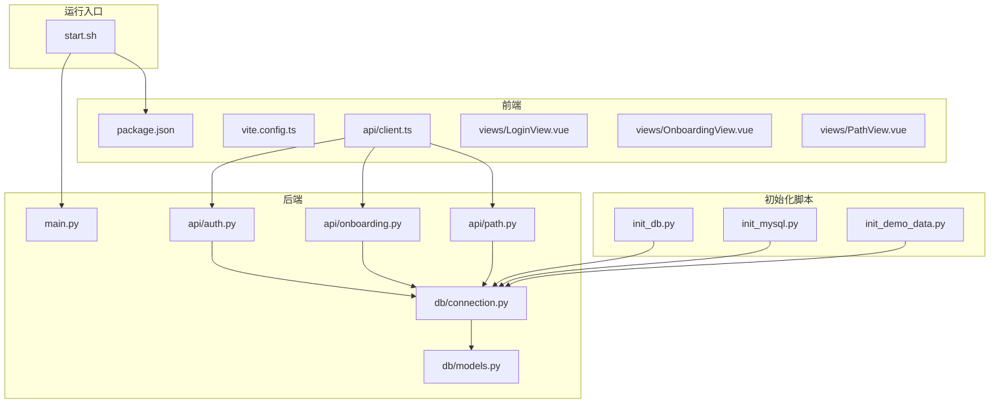
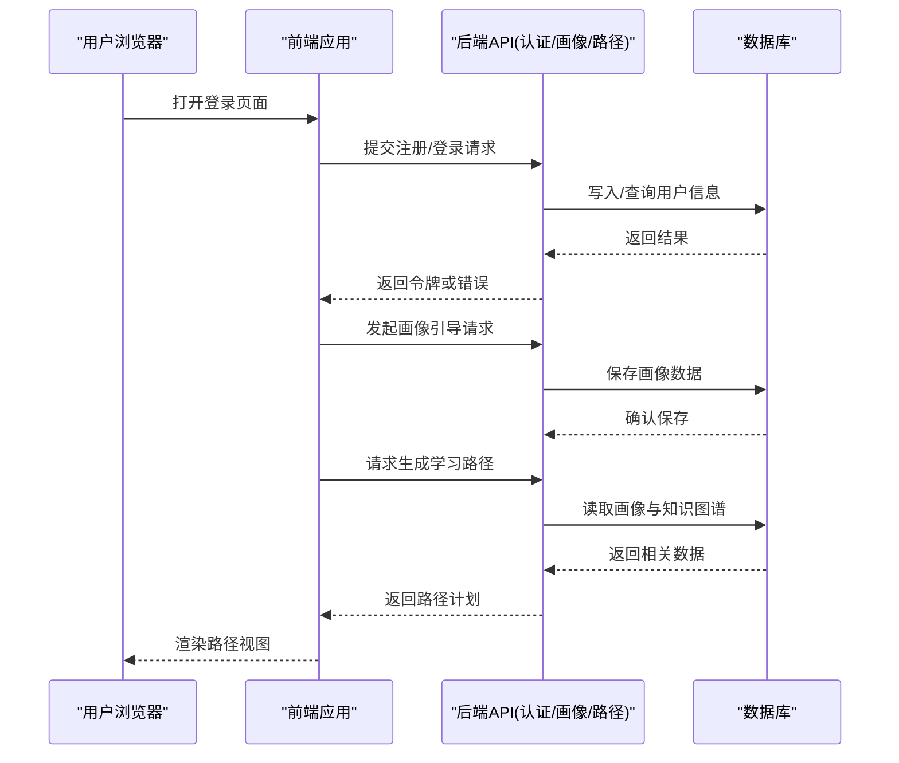
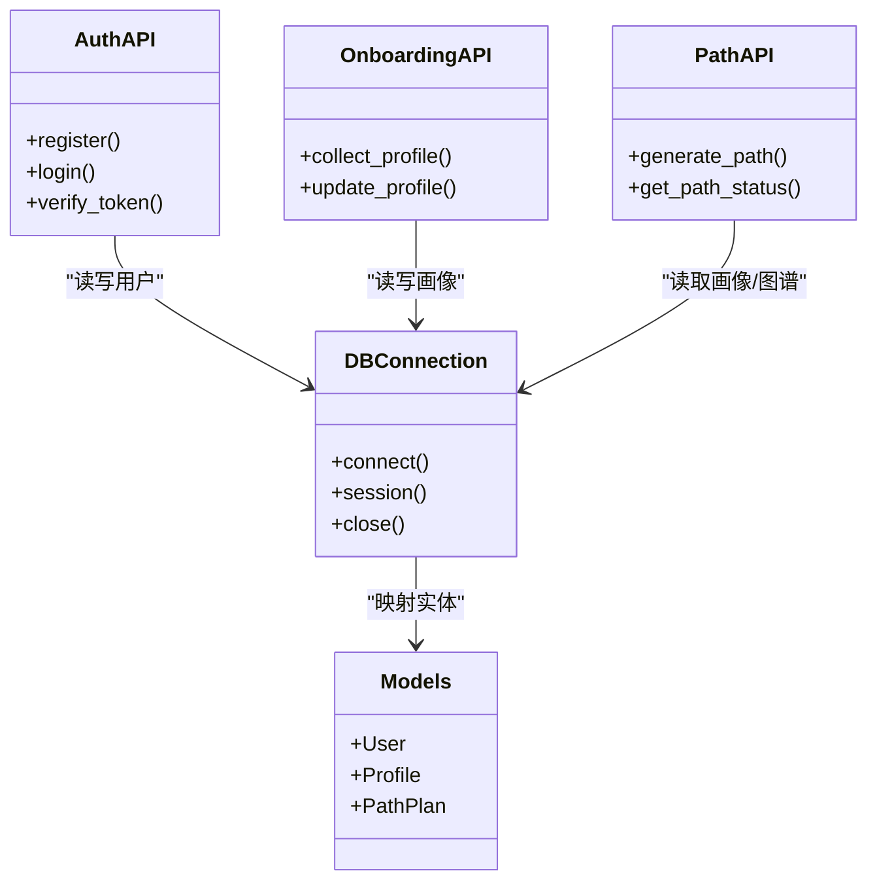
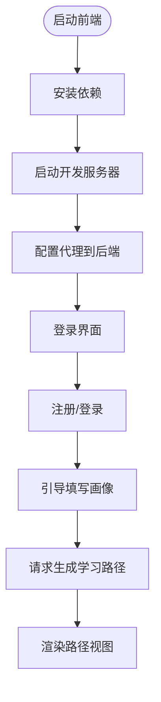
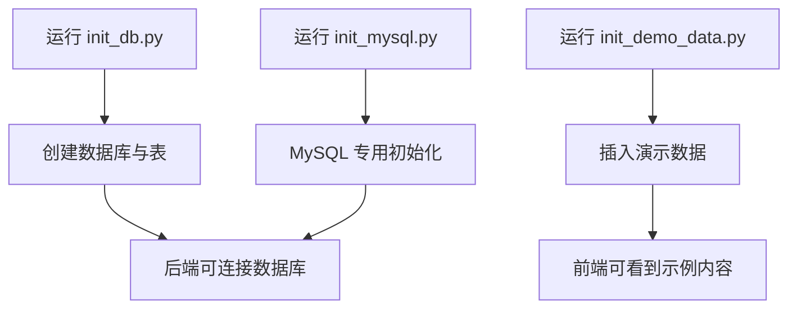
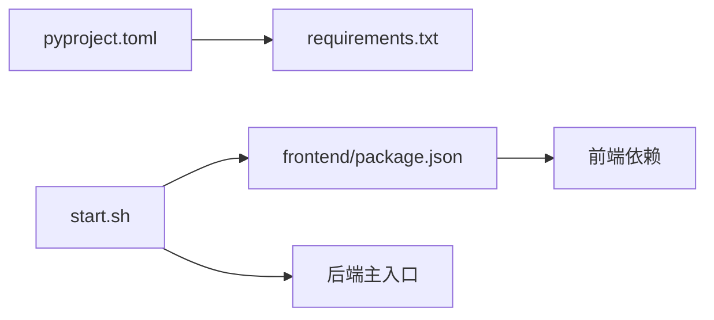

# 快速开始指南

<cite>
**本文引用的文件**   
- [start.sh](file://start.sh)
- [pyproject.toml](file://pyproject.toml)
- [requirements.txt](file://requirements.txt)
- [src/loopse/main.py](file://src/loopse/main.py)
- [scripts/init_db.py](file://scripts/init_db.py)
- [scripts/init_mysql.py](file://scripts/init_mysql.py)
- [scripts/init_demo_data.py](file://scripts/init_demo_data.py)
- [frontend/package.json](file://frontend/package.json)
- [frontend/vite.config.ts](file://frontend/vite.config.ts)
- [frontend/src/api/client.ts](file://frontend/src/api/client.ts)
- [frontend/src/views/LoginView.vue](file://frontend/src/views/LoginView.vue)
- [frontend/src/views/OnboardingView.vue](file://frontend/src/views/OnboardingView.vue)
- [frontend/src/views/PathView.vue](file://frontend/src/views/PathView.vue)
- [frontend/src/stores/authStore.ts](file://frontend/src/stores/authStore.ts)
- [frontend/src/stores/pathStore.ts](file://frontend/src/stores/pathStore.ts)
- [src/loopse/api/auth.py](file://src/loopse/api/auth.py)
- [src/loopse/api/onboarding.py](file://src/loopse/api/onboarding.py)
- [src/loopse/api/path.py](file://src/loopse/api/path.py)
- [src/loopse/db/connection.py](file://src/loopse/db/connection.py)
- [src/loopse/db/models.py](file://src/loopse/db/models.py)
</cite>

## 目录
1. [简介](#简介)
2. [项目结构](#项目结构)
3. [核心组件](#核心组件)
4. [架构总览](#架构总览)
5. [详细组件分析](#详细组件分析)
6. [依赖分析](#依赖分析)
7. [性能考虑](#性能考虑)
8. [故障排查指南](#故障排查指南)
9. [结论](#结论)
10. [附录](#附录)

## 简介
本指南面向首次接触 Socrates-Cube 的开发者与学习者，目标是在 30 分钟内完成本地环境搭建、前后端服务启动、数据库初始化，并完成“注册账号—生成学习路径”的首次体验。文档提供：
- 环境与依赖准备（Python、Node.js）
- 数据库初始化与演示数据导入
- 后端与前端启动命令及端口说明
- 开发环境验证方法
- 常见问题定位与解决建议
- 端到端操作流程（注册与路径生成）

## 项目结构
Socrates-Cube 采用前后端分离架构：
- 后端：基于 Python 的服务，提供认证、用户画像、学习路径、资源生成等 API；使用脚本进行数据库与演示数据初始化。
- 前端：基于 Vue + Vite 的单页应用，通过 API 客户端访问后端服务。
- 配置与提示词：集中管理 Agent 提示词与系统配置。
- 测试与脚本：包含单元测试、集成验证与工具脚本。

图表来源
- [start.sh](file://start.sh)
- [src/loopse/main.py](file://src/loopse/main.py)
- [src/loopse/api/auth.py](file://src/loopse/api/auth.py)
- [src/loopse/api/onboarding.py](file://src/loopse/api/onboarding.py)
- [src/loopse/api/path.py](file://src/loopse/api/path.py)
- [src/loopse/db/connection.py](file://src/loopse/db/connection.py)
- [src/loopse/db/models.py](file://src/loopse/db/models.py)
- [scripts/init_db.py](file://scripts/init_db.py)
- [scripts/init_mysql.py](file://scripts/init_mysql.py)
- [scripts/init_demo_data.py](file://scripts/init_demo_data.py)
- [frontend/package.json](file://frontend/package.json)
- [frontend/vite.config.ts](file://frontend/vite.config.ts)
- [frontend/src/api/client.ts](file://frontend/src/api/client.ts)
- [frontend/src/views/LoginView.vue](file://frontend/src/views/LoginView.vue)
- [frontend/src/views/OnboardingView.vue](file://frontend/src/views/OnboardingView.vue)
- [frontend/src/views/PathView.vue](file://frontend/src/views/PathView.vue)

章节来源
- [start.sh](file://start.sh)
- [src/loopse/main.py](file://src/loopse/main.py)
- [frontend/package.json](file://frontend/package.json)
- [frontend/vite.config.ts](file://frontend/vite.config.ts)
- [frontend/src/api/client.ts](file://frontend/src/api/client.ts)

## 核心组件
- 后端主入口与路由挂载：负责加载各功能模块并暴露 HTTP 接口。
- 认证与会话：提供注册、登录、令牌签发与校验。
- 用户画像与引导：收集初始信息，更新画像，驱动个性化推荐。
- 学习路径规划：根据画像与目标生成可执行的学习步骤序列。
- 数据库连接与模型：封装连接池、会话管理与数据模型映射。
- 前端 API 客户端：统一请求基地址、拦截器与错误处理。
- 初始化脚本：创建数据库、表结构与演示数据。

章节来源
- [src/loopse/main.py](file://src/loopse/main.py)
- [src/loopse/api/auth.py](file://src/loopse/api/auth.py)
- [src/loopse/api/onboarding.py](file://src/loopse/api/onboarding.py)
- [src/loopse/api/path.py](file://src/loopse/api/path.py)
- [src/loopse/db/connection.py](file://src/loopse/db/connection.py)
- [src/loopse/db/models.py](file://src/loopse/db/models.py)
- [frontend/src/api/client.ts](file://frontend/src/api/client.ts)

## 架构总览
下图展示从浏览器到后端 API 再到数据库的关键交互流程，以及初始化脚本的作用点。

图表来源
- [frontend/src/views/LoginView.vue](file://frontend/src/views/LoginView.vue)
- [frontend/src/views/OnboardingView.vue](file://frontend/src/views/OnboardingView.vue)
- [frontend/src/views/PathView.vue](file://frontend/src/views/PathView.vue)
- [frontend/src/api/client.ts](file://frontend/src/api/client.ts)
- [src/loopse/api/auth.py](file://src/loopse/api/auth.py)
- [src/loopse/api/onboarding.py](file://src/loopse/api/onboarding.py)
- [src/loopse/api/path.py](file://src/loopse/api/path.py)
- [src/loopse/db/connection.py](file://src/loopse/db/connection.py)

## 详细组件分析

### 后端服务与数据库
- 服务入口：加载中间件、注册路由、启动监听端口。
- 认证模块：实现注册、登录、令牌签发与校验逻辑。
- 画像模块：接收用户初始信息，持久化画像，支持后续个性化。
- 路径模块：结合画像与知识库，生成学习路径。
- 数据库连接：封装连接参数、会话生命周期与事务边界。
- 数据模型：定义用户、画像、路径等实体关系。

图表来源
- [src/loopse/api/auth.py](file://src/loopse/api/auth.py)
- [src/loopse/api/onboarding.py](file://src/loopse/api/onboarding.py)
- [src/loopse/api/path.py](file://src/loopse/api/path.py)
- [src/loopse/db/connection.py](file://src/loopse/db/connection.py)
- [src/loopse/db/models.py](file://src/loopse/db/models.py)

章节来源
- [src/loopse/main.py](file://src/loopse/main.py)
- [src/loopse/api/auth.py](file://src/loopse/api/auth.py)
- [src/loopse/api/onboarding.py](file://src/loopse/api/onboarding.py)
- [src/loopse/api/path.py](file://src/loopse/api/path.py)
- [src/loopse/db/connection.py](file://src/loopse/db/connection.py)
- [src/loopse/db/models.py](file://src/loopse/db/models.py)

### 前端应用与 API 客户端
- 构建与开发服务器：由 Vite 提供热重载与代理能力。
- API 客户端：统一设置基础 URL、请求头与错误处理。
- 页面组件：登录、引导、路径视图分别调用对应 API。
- 状态管理：维护认证态与路径数据。

图表来源
- [frontend/package.json](file://frontend/package.json)
- [frontend/vite.config.ts](file://frontend/vite.config.ts)
- [frontend/src/api/client.ts](file://frontend/src/api/client.ts)
- [frontend/src/views/LoginView.vue](file://frontend/src/views/LoginView.vue)
- [frontend/src/views/OnboardingView.vue](file://frontend/src/views/OnboardingView.vue)
- [frontend/src/views/PathView.vue](file://frontend/src/views/PathView.vue)
- [frontend/src/stores/authStore.ts](file://frontend/src/stores/authStore.ts)
- [frontend/src/stores/pathStore.ts](file://frontend/src/stores/pathStore.ts)

章节来源
- [frontend/package.json](file://frontend/package.json)
- [frontend/vite.config.ts](file://frontend/vite.config.ts)
- [frontend/src/api/client.ts](file://frontend/src/api/client.ts)
- [frontend/src/views/LoginView.vue](file://frontend/src/views/LoginView.vue)
- [frontend/src/views/OnboardingView.vue](file://frontend/src/views/OnboardingView.vue)
- [frontend/src/views/PathView.vue](file://frontend/src/views/PathView.vue)
- [frontend/src/stores/authStore.ts](file://frontend/src/stores/authStore.ts)
- [frontend/src/stores/pathStore.ts](file://frontend/src/stores/pathStore.ts)

### 初始化脚本与演示数据
- 数据库初始化：创建库与表结构。
- MySQL 初始化：针对 MySQL 环境的建库建表脚本。
- 演示数据：预置用户、画像与示例路径，便于快速体验。

图表来源
- [scripts/init_db.py](file://scripts/init_db.py)
- [scripts/init_mysql.py](file://scripts/init_mysql.py)
- [scripts/init_demo_data.py](file://scripts/init_demo_data.py)

章节来源
- [scripts/init_db.py](file://scripts/init_db.py)
- [scripts/init_mysql.py](file://scripts/init_mysql.py)
- [scripts/init_demo_data.py](file://scripts/init_demo_data.py)

## 依赖分析
- Python 依赖：通过 pyproject 与 requirements 文件声明，涵盖 Web 框架、ORM、向量检索与 LLM 客户端等。
- Node.js 依赖：前端 package.json 声明了构建、样式与运行时依赖。
- 启动脚本：一键启动后端与前端开发服务器，简化本地联调。

图表来源
- [pyproject.toml](file://pyproject.toml)
- [requirements.txt](file://requirements.txt)
- [frontend/package.json](file://frontend/package.json)
- [start.sh](file://start.sh)

章节来源
- [pyproject.toml](file://pyproject.toml)
- [requirements.txt](file://requirements.txt)
- [frontend/package.json](file://frontend/package.json)
- [start.sh](file://start.sh)

## 性能考虑
- 数据库连接池：合理设置最大连接数与超时，避免在高并发下耗尽连接。
- 缓存策略：对热点画像与路径结果引入短期缓存，降低重复计算。
- 异步任务：将耗时操作（如资源生成）放入后台队列，提升响应速度。
- 前端优化：按需加载与懒加载页面组件，减少首屏体积。

[本节为通用指导，不直接分析具体文件]

## 故障排查指南
- 端口冲突
  - 现象：后端或前端无法启动，报端口占用。
  - 处理：修改后端监听端口或前端开发服务器端口，确保不与已有服务冲突。
- 数据库连接失败
  - 现象：后端启动后访问 API 报错，日志显示连接异常。
  - 处理：检查数据库地址、用户名、密码与库名；确认已执行数据库初始化脚本。
- CORS 跨域问题
  - 现象：前端控制台报跨域错误。
  - 处理：在后端启用 CORS 并允许前端域名与端口；或在开发模式配置代理。
- 环境变量缺失
  - 现象：LLM 客户端或密钥相关功能不可用。
  - 处理：按项目要求配置必要的环境变量，并确保值正确。
- 依赖安装失败
  - 现象：pip 或 npm 安装时报网络或版本冲突。
  - 处理：切换镜像源、清理缓存或使用虚拟环境隔离依赖。

章节来源
- [src/loopse/db/connection.py](file://src/loopse/db/connection.py)
- [frontend/src/api/client.ts](file://frontend/src/api/client.ts)
- [frontend/vite.config.ts](file://frontend/vite.config.ts)

## 结论
按照本指南完成环境准备、数据库初始化与前后端启动后，即可在 30 分钟内完成注册与学习路径生成的完整体验。建议在本地联调阶段优先关注端口、数据库连接与跨域配置，以确保稳定运行。

## 附录

### 环境准备清单
- Python 3.x 与 pip
- Node.js 18+ 与 npm/yarn
- 数据库（MySQL 或兼容引擎）
- 可选：LLM 客户端凭据（用于 AI 功能）

### 后端启动步骤
- 安装 Python 依赖
  - 参考：[pyproject.toml](file://pyproject.toml)、[requirements.txt](file://requirements.txt)
- 初始化数据库
  - 参考：[scripts/init_db.py](file://scripts/init_db.py)、[scripts/init_mysql.py](file://scripts/init_mysql.py)
- 启动后端服务
  - 参考：[start.sh](file://start.sh)、[src/loopse/main.py](file://src/loopse/main.py)

### 前端启动步骤
- 安装前端依赖
  - 参考：[frontend/package.json](file://frontend/package.json)
- 启动开发服务器
  - 参考：[frontend/vite.config.ts](file://frontend/vite.config.ts)
- 配置 API 基地址与代理
  - 参考：[frontend/src/api/client.ts](file://frontend/src/api/client.ts)

### 第一个用户注册与学习路径生成流程
- 打开前端登录页面
  - 参考：[frontend/src/views/LoginView.vue](file://frontend/src/views/LoginView.vue)
- 提交注册/登录请求
  - 参考：[frontend/src/stores/authStore.ts](file://frontend/src/stores/authStore.ts)、[src/loopse/api/auth.py](file://src/loopse/api/auth.py)
- 进入引导页面填写画像
  - 参考：[frontend/src/views/OnboardingView.vue](file://frontend/src/views/OnboardingView.vue)、[src/loopse/api/onboarding.py](file://src/loopse/api/onboarding.py)
- 请求生成学习路径
  - 参考：[frontend/src/views/PathView.vue](file://frontend/src/views/PathView.vue)、[src/loopse/api/path.py](file://src/loopse/api/path.py)
- 渲染路径视图并体验
  - 参考：[frontend/src/stores/pathStore.ts](file://frontend/src/stores/pathStore.ts)