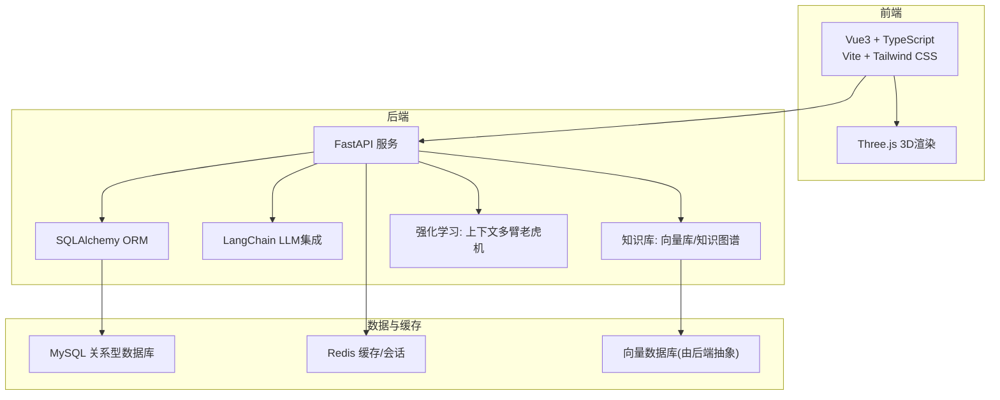
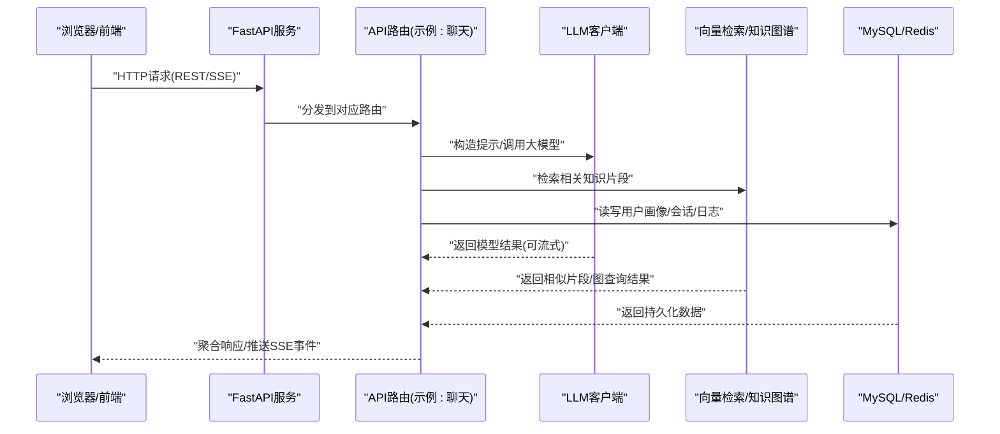
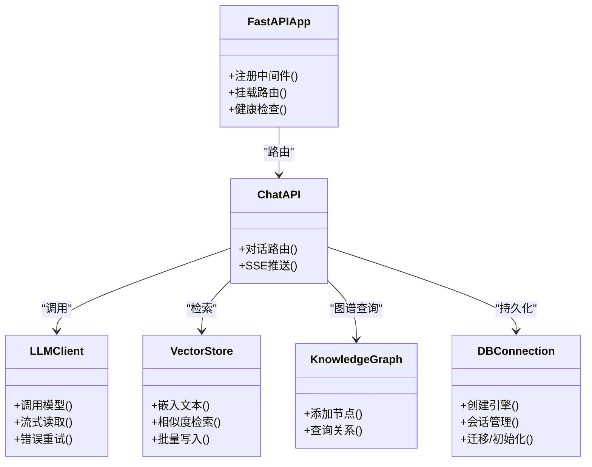
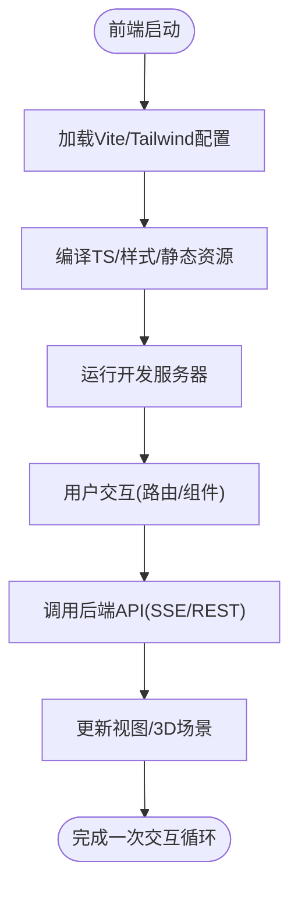
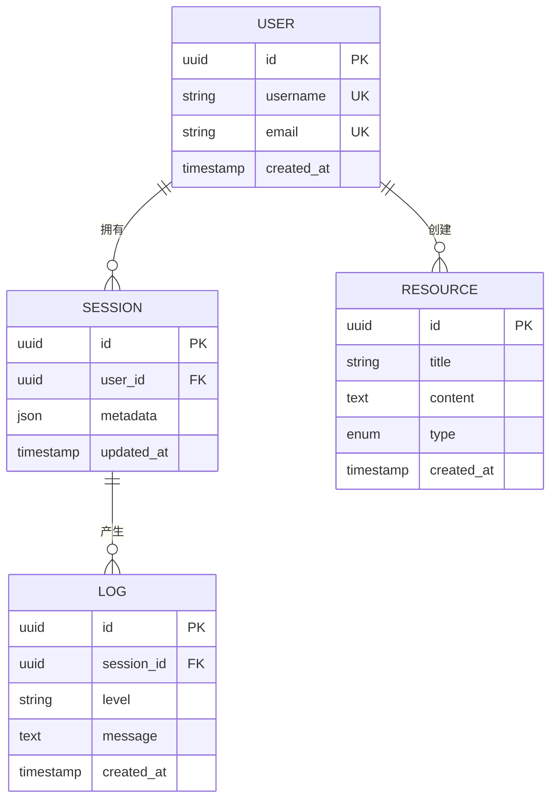
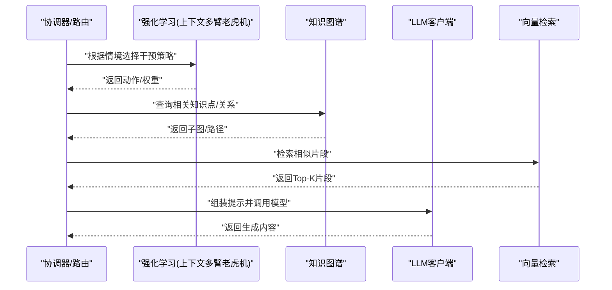
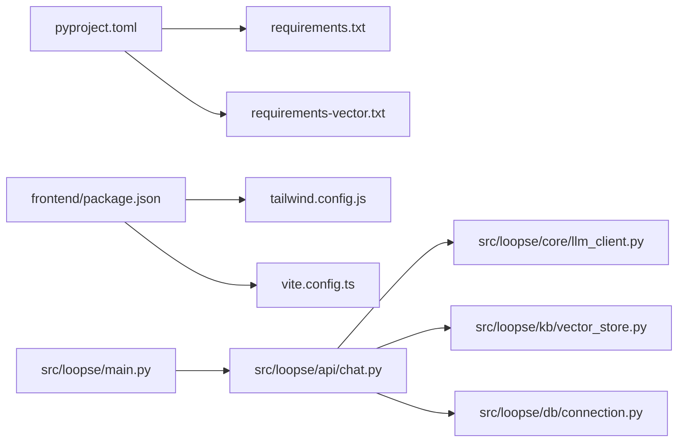

# 技术栈概览

<cite>
**本文引用的文件**   
- [pyproject.toml](file://pyproject.toml)
- [requirements.txt](file://requirements.txt)
- [requirements-vector.txt](file://requirements-vector.txt)
- [frontend/package.json](file://frontend/package.json)
- [frontend/tailwind.config.js](file://frontend/tailwind.config.js)
- [frontend/vite.config.ts](file://frontend/vite.config.ts)
- [src/loopse/main.py](file://src/loopse/main.py)
- [src/loopse/db/connection.py](file://src/loopse/db/connection.py)
- [src/loopse/kb/vector_store.py](file://src/loopse/kb/vector_store.py)
- [src/loopse/core/llm_client.py](file://src/loopse/core/llm_client.py)
- [src/loopse/api/chat.py](file://src/loopse/api/chat.py)
- [src/loopse/api/rl.py](file://src/loopse/api/rl.py)
- [src/loopse/rl/contextual_bandit.py](file://src/loopse/rl/contextual bandit.py)
- [src/loopse/kb/knowledge_graph.py](file://src/loopse/kb/knowledge_graph.py)
- [scripts/init_db.py](file://scripts/init_db.py)
- [scripts/init_mysql.py](file://scripts/init_mysql.py)
- [scripts/build_knowledge_base.py](file://scripts/build_knowledge_base.py)
</cite>

## 目录
1. [简介](#简介)
2. [项目结构](#项目结构)
3. [核心组件](#核心组件)
4. [架构总览](#架构总览)
5. [详细组件分析](#详细组件分析)
6. [依赖关系分析](#依赖关系分析)
7. [性能考量](#性能考量)
8. [故障排查指南](#故障排查指南)
9. [结论](#结论)
10. [附录](#附录)

## 简介
本技术栈概览面向Socrates-Cube项目的开发者与运维人员，系统梳理后端、前端、数据库与AI/ML相关技术选型、版本要求、相互关系以及开发工具链、构建与部署方式。目标是帮助读者快速建立对整体技术环境的清晰认知，并指导后续开发与排障。

## 项目结构
仓库采用前后端分离的模块化组织：
- 后端（Python）：基于FastAPI提供REST/SSE接口，使用SQLAlchemy进行ORM建模与连接管理，结合LangChain生态完成LLM调用与提示工程；向量检索与知识图谱位于kb模块；强化学习在rl模块；API路由集中在api模块。
- 前端（Vue3 + TypeScript）：使用Vite构建，Tailwind CSS样式框架，Three.js用于3D场景展示；通过API层与后端交互，状态管理使用组合式Store。
- 脚本与数据：scripts目录包含知识库构建、数据初始化、环境校验等工具脚本。
- 配置与文档：config存放提示词模板与API契约；docs存放架构、需求、部署与测试说明。

[此图为概念性结构示意，不直接映射具体源码文件]

## 核心组件
- 后端服务入口与路由
  - FastAPI应用启动与中间件注册、路由挂载位于主入口文件。
  - 各业务域以独立API模块划分，如聊天、路径规划、资源生成、诊断、模拟、RL等。
- 数据访问层
  - SQLAlchemy连接管理与模型定义，统一封装数据库操作。
  - 提供初始化脚本用于建库、建表与种子数据注入。
- AI能力层
  - LLM客户端封装，屏蔽不同提供商差异，支持流式响应与重试策略。
  - LangChain用于提示编排、检索增强与结构化输出。
  - 向量存储抽象，对接外部向量数据库，提供文本切分、索引与检索。
  - 知识图谱模块负责节点/边建模与查询。
- 强化学习
  - 上下文多臂老虎机算法用于干预策略选择，结合用户画像与情境特征。
- 前端
  - Vue3 + TypeScript + Vite + Tailwind CSS，组件化视图与组合式逻辑。
  - Three.js用于设备/硬件3D可视化。
  - 统一的API客户端与拦截器，支持Mock与SSE事件处理。

章节来源
- [src/loopse/main.py](file://src/loopse/main.py)
- [src/loopse/api/chat.py](file://src/loopse/api/chat.py)
- [src/loopse/db/connection.py](file://src/loopse/db/connection.py)
- [src/loopse/core/llm_client.py](file://src/loopse/core/llm_client.py)
- [src/loopse/kb/vector_store.py](file://src/loopse/kb/vector_store.py)
- [src/loopse/kb/knowledge_graph.py](file://src/loopse/kb/knowledge_graph.py)
- [src/loopse/rl/contextual bandit.py](file://src/loopse/rl/contextual bandit.py)
- [frontend/package.json](file://frontend/package.json)
- [frontend/tailwind.config.js](file://frontend/tailwind.config.js)
- [frontend/vite.config.ts](file://frontend/vite.config.ts)

## 架构总览
下图展示了从前端到后端的请求链路，以及与数据库、缓存、向量库和LLM的交互关系。

图表来源
- [src/loopse/main.py](file://src/loopse/main.py)
- [src/loopse/api/chat.py](file://src/loopse/api/chat.py)
- [src/loopse/core/llm_client.py](file://src/loopse/core/llm_client.py)
- [src/loopse/kb/vector_store.py](file://src/loopse/kb/vector_store.py)
- [src/loopse/db/connection.py](file://src/loopse/db/connection.py)

## 详细组件分析

### 后端技术栈：Python + FastAPI + SQLAlchemy + LangChain
- Python与包管理
  - 使用pyproject.toml声明项目元数据与依赖，requirements.txt作为兼容清单。
  - 向量相关依赖单独维护于requirements-vector.txt，便于按需安装。
- FastAPI服务
  - 主入口负责应用实例化、中间件与路由注册。
  - 各API按领域拆分，便于扩展与维护。
- SQLAlchemy
  - 连接管理、模型定义与事务封装，统一数据访问。
  - 提供初始化脚本用于数据库准备与种子数据。
- LangChain与大模型集成
  - LLM客户端封装统一调用接口，支持多种提供商与流式输出。
  - 提示工程与检索增强通过LangChain生态实现。

图表来源
- [src/loopse/main.py](file://src/loopse/main.py)
- [src/loopse/api/chat.py](file://src/loopse/api/chat.py)
- [src/loopse/core/llm_client.py](file://src/loopse/core/llm_client.py)
- [src/loopse/kb/vector_store.py](file://src/loopse/kb/vector_store.py)
- [src/loopse/kb/knowledge_graph.py](file://src/loopse/kb/knowledge_graph.py)
- [src/loopse/db/connection.py](file://src/loopse/db/connection.py)

章节来源
- [pyproject.toml](file://pyproject.toml)
- [requirements.txt](file://requirements.txt)
- [requirements-vector.txt](file://requirements-vector.txt)
- [src/loopse/main.py](file://src/loopse/main.py)
- [src/loopse/api/chat.py](file://src/loopse/api/chat.py)
- [src/loopse/core/llm_client.py](file://src/loopse/core/llm_client.py)
- [src/loopse/kb/vector_store.py](file://src/loopse/kb/vector_store.py)
- [src/loopse/kb/knowledge_graph.py](file://src/loopse/kb/knowledge_graph.py)
- [src/loopse/db/connection.py](file://src/loopse/db/connection.py)

### 前端技术栈：Vue3 + TypeScript + Tailwind CSS + Three.js
- 构建与工程化
  - Vite作为构建工具，TypeScript类型安全，Tailwind CSS原子化样式。
  - package.json集中声明依赖与脚本命令。
- 3D可视化
  - Three.js用于设备/硬件3D场景渲染，提升教学沉浸感。
- 网络与状态
  - 统一API客户端与拦截器，支持Mock与SSE事件处理。
  - 组合式Store管理认证、聊天、路径、资源、模拟器与用户信息。

图表来源
- [frontend/package.json](file://frontend/package.json)
- [frontend/tailwind.config.js](file://frontend/tailwind.config.js)
- [frontend/vite.config.ts](file://frontend/vite.config.ts)

章节来源
- [frontend/package.json](file://frontend/package.json)
- [frontend/tailwind.config.js](file://frontend/tailwind.config.js)
- [frontend/vite.config.ts](file://frontend/vite.config.ts)

### 数据库方案：MySQL + Redis + 向量数据库
- MySQL
  - 关系型数据存储，承载用户、会话、资源、日志等结构化数据。
  - 通过SQLAlchemy连接与模型管理，配合初始化脚本完成建库建表与种子数据。
- Redis
  - 用作缓存与会话存储，降低热点数据访问延迟。
- 向量数据库
  - 通过后端抽象层接入，提供文本嵌入与相似度检索，支撑检索增强生成(RAG)。
  - 构建流程由脚本驱动，将文档解析、切分、向量化与入库串联。

图表来源
- [src/loopse/db/models.py](file://src/loopse/db/models.py)

章节来源
- [src/loopse/db/connection.py](file://src/loopse/db/connection.py)
- [scripts/init_db.py](file://scripts/init_db.py)
- [scripts/init_mysql.py](file://scripts/init_mysql.py)
- [scripts/build_knowledge_base.py](file://scripts/build_knowledge_base.py)
- [src/loopse/kb/vector_store.py](file://src/loopse/kb/vector_store.py)

### AI/ML技术：大语言模型集成、强化学习、知识图谱
- 大语言模型集成
  - 通过LLM客户端统一封装，支持多种提供商与流式输出，结合LangChain进行提示编排与结构化输出。
- 强化学习
  - 上下文多臂老虎机用于动态干预策略选择，依据用户画像与情境特征优化推荐与引导。
- 知识图谱
  - 节点与边建模，支持关系查询与可视化，辅助诊断与路径规划。

图表来源
- [src/loopse/api/rl.py](file://src/loopse/api/rl.py)
- [src/loopse/rl/contextual bandit.py](file://src/loopse/rl/contextual bandit.py)
- [src/loopse/kb/knowledge_graph.py](file://src/loopse/kb/knowledge_graph.py)
- [src/loopse/kb/vector_store.py](file://src/loopse/kb/vector_store.py)
- [src/loopse/core/llm_client.py](file://src/loopse/core/llm_client.py)

章节来源
- [src/loopse/api/rl.py](file://src/loopse/api/rl.py)
- [src/loopse/rl/contextual bandit.py](file://src/loopse/rl/contextual bandit.py)
- [src/loopse/kb/knowledge_graph.py](file://src/loopse/kb/knowledge_graph.py)
- [src/loopse/kb/vector_store.py](file://src/loopse/kb/vector_store.py)
- [src/loopse/core/llm_client.py](file://src/loopse/core/llm_client.py)

## 依赖关系分析
- 后端依赖
  - pyproject.toml与requirements.txt声明核心依赖；requirements-vector.txt专管向量库相关依赖。
  - FastAPI、SQLAlchemy、LangChain为核心运行时依赖。
- 前端依赖
  - package.json声明Vue3、TypeScript、Vite、Tailwind CSS与Three.js等依赖。
- 关键耦合点
  - API层与LLM/向量/图谱/数据库存在强耦合，需通过清晰的接口与错误处理解耦。
  - 前端与后端通过REST/SSE通信，需保证契约一致与版本兼容。

图表来源
- [pyproject.toml](file://pyproject.toml)
- [requirements.txt](file://requirements.txt)
- [requirements-vector.txt](file://requirements-vector.txt)
- [frontend/package.json](file://frontend/package.json)
- [frontend/tailwind.config.js](file://frontend/tailwind.config.js)
- [frontend/vite.config.ts](file://frontend/vite.config.ts)
- [src/loopse/main.py](file://src/loopse/main.py)
- [src/loopse/api/chat.py](file://src/loopse/api/chat.py)
- [src/loopse/core/llm_client.py](file://src/loopse/core/llm_client.py)
- [src/loopse/kb/vector_store.py](file://src/loopse/kb/vector_store.py)
- [src/loopse/db/connection.py](file://src/loopse/db/connection.py)

章节来源
- [pyproject.toml](file://pyproject.toml)
- [requirements.txt](file://requirements.txt)
- [requirements-vector.txt](file://requirements-vector.txt)
- [frontend/package.json](file://frontend/package.json)
- [frontend/tailwind.config.js](file://frontend/tailwind.config.js)
- [frontend/vite.config.ts](file://frontend/vite.config.ts)
- [src/loopse/main.py](file://src/loopse/main.py)
- [src/loopse/api/chat.py](file://src/loopse/api/chat.py)
- [src/loopse/core/llm_client.py](file://src/loopse/core/llm_client.py)
- [src/loopse/kb/vector_store.py](file://src/loopse/kb/vector_store.py)
- [src/loopse/db/connection.py](file://src/loopse/db/connection.py)

## 性能考量
- 后端
  - 使用异步I/O与流式响应降低长耗时请求阻塞。
  - 向量检索与LLM调用建议引入缓存与批处理策略，减少重复计算。
  - 数据库连接池与慢查询监控有助于稳定吞吐。
- 前端
  - 合理使用懒加载与代码分割，控制首屏体积。
  - 3D场景按需渲染与纹理压缩，避免卡顿。
- 数据层
  - 热点数据入Redis缓存，合理设置TTL与失效策略。
  - 向量索引定期重建与增量更新，平衡召回率与延迟。

[本节为通用性能建议，不直接分析具体文件]

## 故障排查指南
- 常见后端问题
  - 数据库连接失败：检查连接参数、权限与初始化脚本执行顺序。
  - LLM调用超时或限流：查看客户端重试与降级策略，确认密钥与配额。
  - 向量检索无结果：确认文本切分与嵌入一致性，检查索引是否构建成功。
- 常见前端问题
  - 构建失败：核对Node版本与依赖锁定文件，清理缓存后重装。
  - SSE无法接收：检查跨域与代理配置，确认后端事件流格式。
- 参考脚本与入口
  - 数据库初始化与MySQL初始化脚本。
  - 知识库构建脚本用于验证向量库连通性与索引质量。

章节来源
- [scripts/init_db.py](file://scripts/init_db.py)
- [scripts/init_mysql.py](file://scripts/init_mysql.py)
- [scripts/build_knowledge_base.py](file://scripts/build_knowledge_base.py)
- [src/loopse/db/connection.py](file://src/loopse/db/connection.py)
- [src/loopse/core/llm_client.py](file://src/loopse/core/llm_client.py)
- [src/loopse/kb/vector_store.py](file://src/loopse/kb/vector_store.py)

## 结论
Socrates-Cube采用现代前后端分离架构，后端以FastAPI+SQLAlchemy+LangChain为核心，结合向量检索与知识图谱实现检索增强与智能问答；前端以Vue3+TypeScript+Tailwind+Three.js提供沉浸式交互体验。通过清晰的模块划分与脚本化工具链，项目在可扩展性、可维护性与教学效果方面具备良好基础。建议在后续迭代中持续完善错误处理、性能监控与自动化测试，以提升稳定性与交付效率。

## 附录
- 开发工具链
  - 后端：Python、FastAPI、SQLAlchemy、LangChain、向量库SDK。
  - 前端：Node.js、Vite、TypeScript、Tailwind CSS、Three.js。
- 构建与部署
  - 前端：Vite构建产物，可通过Nginx或CDN托管。
  - 后端：容器化部署，环境变量管理敏感配置，反向代理暴露API。
- 版本要求
  - 详见pyproject.toml、requirements*.txt与package.json中的依赖声明。

[本节为通用说明，不直接分析具体文件]