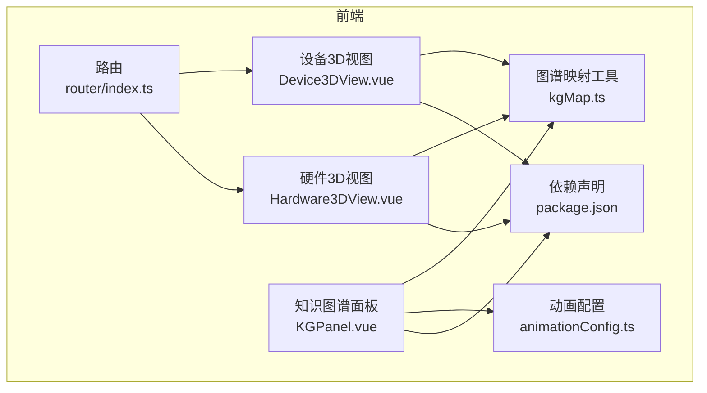
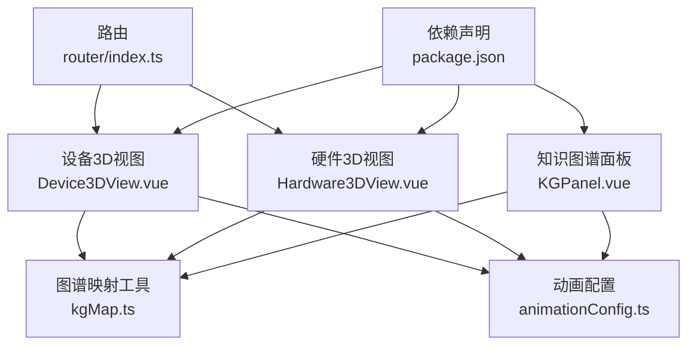
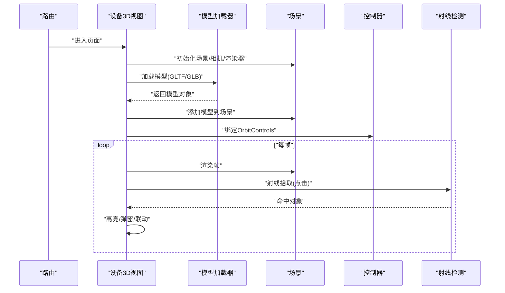
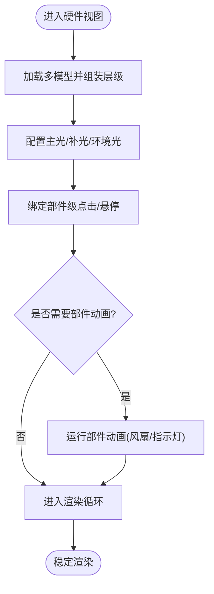
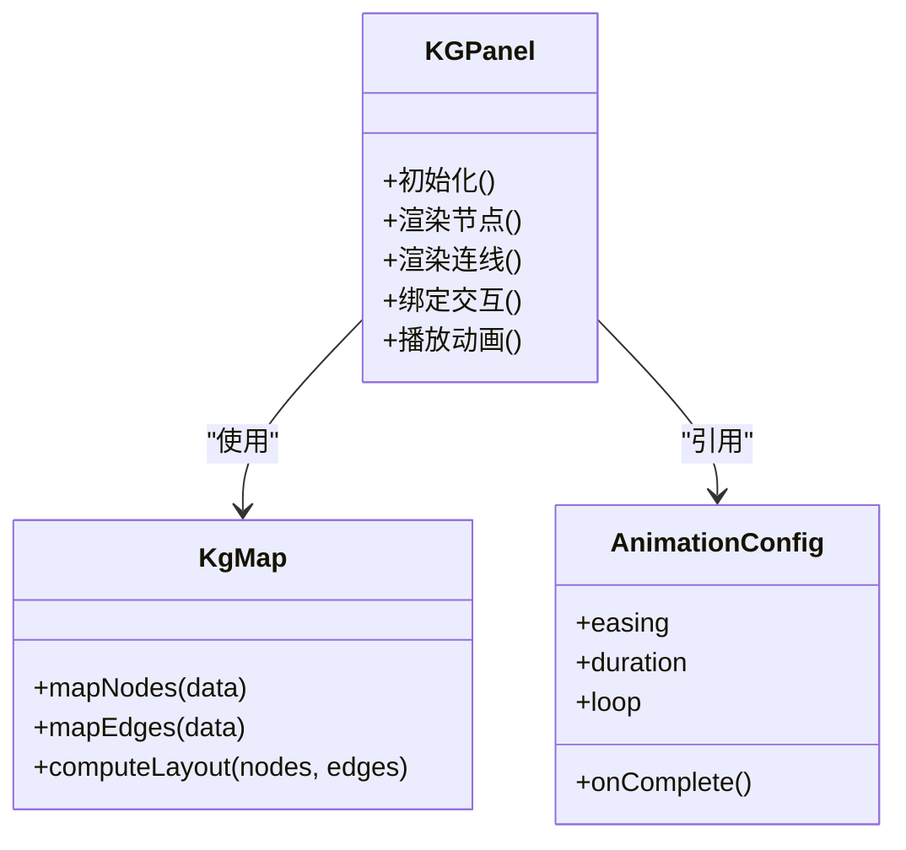
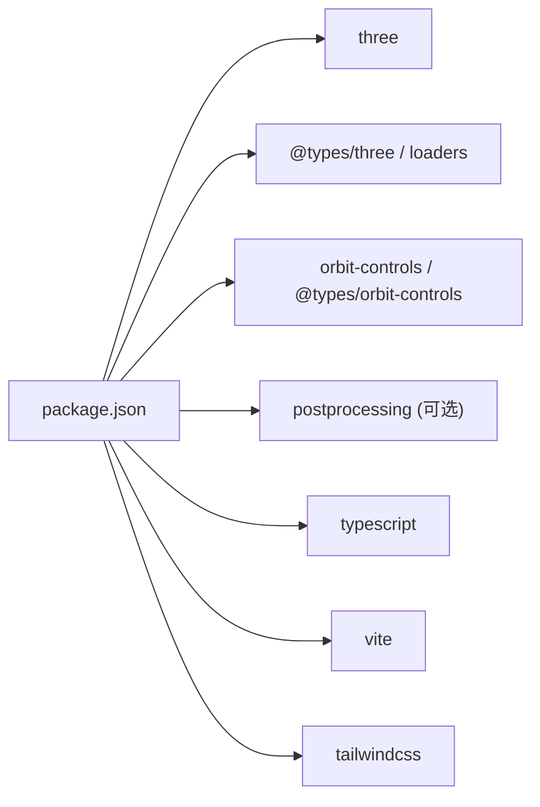

# 3D可视化交互系统

<cite>
**本文引用的文件**   
- [frontend/src/views/Device3DView.vue](file://frontend/src/views/Device3DView.vue)
- [frontend/src/views/Hardware3DView.vue](file://frontend/src/views/Hardware3DView.vue)
- [frontend/src/components/KGPanel.vue](file://frontend/src/components/KGPanel.vue)
- [frontend/src/utils/kgMap.ts](file://frontend/src/utils/kgMap.ts)
- [frontend/src/utils/animationConfig.ts](file://frontend/src/utils/animationConfig.ts)
- [frontend/src/router/index.ts](file://frontend/src/router/index.ts)
- [frontend/package.json](file://frontend/package.json)
</cite>

## 目录
1. [简介](#简介)
2. [项目结构](#项目结构)
3. [核心组件](#核心组件)
4. [架构总览](#架构总览)
5. [详细组件分析](#详细组件分析)
6. [依赖分析](#依赖分析)
7. [性能考虑](#性能考虑)
8. [故障排查指南](#故障排查指南)
9. [结论](#结论)
10. [附录](#附录)

## 简介
本技术文档面向Socrates-Cube的3D可视化交互系统，聚焦Three.js在前端工程中的集成方案与落地实践。内容涵盖：
- 3D场景初始化、模型加载与渲染优化
- 硬件设备3D展示（模型管理、材质与光照）
- 用户交互设计（鼠标操作、视角控制、点击响应）
- 知识图谱的3D可视化实现（节点布局、连线绘制、动画）
- 性能优化策略（模型压缩、纹理优化、渲染管线调优）
- 开发指南（新增设备与场景、自定义交互）
- 学习过程中的应用价值与用户体验提升

## 项目结构
前端采用Vue 3 + TypeScript组织，3D相关视图与工具位于以下位置：
- 视图层：Device3DView.vue、Hardware3DView.vue
- 知识图谱面板：KGPanel.vue
- 工具与配置：kgMap.ts、animationConfig.ts
- 路由注册：router/index.ts
- 依赖声明：package.json

图表来源
- [frontend/src/router/index.ts](file://frontend/src/router/index.ts)
- [frontend/src/views/Device3DView.vue](file://frontend/src/views/Device3DView.vue)
- [frontend/src/views/Hardware3DView.vue](file://frontend/src/views/Hardware3DView.vue)
- [frontend/src/components/KGPanel.vue](file://frontend/src/components/KGPanel.vue)
- [frontend/src/utils/kgMap.ts](file://frontend/src/utils/kgMap.ts)
- [frontend/src/utils/animationConfig.ts](file://frontend/src/utils/animationConfig.ts)
- [frontend/package.json](file://frontend/package.json)

章节来源
- [frontend/src/router/index.ts](file://frontend/src/router/index.ts)
- [frontend/src/views/Device3DView.vue](file://frontend/src/views/Device3DView.vue)
- [frontend/src/views/Hardware3DView.vue](file://frontend/src/views/Hardware3DView.vue)
- [frontend/src/components/KGPanel.vue](file://frontend/src/components/KGPanel.vue)
- [frontend/src/utils/kgMap.ts](file://frontend/src/utils/kgMap.ts)
- [frontend/src/utils/animationConfig.ts](file://frontend/src/utils/animationConfig.ts)
- [frontend/package.json](file://frontend/package.json)

## 核心组件
- 设备3D视图（Device3DView.vue）
  - 负责3D场景初始化、相机与控制器设置、模型加载与渲染循环
  - 提供点击拾取、高亮反馈、信息面板联动等交互能力
- 硬件3D视图（Hardware3DView.vue）
  - 在设备视图基础上扩展硬件专属逻辑：多模型装配、材质切换、光照环境配置
  - 支持按部件分组、层级管理与局部动画
- 知识图谱面板（KGPanel.vue）
  - 将图谱数据映射为3D节点与连线，提供力导向布局、缩放平移、悬停提示
  - 通过动画配置驱动入场、呼吸、脉冲等动效
- 图谱映射工具（kgMap.ts）
  - 提供图谱数据结构到3D实体的转换函数（节点坐标、边集合、标签文本）
- 动画配置（animationConfig.ts）
  - 集中定义缓动曲线、时长、循环模式、事件回调等动画参数
- 路由（router/index.ts）
  - 注册3D页面路由，统一导航入口
- 依赖（package.json）
  - 声明Three.js及相关生态库版本，确保构建一致性

章节来源
- [frontend/src/views/Device3DView.vue](file://frontend/src/views/Device3DView.vue)
- [frontend/src/views/Hardware3DView.vue](file://frontend/src/views/Hardware3DView.vue)
- [frontend/src/components/KGPanel.vue](file://frontend/src/components/KGPanel.vue)
- [frontend/src/utils/kgMap.ts](file://frontend/src/utils/kgMap.ts)
- [frontend/src/utils/animationConfig.ts](file://frontend/src/utils/animationConfig.ts)
- [frontend/src/router/index.ts](file://frontend/src/router/index.ts)
- [frontend/package.json](file://frontend/package.json)

## 架构总览
整体采用“视图-工具-依赖”分层：
- 视图层：承载业务场景（设备/硬件），编排Three.js生命周期
- 工具层：数据映射与动画配置，解耦业务与图形细节
- 依赖层：Three.js及其生态库，提供渲染、几何、材质、加载器、控制器等能力

图表来源
- [frontend/src/views/Device3DView.vue](file://frontend/src/views/Device3DView.vue)
- [frontend/src/views/Hardware3DView.vue](file://frontend/src/views/Hardware3DView.vue)
- [frontend/src/components/KGPanel.vue](file://frontend/src/components/KGPanel.vue)
- [frontend/src/utils/kgMap.ts](file://frontend/src/utils/kgMap.ts)
- [frontend/src/utils/animationConfig.ts](file://frontend/src/utils/animationConfig.ts)
- [frontend/src/router/index.ts](file://frontend/src/router/index.ts)
- [frontend/package.json](file://frontend/package.json)

## 详细组件分析

### 设备3D视图（Device3DView.vue）
职责与流程
- 场景初始化：创建场景、相机、渲染器、控制器、光源与环境贴图
- 模型加载：使用GLTF/GLB加载器读取模型，处理材质与贴图资源
- 渲染循环：requestAnimationFrame驱动帧更新，处理阴影、后处理（可选）
- 交互：射线拾取点击目标，触发高亮或弹出详情；控制器提供旋转/缩放/平移
- 生命周期：挂载时启动，卸载时释放监听与资源，避免内存泄漏

图表来源
- [frontend/src/views/Device3DView.vue](file://frontend/src/views/Device3DView.vue)
- [frontend/src/router/index.ts](file://frontend/src/router/index.ts)

章节来源
- [frontend/src/views/Device3DView.vue](file://frontend/src/views/Device3DView.vue)
- [frontend/src/router/index.ts](file://frontend/src/router/index.ts)

### 硬件3D视图（Hardware3DView.vue）
职责与流程
- 多模型装配：组合多个子模型（如主板、散热、外壳），维护父子层级
- 材质管理：按部件切换PBR材质、金属度/粗糙度、法线贴图
- 光照配置：主光+补光+环境光，必要时启用HDR或反射探针
- 局部动画：对风扇、指示灯等部件执行独立动画
- 交互增强：按部件分组拾取，显示部件级信息

图表来源
- [frontend/src/views/Hardware3DView.vue](file://frontend/src/views/Hardware3DView.vue)

章节来源
- [frontend/src/views/Hardware3DView.vue](file://frontend/src/views/Hardware3DView.vue)

### 知识图谱3D可视化（KGPanel.vue + kgMap.ts + animationConfig.ts）
职责与流程
- 数据映射：将图谱节点/边转换为3D实体（球体/圆柱/线条）
- 布局算法：基于力导向或预设坐标计算节点位置，避免重叠
- 连线绘制：使用TubeGeometry或LineSegments绘制边，支持权重与颜色编码
- 动画效果：入场渐显、呼吸、脉冲、路径跟随等，由动画配置驱动
- 交互：悬停高亮、点击展开详情、拖拽调整布局

图表来源
- [frontend/src/components/KGPanel.vue](file://frontend/src/components/KGPanel.vue)
- [frontend/src/utils/kgMap.ts](file://frontend/src/utils/kgMap.ts)
- [frontend/src/utils/animationConfig.ts](file://frontend/src/utils/animationConfig.ts)

章节来源
- [frontend/src/components/KGPanel.vue](file://frontend/src/components/KGPanel.vue)
- [frontend/src/utils/kgMap.ts](file://frontend/src/utils/kgMap.ts)
- [frontend/src/utils/animationConfig.ts](file://frontend/src/utils/animationConfig.ts)

## 依赖分析
关键依赖与版本约束
- Three.js及生态库：用于场景、材质、几何、加载器、控制器、后处理等
- 构建与打包：Vite、TypeScript、CSS框架（Tailwind）
- 运行时：浏览器WebGL能力检测与降级策略

图表来源
- [frontend/package.json](file://frontend/package.json)

章节来源
- [frontend/package.json](file://frontend/package.json)

## 性能考虑
- 模型与纹理
  - 优先使用GLTF/GLB格式，开启Draco压缩；纹理使用KTX2/Basis压缩
  - 合理切分模型，按需加载与实例化重复构件
- 渲染管线
  - 合理使用阴影贴图分辨率与数量；关闭不必要的后处理
  - 启用抗锯齿与像素比自适应；根据设备能力动态降级
- 交互与计算
  - 射线检测仅对可见且可交互对象进行；批量合并静态网格
  - 动画使用GPU加速（ShaderMaterial）或节流更新频率
- 资源管理
  - 及时释放不再使用的纹理与几何体；避免全局缓存过大
  - 预加载关键资源，懒加载次要资源

[本节为通用指导，不直接分析具体文件]

## 故障排查指南
常见问题与定位思路
- 黑屏或无法渲染
  - 检查WebGL是否可用；确认渲染器尺寸与容器DOM存在
  - 查看控制台错误，定位材质或着色器异常
- 模型未显示或比例异常
  - 校验模型坐标系与单位；检查相机近远裁剪面与初始位置
  - 确认加载器类型与模型后缀匹配
- 交互无响应
  - 确认射线检测对象是否加入场景且未被遮挡
  - 检查事件监听是否在正确时机绑定与移除
- 性能卡顿
  - 监控Draw Call与三角面数；减少阴影与后处理
  - 降低纹理分辨率或启用纹理压缩；合并静态网格

章节来源
- [frontend/src/views/Device3DView.vue](file://frontend/src/views/Device3DView.vue)
- [frontend/src/views/Hardware3DView.vue](file://frontend/src/views/Hardware3DView.vue)
- [frontend/src/components/KGPanel.vue](file://frontend/src/components/KGPanel.vue)

## 结论
本系统以Three.js为核心，结合Vue 3组件化与工具化抽象，实现了设备与硬件的3D展示以及知识图谱的交互式可视化。通过合理的资源管理、渲染优化与交互设计，既保证了教学演示的沉浸感，也兼顾了跨设备的性能表现。后续可在HDR、物理材质、更丰富的动画与AI辅助讲解方面持续演进。

[本节为总结性内容，不直接分析具体文件]

## 附录

### 开发指南：新增3D设备与场景
- 新建视图组件
  - 在views下新增设备视图组件，复用场景初始化与渲染循环模板
  - 在路由中注册新页面，提供导航入口
- 准备模型与资源
  - 导出GLTF/GLB，拆分部件，命名清晰；生成对应纹理与贴图
  - 将资源放入public或静态目录，确保相对路径一致
- 实现交互
  - 为部件绑定点击/悬停事件，输出结构化信息至UI面板
  - 使用控制器提供标准视角操作
- 测试与优化
  - 在不同设备上验证渲染质量与性能；按需调整阴影与后处理

章节来源
- [frontend/src/router/index.ts](file://frontend/src/router/index.ts)
- [frontend/src/views/Device3DView.vue](file://frontend/src/views/Device3DView.vue)
- [frontend/src/views/Hardware3DView.vue](file://frontend/src/views/Hardware3DView.vue)

### 自定义交互效果实现方法
- 事件体系
  - 统一封装点击、双击、长按、拖拽事件，分发到各部件
- 视觉反馈
  - 高亮材质切换、描边、粒子特效；保持风格一致
- 状态同步
  - 与上层状态管理或面板联动，保证3D与UI一致

章节来源
- [frontend/src/components/KGPanel.vue](file://frontend/src/components/KGPanel.vue)
- [frontend/src/utils/animationConfig.ts](file://frontend/src/utils/animationConfig.ts)

### 学习过程中的应用价值与体验提升
- 直观理解复杂设备结构与工作原理
- 通过交互探索加深记忆与迁移能力
- 知识图谱可视化帮助建立概念关联与路径规划
- 动画与反馈提升参与感与动机

[本节为概念性说明，不直接分析具体文件]