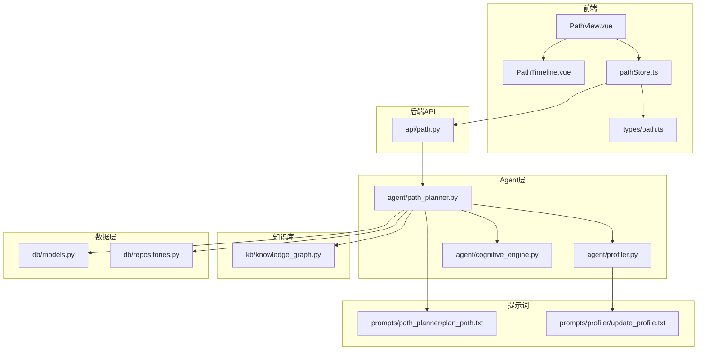
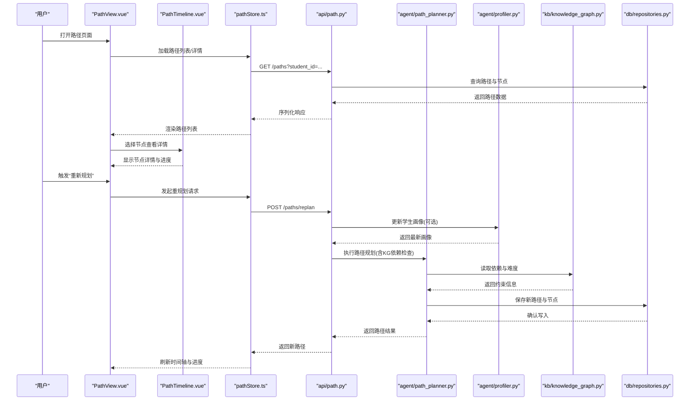
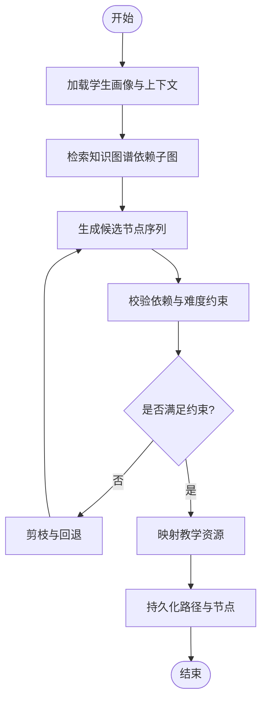
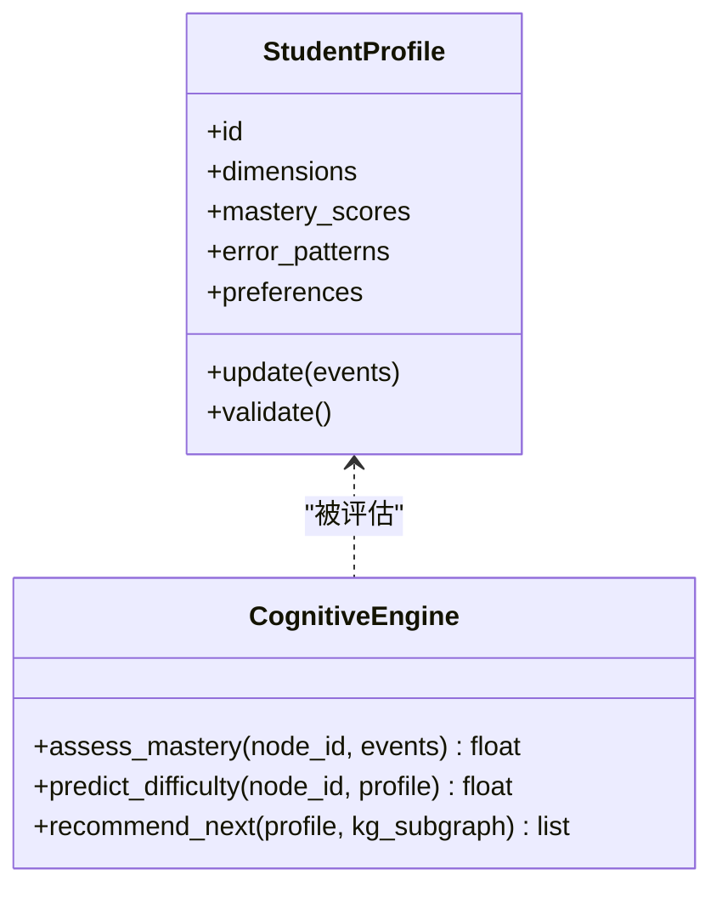
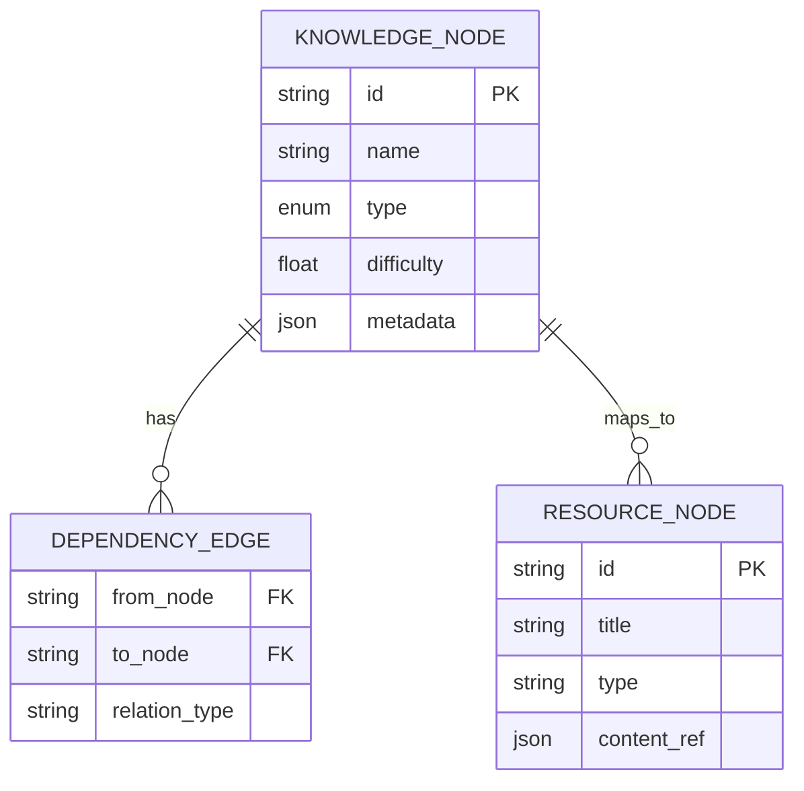
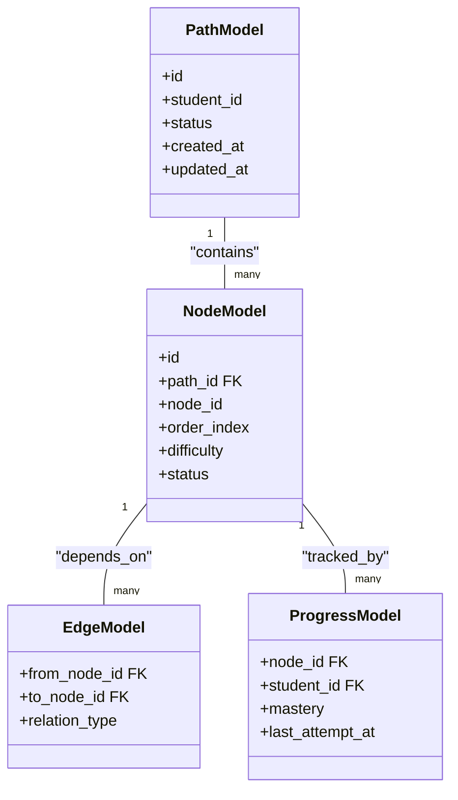
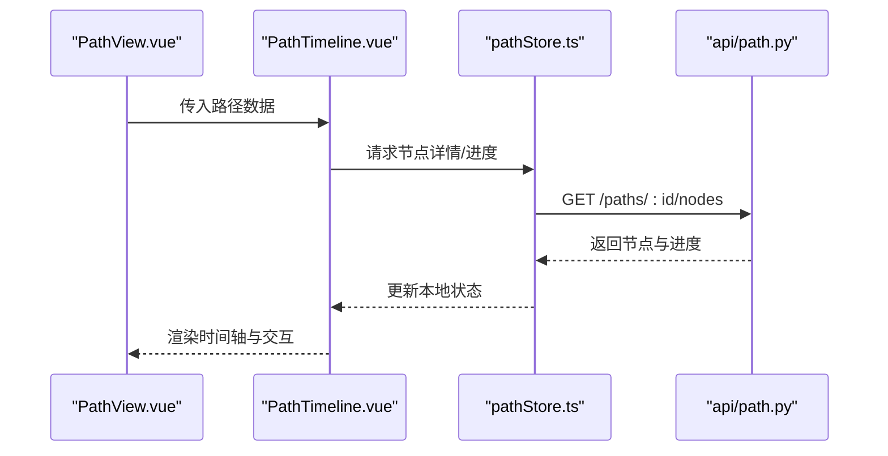
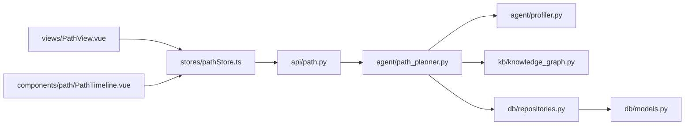

# 个性化学习路径规划

<cite>
**本文引用的文件**   
- [src/loopse/agent/path_planner.py](file://src/loopse/agent/path_planner.py)
- [src/loopse/api/path.py](file://src/loopse/api/path.py)
- [frontend/src/types/path.ts](file://frontend/src/types/path.ts)
- [frontend/src/stores/pathStore.ts](file://frontend/src/stores/pathStore.ts)
- [frontend/src/components/path/PathTimeline.vue](file://frontend/src/components/path/PathTimeline.vue)
- [frontend/src/views/PathView.vue](file://frontend/src/views/PathView.vue)
- [config/prompts/path_planner/plan_path.txt](file://config/prompts/path_planner/plan_path.txt)
- [config/prompts/profiler/update_profile.txt](file://config/prompts/profiler/update_profile.txt)
- [src/loopse/schema/student_profile_schema.py](file://src/loopse/schema/student_profile_schema.py)
- [src/loopse/kb/knowledge_graph.py](file://src/loopse/kb/knowledge_graph.py)
- [src/loopse/db/models.py](file://src/loopse/db/models.py)
- [src/loopse/db/repositories.py](file://src/loopse/db/repositories.py)
- [frontend/public/mock/path_mock.json](file://frontend/public/mock/path_mock.json)
</cite>

## 目录
1. [简介](#简介)
2. [项目结构](#项目结构)
3. [核心组件](#核心组件)
4. [架构总览](#架构总览)
5. [详细组件分析](#详细组件分析)
6. [依赖关系分析](#依赖关系分析)
7. [性能考量](#性能考量)
8. [故障排查指南](#故障排查指南)
9. [结论](#结论)
10. [附录](#附录)

## 简介
本技术文档聚焦Socrates-Cube的“个性化学习路径规划”能力，围绕以下目标展开：
- 路径规划算法的实现原理：基于学生画像的动态路径生成、难度评估模型与知识点依赖关系分析。
- 学习路径的数据结构设计：节点类型、连接关系与属性定义。
- 前端可视化组件：路径时间轴展示、进度跟踪与用户交互。
- API接口规范：路径创建、更新、查询与同步的RESTful接口说明。
- 使用场景与效果演示：如何根据学生的学习行为与认知水平动态调整学习路线。

## 项目结构
与“个性化学习路径规划”相关的代码主要分布在后端Agent层、API层、知识库与数据库层，以及前端的类型定义、状态管理与视图组件中。整体组织方式采用分层与按功能域划分相结合的模式：
- 后端
  - Agent层：path_planner负责路径规划策略与编排；profiler负责学生画像更新；cognitive_engine提供认知维度建模。
  - API层：path.py暴露路径相关REST接口。
  - 知识库：knowledge_graph维护知识点与依赖关系。
  - 数据层：models.py定义持久化模型；repositories.py提供数据访问封装。
  - 提示词：plan_path.txt与update_profile.txt驱动LLM生成与画像更新。
- 前端
  - 类型定义：path.ts描述路径数据结构。
  - 状态管理：pathStore.ts聚合路径相关状态与异步调用。
  - 视图与组件：PathView.vue为页面入口；PathTimeline.vue用于可视化呈现。
  - Mock数据：path_mock.json用于离线演示与联调。

图表来源
- [frontend/src/views/PathView.vue](file://frontend/src/views/PathView.vue)
- [frontend/src/components/path/PathTimeline.vue](file://frontend/src/components/path/PathTimeline.vue)
- [frontend/src/stores/pathStore.ts](file://frontend/src/stores/pathStore.ts)
- [frontend/src/types/path.ts](file://frontend/src/types/path.ts)
- [src/loopse/api/path.py](file://src/loopse/api/path.py)
- [src/loopse/agent/path_planner.py](file://src/loopse/agent/path_planner.py)
- [src/loopse/agent/profiler.py](file://src/loopse/agent/profiler.py)
- [src/loopse/agent/cognitive_engine.py](file://src/loopse/agent/cognitive_engine.py)
- [src/loopse/kb/knowledge_graph.py](file://src/loopse/kb/knowledge_graph.py)
- [src/loopse/db/models.py](file://src/loopse/db/models.py)
- [src/loopse/db/repositories.py](file://src/loopse/db/repositories.py)
- [config/prompts/path_planner/plan_path.txt](file://config/prompts/path_planner/plan_path.txt)
- [config/prompts/profiler/update_profile.txt](file://config/prompts/profiler/update_profile.txt)

章节来源
- [src/loopse/agent/path_planner.py](file://src/loopse/agent/path_planner.py)
- [src/loopse/api/path.py](file://src/loopse/api/path.py)
- [frontend/src/types/path.ts](file://frontend/src/types/path.ts)
- [frontend/src/stores/pathStore.ts](file://frontend/src/stores/pathStore.ts)
- [frontend/src/components/path/PathTimeline.vue](file://frontend/src/components/path/PathTimeline.vue)
- [frontend/src/views/PathView.vue](file://frontend/src/views/PathView.vue)
- [config/prompts/path_planner/plan_path.txt](file://config/prompts/path_planner/plan_path.txt)
- [config/prompts/profiler/update_profile.txt](file://config/prompts/profiler/update_profile.txt)
- [src/loopse/schema/student_profile_schema.py](file://src/loopse/schema/student_profile_schema.py)
- [src/loopse/kb/knowledge_graph.py](file://src/loopse/kb/knowledge_graph.py)
- [src/loopse/db/models.py](file://src/loopse/db/models.py)
- [src/loopse/db/repositories.py](file://src/loopse/db/repositories.py)
- [frontend/public/mock/path_mock.json](file://frontend/public/mock/path_mock.json)

## 核心组件
本节从系统层面梳理路径规划的核心组件及其职责边界：
- 路径规划器（path_planner）
  - 输入：学生画像、当前学习目标、知识图谱约束、历史学习证据。
  - 输出：结构化学习路径（节点序列、依赖边、难度梯度、资源映射）。
  - 关键逻辑：结合LLM提示词进行策略推理，依据依赖图进行拓扑排序与剪枝，应用难度评估模型进行顺序优化。
- 学生画像（profiler）
  - 职责：采集并更新学生的认知维度、掌握度、错误模式与偏好。
  - 更新机制：基于学习事件与诊断结果增量更新，遵循schema校验。
- 知识图谱（knowledge_graph）
  - 职责：维护知识点、先修关系、难度标签与资源关联。
  - 作用：为路径规划提供依赖约束与可达性判断。
- 数据模型与仓库（models/repositories）
  - 职责：持久化路径、节点、边、学习进度与证据。
  - 抽象：通过仓库层屏蔽底层存储细节，便于替换或扩展。
- 前端路径模块（types/path.ts, pathStore.ts, PathTimeline.vue, PathView.vue）
  - 职责：定义路径数据结构、聚合状态、渲染时间轴与交互控制。
  - 特性：支持进度追踪、节点详情展开、路径重规划触发。

章节来源
- [src/loopse/agent/path_planner.py](file://src/loopse/agent/path_planner.py)
- [src/loopse/agent/profiler.py](file://src/loopse/agent/profiler.py)
- [src/loopse/kb/knowledge_graph.py](file://src/loopse/kb/knowledge_graph.py)
- [src/loopse/db/models.py](file://src/loopse/db/models.py)
- [src/loopse/db/repositories.py](file://src/loopse/db/repositories.py)
- [frontend/src/types/path.ts](file://frontend/src/types/path.ts)
- [frontend/src/stores/pathStore.ts](file://frontend/src/stores/pathStore.ts)
- [frontend/src/components/path/PathTimeline.vue](file://frontend/src/components/path/PathTimeline.vue)
- [frontend/src/views/PathView.vue](file://frontend/src/views/PathView.vue)

## 架构总览
下图展示了从前端到后端的端到端流程，包括路径创建、更新、查询与同步的关键交互。

图表来源
- [frontend/src/views/PathView.vue](file://frontend/src/views/PathView.vue)
- [frontend/src/components/path/PathTimeline.vue](file://frontend/src/components/path/PathTimeline.vue)
- [frontend/src/stores/pathStore.ts](file://frontend/src/stores/pathStore.ts)
- [src/loopse/api/path.py](file://src/loopse/api/path.py)
- [src/loopse/agent/path_planner.py](file://src/loopse/agent/path_planner.py)
- [src/loopse/agent/profiler.py](file://src/loopse/agent/profiler.py)
- [src/loopse/kb/knowledge_graph.py](file://src/loopse/kb/knowledge_graph.py)
- [src/loopse/db/repositories.py](file://src/loopse/db/repositories.py)

## 详细组件分析

### 路径规划器（path_planner）
- 设计要点
  - 输入融合：整合学生画像、学习目标、历史表现与知识图谱约束。
  - 策略生成：借助提示词驱动LLM生成候选路径片段，再经规则引擎进行可行性校验。
  - 依赖处理：基于知识图谱的先修关系进行拓扑排序，确保路径可执行性。
  - 难度评估：对每个节点计算难度值，保证整体难度曲线平滑上升。
  - 资源映射：将节点与教学资源建立关联，支撑后续内容推送。
- 关键流程
  - 获取画像与上下文
  - 检索依赖子图
  - 生成候选节点序列
  - 校验与剪枝
  - 持久化路径与节点
- 复杂度与优化
  - 依赖子图规模影响排序与剪枝成本；可通过缓存热点子图降低延迟。
  - LLM调用次数与提示词长度直接影响时延；建议批量化与缓存策略。

图表来源
- [src/loopse/agent/path_planner.py](file://src/loopse/agent/path_planner.py)
- [src/loopse/kb/knowledge_graph.py](file://src/loopse/kb/knowledge_graph.py)
- [config/prompts/path_planner/plan_path.txt](file://config/prompts/path_planner/plan_path.txt)

章节来源
- [src/loopse/agent/path_planner.py](file://src/loopse/agent/path_planner.py)
- [config/prompts/path_planner/plan_path.txt](file://config/prompts/path_planner/plan_path.txt)

### 学生画像（profiler）与认知引擎（cognitive_engine）
- 画像更新
  - 基于学习事件（完成、错误、耗时、重试等）增量更新掌握度与错误模式。
  - 使用提示词模板统一更新口径，确保一致性。
- 认知维度
  - 包含概念理解、程序性技能、迁移能力等维度评分。
  - 与路径难度评估联动，形成自适应调节。
- 校验与约束
  - 遵循schema定义，防止非法字段与越界数值。

图表来源
- [src/loopse/agent/profiler.py](file://src/loopse/agent/profiler.py)
- [src/loopse/agent/cognitive_engine.py](file://src/loopse/agent/cognitive_engine.py)
- [src/loopse/schema/student_profile_schema.py](file://src/loopse/schema/student_profile_schema.py)
- [config/prompts/profiler/update_profile.txt](file://config/prompts/profiler/update_profile.txt)

章节来源
- [src/loopse/agent/profiler.py](file://src/loopse/agent/profiler.py)
- [src/loopse/agent/cognitive_engine.py](file://src/loopse/agent/cognitive_engine.py)
- [src/loopse/schema/student_profile_schema.py](file://src/loopse/schema/student_profile_schema.py)
- [config/prompts/profiler/update_profile.txt](file://config/prompts/profiler/update_profile.txt)

### 知识图谱（knowledge_graph）
- 结构与职责
  - 节点：知识点、资源、先修关系、难度标签。
  - 边：依赖关系、资源关联。
  - 查询：子图提取、可达性判断、最短路径与拓扑序。
- 与路径规划的耦合
  - 提供依赖约束与难度基准，保障路径的可执行性与渐进性。

图表来源
- [src/loopse/kb/knowledge_graph.py](file://src/loopse/kb/knowledge_graph.py)
- [src/loopse/db/models.py](file://src/loopse/db/models.py)

章节来源
- [src/loopse/kb/knowledge_graph.py](file://src/loopse/kb/knowledge_graph.py)
- [src/loopse/db/models.py](file://src/loopse/db/models.py)

### 数据模型与仓库（models/repositories）
- 模型定义
  - 路径、节点、边、学习进度、证据记录等实体。
- 仓库抽象
  - 提供CRUD与批量操作，屏蔽存储实现差异。
- 事务与一致性
  - 路径创建与节点写入需保证原子性，避免中间态。

图表来源
- [src/loopse/db/models.py](file://src/loopse/db/models.py)
- [src/loopse/db/repositories.py](file://src/loopse/db/repositories.py)

章节来源
- [src/loopse/db/models.py](file://src/loopse/db/models.py)
- [src/loopse/db/repositories.py](file://src/loopse/db/repositories.py)

### 前端路径模块（types/path.ts, pathStore.ts, PathTimeline.vue, PathView.vue）
- 类型定义（types/path.ts）
  - 定义路径、节点、边、进度等数据结构，确保前后端契约一致。
- 状态管理（pathStore.ts）
  - 聚合路径列表、详情、进度与错误状态；封装异步调用与重试逻辑。
- 可视化（PathTimeline.vue）
  - 以时间轴形式展示路径节点，支持点击展开详情、拖拽重排（若启用）、进度条与状态标记。
- 页面集成（PathView.vue）
  - 组合各组件，提供“重新规划”、“导出”、“分享”等操作入口。

图表来源
- [frontend/src/types/path.ts](file://frontend/src/types/path.ts)
- [frontend/src/stores/pathStore.ts](file://frontend/src/stores/pathStore.ts)
- [frontend/src/components/path/PathTimeline.vue](file://frontend/src/components/path/PathTimeline.vue)
- [frontend/src/views/PathView.vue](file://frontend/src/views/PathView.vue)
- [src/loopse/api/path.py](file://src/loopse/api/path.py)

章节来源
- [frontend/src/types/path.ts](file://frontend/src/types/path.ts)
- [frontend/src/stores/pathStore.ts](file://frontend/src/stores/pathStore.ts)
- [frontend/src/components/path/PathTimeline.vue](file://frontend/src/components/path/PathTimeline.vue)
- [frontend/src/views/PathView.vue](file://frontend/src/views/PathView.vue)

### RESTful API接口规范（路径相关）
以下为路径规划相关的主要接口约定（方法、路径、用途与典型参数），具体字段以实际实现为准：
- 创建路径
  - 方法：POST
  - 路径：/api/v1/paths
  - 用途：为指定学生创建初始学习路径
  - 请求体关键字段：student_id、goal、constraints、resources
  - 响应：路径ID、状态、节点列表
- 查询路径列表
  - 方法：GET
  - 路径：/api/v1/paths
  - 查询参数：student_id、status、page、size
  - 响应：分页的路径条目
- 查询路径详情
  - 方法：GET
  - 路径：/api/v1/paths/{path_id}
  - 响应：路径元信息、节点序列、依赖边、进度摘要
- 更新路径
  - 方法：PUT/PATCH
  - 路径：/api/v1/paths/{path_id}
  - 用途：调整节点顺序、难度阈值、资源映射等
  - 请求体关键字段：updates（节点/边/属性变更）
- 重新规划
  - 方法：POST
  - 路径：/api/v1/paths/replan
  - 用途：基于最新画像与证据重新生成路径
  - 请求体关键字段：student_id、evidence、constraints
- 同步进度
  - 方法：POST
  - 路径：/api/v1/paths/{path_id}/progress
  - 用途：上报节点完成、掌握度、错误证据
  - 请求体关键字段：node_id、mastery、events
- 删除路径
  - 方法：DELETE
  - 路径：/api/v1/paths/{path_id}
  - 用途：归档或删除路径

章节来源
- [src/loopse/api/path.py](file://src/loopse/api/path.py)

### 使用场景与效果演示
- 场景一：新手入门
  - 输入：低掌握度、基础薄弱
  - 行为：系统优先安排前置知识点，逐步提升难度，配合资源推荐
  - 效果：路径平缓上升，错误率下降，完成率提高
- 场景二：瓶颈突破
  - 输入：特定知识点长期未掌握
  - 行为：诊断错误模式，插入针对性练习与讲解资源
  - 效果：短期强化后掌握度显著提升
- 场景三：进阶拓展
  - 输入：高掌握度、兴趣导向
  - 行为：引入跨领域迁移任务与挑战题
  - 效果：保持动机，促进高阶能力发展

[本节为概念性说明，不直接分析具体文件]

## 依赖关系分析
- 组件耦合
  - path_planner依赖profiler与knowledge_graph，同时通过repositories访问数据层。
  - API层作为对外契约，解耦前端与Agent内部实现。
  - 前端通过pathStore集中管理状态，减少组件间耦合。
- 外部依赖
  - LLM服务：用于策略生成与画像更新。
  - 知识图谱存储：提供依赖查询与子图构建。
- 潜在循环依赖
  - 通过API层与仓库抽象避免Agent与数据层的直接强耦合。

图表来源
- [src/loopse/api/path.py](file://src/loopse/api/path.py)
- [src/loopse/agent/path_planner.py](file://src/loopse/agent/path_planner.py)
- [src/loopse/agent/profiler.py](file://src/loopse/agent/profiler.py)
- [src/loopse/kb/knowledge_graph.py](file://src/loopse/kb/knowledge_graph.py)
- [src/loopse/db/repositories.py](file://src/loopse/db/repositories.py)
- [src/loopse/db/models.py](file://src/loopse/db/models.py)
- [frontend/src/stores/pathStore.ts](file://frontend/src/stores/pathStore.ts)
- [frontend/src/views/PathView.vue](file://frontend/src/views/PathView.vue)
- [frontend/src/components/path/PathTimeline.vue](file://frontend/src/components/path/PathTimeline.vue)

章节来源
- [src/loopse/api/path.py](file://src/loopse/api/path.py)
- [src/loopse/agent/path_planner.py](file://src/loopse/agent/path_planner.py)
- [src/loopse/agent/profiler.py](file://src/loopse/agent/profiler.py)
- [src/loopse/kb/knowledge_graph.py](file://src/loopse/kb/knowledge_graph.py)
- [src/loopse/db/repositories.py](file://src/loopse/db/repositories.py)
- [src/loopse/db/models.py](file://src/loopse/db/models.py)
- [frontend/src/stores/pathStore.ts](file://frontend/src/stores/pathStore.ts)
- [frontend/src/views/PathView.vue](file://frontend/src/views/PathView.vue)
- [frontend/src/components/path/PathTimeline.vue](file://frontend/src/components/path/PathTimeline.vue)

## 性能考量
- 依赖子图缓存
  - 对高频学生或热门主题的子图进行缓存，减少重复计算。
- LLM调用优化
  - 合并提示词、限制上下文长度、引入缓存与降级策略。
- 批量写入
  - 路径与节点写入采用事务与批量接口，降低IO开销。
- 前端渲染优化
  - 虚拟滚动与懒加载，避免长路径导致的卡顿。
- 并发与限流
  - 对重规划与进度上报进行限流与去抖，保护后端稳定性。

[本节提供通用指导，不直接分析具体文件]

## 故障排查指南
- 常见问题
  - 路径不可达：检查依赖边是否存在环或缺失前置节点。
  - 难度异常：核对难度评估模型与画像维度权重。
  - 进度不同步：确认进度上报接口幂等性与时序。
- 定位步骤
  - 查看API日志与Agent执行轨迹。
  - 验证知识图谱子图完整性。
  - 检查前端状态与网络请求。
- 恢复策略
  - 触发重新规划并回滚至上一稳定版本路径。
  - 清理缓存与重建子图。

章节来源
- [src/loopse/api/path.py](file://src/loopse/api/path.py)
- [src/loopse/agent/path_planner.py](file://src/loopse/agent/path_planner.py)
- [src/loopse/kb/knowledge_graph.py](file://src/loopse/kb/knowledge_graph.py)
- [frontend/src/stores/pathStore.ts](file://frontend/src/stores/pathStore.ts)

## 结论
Socrates-Cube的个性化学习路径规划通过“画像—图谱—规划—可视化”的闭环，实现了动态、可解释且可演进的学习路线生成。其优势在于：
- 以知识图谱为先决条件，确保路径的可执行性与渐进性。
- 以LLM与规则引擎协同，兼顾灵活性与可控性。
- 以前端可视化与状态管理，提升用户体验与可操作性。
未来可在多模态资源融合、在线学习与离线回放一致性、以及更细粒度的认知建模方面持续深化。

[本节为总结性内容，不直接分析具体文件]

## 附录
- 示例数据
  - 前端Mock数据可用于离线演示与联调，参考路径样例。
- 提示词模板
  - plan_path.txt与update_profile.txt定义了路径生成与画像更新的提示词格式，便于定制与调试。

章节来源
- [frontend/public/mock/path_mock.json](file://frontend/public/mock/path_mock.json)
- [config/prompts/path_planner/plan_path.txt](file://config/prompts/path_planner/plan_path.txt)
- [config/prompts/profiler/update_profile.txt](file://config/prompts/profiler/update_profile.txt)