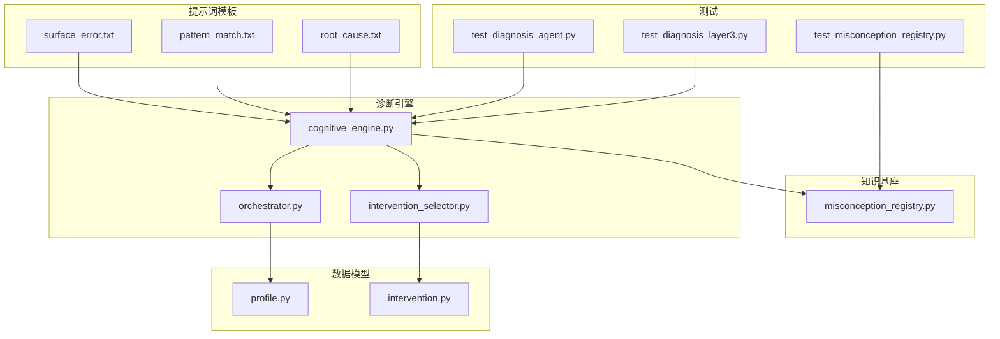
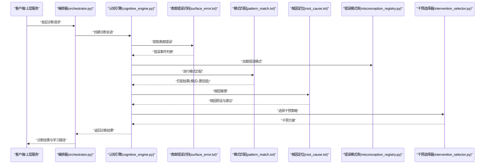
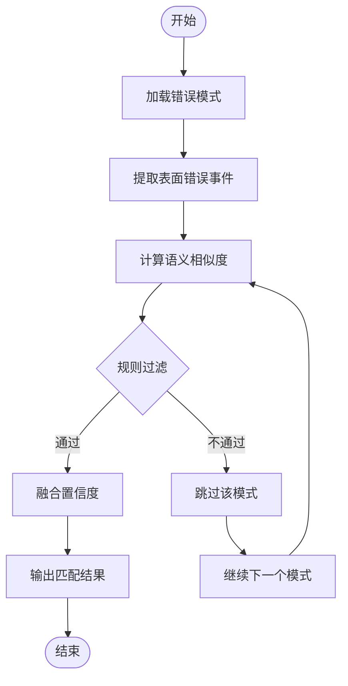
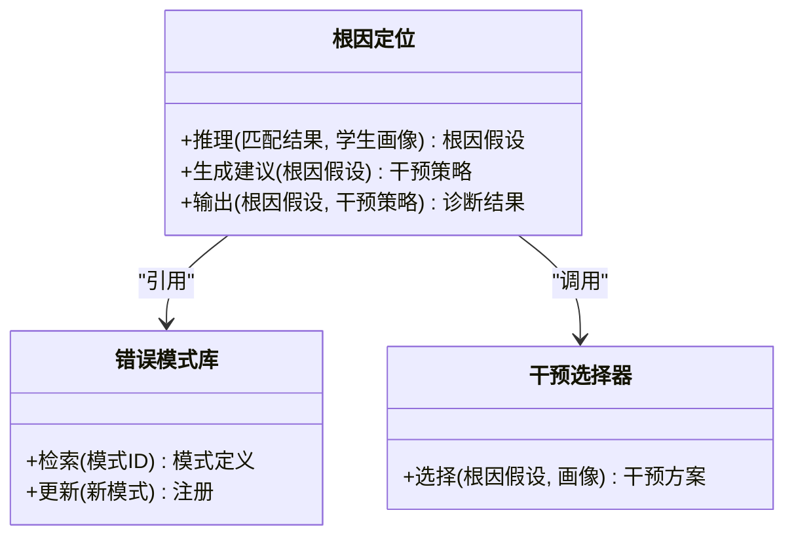
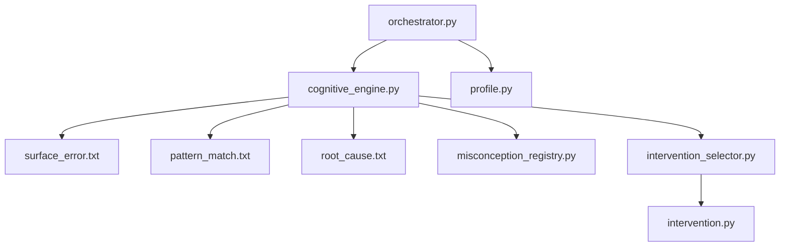

# 多层认知诊断系统

<cite>
**本文引用的文件**   
- [config/prompts/diagnosis/pattern_match.txt](file://config/prompts/diagnosis/pattern_match.txt)
- [config/prompts/diagnosis/root_cause.txt](file://config/prompts/diagnosis/root_cause.txt)
- [config/prompts/diagnosis/surface_error.txt](file://config/prompts/diagnosis/surface_error.txt)
- [src/agents/student/__init__.py](file://src/agents/student/__init__.py)
- [src/loopse/agent/cognitive_engine.py](file://src/loopse/agent/cognitive_engine.py)
- [src/loopse/agent/orchestrator.py](file://src/loopse/agent/orchestrator.py)
- [src/loopse/agent/intervention_selector.py](file://src/loopse/agent/intervention_selector.py)
- [src/loopse/kb/misconception_registry.py](file://src/loopse/kb/misconception_registry.py)
- [src/loopse/schema/intervention.py](file://src/loopse/schema/intervention.py)
- [src/loopse/schema/profile.py](file://src/loopse/schema/profile.py)
- [tests/unit/test_diagnosis_agent.py](file://tests/unit/test_diagnosis_agent.py)
- [tests/unit/test_diagnosis_layer3.py](file://tests/unit/test_diagnosis_layer3.py)
- [tests/unit/test_misconception_registry.py](file://tests/unit/test_misconception_registry.py)
</cite>

## 目录
1. [引言](#引言)
2. [项目结构](#项目结构)
3. [核心组件](#核心组件)
4. [架构总览](#架构总览)
5. [详细组件分析](#详细组件分析)
6. [依赖关系分析](#依赖关系分析)
7. [性能考虑](#性能考虑)
8. [故障排查指南](#故障排查指南)
9. [结论](#结论)
10. [附录](#附录)

## 引言
本技术文档面向Socrates-Cube的多层认知诊断系统，聚焦三层诊断架构：表面错误识别、模式匹配分析与根因定位。文档将深入解释每层的实现原理（错误模式库、匹配算法与推理逻辑）、提示词模板设计与使用方式（pattern_match.txt、root_cause.txt等）、诊断结果的数据结构与输出格式（错误类型、置信度、干预建议），并提供扩展指南（新增错误模式、自定义诊断规则）以及实际诊断案例与分析过程，帮助读者理解系统如何准确识别学生的认知偏差并给出针对性学习建议。

## 项目结构
围绕诊断能力的相关代码与配置主要分布在以下位置：
- 提示词模板：config/prompts/diagnosis/ 下的 surface_error.txt、pattern_match.txt、root_cause.txt
- 诊断引擎与编排：src/loopse/agent/ 下的 cognitive_engine.py、orchestrator.py、intervention_selector.py
- 错误模式库：src/loopse/kb/misconception_registry.py
- 数据模型：src/loopse/schema/intervention.py、src/loopse/schema/profile.py
- 学生代理入口：src/agents/student/__init__.py
- 单元测试：tests/unit/test_diagnosis_agent.py、test_diagnosis_layer3.py、test_misconception_registry.py

图表来源
- [config/prompts/diagnosis/surface_error.txt](file://config/prompts/diagnosis/surface_error.txt)
- [config/prompts/diagnosis/pattern_match.txt](file://config/prompts/diagnosis/pattern_match.txt)
- [config/prompts/diagnosis/root_cause.txt](file://config/prompts/diagnosis/root_cause.txt)
- [src/loopse/agent/cognitive_engine.py](file://src/loopse/agent/cognitive_engine.py)
- [src/loopse/agent/orchestrator.py](file://src/loopse/agent/orchestrator.py)
- [src/loopse/agent/intervention_selector.py](file://src/loopse/agent/intervention_selector.py)
- [src/loopse/kb/misconception_registry.py](file://src/loopse/kb/misconception_registry.py)
- [src/loopse/schema/intervention.py](file://src/loopse/schema/intervention.py)
- [src/loopse/schema/profile.py](file://src/loopse/schema/profile.py)
- [tests/unit/test_diagnosis_agent.py](file://tests/unit/test_diagnosis_agent.py)
- [tests/unit/test_diagnosis_layer3.py](file://tests/unit/test_diagnosis_layer3.py)
- [tests/unit/test_misconception_registry.py](file://tests/unit/test_misconception_registry.py)

章节来源
- [config/prompts/diagnosis/surface_error.txt](file://config/prompts/diagnosis/surface_error.txt)
- [config/prompts/diagnosis/pattern_match.txt](file://config/prompts/diagnosis/pattern_match.txt)
- [config/prompts/diagnosis/root_cause.txt](file://config/prompts/diagnosis/root_cause.txt)
- [src/loopse/agent/cognitive_engine.py](file://src/loopse/agent/cognitive_engine.py)
- [src/loopse/agent/orchestrator.py](file://src/loopse/agent/orchestrator.py)
- [src/loopse/agent/intervention_selector.py](file://src/loopse/agent/intervention_selector.py)
- [src/loopse/kb/misconception_registry.py](file://src/loopse/kb/misconception_registry.py)
- [src/loopse/schema/intervention.py](file://src/loopse/schema/intervention.py)
- [src/loopse/schema/profile.py](file://src/loopse/schema/profile.py)
- [tests/unit/test_diagnosis_agent.py](file://tests/unit/test_diagnosis_agent.py)
- [tests/unit/test_diagnosis_layer3.py](file://tests/unit/test_diagnosis_layer3.py)
- [tests/unit/test_misconception_registry.py](file://tests/unit/test_misconception_registry.py)

## 核心组件
- 三层诊断流水线
  - 第一层：表面错误识别（Surface Error Identification）
    - 目标：从学生作答或交互片段中抽取显式错误信号（如答案错误、步骤缺失、表述歧义）。
    - 输入：原始对话/作答片段、上下文元信息。
    - 输出：结构化错误事件列表（含错误描述、证据片段、初步分类标签）。
  - 第二层：模式匹配分析（Pattern Matching Analysis）
    - 目标：将表面错误映射到“错误模式”集合，计算匹配强度与置信度。
    - 输入：第一层输出的错误事件、错误模式库。
    - 输出：匹配到的错误模式及其置信度、相关证据、可解释说明。
  - 第三层：根因定位（Root Cause Localization）
    - 目标：基于错误模式与上下文，推断深层认知偏差或知识缺口，并生成干预建议。
    - 输入：第二层输出、学生画像、历史轨迹。
    - 输出：根因假设、置信度、推荐干预策略与资源路径。

- 关键模块职责
  - 认知引擎（cognitive_engine.py）：串联三层诊断流程，协调提示词模板与知识库，产出统一诊断结果。
  - 编排器（orchestrator.py）：负责任务调度、状态流转与多Agent协作。
  - 干预选择器（intervention_selector.py）：根据根因与画像选择合适干预策略，生成可执行的学习路径。
  - 错误模式库（misconception_registry.py）：维护错误模式定义、索引与检索接口。
  - 数据模型（intervention.py、profile.py）：定义诊断结果、干预策略与学生画像的结构化契约。

章节来源
- [src/loopse/agent/cognitive_engine.py](file://src/loopse/agent/cognitive_engine.py)
- [src/loopse/agent/orchestrator.py](file://src/loopse/agent/orchestrator.py)
- [src/loopse/agent/intervention_selector.py](file://src/loopse/agent/intervention_selector.py)
- [src/loopse/kb/misconception_registry.py](file://src/loopse/kb/misconception_registry.py)
- [src/loopse/schema/intervention.py](file://src/loopse/schema/intervention.py)
- [src/loopse/schema/profile.py](file://src/loopse/schema/profile.py)

## 架构总览
下图展示了三层诊断在系统中的整体调用关系与数据流向。

图表来源
- [src/loopse/agent/orchestrator.py](file://src/loopse/agent/orchestrator.py)
- [src/loopse/agent/cognitive_engine.py](file://src/loopse/agent/cognitive_engine.py)
- [config/prompts/diagnosis/surface_error.txt](file://config/prompts/diagnosis/surface_error.txt)
- [config/prompts/diagnosis/pattern_match.txt](file://config/prompts/diagnosis/pattern_match.txt)
- [config/prompts/diagnosis/root_cause.txt](file://config/prompts/diagnosis/root_cause.txt)
- [src/loopse/kb/misconception_registry.py](file://src/loopse/kb/misconception_registry.py)
- [src/loopse/agent/intervention_selector.py](file://src/loopse/agent/intervention_selector.py)

## 详细组件分析

### 第一层：表面错误识别
- 设计要点
  - 通过提示词模板 surface_error.txt 引导模型从原始交互中抽取显式错误信号，包括错误类型、证据片段、发生位置等。
  - 输出为标准化错误事件，便于后续层复用。
- 处理流程
  - 输入预处理：清洗文本、对齐时间戳、提取关键片段。
  - 提示词驱动：按模板注入上下文与约束，生成结构化错误事件。
  - 后处理：去重、合并相邻错误、规范化标签。
- 复杂度与优化
  - 时间复杂度主要取决于输入长度与模板解析开销；可通过缓存与批处理提升吞吐。
- 错误处理
  - 对不可解析的片段进行降级处理，保留最小可用证据，避免中断流水线。

章节来源
- [config/prompts/diagnosis/surface_error.txt](file://config/prompts/diagnosis/surface_error.txt)
- [src/loopse/agent/cognitive_engine.py](file://src/loopse/agent/cognitive_engine.py)

### 第二层：模式匹配分析
- 设计要点
  - 使用 pattern_match.txt 模板将表面错误与错误模式库中的模式进行匹配，输出匹配强度与置信度。
  - 错误模式库由 misconception_registry.py 管理，支持按类别、难度、领域检索。
- 匹配算法
  - 语义相似度：结合向量检索与关键词加权，提高召回率与准确率。
  - 规则过滤：基于先验规则剔除低质量匹配。
  - 置信度融合：综合相似度、证据数量、历史命中率等指标。
- 数据结构
  - 匹配结果包含：模式ID、错误类型、置信度、证据片段、可解释说明。
- 扩展性
  - 新增错误模式只需在模式库注册，并在模板中声明匹配条件与权重。

图表来源
- [config/prompts/diagnosis/pattern_match.txt](file://config/prompts/diagnosis/pattern_match.txt)
- [src/loopse/kb/misconception_registry.py](file://src/loopse/kb/misconception_registry.py)
- [src/loopse/agent/cognitive_engine.py](file://src/loopse/agent/cognitive_engine.py)

章节来源
- [config/prompts/diagnosis/pattern_match.txt](file://config/prompts/diagnosis/pattern_match.txt)
- [src/loopse/kb/misconception_registry.py](file://src/loopse/kb/misconception_registry.py)
- [src/loopse/agent/cognitive_engine.py](file://src/loopse/agent/cognitive_engine.py)

### 第三层：根因定位
- 设计要点
  - 使用 root_cause.txt 模板结合第二层匹配结果与学生画像，进行因果推理，定位深层认知偏差或知识缺口。
  - 输出包含根因假设、置信度、干预建议与资源路径。
- 推理逻辑
  - 基于错误模式与上下文构建因果图，评估各潜在根因的证据强度。
  - 引入学生画像（历史表现、偏好、薄弱点）作为先验，提升推理准确性。
- 干预策略
  - 干预选择器根据根因与画像选择最合适的干预策略，生成个性化学习路径。
- 数据结构
  - 根因结果包含：根因类型、置信度、证据链、建议干预、关联资源。

图表来源
- [config/prompts/diagnosis/root_cause.txt](file://config/prompts/diagnosis/root_cause.txt)
- [src/loopse/kb/misconception_registry.py](file://src/loopse/kb/misconception_registry.py)
- [src/loopse/agent/intervention_selector.py](file://src/loopse/agent/intervention_selector.py)
- [src/loopse/agent/cognitive_engine.py](file://src/loopse/agent/cognitive_engine.py)

章节来源
- [config/prompts/diagnosis/root_cause.txt](file://config/prompts/diagnosis/root_cause.txt)
- [src/loopse/agent/intervention_selector.py](file://src/loopse/agent/intervention_selector.py)
- [src/loopse/agent/cognitive_engine.py](file://src/loopse/agent/cognitive_engine.py)

### 提示词模板设计与使用
- surface_error.txt
  - 作用：指导模型从原始交互中抽取显式错误信号，输出结构化错误事件。
  - 配置方法：在模板中定义字段约束、示例片段与输出格式要求。
- pattern_match.txt
  - 作用：将表面错误与错误模式库进行匹配，输出匹配强度与置信度。
  - 配置方法：定义匹配条件、权重与阈值，支持动态调整。
- root_cause.txt
  - 作用：基于匹配结果与学生画像进行因果推理，输出根因假设与干预建议。
  - 配置方法：定义推理规则、证据链组织与输出结构。

章节来源
- [config/prompts/diagnosis/surface_error.txt](file://config/prompts/diagnosis/surface_error.txt)
- [config/prompts/diagnosis/pattern_match.txt](file://config/prompts/diagnosis/pattern_match.txt)
- [config/prompts/diagnosis/root_cause.txt](file://config/prompts/diagnosis/root_cause.txt)

### 诊断结果的数据结构与输出格式
- 统一诊断结果
  - 错误类型：来自错误模式库的分类标签。
  - 置信度：匹配与推理的综合评分。
  - 证据片段：支撑判断的关键文本或行为片段。
  - 干预建议：基于根因生成的个性化学习策略与资源路径。
- 数据模型
  - intervention.py：定义干预策略的结构化契约。
  - profile.py：定义学生画像与历史轨迹的数据结构。

章节来源
- [src/loopse/schema/intervention.py](file://src/loopse/schema/intervention.py)
- [src/loopse/schema/profile.py](file://src/loopse/schema/profile.py)

### 扩展指南：新增错误模式与自定义诊断规则
- 新增错误模式
  - 在 misconception_registry.py 中注册新模式的定义、索引与检索接口。
  - 在 pattern_match.txt 中声明匹配条件与权重，确保新模能被正确匹配。
- 自定义诊断规则
  - 在 root_cause.txt 中扩展推理规则，定义新的因果假设与证据链组织方式。
  - 在 intervention_selector.py 中增加对应干预策略的选择逻辑。
- 验证与回归
  - 使用 tests/unit/test_misconception_registry.py 验证模式库的正确性与性能。
  - 使用 tests/unit/test_diagnosis_agent.py 与 test_diagnosis_layer3.py 进行端到端验证。

章节来源
- [src/loopse/kb/misconception_registry.py](file://src/loopse/kb/misconception_registry.py)
- [config/prompts/diagnosis/pattern_match.txt](file://config/prompts/diagnosis/pattern_match.txt)
- [config/prompts/diagnosis/root_cause.txt](file://config/prompts/diagnosis/root_cause.txt)
- [src/loopse/agent/intervention_selector.py](file://src/loopse/agent/intervention_selector.py)
- [tests/unit/test_misconception_registry.py](file://tests/unit/test_misconception_registry.py)
- [tests/unit/test_diagnosis_agent.py](file://tests/unit/test_diagnosis_agent.py)
- [tests/unit/test_diagnosis_layer3.py](file://tests/unit/test_diagnosis_layer3.py)

### 实际诊断案例与分析过程
- 案例背景
  - 学生在某知识点练习中出现多次错误，表现为步骤缺失与概念混淆。
- 诊断过程
  - 第一层：从交互片段中提取表面错误事件，包括错误类型与证据片段。
  - 第二层：将错误事件与错误模式库匹配，得到高置信度的模式匹配结果。
  - 第三层：结合学生画像进行根因推理，定位深层认知偏差并生成干预建议。
- 结果解读
  - 错误类型明确，置信度高，证据链完整。
  - 干预建议针对根因，提供个性化学习路径与资源推荐。

章节来源
- [src/loopse/agent/cognitive_engine.py](file://src/loopse/agent/cognitive_engine.py)
- [src/loopse/kb/misconception_registry.py](file://src/loopse/kb/misconception_registry.py)
- [src/loopse/agent/intervention_selector.py](file://src/loopse/agent/intervention_selector.py)

## 依赖关系分析
- 组件耦合
  - 认知引擎依赖提示词模板与错误模式库，编排器负责流程控制，干预选择器依赖根因结果与学生画像。
- 外部依赖
  - LLM客户端用于提示词驱动的推理与生成。
  - 数据库与向量存储用于错误模式检索与历史数据访问。
- 循环依赖检查
  - 当前架构无直接循环依赖，各模块职责清晰，易于维护与扩展。

图表来源
- [src/loopse/agent/cognitive_engine.py](file://src/loopse/agent/cognitive_engine.py)
- [config/prompts/diagnosis/surface_error.txt](file://config/prompts/diagnosis/surface_error.txt)
- [config/prompts/diagnosis/pattern_match.txt](file://config/prompts/diagnosis/pattern_match.txt)
- [config/prompts/diagnosis/root_cause.txt](file://config/prompts/diagnosis/root_cause.txt)
- [src/loopse/kb/misconception_registry.py](file://src/loopse/kb/misconception_registry.py)
- [src/loopse/agent/intervention_selector.py](file://src/loopse/agent/intervention_selector.py)
- [src/loopse/schema/intervention.py](file://src/loopse/schema/intervention.py)
- [src/loopse/schema/profile.py](file://src/loopse/schema/profile.py)
- [src/loopse/agent/orchestrator.py](file://src/loopse/agent/orchestrator.py)

章节来源
- [src/loopse/agent/cognitive_engine.py](file://src/loopse/agent/cognitive_engine.py)
- [src/loopse/agent/orchestrator.py](file://src/loopse/agent/orchestrator.py)
- [src/loopse/agent/intervention_selector.py](file://src/loopse/agent/intervention_selector.py)
- [src/loopse/kb/misconception_registry.py](file://src/loopse/kb/misconception_registry.py)
- [src/loopse/schema/intervention.py](file://src/loopse/schema/intervention.py)
- [src/loopse/schema/profile.py](file://src/loopse/schema/profile.py)

## 性能考虑
- 缓存策略
  - 对频繁使用的错误模式与匹配结果进行缓存，减少重复计算。
- 批处理
  - 批量处理多个学生的诊断请求，提升吞吐量。
- 异步处理
  - 将耗时操作（如向量检索、LLM调用）异步化，降低响应延迟。
- 监控与告警
  - 记录关键指标（匹配成功率、置信度分布、响应时间），设置阈值告警。

[本节为通用性能建议，无需特定文件来源]

## 故障排查指南
- 常见问题
  - 提示词模板配置错误：检查模板语法与字段约束。
  - 错误模式库缺失：确认模式注册与索引是否正确。
  - 匹配置信度过低：调整匹配权重与阈值。
  - 根因推理不准确：优化推理规则与学生画像数据。
- 调试工具
  - 使用单元测试验证各层功能与集成效果。
  - 查看日志与中间结果，定位问题环节。

章节来源
- [tests/unit/test_diagnosis_agent.py](file://tests/unit/test_diagnosis_agent.py)
- [tests/unit/test_diagnosis_layer3.py](file://tests/unit/test_diagnosis_layer3.py)
- [tests/unit/test_misconception_registry.py](file://tests/unit/test_misconception_registry.py)

## 结论
Socrates-Cube的多层认知诊断系统通过三层架构实现了从表面错误识别到根因定位的完整闭环。借助提示词模板与错误模式库，系统能够准确识别学生的认知偏差并提供针对性的学习建议。扩展指南与故障排查内容有助于开发者快速上手与维护系统。

[本节为总结性内容，无需特定文件来源]

## 附录
- 术语表
  - 表面错误：显式的错误信号，如答案错误或步骤缺失。
  - 错误模式：预定义的典型错误类型与特征。
  - 根因：导致错误的深层认知偏差或知识缺口。
  - 干预策略：基于根因生成的个性化学习建议与资源路径。

[本节为补充信息，无需特定文件来源]