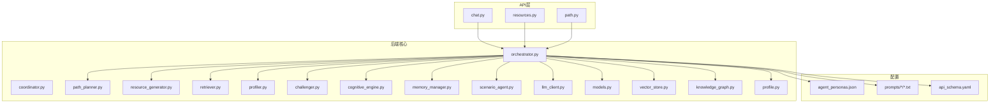
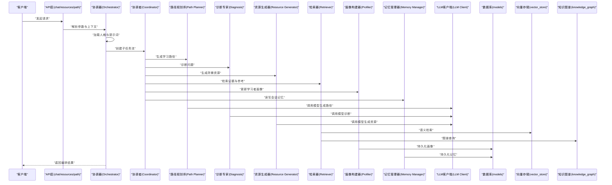
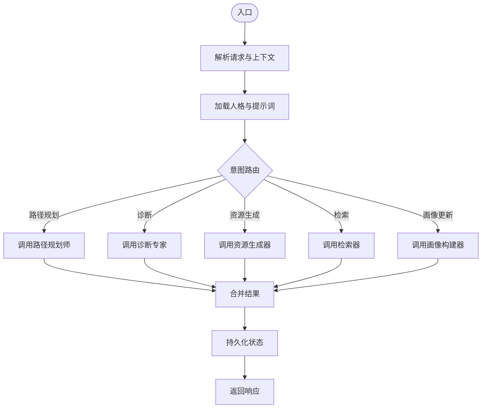
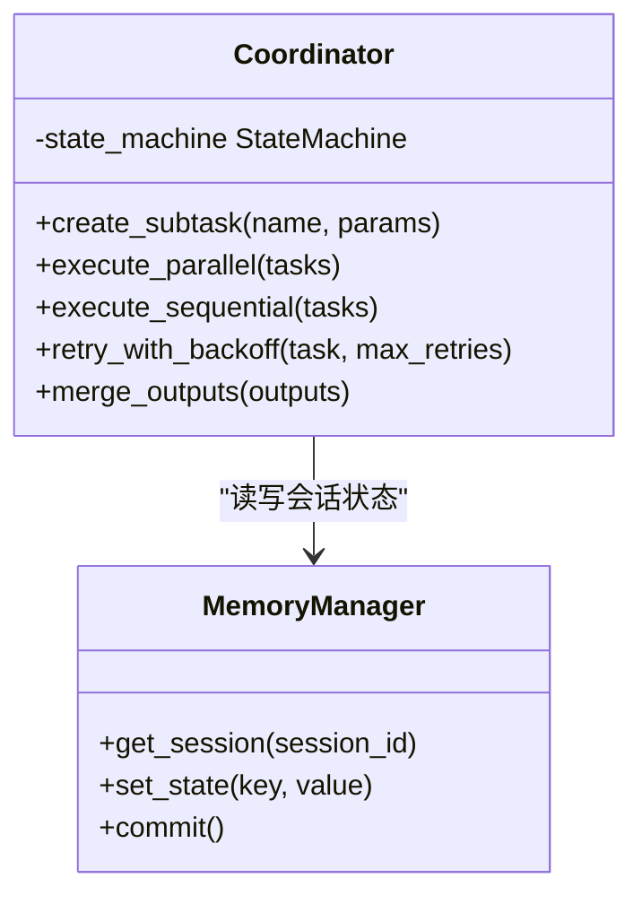
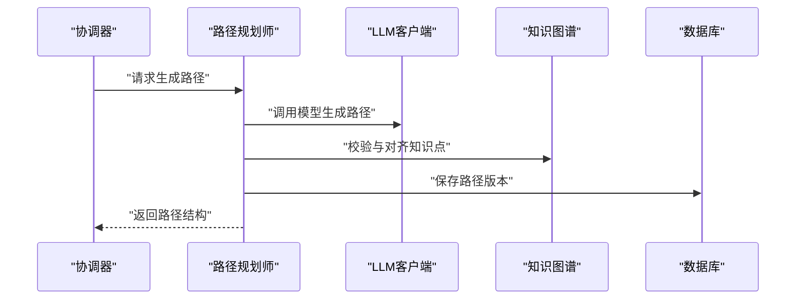
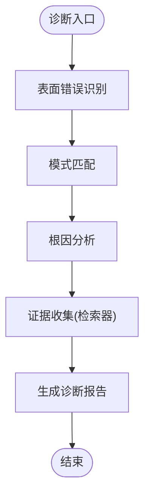
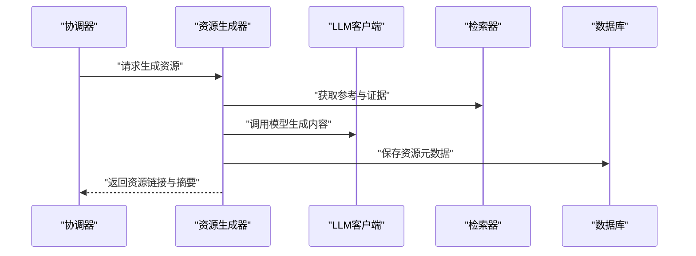
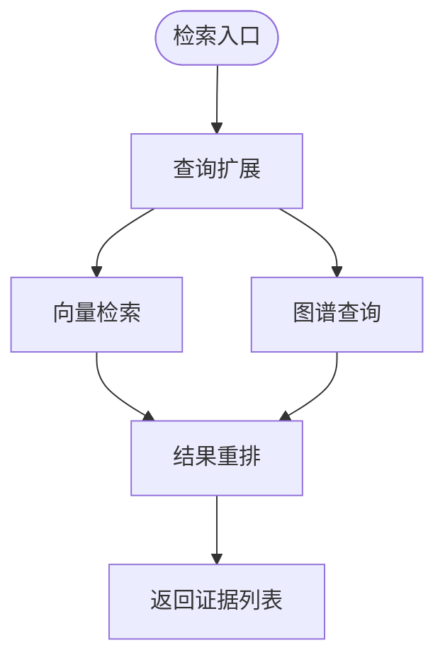
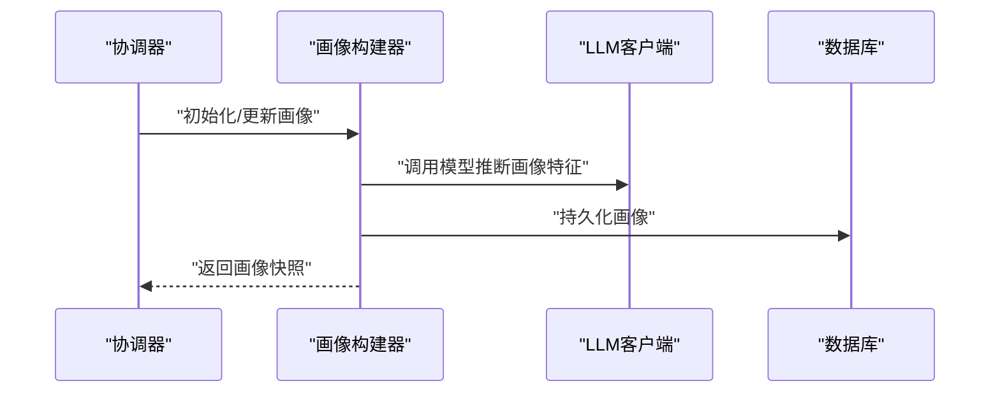
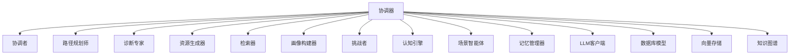

# 多智能体协作系统

<cite>
**本文引用的文件**   
- [src/loopse/agent/orchestrator.py](file://src/loopse/agent/orchestrator.py)
- [src/loopse/agent/coordinator.py](file://src/loopse/agent/coordinator.py)
- [src/loopse/agent/path_planner.py](file://src/loopse/agent/path_planner.py)
- [src/loopse/agent/resource_generator.py](file://src/loopse/agent/resource_generator.py)
- [src/loopse/agent/retriever.py](file://src/loopse/agent/retriever.py)
- [src/loopse/agent/profiler.py](file://src/loopse/agent/profiler.py)
- [src/loopse/agent/challenger.py](file://src/loopse/agent/challenger.py)
- [src/loopse/agent/cognitive_engine.py](file://src/loopse/agent/cognitive_engine.py)
- [src/loopse/agent/memory_manager.py](file://src/loopse/agent/memory_manager.py)
- [src/loopse/agent/scenario_agent.py](file://src/loopse/agent/scenario_agent.py)
- [config/agent_personas.json](file://config/agent_personas.json)
- [config/prompts/orchestrator/route.txt](file://config/prompts/orchestrator/route.txt)
- [config/prompts/path_planner/plan_path.txt](file://config/prompts/path_planner/plan_path.txt)
- [config/prompts/diagnosis/pattern_match.txt](file://config/prompts/diagnosis/pattern_match.txt)
- [config/prompts/diagnosis/root_cause.txt](file://config/prompts/diagnosis/root_cause.txt)
- [config/prompts/diagnosis/surface_error.txt](file://config/prompts/diagnosis/surface_error.txt)
- [config/prompts/resource_generator/generate_code.txt](file://config/prompts/resource_generator/generate_code.txt)
- [config/prompts/resource_generator/generate_doc.txt](file://config/prompts/resource_generator/generate_doc.txt)
- [config/prompts/resource_generator/generate_exercise.txt](file://config/prompts/resource_generator/generate_exercise.txt)
- [config/prompts/resource_generator/generate_infographic.txt](file://config/prompts/resource_generator/generate_infographic.txt)
- [config/prompts/resource_generator/generate_script.txt](file://config/prompts/resource_generator/generate_script.txt)
- [config/prompts/retriever/query_expansion.txt](file://config/prompts/retriever/query_expansion.txt)
- [config/prompts/retriever/search_query.txt](file://config/prompts/retriever/search_query.txt)
- [config/prompts/profiler/onboarding.txt](file://config/prompts/profiler/onboarding.txt)
- [config/prompts/profiler/update_profile.txt](file://config/prompts/profiler/update_profile.txt)
- [config/api_schema.yaml](file://config/api_schema.yaml)
- [src/loopse/core/llm_client.py](file://src/loopse/core/llm_client.py)
- [src/loopse/db/models.py](file://src/loopse/db/models.py)
- [src/loopse/kb/vector_store.py](file://src/loopse/kb/vector_store.py)
- [src/loopse/kb/knowledge_graph.py](file://src/loopse/kb/knowledge_graph.py)
- [src/loopse/schema/profile.py](file://src/loopse/schema/profile.py)
- [src/loopse/api/chat.py](file://src/loopse/api/chat.py)
- [src/loopse/api/resources.py](file://src/loopse/api/resources.py)
- [src/loopse/api/path.py](file://src/loopse/api/path.py)
- [tests/unit/test_orchestrator_integration.py](file://tests/unit/test_orchestrator_integration.py)
</cite>

## 目录
1. [简介](#简介)
2. [项目结构](#项目结构)
3. [核心组件](#核心组件)
4. [架构总览](#架构总览)
5. [详细组件分析](#详细组件分析)
6. [依赖关系分析](#依赖关系分析)
7. [性能考量](#性能考量)
8. [故障排查指南](#故障排查指南)
9. [结论](#结论)
10. [附录](#附录)

## 简介
本技术文档面向Socrates-Cube的多智能体协作系统，聚焦于协调器（Orchestrator）如何管理与调度各类专业智能体（学习路径规划师、诊断专家、资源生成器、检索器、学习者画像构建器等），并阐述智能体间的通信协议、状态共享机制与任务分配策略。同时，文档说明智能体人格配置系统如何通过配置文件定义不同智能体的行为模式与交互风格，并提供扩展开发指导，帮助开发者实现自定义智能体并将其集成到系统中。

## 项目结构
仓库采用分层与按功能域组织相结合的结构：
- agents: 智能体相关代码（Python实现位于 src/loopse/agent）
- config: 提示词模板、人格配置与API契约
- docs: 架构与设计文档、部署与测试材料
- frontend: 前端应用（Vue3 + TypeScript）
- scripts: 数据准备、知识库构建与验证脚本
- src/loopse: 后端核心实现（智能体、API、数据库、知识图谱、向量存储等）
- tests: 单元测试与集成测试

图表来源
- [src/loopse/agent/orchestrator.py](file://src/loopse/agent/orchestrator.py)
- [src/loopse/agent/coordinator.py](file://src/loopse/agent/coordinator.py)
- [src/loopse/agent/path_planner.py](file://src/loopse/agent/path_planner.py)
- [src/loopse/agent/resource_generator.py](file://src/loopse/agent/resource_generator.py)
- [src/loopse/agent/retriever.py](file://src/loopse/agent/retriever.py)
- [src/loopse/agent/profiler.py](file://src/loopse/agent/profiler.py)
- [src/loopse/agent/challenger.py](file://src/loopse/agent/challenger.py)
- [src/loopse/agent/cognitive_engine.py](file://src/loopse/agent/cognitive_engine.py)
- [src/loopse/agent/memory_manager.py](file://src/loopse/agent/memory_manager.py)
- [src/loopse/agent/scenario_agent.py](file://src/loopse/agent/scenario_agent.py)
- [src/loopse/core/llm_client.py](file://src/loopse/core/llm_client.py)
- [src/loopse/db/models.py](file://src/loopse/db/models.py)
- [src/loopse/kb/vector_store.py](file://src/loopse/kb/vector_store.py)
- [src/loopse/kb/knowledge_graph.py](file://src/loopse/kb/knowledge_graph.py)
- [src/loopse/schema/profile.py](file://src/loopse/schema/profile.py)
- [config/agent_personas.json](file://config/agent_personas.json)
- [config/prompts/orchestrator/route.txt](file://config/prompts/orchestrator/route.txt)
- [config/prompts/path_planner/plan_path.txt](file://config/prompts/path_planner/plan_path.txt)
- [config/prompts/diagnosis/pattern_match.txt](file://config/prompts/diagnosis/pattern_match.txt)
- [config/prompts/diagnosis/root_cause.txt](file://config/prompts/diagnosis/root_cause.txt)
- [config/prompts/diagnosis/surface_error.txt](file://config/prompts/diagnosis/surface_error.txt)
- [config/prompts/resource_generator/generate_code.txt](file://config/prompts/resource_generator/generate_code.txt)
- [config/prompts/resource_generator/generate_doc.txt](file://config/prompts/resource_generator/generate_doc.txt)
- [config/prompts/resource_generator/generate_exercise.txt](file://config/prompts/resource_generator/generate_exercise.txt)
- [config/prompts/resource_generator/generate_infographic.txt](file://config/prompts/resource_generator/generate_infographic.txt)
- [config/prompts/resource_generator/generate_script.txt](file://config/prompts/resource_generator/generate_script.txt)
- [config/prompts/retriever/query_expansion.txt](file://config/prompts/retriever/query_expansion.txt)
- [config/prompts/retriever/search_query.txt](file://config/prompts/retriever/search_query.txt)
- [config/prompts/profiler/onboarding.txt](file://config/prompts/profiler/onboarding.txt)
- [config/prompts/profiler/update_profile.txt](file://config/prompts/profiler/update_profile.txt)
- [config/api_schema.yaml](file://config/api_schema.yaml)
- [src/loopse/api/chat.py](file://src/loopse/api/chat.py)
- [src/loopse/api/resources.py](file://src/loopse/api/resources.py)
- [src/loopse/api/path.py](file://src/loopse/api/path.py)

章节来源
- [src/loopse/agent/orchestrator.py](file://src/loopse/agent/orchestrator.py)
- [config/agent_personas.json](file://config/agent_personas.json)
- [config/api_schema.yaml](file://config/api_schema.yaml)

## 核心组件
- 协调器（Orchestrator）：负责接收外部请求、解析意图、选择并编排子智能体执行流程，维护会话上下文与全局状态。
- 协调者（Coordinator）：在复杂任务中作为次级编排节点，管理并行或串行的子任务流。
- 学习路径规划师（Path Planner）：基于学习者画像与目标，生成个性化学习路径与阶段目标。
- 诊断专家（Diagnosis Agents）：包含表面错误识别、模式匹配与根因分析等能力，用于定位学习问题。
- 资源生成器（Resource Generator）：根据需求生成代码、文档、练习、信息图、脚本等多模态资源。
- 检索器（Retriever）：对向量库与知识图谱进行查询与扩展，提供证据与参考。
- 学习者画像构建器（Profiler）：通过引导与更新流程维护学习者画像，驱动个性化决策。
- 挑战者（Challenger）：设计问答与挑战任务，促进深度学习与反思。
- 认知引擎（Cognitive Engine）：整合记忆、推理与干预策略，形成闭环学习体验。
- 记忆管理器（Memory Manager）：维护短期与长期记忆，支持跨会话的状态共享。
- 场景智能体（Scenario Agent）：构造情境化任务与案例，增强真实感与应用性。
- LLM客户端（LLM Client）：统一封装大模型调用，屏蔽底层差异。
- 数据库模型（Models）：持久化实体与关系，支撑状态与结果存储。
- 向量存储（Vector Store）：语义检索与相似性搜索。
- 知识图谱（Knowledge Graph）：结构化知识与概念关联。
- 学习者画像Schema（Profile Schema）：规范画像字段与约束。

章节来源
- [src/loopse/agent/orchestrator.py](file://src/loopse/agent/orchestrator.py)
- [src/loopse/agent/coordinator.py](file://src/loopse/agent/coordinator.py)
- [src/loopse/agent/path_planner.py](file://src/loopse/agent/path_planner.py)
- [src/loopse/agent/resource_generator.py](file://src/loopse/agent/resource_generator.py)
- [src/loopse/agent/retriever.py](file://src/loopse/agent/retriever.py)
- [src/loopse/agent/profiler.py](file://src/loopse/agent/profiler.py)
- [src/loopse/agent/challenger.py](file://src/loopse/agent/challenger.py)
- [src/loopse/agent/cognitive_engine.py](file://src/loopse/agent/cognitive_engine.py)
- [src/loopse/agent/memory_manager.py](file://src/loopse/agent/memory_manager.py)
- [src/loopse/agent/scenario_agent.py](file://src/loopse/agent/scenario_agent.py)
- [src/loopse/core/llm_client.py](file://src/loopse/core/llm_client.py)
- [src/loopse/db/models.py](file://src/loopse/db/models.py)
- [src/loopse/kb/vector_store.py](file://src/loopse/kb/vector_store.py)
- [src/loopse/kb/knowledge_graph.py](file://src/loopse/kb/knowledge_graph.py)
- [src/loopse/schema/profile.py](file://src/loopse/schema/profile.py)

## 架构总览
多智能体系统以“请求进入—意图路由—子智能体编排—结果聚合”为主线，结合人格配置与提示词模板驱动各智能体行为。

图表来源
- [src/loopse/api/chat.py](file://src/loopse/api/chat.py)
- [src/loopse/api/resources.py](file://src/loopse/api/resources.py)
- [src/loopse/api/path.py](file://src/loopse/api/path.py)
- [src/loopse/agent/orchestrator.py](file://src/loopse/agent/orchestrator.py)
- [src/loopse/agent/coordinator.py](file://src/loopse/agent/coordinator.py)
- [src/loopse/agent/path_planner.py](file://src/loopse/agent/path_planner.py)
- [src/loopse/agent/resource_generator.py](file://src/loopse/agent/resource_generator.py)
- [src/loopse/agent/retriever.py](file://src/loopse/agent/retriever.py)
- [src/loopse/agent/profiler.py](file://src/loopse/agent/profiler.py)
- [src/loopse/agent/memory_manager.py](file://src/loopse/agent/memory_manager.py)
- [src/loopse/core/llm_client.py](file://src/loopse/core/llm_client.py)
- [src/loopse/db/models.py](file://src/loopse/db/models.py)
- [src/loopse/kb/vector_store.py](file://src/loopse/kb/vector_store.py)
- [src/loopse/kb/knowledge_graph.py](file://src/loopse/kb/knowledge_graph.py)

## 详细组件分析

### 协调器（Orchestrator）
职责与行为
- 接收API请求，解析用户意图与上下文。
- 加载人格配置与提示词模板，决定路由策略。
- 创建并管理协调者（Coordinator）实例，编排子智能体执行顺序与并发度。
- 聚合各子智能体输出，进行校验与格式化后返回。

关键流程
- 意图识别与路由：依据人格与提示词，将请求映射到具体子智能体组合。
- 任务分解与调度：将复杂任务拆分为可并行的子任务，设置超时与重试策略。
- 状态共享：通过记忆管理器与数据库持久化会话状态，确保跨步骤一致性。
- 错误处理：捕获异常、降级策略与回退路径，保证系统鲁棒性。

图表来源
- [src/loopse/agent/orchestrator.py](file://src/loopse/agent/orchestrator.py)
- [config/agent_personas.json](file://config/agent_personas.json)
- [config/prompts/orchestrator/route.txt](file://config/prompts/orchestrator/route.txt)

章节来源
- [src/loopse/agent/orchestrator.py](file://src/loopse/agent/orchestrator.py)
- [config/agent_personas.json](file://config/agent_personas.json)
- [config/prompts/orchestrator/route.txt](file://config/prompts/orchestrator/route.txt)

### 协调者（Coordinator）
职责与行为
- 在复杂任务中作为次级编排节点，管理并行或串行子任务流。
- 维护子任务状态机，支持失败重试与补偿操作。
- 与记忆管理器交互，确保子任务间的数据一致性。

图表来源
- [src/loopse/agent/coordinator.py](file://src/loopse/agent/coordinator.py)
- [src/loopse/agent/memory_manager.py](file://src/loopse/agent/memory_manager.py)

章节来源
- [src/loopse/agent/coordinator.py](file://src/loopse/agent/coordinator.py)
- [src/loopse/agent/memory_manager.py](file://src/loopse/agent/memory_manager.py)

### 学习路径规划师（Path Planner）
职责与行为
- 基于学习者画像与目标，生成阶段性学习目标与活动序列。
- 使用提示词模板与LLM生成结构化路径，并与知识图谱对齐。

图表来源
- [src/loopse/agent/path_planner.py](file://src/loopse/agent/path_planner.py)
- [config/prompts/path_planner/plan_path.txt](file://config/prompts/path_planner/plan_path.txt)
- [src/loopse/kb/knowledge_graph.py](file://src/loopse/kb/knowledge_graph.py)
- [src/loopse/db/models.py](file://src/loopse/db/models.py)

章节来源
- [src/loopse/agent/path_planner.py](file://src/loopse/agent/path_planner.py)
- [config/prompts/path_planner/plan_path.txt](file://config/prompts/path_planner/plan_path.txt)
- [src/loopse/kb/knowledge_graph.py](file://src/loopse/kb/knowledge_graph.py)
- [src/loopse/db/models.py](file://src/loopse/db/models.py)

### 诊断专家（Diagnosis Agents）
职责与行为
- 表面错误识别：快速定位显式错误与症状。
- 模式匹配：对照常见错误模式与知识缺陷。
- 根因分析：深入挖掘根本原因并提出修复建议。

图表来源
- [config/prompts/diagnosis/surface_error.txt](file://config/prompts/diagnosis/surface_error.txt)
- [config/prompts/diagnosis/pattern_match.txt](file://config/prompts/diagnosis/pattern_match.txt)
- [config/prompts/diagnosis/root_cause.txt](file://config/prompts/diagnosis/root_cause.txt)
- [src/loopse/agent/retriever.py](file://src/loopse/agent/retriever.py)

章节来源
- [config/prompts/diagnosis/surface_error.txt](file://config/prompts/diagnosis/surface_error.txt)
- [config/prompts/diagnosis/pattern_match.txt](file://config/prompts/diagnosis/pattern_match.txt)
- [config/prompts/diagnosis/root_cause.txt](file://config/prompts/diagnosis/root_cause.txt)
- [src/loopse/agent/retriever.py](file://src/loopse/agent/retriever.py)

### 资源生成器（Resource Generator）
职责与行为
- 根据任务需求生成代码、文档、练习、信息图、脚本等资源。
- 结合检索器的证据与知识图谱的约束，确保资源质量与一致性。

图表来源
- [src/loopse/agent/resource_generator.py](file://src/loopse/agent/resource_generator.py)
- [config/prompts/resource_generator/generate_code.txt](file://config/prompts/resource_generator/generate_code.txt)
- [config/prompts/resource_generator/generate_doc.txt](file://config/prompts/resource_generator/generate_doc.txt)
- [config/prompts/resource_generator/generate_exercise.txt](file://config/prompts/resource_generator/generate_exercise.txt)
- [config/prompts/resource_generator/generate_infographic.txt](file://config/prompts/resource_generator/generate_infographic.txt)
- [config/prompts/resource_generator/generate_script.txt](file://config/prompts/resource_generator/generate_script.txt)
- [src/loopse/agent/retriever.py](file://src/loopse/agent/retriever.py)
- [src/loopse/db/models.py](file://src/loopse/db/models.py)

章节来源
- [src/loopse/agent/resource_generator.py](file://src/loopse/agent/resource_generator.py)
- [config/prompts/resource_generator/generate_code.txt](file://config/prompts/resource_generator/generate_code.txt)
- [config/prompts/resource_generator/generate_doc.txt](file://config/prompts/resource_generator/generate_doc.txt)
- [config/prompts/resource_generator/generate_exercise.txt](file://config/prompts/resource_generator/generate_exercise.txt)
- [config/prompts/resource_generator/generate_infographic.txt](file://config/prompts/resource_generator/generate_infographic.txt)
- [config/prompts/resource_generator/generate_script.txt](file://config/prompts/resource_generator/generate_script.txt)
- [src/loopse/agent/retriever.py](file://src/loopse/agent/retriever.py)
- [src/loopse/db/models.py](file://src/loopse/db/models.py)

### 检索器（Retriever）
职责与行为
- 对向量存储进行语义检索，对知识图谱进行结构化查询。
- 支持查询扩展与重排，提升召回与相关性。

图表来源
- [src/loopse/agent/retriever.py](file://src/loopse/agent/retriever.py)
- [config/prompts/retriever/query_expansion.txt](file://config/prompts/retriever/query_expansion.txt)
- [config/prompts/retriever/search_query.txt](file://config/prompts/retriever/search_query.txt)
- [src/loopse/kb/vector_store.py](file://src/loopse/kb/vector_store.py)
- [src/loopse/kb/knowledge_graph.py](file://src/loopse/kb/knowledge_graph.py)

章节来源
- [src/loopse/agent/retriever.py](file://src/loopse/agent/retriever.py)
- [config/prompts/retriever/query_expansion.txt](file://config/prompts/retriever/query_expansion.txt)
- [config/prompts/retriever/search_query.txt](file://config/prompts/retriever/search_query.txt)
- [src/loopse/kb/vector_store.py](file://src/loopse/kb/vector_store.py)
- [src/loopse/kb/knowledge_graph.py](file://src/loopse/kb/knowledge_graph.py)

### 学习者画像构建器（Profiler）
职责与行为
- 通过引导流程初始化画像，并在交互过程中持续更新。
- 与记忆管理器协作，保持画像与记忆的同步。

图表来源
- [src/loopse/agent/profiler.py](file://src/loopse/agent/profiler.py)
- [config/prompts/profiler/onboarding.txt](file://config/prompts/profiler/onboarding.txt)
- [config/prompts/profiler/update_profile.txt](file://config/prompts/profiler/update_profile.txt)
- [src/loopse/db/models.py](file://src/loopse/db/models.py)

章节来源
- [src/loopse/agent/profiler.py](file://src/loopse/agent/profiler.py)
- [config/prompts/profiler/onboarding.txt](file://config/prompts/profiler/onboarding.txt)
- [config/prompts/profiler/update_profile.txt](file://config/prompts/profiler/update_profile.txt)
- [src/loopse/db/models.py](file://src/loopse/db/models.py)

### 挑战者（Challenger）
职责与行为
- 设计问答与挑战任务，促进反思与深度理解。
- 结合学习者画像与当前路径，动态调整难度与类型。

章节来源
- [src/loopse/agent/challenger.py](file://src/loopse/agent/challenger.py)

### 认知引擎（Cognitive Engine）
职责与行为
- 整合记忆、推理与干预策略，形成闭环学习体验。
- 与协调者协作，控制干预时机与方式。

章节来源
- [src/loopse/agent/cognitive_engine.py](file://src/loopse/agent/cognitive_engine.py)

### 记忆管理器（Memory Manager）
职责与行为
- 维护短期与长期记忆，支持跨会话状态共享。
- 提供原子写入与事务性提交，确保一致性。

章节来源
- [src/loopse/agent/memory_manager.py](file://src/loopse/agent/memory_manager.py)

### 场景智能体（Scenario Agent）
职责与行为
- 构造情境化任务与案例，增强真实感与应用性。
- 与路径规划师协同，将场景嵌入学习路径。

章节来源
- [src/loopse/agent/scenario_agent.py](file://src/loopse/agent/scenario_agent.py)

### LLM客户端（LLM Client）
职责与行为
- 统一封装大模型调用，屏蔽底层差异。
- 提供重试、超时与限流策略。

章节来源
- [src/loopse/core/llm_client.py](file://src/loopse/core/llm_client.py)

### 数据库模型（Models）
职责与行为
- 定义实体与关系，支撑状态与结果持久化。
- 为各智能体提供一致的存储接口。

章节来源
- [src/loopse/db/models.py](file://src/loopse/db/models.py)

### 向量存储（Vector Store）
职责与行为
- 提供语义检索与相似性搜索。
- 与检索器协作，优化召回效果。

章节来源
- [src/loopse/kb/vector_store.py](file://src/loopse/kb/vector_store.py)

### 知识图谱（Knowledge Graph）
职责与行为
- 维护结构化知识与概念关联。
- 为路径规划与诊断提供知识约束与校验。

章节来源
- [src/loopse/kb/knowledge_graph.py](file://src/loopse/kb/knowledge_graph.py)

### 学习者画像Schema（Profile Schema）
职责与行为
- 规范画像字段与约束，确保数据结构一致。

章节来源
- [src/loopse/schema/profile.py](file://src/loopse/schema/profile.py)

## 依赖关系分析
- 耦合与内聚
  - 协调器与各子智能体松耦合，通过明确接口与消息格式交互。
  - 记忆管理器与数据库强耦合，保障状态一致性。
  - 检索器与向量存储、知识图谱解耦，便于替换与扩展。
- 外部依赖
  - LLM客户端依赖外部大模型服务。
  - 数据库与向量存储依赖外部存储系统。
- 潜在循环依赖
  - 协调器与协调者为单向依赖，避免循环。
  - 各子智能体不直接相互依赖，通过协调器与记忆管理器间接交互。

图表来源
- [src/loopse/agent/orchestrator.py](file://src/loopse/agent/orchestrator.py)
- [src/loopse/agent/coordinator.py](file://src/loopse/agent/coordinator.py)
- [src/loopse/agent/path_planner.py](file://src/loopse/agent/path_planner.py)
- [src/loopse/agent/resource_generator.py](file://src/loopse/agent/resource_generator.py)
- [src/loopse/agent/retriever.py](file://src/loopse/agent/retriever.py)
- [src/loopse/agent/profiler.py](file://src/loopse/agent/profiler.py)
- [src/loopse/agent/challenger.py](file://src/loopse/agent/challenger.py)
- [src/loopse/agent/cognitive_engine.py](file://src/loopse/agent/cognitive_engine.py)
- [src/loopse/agent/memory_manager.py](file://src/loopse/agent/memory_manager.py)
- [src/loopse/agent/scenario_agent.py](file://src/loopse/agent/scenario_agent.py)
- [src/loopse/core/llm_client.py](file://src/loopse/core/llm_client.py)
- [src/loopse/db/models.py](file://src/loopse/db/models.py)
- [src/loopse/kb/vector_store.py](file://src/loopse/kb/vector_store.py)
- [src/loopse/kb/knowledge_graph.py](file://src/loopse/kb/knowledge_graph.py)

章节来源
- [src/loopse/agent/orchestrator.py](file://src/loopse/agent/orchestrator.py)
- [src/loopse/agent/coordinator.py](file://src/loopse/agent/coordinator.py)
- [src/loopse/agent/memory_manager.py](file://src/loopse/agent/memory_manager.py)
- [src/loopse/core/llm_client.py](file://src/loopse/core/llm_client.py)
- [src/loopse/db/models.py](file://src/loopse/db/models.py)
- [src/loopse/kb/vector_store.py](file://src/loopse/kb/vector_store.py)
- [src/loopse/kb/knowledge_graph.py](file://src/loopse/kb/knowledge_graph.py)

## 性能考量
- 并发与批处理
  - 协调者在安全范围内并行执行独立子任务，减少端到端延迟。
  - 批量写入数据库与向量存储，降低I/O开销。
- 缓存与复用
  - 对高频检索结果与中间状态进行缓存，提高命中率。
  - 复用LLM生成的通用片段，减少重复调用。
- 超时与重试
  - 为外部依赖设置合理超时与指数退避重试，提升稳定性。
- 资源限制
  - 对生成类任务实施速率限制与配额管理，防止过载。

[本节为一般性指导，无需特定文件引用]

## 故障排查指南
- 常见问题
  - LLM调用失败：检查网络连通性与密钥配置，查看重试日志。
  - 检索结果为空：确认向量索引是否构建完成，检查查询扩展策略。
  - 路径生成不合理：核对提示词模板与知识图谱对齐逻辑。
  - 画像更新异常：检查Schema约束与数据库写入权限。
- 调试工具
  - 启用详细日志，记录各子智能体输入输出与耗时。
  - 使用集成测试用例验证编排流程与边界条件。

章节来源
- [tests/unit/test_orchestrator_integration.py](file://tests/unit/test_orchestrator_integration.py)

## 结论
Socrates-Cube的多智能体协作系统通过协调器统一管理专业智能体，结合人格配置与提示词模板驱动行为，实现了灵活的任务编排与高质量的学习体验。通过清晰的依赖关系与可扩展的接口设计，系统具备良好的内聚性与可维护性。未来可在并发优化、缓存策略与监控告警方面进一步演进。

[本节为总结性内容，无需特定文件引用]

## 附录

### 智能体人格配置系统
- 人格定义
  - 通过配置文件定义智能体的角色、语气、约束与偏好。
- 提示词模板
  - 针对不同智能体与任务，提供专用提示词模板，驱动LLM生成符合期望的输出。
- 行为模式与交互风格
  - 人格与提示词共同决定智能体的行为模式与交互风格，支持细粒度定制。

章节来源
- [config/agent_personas.json](file://config/agent_personas.json)
- [config/prompts/orchestrator/route.txt](file://config/prompts/orchestrator/route.txt)
- [config/prompts/path_planner/plan_path.txt](file://config/prompts/path_planner/plan_path.txt)
- [config/prompts/diagnosis/pattern_match.txt](file://config/prompts/diagnosis/pattern_match.txt)
- [config/prompts/diagnosis/root_cause.txt](file://config/prompts/diagnosis/root_cause.txt)
- [config/prompts/diagnosis/surface_error.txt](file://config/prompts/diagnosis/surface_error.txt)
- [config/prompts/resource_generator/generate_code.txt](file://config/prompts/resource_generator/generate_code.txt)
- [config/prompts/resource_generator/generate_doc.txt](file://config/prompts/resource_generator/generate_doc.txt)
- [config/prompts/resource_generator/generate_exercise.txt](file://config/prompts/resource_generator/generate_exercise.txt)
- [config/prompts/resource_generator/generate_infographic.txt](file://config/prompts/resource_generator/generate_infographic.txt)
- [config/prompts/resource_generator/generate_script.txt](file://config/prompts/resource_generator/generate_script.txt)
- [config/prompts/retriever/query_expansion.txt](file://config/prompts/retriever/query_expansion.txt)
- [config/prompts/retriever/search_query.txt](file://config/prompts/retriever/search_query.txt)
- [config/prompts/profiler/onboarding.txt](file://config/prompts/profiler/onboarding.txt)
- [config/prompts/profiler/update_profile.txt](file://config/prompts/profiler/update_profile.txt)

### 智能体通信协议与状态共享
- 通信协议
  - 基于结构化消息（JSON/YAML）进行智能体间通信，定义统一的请求/响应格式。
- 状态共享机制
  - 通过记忆管理器与数据库持久化会话状态，确保跨智能体的一致性。
- 任务分配策略
  - 协调器根据意图与规则分配任务，支持并行与串行执行，具备重试与补偿能力。

章节来源
- [config/api_schema.yaml](file://config/api_schema.yaml)
- [src/loopse/agent/memory_manager.py](file://src/loopse/agent/memory_manager.py)
- [src/loopse/db/models.py](file://src/loopse/db/models.py)

### 智能体扩展开发指导
- 自定义智能体实现方法
  - 定义智能体类与接口，遵循消息协议与状态约定。
  - 编写提示词模板与人格配置，驱动行为模式。
- 集成步骤
  - 在协调器中注册新智能体，配置路由规则。
  - 编写单元测试与集成测试，验证功能与稳定性。
- 实际示例
  - 参考现有智能体实现与测试用例，了解最佳实践。

章节来源
- [src/loopse/agent/orchestrator.py](file://src/loopse/agent/orchestrator.py)
- [config/agent_personas.json](file://config/agent_personas.json)
- [config/prompts/orchestrator/route.txt](file://config/prompts/orchestrator/route.txt)
- [tests/unit/test_orchestrator_integration.py](file://tests/unit/test_orchestrator_integration.py)