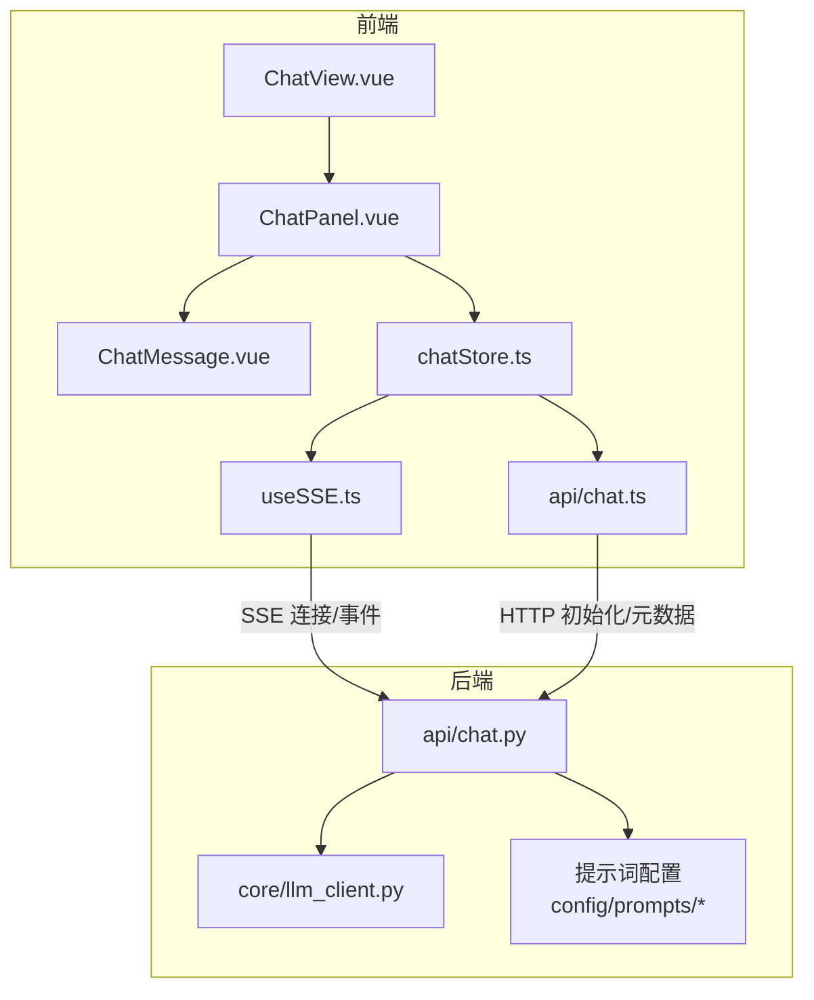
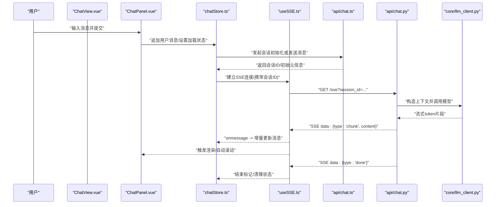
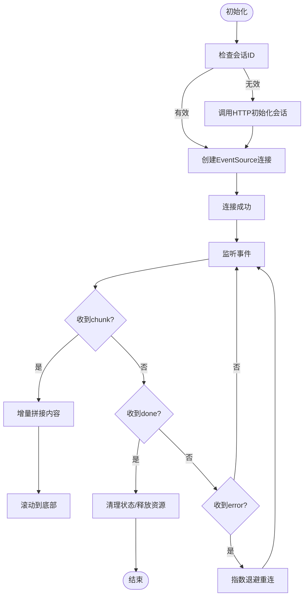
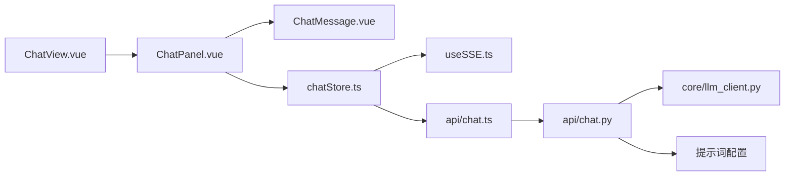

# 实时对话辅导系统

<cite>
**本文引用的文件**   
- [frontend/src/composables/useSSE.ts](file://frontend/src/composables/useSSE.ts)
- [frontend/src/api/chat.ts](file://frontend/src/api/chat.ts)
- [frontend/src/stores/chatStore.ts](file://frontend/src/stores/chatStore.ts)
- [frontend/src/components/ChatPanel.vue](file://frontend/src/components/ChatPanel.vue)
- [frontend/src/components/ChatMessage.vue](file://frontend/src/components/ChatMessage.vue)
- [frontend/src/views/ChatView.vue](file://frontend/src/views/ChatView.vue)
- [src/loopse/api/chat.py](file://src/loopse/api/chat.py)
- [src/loopse/core/llm_client.py](file://src/loopse/core/llm_client.py)
- [config/prompts/orchestrator/route.txt](file://config/prompts/orchestrator/route.txt)
- [config/prompts/profiler/onboarding.txt](file://config/prompts/profiler/onboarding.txt)
- [config/prompts/retriever/query_expansion.txt](file://config/prompts/retriever/query_expansion.txt)
- [config/prompts/resource_generator/generate_code.txt](file://config/prompts/resource_generator/generate_code.txt)
</cite>

## 目录
1. [简介](#简介)
2. [项目结构](#项目结构)
3. [核心组件](#核心组件)
4. [架构总览](#架构总览)
5. [详细组件分析](#详细组件分析)
6. [依赖关系分析](#依赖关系分析)
7. [性能考虑](#性能考虑)
8. [故障排查指南](#故障排查指南)
9. [结论](#结论)
10. [附录](#附录)

## 简介
本技术文档围绕 Socrates-Cube 的“实时对话辅导系统”，聚焦以下目标：
- 基于 SSE（Server-Sent Events）的实时通信实现，包括连接建立、增量消息推送与断线重连。
- 聊天界面组件架构：消息气泡、输入框与滚动优化。
- 对话上下文管理：历史消息存储、会话状态维护与记忆提取。
- AI 助手集成：大语言模型调用、提示词设计与响应处理。
- 扩展能力：自定义回复模板与多模态支持。
- 性能优化：分页加载、内存管理与网络请求优化。
- 个性化辅导应用效果与用户体验。

## 项目结构
前端采用 Vue 3 + TypeScript，后端为 Python FastAPI。实时对话的关键路径如下：
- 前端：useSSE 组合式函数负责 SSE 连接与事件处理；chat API 封装 HTTP/SSE 调用；chatStore 管理会话与消息状态；ChatPanel/ChatMessage 渲染 UI。
- 后端：chat API 路由接收用户消息，编排 LLM 调用并流式返回；LLM 客户端统一抽象外部模型接口；提示词配置位于 config/prompts。

图表来源
- [frontend/src/views/ChatView.vue](file://frontend/src/views/ChatView.vue)
- [frontend/src/components/ChatPanel.vue](file://frontend/src/components/ChatPanel.vue)
- [frontend/src/components/ChatMessage.vue](file://frontend/src/components/ChatMessage.vue)
- [frontend/src/stores/chatStore.ts](file://frontend/src/stores/chatStore.ts)
- [frontend/src/composables/useSSE.ts](file://frontend/src/composables/useSSE.ts)
- [frontend/src/api/chat.ts](file://frontend/src/api/chat.ts)
- [src/loopse/api/chat.py](file://src/loopse/api/chat.py)
- [src/loopse/core/llm_client.py](file://src/loopse/core/llm_client.py)
- [config/prompts/orchestrator/route.txt](file://config/prompts/orchestrator/route.txt)
- [config/prompts/profiler/onboarding.txt](file://config/prompts/profiler/onboarding.txt)
- [config/prompts/retriever/query_expansion.txt](file://config/prompts/retriever/query_expansion.txt)
- [config/prompts/resource_generator/generate_code.txt](file://config/prompts/resource_generator/generate_code.txt)

章节来源
- [frontend/src/views/ChatView.vue](file://frontend/src/views/ChatView.vue)
- [frontend/src/components/ChatPanel.vue](file://frontend/src/components/ChatPanel.vue)
- [frontend/src/components/ChatMessage.vue](file://frontend/src/components/ChatMessage.vue)
- [frontend/src/stores/chatStore.ts](file://frontend/src/stores/chatStore.ts)
- [frontend/src/composables/useSSE.ts](file://frontend/src/composables/useSSE.ts)
- [frontend/src/api/chat.ts](file://frontend/src/api/chat.ts)
- [src/loopse/api/chat.py](file://src/loopse/api/chat.py)
- [src/loopse/core/llm_client.py](file://src/loopse/core/llm_client.py)
- [config/prompts/orchestrator/route.txt](file://config/prompts/orchestrator/route.txt)
- [config/prompts/profiler/onboarding.txt](file://config/prompts/profiler/onboarding.txt)
- [config/prompts/retriever/query_expansion.txt](file://config/prompts/retriever/query_expansion.txt)
- [config/prompts/resource_generator/generate_code.txt](file://config/prompts/resource_generator/generate_code.txt)

## 核心组件
- useSSE：封装 EventSource 生命周期、心跳保活、断线重连、事件分发与错误恢复。
- chat API：提供会话初始化、发送消息、获取历史等 HTTP 接口，并与 SSE 端点协同。
- chatStore：集中管理当前会话 ID、消息列表、加载状态、错误状态与持久化策略。
- ChatPanel/ChatMessage：消息渲染、自动滚动、输入校验与交互反馈。
- 后端 chat API：解析请求、构建上下文、调度 LLM、流式输出与错误透传。
- LLM 客户端：统一对外部模型的调用、重试与超时控制。
- 提示词配置：按角色/任务组织，便于替换与扩展。

章节来源
- [frontend/src/composables/useSSE.ts](file://frontend/src/composables/useSSE.ts)
- [frontend/src/api/chat.ts](file://frontend/src/api/chat.ts)
- [frontend/src/stores/chatStore.ts](file://frontend/src/stores/chatStore.ts)
- [frontend/src/components/ChatPanel.vue](file://frontend/src/components/ChatPanel.vue)
- [frontend/src/components/ChatMessage.vue](file://frontend/src/components/ChatMessage.vue)
- [src/loopse/api/chat.py](file://src/loopse/api/chat.py)
- [src/loopse/core/llm_client.py](file://src/loopse/core/llm_client.py)
- [config/prompts/orchestrator/route.txt](file://config/prompts/orchestrator/route.txt)
- [config/prompts/profiler/onboarding.txt](file://config/prompts/profiler/onboarding.txt)
- [config/prompts/retriever/query_expansion.txt](file://config/prompts/retriever/query_expansion.txt)
- [config/prompts/resource_generator/generate_code.txt](file://config/prompts/resource_generator/generate_code.txt)

## 架构总览
下图展示从用户输入到流式响应的端到端流程，以及前后端关键模块的职责边界。

图表来源
- [frontend/src/views/ChatView.vue](file://frontend/src/views/ChatView.vue)
- [frontend/src/components/ChatPanel.vue](file://frontend/src/components/ChatPanel.vue)
- [frontend/src/stores/chatStore.ts](file://frontend/src/stores/chatStore.ts)
- [frontend/src/composables/useSSE.ts](file://frontend/src/composables/useSSE.ts)
- [frontend/src/api/chat.ts](file://frontend/src/api/chat.ts)
- [src/loopse/api/chat.py](file://src/loopse/api/chat.py)
- [src/loopse/core/llm_client.py](file://src/loopse/core/llm_client.py)

## 详细组件分析

### SSE 实时通信（useSSE）
- 连接建立：根据会话 ID 创建 EventSource，附加鉴权与追踪参数。
- 事件处理：区分 chunk/done/error 等事件类型，增量拼接内容并通知上层。
- 断线重连：监听 onerror，指数退避重试，保留已消费游标避免重复。
- 资源释放：组件卸载时关闭连接，防止内存泄漏。
- 错误恢复：网络异常时降级为轮询或提示用户重试。

图表来源
- [frontend/src/composables/useSSE.ts](file://frontend/src/composables/useSSE.ts)
- [frontend/src/api/chat.ts](file://frontend/src/api/chat.ts)

章节来源
- [frontend/src/composables/useSSE.ts](file://frontend/src/composables/useSSE.ts)
- [frontend/src/api/chat.ts](file://frontend/src/api/chat.ts)

### 聊天 API 封装（api/chat.ts）
- 会话初始化：返回 session_id 与必要元信息，供后续 SSE 使用。
- 发送消息：将用户文本与上下文提交至后端，触发流式生成。
- 历史拉取：分页加载历史消息，减少首屏压力。
- 错误映射：将后端错误码转换为前端友好提示。

章节来源
- [frontend/src/api/chat.ts](file://frontend/src/api/chat.ts)

### 会话与消息状态（chatStore.ts）
- 状态字段：当前会话 ID、消息数组、加载/错误标志、是否正在生成。
- 操作：追加用户消息、合并服务端增量、完成收尾、重置会话。
- 持久化：本地缓存最近 N 条消息，刷新后快速恢复。
- 副作用：在新增/更新消息时触发滚动与搜索索引更新。

章节来源
- [frontend/src/stores/chatStore.ts](file://frontend/src/stores/chatStore.ts)

### 聊天面板与消息气泡（ChatPanel.vue / ChatMessage.vue）
- ChatPanel：输入区、发送按钮、加载指示器、错误提示、快捷指令入口。
- ChatMessage：区分用户/AI 样式，支持 Markdown 渲染、代码高亮、链接与图片。
- 滚动优化：虚拟滚动或按需渲染，避免长对话卡顿。
- 交互：复制、重新生成、展开详情等。

章节来源
- [frontend/src/components/ChatPanel.vue](file://frontend/src/components/ChatPanel.vue)
- [frontend/src/components/ChatMessage.vue](file://frontend/src/components/ChatMessage.vue)

### 视图入口（ChatView.vue）
- 挂载聊天面板与侧边栏（如知识库/诊断面板）。
- 路由参数驱动会话切换与页面标题更新。
- 生命周期中注册/注销全局快捷键与窗口尺寸监听。

章节来源
- [frontend/src/views/ChatView.vue](file://frontend/src/views/ChatView.vue)

### 后端对话路由（api/chat.py）
- 接收用户消息与会话上下文，组装提示词。
- 调用 LLM 客户端，以流式方式返回 token 片段。
- 对错误进行包装，保证 SSE 协议稳定。
- 记录审计日志与指标，便于排障与分析。

章节来源
- [src/loopse/api/chat.py](file://src/loopse/api/chat.py)

### LLM 客户端（core/llm_client.py）
- 统一抽象：不同模型提供商的统一接口。
- 重试与超时：可配置的重试次数、退避策略与超时阈值。
- 流式读取：逐块读取 token，降低首字延迟。
- 安全与限流：鉴权、配额与速率限制。

章节来源
- [src/loopse/core/llm_client.py](file://src/loopse/core/llm_client.py)

### 提示词与编排（config/prompts/*）
- 编排路由：根据意图选择子代理或工具。
- 画像更新：引导式问题收集与画像增量更新。
- 检索增强：查询扩展与关键词提炼。
- 资源生成：代码/文档/练习等资源的结构化提示。

章节来源
- [config/prompts/orchestrator/route.txt](file://config/prompts/orchestrator/route.txt)
- [config/prompts/profiler/onboarding.txt](file://config/prompts/profiler/onboarding.txt)
- [config/prompts/retriever/query_expansion.txt](file://config/prompts/retriever/query_expansion.txt)
- [config/prompts/resource_generator/generate_code.txt](file://config/prompts/resource_generator/generate_code.txt)

## 依赖关系分析
- 前端内部依赖：ChatView → ChatPanel → ChatMessage；ChatPanel ↔ chatStore；chatStore → useSSE → api/chat。
- 前后端契约：HTTP 用于会话初始化与历史拉取；SSE 用于增量推送。
- 后端内部依赖：chat API → llm_client；提示词由配置文件注入。

图表来源
- [frontend/src/views/ChatView.vue](file://frontend/src/views/ChatView.vue)
- [frontend/src/components/ChatPanel.vue](file://frontend/src/components/ChatPanel.vue)
- [frontend/src/components/ChatMessage.vue](file://frontend/src/components/ChatMessage.vue)
- [frontend/src/stores/chatStore.ts](file://frontend/src/stores/chatStore.ts)
- [frontend/src/composables/useSSE.ts](file://frontend/src/composables/useSSE.ts)
- [frontend/src/api/chat.ts](file://frontend/src/api/chat.ts)
- [src/loopse/api/chat.py](file://src/loopse/api/chat.py)
- [src/loopse/core/llm_client.py](file://src/loopse/core/llm_client.py)
- [config/prompts/orchestrator/route.txt](file://config/prompts/orchestrator/route.txt)

## 性能考虑
- 消息分页加载：首次仅加载最近 N 条，上拉加载更多，降低首屏渲染压力。
- 增量渲染：SSE chunk 到达即渲染，避免整段等待。
- 滚动优化：长列表使用虚拟滚动或只渲染可视区域节点。
- 内存管理：及时关闭 SSE 连接，清理定时器与事件监听；限制本地缓存大小。
- 网络优化：合理设置超时与重试；必要时启用压缩与缓存策略。
- 后端优化：流式输出、批处理提示词、缓存热点结果与检索向量。

[本节为通用指导，不直接分析具体文件]

## 故障排查指南
- 连接失败：检查会话初始化返回值与 SSE 端点可达性；确认鉴权头与跨域配置。
- 无增量消息：核对 SSE 事件类型与前端解析逻辑；查看后端日志与 LLM 返回。
- 频繁重连：观察网络抖动与服务端负载；调整退避参数与最大重试次数。
- 内存泄漏：确保组件卸载时关闭连接与清理状态；监控浏览器内存占用。
- 渲染卡顿：开启虚拟滚动；减少不必要的重绘；拆分重型组件。

章节来源
- [frontend/src/composables/useSSE.ts](file://frontend/src/composables/useSSE.ts)
- [frontend/src/stores/chatStore.ts](file://frontend/src/stores/chatStore.ts)
- [src/loopse/api/chat.py](file://src/loopse/api/chat.py)

## 结论
本系统通过 SSE 实现低延迟的流式对话体验，结合清晰的组件分层与状态管理，提供了可扩展的个性化辅导能力。提示词与 LLM 客户端解耦使得模型与策略易于替换与升级。配合分页、虚拟滚动与内存治理，可在大规模对话场景下保持流畅体验。

[本节为总结性内容，不直接分析具体文件]

## 附录

### 扩展方法
- 自定义回复模板：在提示词目录新增模板文件，并在编排层按意图选择。
- 多模态支持：在前端增加图片/语音上传与预览，在后端接入多模态模型与媒体处理管线。
- 插件化代理：在编排层注册新的子代理，定义输入输出契约与权限范围。

[本节为概念性说明，不直接分析具体文件]