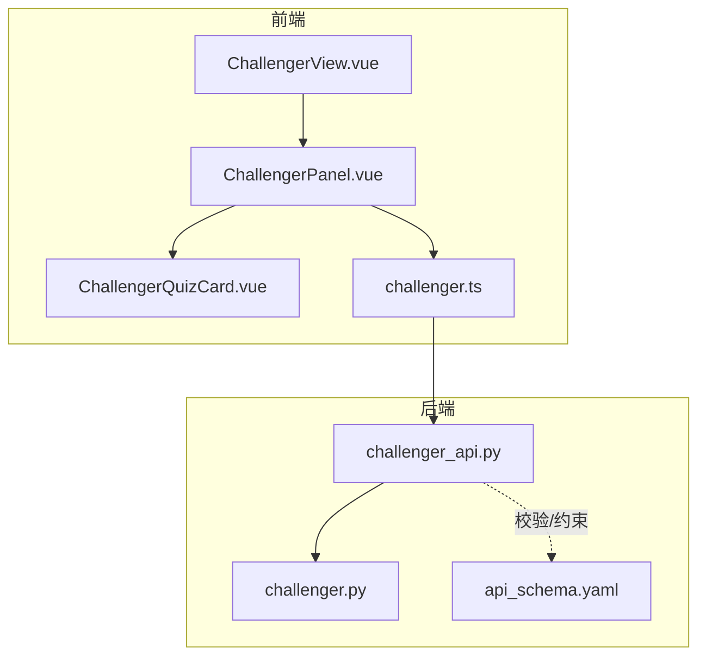
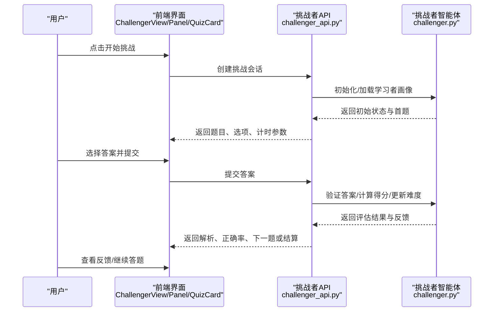
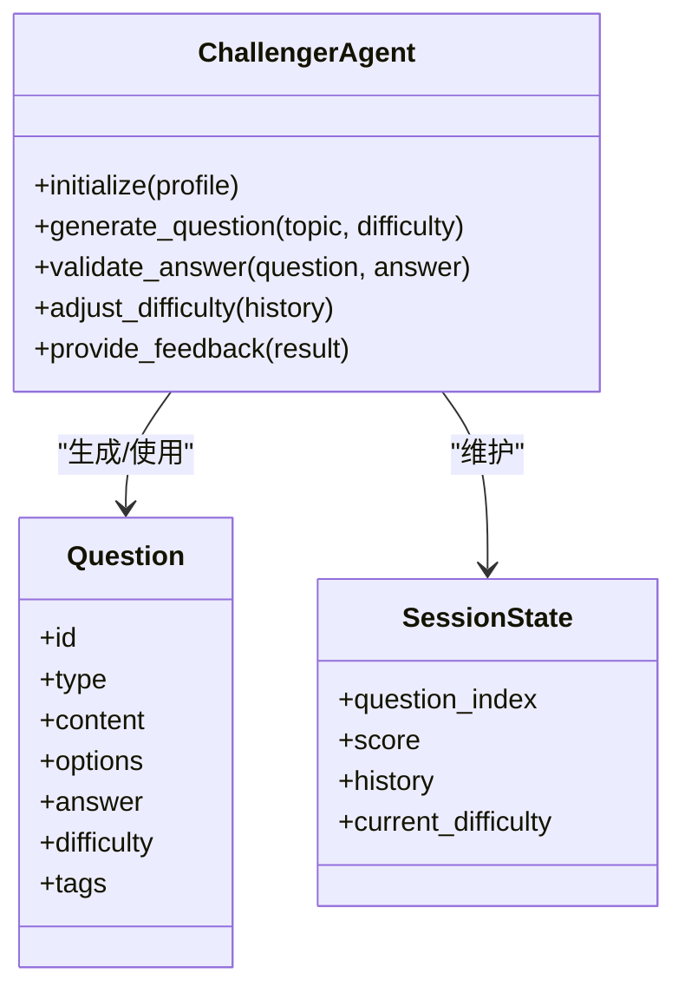
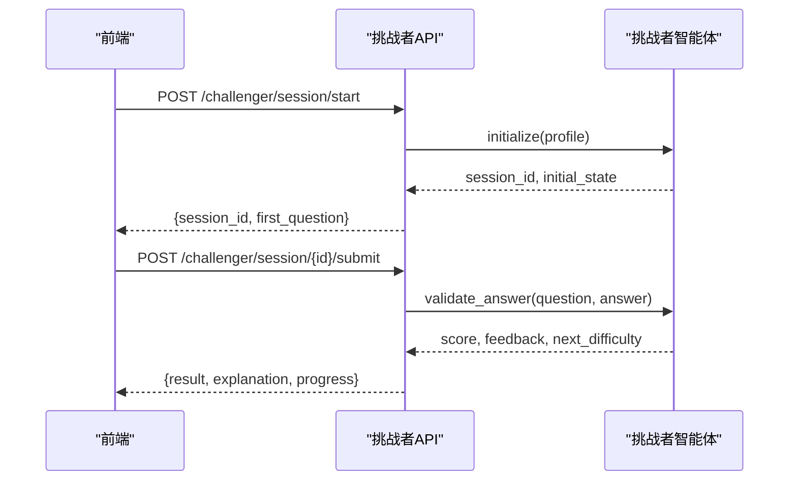
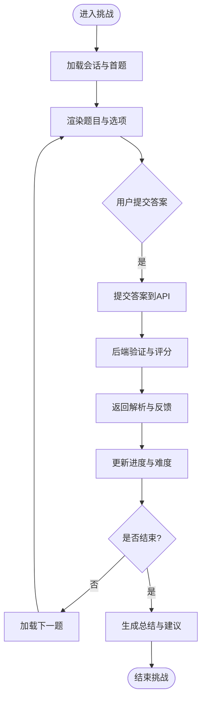
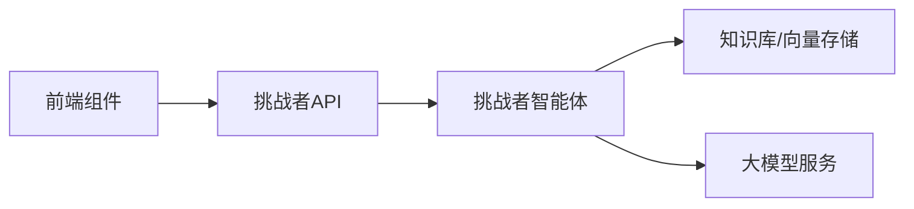

# 挑战者模式

<cite>
**本文引用的文件**   
- [challenger.py](file://src/loopse/agent/challenger.py)
- [challenger_api.py](file://src/loopse/api/challenger.py)
- [test_challenger_agent.py](file://tests/unit/test_challenger_agent.py)
- [ChallengerView.vue](file://frontend/src/views/ChallengerView.vue)
- [ChallengerPanel.vue](file://frontend/src/components/ChallengerPanel.vue)
- [ChallengerQuizCard.vue](file://frontend/src/components/ChallengerQuizCard.vue)
- [challenger.ts](file://frontend/src/api/challenger.ts)
- [api_schema.yaml](file://config/api_schema.yaml)
</cite>

## 目录
1. [简介](#简介)
2. [项目结构](#项目结构)
3. [核心组件](#核心组件)
4. [架构总览](#架构总览)
5. [详细组件分析](#详细组件分析)
6. [依赖关系分析](#依赖关系分析)
7. [性能与可扩展性](#性能与可扩展性)
8. [故障排查指南](#故障排查指南)
9. [结论](#结论)
10. [附录](#附录)

## 简介
本文件面向Socrates-Cube的挑战者模式，系统性阐述挑战者智能体的设计原理、题目数据结构、难度动态调整策略、反馈机制、前后端交互流程以及配置方法。文档旨在帮助开发者快速理解并扩展挑战者模式，同时为教学实践提供可落地的优化建议。

## 项目结构
挑战者模式涉及后端智能体、API接口、前端视图与组件、类型定义与API契约等模块。整体组织遵循“按功能域+分层”的划分方式：
- 后端智能体层：负责题目生成、难度调节、评估与反馈
- API层：暴露REST接口供前端调用
- 前端视图与组件：实现计时器、进度显示、即时反馈与交互
- 类型与契约：统一前后端数据模型与协议

图表来源
- [ChallengerView.vue](file://frontend/src/views/ChallengerView.vue)
- [ChallengerPanel.vue](file://frontend/src/components/ChallengerPanel.vue)
- [ChallengerQuizCard.vue](file://frontend/src/components/ChallengerQuizCard.vue)
- [challenger.ts](file://frontend/src/api/challenger.ts)
- [challenger_api.py](file://src/loopse/api/challenger.py)
- [challenger.py](file://src/loopse/agent/challenger.py)
- [api_schema.yaml](file://config/api_schema.yaml)

章节来源
- [challenger.py](file://src/loopse/agent/challenger.py)
- [challenger_api.py](file://src/loopse/api/challenger.py)
- [ChallengerView.vue](file://frontend/src/views/ChallengerView.vue)
- [ChallengerPanel.vue](file://frontend/src/components/ChallengerPanel.vue)
- [ChallengerQuizCard.vue](file://frontend/src/components/ChallengerQuizCard.vue)
- [challenger.ts](file://frontend/src/api/challenger.ts)
- [api_schema.yaml](file://config/api_schema.yaml)

## 核心组件
- 挑战者智能体（Agent）
  - 职责：根据学习者画像与知识点掌握度生成题目；动态调整难度；对答题结果进行评分与归因；输出个性化反馈。
  - 关键能力：问题生成策略、难度自适应、答案验证、学习路径建议。
- 挑战者API
  - 职责：接收前端请求，编排智能体工作流，返回结构化结果（题目、选项、正确答案、解析、难度等级、知识点标签等）。
- 前端挑战界面
  - 职责：渲染题目卡片、管理计时器与进度条、展示即时反馈与解析、记录答题轨迹。
- 类型与契约
  - 职责：统一定义题目结构、选项格式、答案验证字段、难度级别枚举、错误码与提示语。

章节来源
- [challenger.py](file://src/loopse/agent/challenger.py)
- [challenger_api.py](file://src/loopse/api/challenger.py)
- [ChallengerView.vue](file://frontend/src/views/ChallengerView.vue)
- [ChallengerPanel.vue](file://frontend/src/components/ChallengerPanel.vue)
- [ChallengerQuizCard.vue](file://frontend/src/components/ChallengerQuizCard.vue)
- [challenger.ts](file://frontend/src/api/challenger.ts)
- [api_schema.yaml](file://config/api_schema.yaml)

## 架构总览
挑战者模式采用“前端UI + API编排 + 智能体决策”的分层架构。前端通过API发起挑战会话、提交答案、获取反馈；API将请求路由到挑战者智能体，由智能体完成题目生成、难度调节与评估；最终结果以标准化JSON返回给前端展示。

图表来源
- [challenger_api.py](file://src/loopse/api/challenger.py)
- [challenger.py](file://src/loopse/agent/challenger.py)
- [ChallengerView.vue](file://frontend/src/views/ChallengerView.vue)
- [ChallengerPanel.vue](file://frontend/src/components/ChallengerPanel.vue)
- [ChallengerQuizCard.vue](file://frontend/src/components/ChallengerQuizCard.vue)

## 详细组件分析

### 挑战者智能体（Agent）
- 设计要点
  - 问题生成策略：基于知识点图谱与学习者画像，结合错题历史与最近表现，选择合适主题与题型组合。
  - 难度动态调整：依据连续正确率、作答时长、知识薄弱点分布，采用自适应算法提升或降低难度。
  - 答案验证逻辑：支持单选、多选、填空等多种题型；内置正则/语义匹配与等价表达判定；对开放题给出评分维度。
  - 反馈机制：即时反馈（对错提示、解析）、延迟反馈（总结报告、学习建议），并提供下一步学习路径。
- 复杂度与优化
  - 时间复杂度：题目检索与难度评估主要受知识库规模与画像特征维度影响，可通过缓存热点题目与预计算难度区间优化。
  - 空间复杂度：维护会话状态与历史轨迹，需控制内存占用，避免长会话导致膨胀。
- 错误处理
  - 输入校验失败：返回明确错误码与修复建议。
  - LLM/外部服务异常：降级至模板题库或默认难度策略，保障可用性。

章节来源
- [challenger.py](file://src/loopse/agent/challenger.py)
- [test_challenger_agent.py](file://tests/unit/test_challenger_agent.py)

#### 类图（代码级）

图表来源
- [challenger.py](file://src/loopse/agent/challenger.py)

### 挑战者API
- 职责与流程
  - 会话管理：创建/恢复挑战会话，持久化状态。
  - 题目下发：调用智能体生成题目，封装响应结构。
  - 答案校验：转发答案至智能体，聚合评估结果。
  - 难度调节：根据历史表现更新难度参数。
  - 反馈输出：返回解析、知识点覆盖、建议练习。
- 安全与健壮性
  - 输入校验：严格校验请求体结构与类型。
  - 限流与超时：防止恶意刷接口与长时间阻塞。
  - 幂等性：同一会话多次提交相同答案应得到一致结果。

章节来源
- [challenger_api.py](file://src/loopse/api/challenger.py)
- [api_schema.yaml](file://config/api_schema.yaml)

#### 序列图（API调用链）

图表来源
- [challenger_api.py](file://src/loopse/api/challenger.py)
- [challenger.py](file://src/loopse/agent/challenger.py)

### 前端挑战界面
- 页面与组件
  - 视图层：ChallengerView负责路由与布局。
  - 面板层：ChallengerPanel管理会话状态、计时器、进度与导航。
  - 卡片层：ChallengerQuizCard渲染具体题目、选项与即时反馈。
- 交互流程
  - 开始挑战：请求创建会话，加载首题与计时参数。
  - 答题过程：选择答案后提交，显示即时反馈与解析。
  - 结果评估：统计正确率、知识点覆盖、建议复习内容。
- 用户体验优化
  - 防抖提交：避免重复提交造成状态不一致。
  - 断线重连：网络异常时自动重试或回退本地缓存。
  - 无障碍支持：键盘导航与屏幕阅读器兼容。

章节来源
- [ChallengerView.vue](file://frontend/src/views/ChallengerView.vue)
- [ChallengerPanel.vue](file://frontend/src/components/ChallengerPanel.vue)
- [ChallengerQuizCard.vue](file://frontend/src/components/ChallengerQuizCard.vue)
- [challenger.ts](file://frontend/src/api/challenger.ts)

#### 流程图（答题与反馈）

图表来源
- [ChallengerPanel.vue](file://frontend/src/components/ChallengerPanel.vue)
- [ChallengerQuizCard.vue](file://frontend/src/components/ChallengerQuizCard.vue)
- [challenger.ts](file://frontend/src/api/challenger.ts)
- [challenger_api.py](file://src/loopse/api/challenger.py)

### 数据结构与验证逻辑
- 题目结构
  - 字段：题目ID、类型（单选/多选/填空/简答）、题干、选项列表、正确答案、难度等级、知识点标签、解析。
  - 选项设计：支持文本、图片、代码片段；包含干扰项与易错点标注。
- 答案验证
  - 规则匹配：精确匹配、大小写不敏感、空白规范化。
  - 语义等价：同义词替换、数学表达式等价、代码执行比对。
  - 开放题评分：多维度打分（准确性、完整性、创新性），阈值判定。
- 难度级别
  - 分级：入门、基础、进阶、挑战；对应不同知识点深度与综合度。
  - 动态调整：基于连续正确率、平均用时、错误类型分布。

章节来源
- [api_schema.yaml](file://config/api_schema.yaml)
- [challenger.py](file://src/loopse/agent/challenger.py)
- [challenger_api.py](file://src/loopse/api/challenger.py)

### 配置方法与个性化适配
- 题库管理
  - 导入导出：批量导入题目，支持CSV/JSON格式；导出用于分析与备份。
  - 版本控制：题目版本化管理，确保回溯与一致性。
- 难度设置
  - 全局策略：默认难度曲线与最大/最小值限制。
  - 个性化：根据学习者画像与历史表现微调难度系数。
- 个性化适配
  - 偏好设置：题型偏好、语言偏好、辅助功能开关。
  - 学习路径：基于薄弱知识点推荐练习资源与讲解视频。

章节来源
- [challenger.py](file://src/loopse/agent/challenger.py)
- [api_schema.yaml](file://config/api_schema.yaml)

### 挑战算法优化策略
- 自适应难度调节
  - 策略：基于连续正确率与用时动态调整难度，避免过难挫败或过易无聊。
  - 指标：滑动窗口正确率、用时分位数、知识点掌握度。
- 知识点覆盖分析
  - 目标：确保练习覆盖核心知识点，避免偏科。
  - 方法：构建知识点权重矩阵，优先选择低掌握度且高重要性的知识点。
- 冷启动与探索
  - 冷启动：新用户采用通用难度与均衡知识点分布。
  - 探索：引入少量随机题目以收集更多行为数据，提升模型精度。

章节来源
- [challenger.py](file://src/loopse/agent/challenger.py)
- [test_challenger_agent.py](file://tests/unit/test_challenger_agent.py)

## 依赖关系分析
- 组件耦合
  - 前端组件强依赖API契约，弱依赖智能体内部实现。
  - API层解耦于智能体，便于替换或扩展不同策略。
- 外部依赖
  - LLM服务：用于生成题目与解析，需考虑超时与降级。
  - 知识库/向量存储：用于检索相关题目与知识点。
- 潜在循环依赖
  - 当前分层清晰，未见循环依赖；建议在扩展时保持单向依赖。

图表来源
- [challenger_api.py](file://src/loopse/api/challenger.py)
- [challenger.py](file://src/loopse/agent/challenger.py)

章节来源
- [challenger_api.py](file://src/loopse/api/challenger.py)
- [challenger.py](file://src/loopse/agent/challenger.py)

## 性能与可扩展性
- 性能优化
  - 缓存热点题目与难度区间，减少重复计算。
  - 异步生成与流式返回，提升首题加载速度。
  - 前端分页与懒加载，降低DOM压力。
- 可扩展性
  - 插件化智能体：支持多种难度策略与评测模型。
  - 多租户隔离：按用户或班级维度隔离数据与策略。
  - 监控与告警：关键指标埋点与异常告警。

[本节为通用指导，无需列出章节来源]

## 故障排查指南
- 常见问题
  - 题目无法加载：检查API连通性与知识库索引状态。
  - 答案验证失败：核对答案格式与等价规则，确认边界条件。
  - 难度不变化：检查历史数据完整性与滑动窗口计算。
- 调试建议
  - 启用详细日志：记录请求/响应与中间状态。
  - 单元测试覆盖：针对验证逻辑与难度调节编写用例。
  - 端到端测试：模拟真实用户操作，验证全流程。

章节来源
- [test_challenger_agent.py](file://tests/unit/test_challenger_agent.py)
- [challenger_api.py](file://src/loopse/api/challenger.py)

## 结论
挑战者模式通过智能体驱动的题目生成与自适应难度调节，结合前端的即时反馈与可视化进度，有效激发学习动机并提升学习效果。未来可在知识点覆盖分析、冷启动策略与多模态题目方面持续优化，进一步个性化与智能化。

[本节为总结，无需列出章节来源]

## 附录
- 术语表
  - 挑战者智能体：负责题目生成、难度调节与评估的核心模块。
  - 自适应难度：根据学习者表现动态调整题目难度的策略。
  - 知识点覆盖：练习内容对核心知识点的全面性度量。
- 参考实现
  - 智能体实现：[challenger.py](file://src/loopse/agent/challenger.py)
  - API实现：[challenger_api.py](file://src/loopse/api/challenger.py)
  - 前端组件：[ChallengerPanel.vue](file://frontend/src/components/ChallengerPanel.vue)、[ChallengerQuizCard.vue](file://frontend/src/components/ChallengerQuizCard.vue)
  - API契约：[api_schema.yaml](file://config/api_schema.yaml)