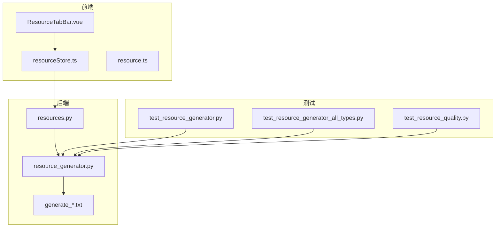
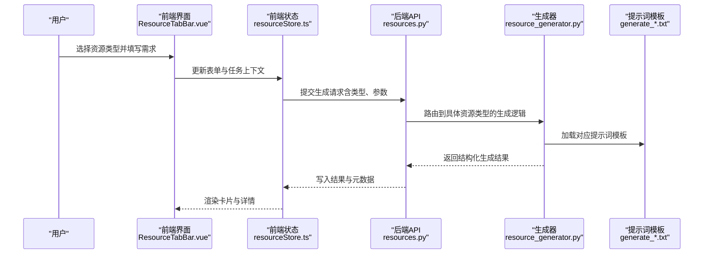
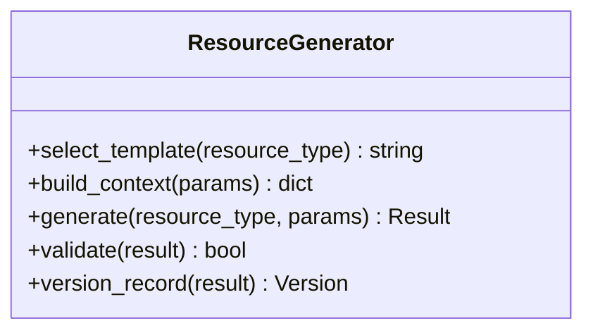
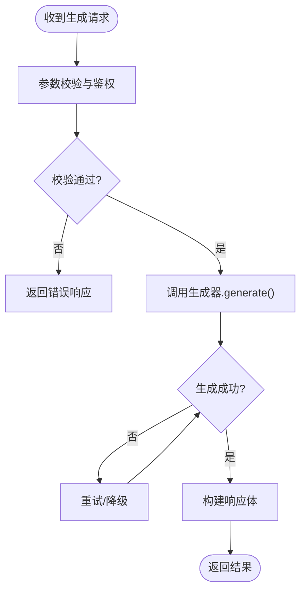
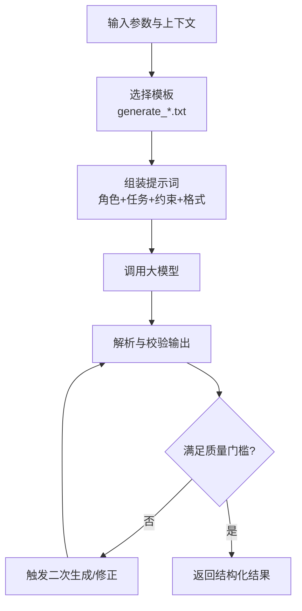
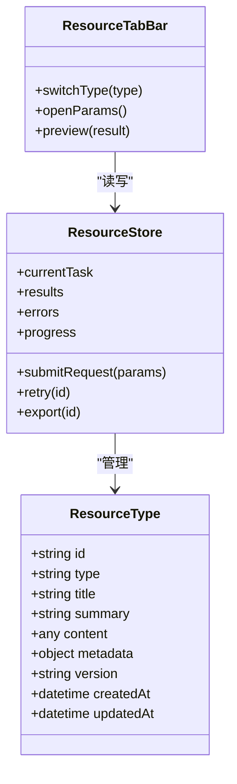
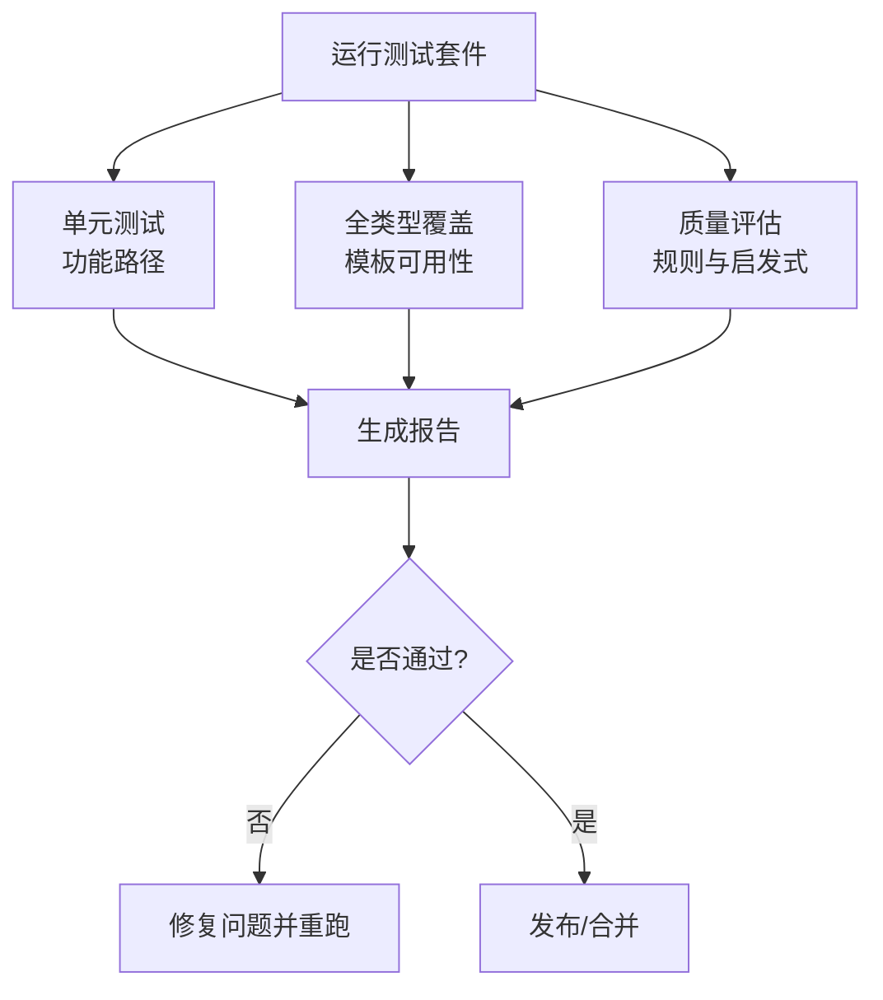
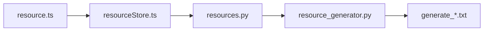
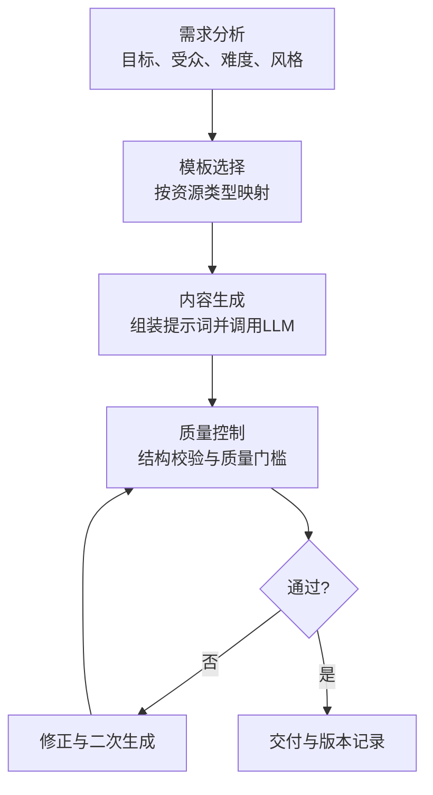

# 智能资源生成引擎

<cite>
**本文引用的文件**   
- [src/loopse/agent/resource_generator.py](file://src/loopse/agent/resource_generator.py)
- [config/prompts/resource_generator/generate_code.txt](file://config/prompts/resource_generator/generate_code.txt)
- [config/prompts/resource_generator/generate_doc.txt](file://config/prompts/resource_generator/generate_doc.txt)
- [config/prompts/resource_generator/generate_exercise.txt](file://config/prompts/resource_generator/generate_exercise.txt)
- [config/prompts/resource_generator/generate_infographic.txt](file://config/prompts/resource_generator/generate_infographic.txt)
- [config/prompts/resource_generator/generate_script.txt](file://config/prompts/resource_generator/generate_script.txt)
- [src/loopse/api/resources.py](file://src/loopse/api/resources.py)
- [frontend/src/types/resource.ts](file://frontend/src/types/resource.ts)
- [frontend/src/stores/resourceStore.ts](file://frontend/src/stores/resourceStore.ts)
- [frontend/src/components/resources/ResourceTabBar.vue](file://frontend/src/components/resources/ResourceTabBar.vue)
- [tests/unit/test_resource_generator.py](file://tests/unit/test_resource_generator.py)
- [tests/unit/test_resource_generator_all_types.py](file://tests/unit/test_resource_generator_all_types.py)
- [tests/unit/test_resource_quality.py](file://tests/unit/test_resource_quality.py)
</cite>

## 目录
1. [简介](#简介)
2. [项目结构](#项目结构)
3. [核心组件](#核心组件)
4. [架构总览](#架构总览)
5. [详细组件分析](#详细组件分析)
6. [依赖关系分析](#依赖关系分析)
7. [性能考量](#性能考量)
8. [故障排查指南](#故障排查指南)
9. [结论](#结论)
10. [附录](#附录)

## 简介
本技术文档面向Socrates-Cube的智能资源生成引擎，系统性阐述其支持的资源类型、端到端生成流程、提示词工程设计与优化策略、版本管理与质量控制机制，以及扩展方法。同时提供实际生成示例与效果对比思路，帮助读者理解AI如何针对不同学习主题自动生成高质量教学资源。

## 项目结构
围绕“资源生成”的关键代码与配置分布如下：
- 后端生成器与API
  - 生成器实现：src/loopse/agent/resource_generator.py
  - 对外接口：src/loopse/api/resources.py
- 提示词模板（按资源类型划分）
  - config/prompts/resource_generator/generate_*.txt
- 前端类型定义与状态管理
  - frontend/src/types/resource.ts
  - frontend/src/stores/resourceStore.ts
  - frontend/src/components/resources/ResourceTabBar.vue
- 测试用例
  - tests/unit/test_resource_generator.py
  - tests/unit/test_resource_generator_all_types.py
  - tests/unit/test_resource_quality.py

图表来源
- [src/loopse/api/resources.py](file://src/loopse/api/resources.py)
- [src/loopse/agent/resource_generator.py](file://src/loopse/agent/resource_generator.py)
- [config/prompts/resource_generator/generate_code.txt](file://config/prompts/resource_generator/generate_code.txt)
- [config/prompts/resource_generator/generate_doc.txt](file://config/prompts/resource_generator/generate_doc.txt)
- [config/prompts/resource_generator/generate_exercise.txt](file://config/prompts/resource_generator/generate_exercise.txt)
- [config/prompts/resource_generator/generate_infographic.txt](file://config/prompts/resource_generator/generate_infographic.txt)
- [config/prompts/resource_generator/generate_script.txt](file://config/prompts/resource_generator/generate_script.txt)
- [frontend/src/components/resources/ResourceTabBar.vue](file://frontend/src/components/resources/ResourceTabBar.vue)
- [frontend/src/stores/resourceStore.ts](file://frontend/src/stores/resourceStore.ts)
- [frontend/src/types/resource.ts](file://frontend/src/types/resource.ts)
- [tests/unit/test_resource_generator.py](file://tests/unit/test_resource_generator.py)
- [tests/unit/test_resource_generator_all_types.py](file://tests/unit/test_resource_generator_all_types.py)
- [tests/unit/test_resource_quality.py](file://tests/unit/test_resource_quality.py)

章节来源
- [src/loopse/agent/resource_generator.py](file://src/loopse/agent/resource_generator.py)
- [src/loopse/api/resources.py](file://src/loopse/api/resources.py)
- [config/prompts/resource_generator/generate_code.txt](file://config/prompts/resource_generator/generate_code.txt)
- [config/prompts/resource_generator/generate_doc.txt](file://config/prompts/resource_generator/generate_doc.txt)
- [config/prompts/resource_generator/generate_exercise.txt](file://config/prompts/resource_generator/generate_exercise.txt)
- [config/prompts/resource_generator/generate_infographic.txt](file://config/prompts/resource_generator/generate_infographic.txt)
- [config/prompts/resource_generator/generate_script.txt](file://config/prompts/resource_generator/generate_script.txt)
- [frontend/src/types/resource.ts](file://frontend/src/types/resource.ts)
- [frontend/src/stores/resourceStore.ts](file://frontend/src/stores/resourceStore.ts)
- [frontend/src/components/resources/ResourceTabBar.vue](file://frontend/src/components/resources/ResourceTabBar.vue)
- [tests/unit/test_resource_generator.py](file://tests/unit/test_resource_generator.py)
- [tests/unit/test_resource_generator_all_types.py](file://tests/unit/test_resource_generator_all_types.py)
- [tests/unit/test_resource_quality.py](file://tests/unit/test_resource_quality.py)

## 核心组件
- 资源生成器（后端）
  - 负责解析请求参数、选择对应提示词模板、调用大模型进行内容生成、结构化输出并返回结果。
  - 支持多种资源类型：代码示例、教学文档、练习题、信息图表、视频脚本等。
- 资源API（后端）
  - 暴露统一的REST接口，接收前端生成的需求描述、目标受众、难度等级、风格偏好等参数，转发给生成器处理。
- 提示词模板（配置）
  - 针对每种资源类型维护独立的提示词模板，包含角色设定、任务说明、输入约束、输出格式规范、质量要求等。
- 前端资源类型与状态管理
  - 通过类型定义统一数据结构；通过store集中管理生成任务、进度、结果与错误状态。
- 测试套件
  - 覆盖功能正确性、多类型一致性、质量指标验证等维度，保障生成稳定性与可回归性。

章节来源
- [src/loopse/agent/resource_generator.py](file://src/loopse/agent/resource_generator.py)
- [src/loopse/api/resources.py](file://src/loopse/api/resources.py)
- [config/prompts/resource_generator/generate_code.txt](file://config/prompts/resource_generator/generate_code.txt)
- [config/prompts/resource_generator/generate_doc.txt](file://config/prompts/resource_generator/generate_doc.txt)
- [config/prompts/resource_generator/generate_exercise.txt](file://config/prompts/resource_generator/generate_exercise.txt)
- [config/prompts/resource_generator/generate_infographic.txt](file://config/prompts/resource_generator/generate_infographic.txt)
- [config/prompts/resource_generator/generate_script.txt](file://config/prompts/resource_generator/generate_script.txt)
- [frontend/src/types/resource.ts](file://frontend/src/types/resource.ts)
- [frontend/src/stores/resourceStore.ts](file://frontend/src/stores/resourceStore.ts)
- [tests/unit/test_resource_generator.py](file://tests/unit/test_resource_generator.py)
- [tests/unit/test_resource_generator_all_types.py](file://tests/unit/test_resource_generator_all_types.py)
- [tests/unit/test_resource_quality.py](file://tests/unit/test_resource_quality.py)

## 架构总览
从用户发起生成到结果呈现的端到端流程如下：

图表来源
- [src/loopse/api/resources.py](file://src/loopse/api/resources.py)
- [src/loopse/agent/resource_generator.py](file://src/loopse/agent/resource_generator.py)
- [config/prompts/resource_generator/generate_code.txt](file://config/prompts/resource_generator/generate_code.txt)
- [config/prompts/resource_generator/generate_doc.txt](file://config/prompts/resource_generator/generate_doc.txt)
- [config/prompts/resource_generator/generate_exercise.txt](file://config/prompts/resource_generator/generate_exercise.txt)
- [config/prompts/resource_generator/generate_infographic.txt](file://config/prompts/resource_generator/generate_infographic.txt)
- [config/prompts/resource_generator/generate_script.txt](file://config/prompts/resource_generator/generate_script.txt)
- [frontend/src/components/resources/ResourceTabBar.vue](file://frontend/src/components/resources/ResourceTabBar.vue)
- [frontend/src/stores/resourceStore.ts](file://frontend/src/stores/resourceStore.ts)

## 详细组件分析

### 资源生成器（resource_generator.py）
- 职责
  - 解析入参：资源类型、学习目标、受众画像、难度、语言风格、输出格式等。
  - 模板选择：根据资源类型映射到对应的提示词模板路径。
  - 内容生成：组装提示词上下文，调用LLM客户端完成生成。
  - 结果校验：对返回内容进行基础结构校验与字段完整性检查。
  - 版本记录：为每次生成打上时间戳、版本标识与变更摘要。
- 关键设计点
  - 模板驱动：将不同资源类型的生成规则外置到文本模板中，便于迭代与A/B实验。
  - 可扩展路由：新增资源类型仅需添加模板与路由分支，无需改动核心逻辑。
  - 容错与重试：对网络异常或模型超时进行有限次重试与降级策略。
- 复杂度与性能
  - 主要耗时在LLM调用，I/O密集；可通过并发队列与缓存减少重复生成。
  - 模板拼接与JSON序列化开销较低，整体线性增长。

图表来源
- [src/loopse/agent/resource_generator.py](file://src/loopse/agent/resource_generator.py)

章节来源
- [src/loopse/agent/resource_generator.py](file://src/loopse/agent/resource_generator.py)

### 资源API（resources.py）
- 职责
  - 暴露REST接口，接收前端请求并进行鉴权、参数校验、限流。
  - 调用生成器执行生成，封装响应体（含状态码、消息、数据、追踪ID）。
  - 支持分页、过滤与排序（如按资源类型、创建时间、标签）。
- 关键设计点
  - 统一错误码与消息格式，便于前端一致化处理。
  - 审计日志：记录请求参数、生成耗时、资源版本等信息。
- 集成点
  - 与生成器模块解耦，仅通过函数/类方法进行调用。
  - 与前端类型定义保持一致，避免前后端契约漂移。

图表来源
- [src/loopse/api/resources.py](file://src/loopse/api/resources.py)
- [src/loopse/agent/resource_generator.py](file://src/loopse/agent/resource_generator.py)

章节来源
- [src/loopse/api/resources.py](file://src/loopse/api/resources.py)

### 提示词工程（generate_*.txt）
- 模板分类
  - generate_code.txt：代码示例生成，强调语法正确、注释清晰、可运行性与教学性。
  - generate_doc.txt：教学文档生成，强调结构完整、循序渐进、术语解释与示例穿插。
  - generate_exercise.txt：练习题生成，强调题型多样、难度梯度、答案与解析分离。
  - generate_infographic.txt：信息图表生成，强调要点提炼、可视化建议、层级结构。
  - generate_script.txt：视频脚本生成，强调分镜描述、旁白文案、时长控制与节奏感。
- 设计原则
  - 明确角色与任务：定义生成者的身份与目标受众。
  - 输入约束：限定知识范围、术语表、风格与长度。
  - 输出规范：指定JSON/Markdown结构、必填字段、样例占位符。
  - 质量门槛：准确性、可读性、教学价值、可评估性。
- 优化策略
  - 分层提示：先大纲后细节，降低长文本幻觉风险。
  - 少样本引导：在模板中嵌入典型示例片段，提升一致性。
  - 自检指令：要求模型在输出前进行自我审查与修正。
  - 动态注入：根据学习者画像与历史表现动态调整难度与风格。

图表来源
- [config/prompts/resource_generator/generate_code.txt](file://config/prompts/resource_generator/generate_code.txt)
- [config/prompts/resource_generator/generate_doc.txt](file://config/prompts/resource_generator/generate_doc.txt)
- [config/prompts/resource_generator/generate_exercise.txt](file://config/prompts/resource_generator/generate_exercise.txt)
- [config/prompts/resource_generator/generate_infographic.txt](file://config/prompts/resource_generator/generate_infographic.txt)
- [config/prompts/resource_generator/generate_script.txt](file://config/prompts/resource_generator/generate_script.txt)
- [src/loopse/agent/resource_generator.py](file://src/loopse/agent/resource_generator.py)

章节来源
- [config/prompts/resource_generator/generate_code.txt](file://config/prompts/resource_generator/generate_code.txt)
- [config/prompts/resource_generator/generate_doc.txt](file://config/prompts/resource_generator/generate_doc.txt)
- [config/prompts/resource_generator/generate_exercise.txt](file://config/prompts/resource_generator/generate_exercise.txt)
- [config/prompts/resource_generator/generate_infographic.txt](file://config/prompts/resource_generator/generate_infographic.txt)
- [config/prompts/resource_generator/generate_script.txt](file://config/prompts/resource_generator/generate_script.txt)
- [src/loopse/agent/resource_generator.py](file://src/loopse/agent/resource_generator.py)

### 前端资源类型与状态管理
- 类型定义（resource.ts）
  - 统一资源对象结构：id、type、title、summary、content、metadata、version、createdAt、updatedAt等。
  - 为不同资源类型提供可选字段扩展（如代码示例的语言、练习题的答案与解析、视频脚本的分镜列表等）。
- 状态管理（resourceStore.ts）
  - 集中管理当前任务、进度、结果缓存、错误信息与重试计数。
  - 提供批量操作与撤销/重做能力，支撑版本回溯。
- 界面交互（ResourceTabBar.vue）
  - 提供资源类型切换、生成参数面板、结果预览与导出入口。
  - 展示生成进度条与阶段性反馈，增强用户体验。

图表来源
- [frontend/src/types/resource.ts](file://frontend/src/types/resource.ts)
- [frontend/src/stores/resourceStore.ts](file://frontend/src/stores/resourceStore.ts)
- [frontend/src/components/resources/ResourceTabBar.vue](file://frontend/src/components/resources/ResourceTabBar.vue)

章节来源
- [frontend/src/types/resource.ts](file://frontend/src/types/resource.ts)
- [frontend/src/stores/resourceStore.ts](file://frontend/src/stores/resourceStore.ts)
- [frontend/src/components/resources/ResourceTabBar.vue](file://frontend/src/components/resources/ResourceTabBar.vue)

### 测试与质量保障
- 功能测试（test_resource_generator.py）
  - 验证各资源类型的基本生成路径与返回结构。
- 全类型测试（test_resource_generator_all_types.py）
  - 遍历所有资源类型，确保模板存在且可被正确选择。
- 质量测试（test_resource_quality.py）
  - 基于规则与启发式指标评估生成内容的准确性、完整性与可读性。
  - 支持阈值判定与失败告警，纳入持续集成。

图表来源
- [tests/unit/test_resource_generator.py](file://tests/unit/test_resource_generator.py)
- [tests/unit/test_resource_generator_all_types.py](file://tests/unit/test_resource_generator_all_types.py)
- [tests/unit/test_resource_quality.py](file://tests/unit/test_resource_quality.py)

章节来源
- [tests/unit/test_resource_generator.py](file://tests/unit/test_resource_generator.py)
- [tests/unit/test_resource_generator_all_types.py](file://tests/unit/test_resource_generator_all_types.py)
- [tests/unit/test_resource_quality.py](file://tests/unit/test_resource_quality.py)

## 依赖关系分析
- 模块耦合
  - API层与生成器松耦合，通过函数/类接口通信，便于替换实现与单元测试。
  - 提示词模板作为纯文本配置，与生成器强关联但易于热更新。
- 外部依赖
  - 大模型客户端：用于实际内容生成，需考虑速率限制与可用性。
  - 存储与检索：可选的知识库与向量存储用于增强生成上下文。
- 潜在循环依赖
  - 当前结构无直接循环导入；若引入新的中间件或服务，应保持单向依赖。

图表来源
- [src/loopse/api/resources.py](file://src/loopse/api/resources.py)
- [src/loopse/agent/resource_generator.py](file://src/loopse/agent/resource_generator.py)
- [config/prompts/resource_generator/generate_code.txt](file://config/prompts/resource_generator/generate_code.txt)
- [config/prompts/resource_generator/generate_doc.txt](file://config/prompts/resource_generator/generate_doc.txt)
- [config/prompts/resource_generator/generate_exercise.txt](file://config/prompts/resource_generator/generate_exercise.txt)
- [config/prompts/resource_generator/generate_infographic.txt](file://config/prompts/resource_generator/generate_infographic.txt)
- [config/prompts/resource_generator/generate_script.txt](file://config/prompts/resource_generator/generate_script.txt)
- [frontend/src/types/resource.ts](file://frontend/src/types/resource.ts)
- [frontend/src/stores/resourceStore.ts](file://frontend/src/stores/resourceStore.ts)

章节来源
- [src/loopse/api/resources.py](file://src/loopse/api/resources.py)
- [src/loopse/agent/resource_generator.py](file://src/loopse/agent/resource_generator.py)
- [config/prompts/resource_generator/generate_code.txt](file://config/prompts/resource_generator/generate_code.txt)
- [config/prompts/resource_generator/generate_doc.txt](file://config/prompts/resource_generator/generate_doc.txt)
- [config/prompts/resource_generator/generate_exercise.txt](file://config/prompts/resource_generator/generate_exercise.txt)
- [config/prompts/resource_generator/generate_infographic.txt](file://config/prompts/resource_generator/generate_infographic.txt)
- [config/prompts/resource_generator/generate_script.txt](file://config/prompts/resource_generator/generate_script.txt)
- [frontend/src/types/resource.ts](file://frontend/src/types/resource.ts)
- [frontend/src/stores/resourceStore.ts](file://frontend/src/stores/resourceStore.ts)

## 性能考量
- 生成延迟
  - 主要瓶颈在LLM调用；可采用异步队列、批处理与缓存命中减少重复计算。
- 并发与限流
  - 对API层实施令牌桶限流，防止突发流量导致服务抖动。
- 模板与上下文
  - 控制提示词长度，避免过长上下文造成推理成本上升。
- 结果缓存
  - 对相同参数组合的结果进行短期缓存，提高命中率。
- 监控与度量
  - 记录生成耗时、成功率、重试次数与错误分布，辅助容量规划与优化。

[本节为通用指导，不直接分析具体文件]

## 故障排查指南
- 常见问题
  - 模板缺失或路径错误：确认模板文件存在且命名与路由匹配。
  - 参数校验失败：检查前端传入字段是否符合类型定义与必填项。
  - 生成结果为空或结构不完整：查看生成器的校验逻辑与重试策略。
  - 大模型不可用或超时：检查客户端配置、密钥与网络连通性。
- 定位步骤
  - 查看API层日志，获取请求ID与错误堆栈。
  - 核对生成器返回的结构与字段完整性。
  - 使用最小化参数复现问题，逐步缩小范围。
- 恢复措施
  - 启用降级模板或默认内容。
  - 触发二次生成或人工审核流程。
  - 回滚至上一稳定版本。

章节来源
- [src/loopse/api/resources.py](file://src/loopse/api/resources.py)
- [src/loopse/agent/resource_generator.py](file://src/loopse/agent/resource_generator.py)

## 结论
Socrates-Cube的智能资源生成引擎以模板驱动为核心，结合清晰的API边界与前端类型契约，实现了多类型教学资源的高效生成与可控质量。通过完善的测试体系与版本管理机制，系统具备良好的可维护性与可扩展性。未来可在知识库增强、个性化推荐与自动化评测方面继续深化。

[本节为总结性内容，不直接分析具体文件]

## 附录

### 支持的资源类型与用途
- 代码示例：用于演示概念与实践，强调可运行与注释清晰。
- 教学文档：系统化讲解知识点，适合自学与课堂补充。
- 练习题：巩固理解与检测掌握程度，配套答案与解析。
- 信息图表：提炼关键要点，便于快速浏览与记忆。
- 视频脚本：指导视频制作，包含分镜与旁白文案。

章节来源
- [config/prompts/resource_generator/generate_code.txt](file://config/prompts/resource_generator/generate_code.txt)
- [config/prompts/resource_generator/generate_doc.txt](file://config/prompts/resource_generator/generate_doc.txt)
- [config/prompts/resource_generator/generate_exercise.txt](file://config/prompts/resource_generator/generate_exercise.txt)
- [config/prompts/resource_generator/generate_infographic.txt](file://config/prompts/resource_generator/generate_infographic.txt)
- [config/prompts/resource_generator/generate_script.txt](file://config/prompts/resource_generator/generate_script.txt)

### 生成工作流程（需求分析→模板选择→内容生成→质量控制）

图表来源
- [src/loopse/agent/resource_generator.py](file://src/loopse/agent/resource_generator.py)
- [config/prompts/resource_generator/generate_code.txt](file://config/prompts/resource_generator/generate_code.txt)
- [config/prompts/resource_generator/generate_doc.txt](file://config/prompts/resource_generator/generate_doc.txt)
- [config/prompts/resource_generator/generate_exercise.txt](file://config/prompts/resource_generator/generate_exercise.txt)
- [config/prompts/resource_generator/generate_infographic.txt](file://config/prompts/resource_generator/generate_infographic.txt)
- [config/prompts/resource_generator/generate_script.txt](file://config/prompts/resource_generator/generate_script.txt)

### 版本管理与质量控制机制
- 版本管理
  - 每次生成附带唯一版本标识与时间戳，支持对比与回滚。
  - 变更记录包括参数快照、模板版本与生成耗时。
- 质量控制
  - 结构校验：确保输出符合预定义Schema。
  - 质量门槛：基于规则与启发式指标（完整性、可读性、准确性）进行评分。
  - 人工复核：对高风险或低分结果进入人工审核流程。

章节来源
- [src/loopse/agent/resource_generator.py](file://src/loopse/agent/resource_generator.py)
- [tests/unit/test_resource_quality.py](file://tests/unit/test_resource_quality.py)

### 扩展方法（新资源类型与自定义模板）
- 新增资源类型步骤
  - 在提示词目录中添加对应模板文件（如 generate_newtype.txt）。
  - 在生成器中增加路由分支，将新类型映射到新模板。
  - 在前端类型定义中扩展新类型的可选字段。
  - 编写相应测试用例，覆盖功能与质量维度。
- 自定义模板开发建议
  - 明确角色与任务，细化输入约束与输出格式。
  - 采用分层提示与少样本引导，提升稳定性。
  - 加入自检指令，促使模型在输出前进行自我修正。

章节来源
- [config/prompts/resource_generator/generate_code.txt](file://config/prompts/resource_generator/generate_code.txt)
- [config/prompts/resource_generator/generate_doc.txt](file://config/prompts/resource_generator/generate_doc.txt)
- [config/prompts/resource_generator/generate_exercise.txt](file://config/prompts/resource_generator/generate_exercise.txt)
- [config/prompts/resource_generator/generate_infographic.txt](file://config/prompts/resource_generator/generate_infographic.txt)
- [config/prompts/resource_generator/generate_script.txt](file://config/prompts/resource_generator/generate_script.txt)
- [src/loopse/agent/resource_generator.py](file://src/loopse/agent/resource_generator.py)
- [frontend/src/types/resource.ts](file://frontend/src/types/resource.ts)
- [tests/unit/test_resource_generator_all_types.py](file://tests/unit/test_resource_generator_all_types.py)

### 实际生成示例与效果对比（思路与指标）
- 示例主题
  - 面向对象编程入门：生成代码示例、教学文档、练习题与信息图表。
  - 机器学习基础：生成视频脚本与配套练习题。
- 对比维度
  - 准确性：事实与概念是否正确。
  - 完整性：是否覆盖必要知识点与步骤。
  - 可读性：语言是否清晰易懂、结构是否合理。
  - 教学价值：是否有助于理解与迁移应用。
- 评估方式
  - 自动化规则与启发式指标打分。
  - 教师或专家抽样评审，形成综合评分。

[本节为方法论与指标说明，不直接分析具体文件]