# 核心特性概览

<cite>
**本文引用的文件**   
- [src/agents/student/__init__.py](file://src/agents/student/__init__.py)
- [src/loopse/agent/orchestrator.py](file://src/loopse/agent/orchestrator.py)
- [src/loopse/agent/coordinator.py](file://src/loopse/agent/coordinator.py)
- [src/loopse/agent/path_planner.py](file://src/loopse/agent/path_planner.py)
- [src/loopse/agent/cognitive_engine.py](file://src/loopse/agent/cognitive_engine.py)
- [src/loopse/agent/resource_generator.py](file://src/loopse/agent/resource_generator.py)
- [src/loopse/agent/challenger.py](file://src/loopse/agent/challenger.py)
- [src/loopse/agent/profiler.py](file://src/loopse/agent/profiler.py)
- [src/loopse/agent/retriever.py](file://src/loopse/agent/retriever.py)
- [src/loopse/agent/scenario_agent.py](file://src/loopse/agent/scenario_agent.py)
- [src/loopse/api/chat.py](file://src/loopse/api/chat.py)
- [src/loopse/api/path.py](file://src/loopse/api/path.py)
- [src/loopse/api/resources.py](file://src/loopse/api/resources.py)
- [src/loopse/api/challenger.py](file://src/loopse/api/challenger.py)
- [src/loopse/api/simulator.py](file://src/loopse/api/simulator.py)
- [src/loopse/core/trust_mechanism.py](file://src/loopse/core/trust_mechanism.py)
- [config/prompts/orchestrator/route.txt](file://config/prompts/orchestrator/route.txt)
- [config/prompts/path_planner/plan_path.txt](file://config/prompts/path_planner/plan_path.txt)
- [config/prompts/diagnosis/pattern_match.txt](file://config/prompts/diagnosis/pattern_match.txt)
- [config/prompts/diagnosis/root_cause.txt](file://config/prompts/diagnosis/root_cause.txt)
- [config/prompts/diagnosis/surface_error.txt](file://config/prompts/diagnosis/surface_error.txt)
- [config/prompts/resource_generator/generate_code.txt](file://config/prompts/resource_generator/generate_code.txt)
- [config/prompts/resource_generator/generate_doc.txt](file://config/prompts/resource_generator/generate_doc.txt)
- [config/prompts/resource_generator/generate_exercise.txt](file://config/prompts/resource_generator/generate_exercise.txt)
- [config/prompts/resource_generator/generate_infographic.txt](file://config/prompts/resource_generator/generate_infographic.txt)
- [config/prompts/resource_generator/generate_script.txt](file://config/prompts/resource_generator/generate_script.txt)
- [frontend/src/views/ChatView.vue](file://frontend/src/views/ChatView.vue)
- [frontend/src/views/PathView.vue](file://frontend/src/views/PathView.vue)
- [frontend/src/views/ResourcesView.vue](file://frontend/src/views/ResourcesView.vue)
- [frontend/src/views/ChallengerView.vue](file://frontend/src/views/ChallengerView.vue)
- [frontend/src/views/SimulatorView.vue](file://frontend/src/views/SimulatorView.vue)
- [frontend/src/components/KGPanel.vue](file://frontend/src/components/KGPanel.vue)
- [frontend/src/components/DiagnosisFlowStepper.vue](file://frontend/src/components/DiagnosisFlowStepper.vue)
- [frontend/src/components/VirtualTeacherPanel.vue](file://frontend/src/components/VirtualTeacherPanel.vue)
</cite>

## 目录
1. [简介](#简介)
2. [项目结构](#项目结构)
3. [核心组件](#核心组件)
4. [架构总览](#架构总览)
5. [详细特性分析](#详细特性分析)
6. [依赖关系分析](#依赖关系分析)
7. [性能与可扩展性](#性能与可扩展性)
8. [故障排查指南](#故障排查指南)
9. [结论](#结论)

## 简介
Socrates-Cube是一个以“多智能体协作”为核心的个性化学习平台。它通过协调多个专业智能体，围绕学习者画像、认知诊断、路径规划、资源生成、对话辅导、挑战者训练以及虚拟实验等能力，构建从“测—学—练—评—改”的闭环体验。八大核心特性包括：
- 多智能体协作系统
- 个性化学习路径规划
- 多层认知诊断
- 智能资源生成
- 3D可视化交互
- 实时对话辅导
- 挑战者模式
- 虚拟实验环境

本概览面向不同层次用户（初学者、进阶学习者、教师与管理者），用通俗语言解释技术要点，并给出使用场景与收益说明。

## 项目结构
后端采用Python服务，按“智能体+API+知识库+工具”分层组织；前端基于Vue工程，提供页面视图与可复用组件；提示词与配置集中在config目录，便于策略调优与扩展。

```mermaid
graph TB
subgraph "前端"
FE_Chat["聊天视图<br/>ChatView.vue"]
FE_Path["路径视图<br/>PathView.vue"]
FE_Res["资源视图<br/>ResourcesView.vue"]
FE_Challenger["挑战者视图<br/>ChallengerView.vue"]
FE_Sim["模拟器视图<br/>SimulatorView.vue"]
FE_KG["知识图谱面板<br/>KGPanel.vue"]
FE_Diag["诊断流程步进器<br/>DiagnosisFlowStepper.vue"]
FE_VT["虚拟教师面板<br/>VirtualTeacherPanel.vue"]
end
subgraph "后端服务"
API_Chat["聊天API<br/>chat.py"]
API_Path["路径API<br/>path.py"]
API_Res["资源API<br/>resources.py"]
API_Challenger["挑战者API<br/>challenger.py"]
API_Sim["模拟器API<br/>simulator.py"]
Orchestrator["编排器<br/>orchestrator.py"]
Coordinator["协调器<br/>coordinator.py"]
PathPlanner["路径规划器<br/>path_planner.py"]
CognitiveEngine["认知引擎<br/>cognitive_engine.py"]
ResourceGen["资源生成器<br/>resource_generator.py"]
ChallengerAgent["挑战者智能体<br/>challenger.py"]
Profiler["学习者画像<br/>profiler.py"]
Retriever["检索器<br/>retriever.py"]
ScenarioAgent["场景智能体<br/>scenario_agent.py"]
Trust["可信机制<br/>trust_mechanism.py"]
end
subgraph "配置与提示词"
P_Route["编排路由提示<br/>route.txt"]
P_Path["路径规划提示<br/>plan_path.txt"]
P_Diag_Pat["诊断-模式匹配<br/>pattern_match.txt"]
P_Diag_Root["诊断-根因分析<br/>root_cause.txt"]
P_Diag_Surface["诊断-表面错误<br/>surface_error.txt"]
P_Res_Code["生成代码提示<br/>generate_code.txt"]
P_Res_Doc["生成文档提示<br/>generate_doc.txt"]
P_Res_Ex["生成练习提示<br/>generate_exercise.txt"]
P_Res_Info["生成信息图提示<br/>generate_infographic.txt"]
P_Res_Script["生成脚本提示<br/>generate_script.txt"]
end
FE_Chat --> API_Chat
FE_Path --> API_Path
FE_Res --> API_Res
FE_Challenger --> API_Challenger
FE_Sim --> API_Sim
FE_KG --> API_Res
FE_Diag --> API_Path
FE_VT --> API_Chat
API_Chat --> Orchestrator
API_Path --> Orchestrator
API_Res --> Orchestrator
API_Challenger --> Orchestrator
API_Sim --> Orchestrator
Orchestrator --> Coordinator
Orchestrator --> Profiler
Orchestrator --> Retriever
Orchestrator --> PathPlanner
Orchestrator --> CognitiveEngine
Orchestrator --> ResourceGen
Orchestrator --> ChallengerAgent
Orchestrator --> ScenarioAgent
Orchestrator --> Trust
P_Route --> Orchestrator
P_Path --> PathPlanner
P_Diag_Pat --> CognitiveEngine
P_Diag_Root --> CognitiveEngine
P_Diag_Surface --> CognitiveEngine
P_Res_Code --> ResourceGen
P_Res_Doc --> ResourceGen
P_Res_Ex --> ResourceGen
P_Res_Info --> ResourceGen
P_Res_Script --> ResourceGen
```

图表来源
- [src/loopse/api/chat.py](file://src/loopse/api/chat.py)
- [src/loopse/api/path.py](file://src/loopse/api/path.py)
- [src/loopse/api/resources.py](file://src/loopse/api/resources.py)
- [src/loopse/api/challenger.py](file://src/loopse/api/challenger.py)
- [src/loopse/api/simulator.py](file://src/loopse/api/simulator.py)
- [src/loopse/agent/orchestrator.py](file://src/loopse/agent/orchestrator.py)
- [src/loopse/agent/coordinator.py](file://src/loopse/agent/coordinator.py)
- [src/loopse/agent/path_planner.py](file://src/loopse/agent/path_planner.py)
- [src/loopse/agent/cognitive_engine.py](file://src/loopse/agent/cognitive_engine.py)
- [src/loopse/agent/resource_generator.py](file://src/loopse/agent/resource_generator.py)
- [src/loopse/agent/challenger.py](file://src/loopse/agent/challenger.py)
- [src/loopse/agent/profiler.py](file://src/loopse/agent/profiler.py)
- [src/loopse/agent/retriever.py](file://src/loopse/agent/retriever.py)
- [src/loopse/agent/scenario_agent.py](file://src/loopse/agent/scenario_agent.py)
- [src/loopse/core/trust_mechanism.py](file://src/loopse/core/trust_mechanism.py)
- [config/prompts/orchestrator/route.txt](file://config/prompts/orchestrator/route.txt)
- [config/prompts/path_planner/plan_path.txt](file://config/prompts/path_planner/plan_path.txt)
- [config/prompts/diagnosis/pattern_match.txt](file://config/prompts/diagnosis/pattern_match.txt)
- [config/prompts/diagnosis/root_cause.txt](file://config/prompts/diagnosis/root_cause.txt)
- [config/prompts/diagnosis/surface_error.txt](file://config/prompts/diagnosis/surface_error.txt)
- [config/prompts/resource_generator/generate_code.txt](file://config/prompts/resource_generator/generate_code.txt)
- [config/prompts/resource_generator/generate_doc.txt](file://config/prompts/resource_generator/generate_doc.txt)
- [config/prompts/resource_generator/generate_exercise.txt](file://config/prompts/resource_generator/generate_exercise.txt)
- [config/prompts/resource_generator/generate_infographic.txt](file://config/prompts/resource_generator/generate_infographic.txt)
- [config/prompts/resource_generator/generate_script.txt](file://config/prompts/resource_generator/generate_script.txt)
- [frontend/src/views/ChatView.vue](file://frontend/src/views/ChatView.vue)
- [frontend/src/views/PathView.vue](file://frontend/src/views/PathView.vue)
- [frontend/src/views/ResourcesView.vue](file://frontend/src/views/ResourcesView.vue)
- [frontend/src/views/ChallengerView.vue](file://frontend/src/views/ChallengerView.vue)
- [frontend/src/views/SimulatorView.vue](file://frontend/src/views/SimulatorView.vue)
- [frontend/src/components/KGPanel.vue](file://frontend/src/components/KGPanel.vue)
- [frontend/src/components/DiagnosisFlowStepper.vue](file://frontend/src/components/DiagnosisFlowStepper.vue)
- [frontend/src/components/VirtualTeacherPanel.vue](file://frontend/src/components/VirtualTeacherPanel.vue)

章节来源
- [src/loopse/agent/orchestrator.py](file://src/loopse/agent/orchestrator.py)
- [src/loopse/agent/coordinator.py](file://src/loopse/agent/coordinator.py)
- [src/loopse/agent/path_planner.py](file://src/loopse/agent/path_planner.py)
- [src/loopse/agent/cognitive_engine.py](file://src/loopse/agent/cognitive_engine.py)
- [src/loopse/agent/resource_generator.py](file://src/loopse/agent/resource_generator.py)
- [src/loopse/agent/challenger.py](file://src/loopse/agent/challenger.py)
- [src/loopse/agent/profiler.py](file://src/loopse/agent/profiler.py)
- [src/loopse/agent/retriever.py](file://src/loopse/agent/retriever.py)
- [src/loopse/agent/scenario_agent.py](file://src/loopse/agent/scenario_agent.py)
- [src/loopse/api/chat.py](file://src/loopse/api/chat.py)
- [src/loopse/api/path.py](file://src/loopse/api/path.py)
- [src/loopse/api/resources.py](file://src/loopse/api/resources.py)
- [src/loopse/api/challenger.py](file://src/loopse/api/challenger.py)
- [src/loopse/api/simulator.py](file://src/loopse/api/simulator.py)
- [src/loopse/core/trust_mechanism.py](file://src/loopse/core/trust_mechanism.py)
- [config/prompts/orchestrator/route.txt](file://config/prompts/orchestrator/route.txt)
- [config/prompts/path_planner/plan_path.txt](file://config/prompts/path_planner/plan_path.txt)
- [config/prompts/diagnosis/pattern_match.txt](file://config/prompts/diagnosis/pattern_match.txt)
- [config/prompts/diagnosis/root_cause.txt](file://config/prompts/diagnosis/root_cause.txt)
- [config/prompts/diagnosis/surface_error.txt](file://config/prompts/diagnosis/surface_error.txt)
- [config/prompts/resource_generator/generate_code.txt](file://config/prompts/resource_generator/generate_code.txt)
- [config/prompts/resource_generator/generate_doc.txt](file://config/prompts/resource_generator/generate_doc.txt)
- [config/prompts/resource_generator/generate_exercise.txt](file://config/prompts/resource_generator/generate_exercise.txt)
- [config/prompts/resource_generator/generate_infographic.txt](file://config/prompts/resource_generator/generate_infographic.txt)
- [config/prompts/resource_generator/generate_script.txt](file://config/prompts/resource_generator/generate_script.txt)
- [frontend/src/views/ChatView.vue](file://frontend/src/views/ChatView.vue)
- [frontend/src/views/PathView.vue](file://frontend/src/views/PathView.vue)
- [frontend/src/views/ResourcesView.vue](file://frontend/src/views/ResourcesView.vue)
- [frontend/src/views/ChallengerView.vue](file://frontend/src/views/ChallengerView.vue)
- [frontend/src/views/SimulatorView.vue](file://frontend/src/views/SimulatorView.vue)
- [frontend/src/components/KGPanel.vue](file://frontend/src/components/KGPanel.vue)
- [frontend/src/components/DiagnosisFlowStepper.vue](file://frontend/src/components/DiagnosisFlowStepper.vue)
- [frontend/src/components/VirtualTeacherPanel.vue](file://frontend/src/components/VirtualTeacherPanel.vue)

## 核心组件
- 编排器：统一接收请求，依据意图路由到相应智能体，协调多智能体协作。
- 协调器：负责跨智能体的状态同步、任务拆分与结果聚合。
- 学习者画像：维护学习者基础信息、偏好与历史表现，驱动个性化决策。
- 检索器：对知识库进行语义检索与上下文增强，提升回答质量。
- 路径规划器：根据画像与诊断结果生成阶段性学习路线。
- 认知引擎：执行多层诊断（表层错误、模式识别、根因分析）并输出干预建议。
- 资源生成器：按需生成代码、文档、练习、信息图、脚本等多模态资源。
- 挑战者智能体：发起追问、反例与对抗式提问，促进深度思考。
- 场景智能体：构造真实情境任务，支撑模拟与实操。
- 可信机制：为生成内容提供来源引用与范围校验，保障可追溯性与安全性。

章节来源
- [src/loopse/agent/orchestrator.py](file://src/loopse/agent/orchestrator.py)
- [src/loopse/agent/coordinator.py](file://src/loopse/agent/coordinator.py)
- [src/loopse/agent/profiler.py](file://src/loopse/agent/profiler.py)
- [src/loopse/agent/retriever.py](file://src/loopse/agent/retriever.py)
- [src/loopse/agent/path_planner.py](file://src/loopse/agent/path_planner.py)
- [src/loopse/agent/cognitive_engine.py](file://src/loopse/agent/cognitive_engine.py)
- [src/loopse/agent/resource_generator.py](file://src/loopse/agent/resource_generator.py)
- [src/loopse/agent/challenger.py](file://src/loopse/agent/challenger.py)
- [src/loopse/agent/scenario_agent.py](file://src/loopse/agent/scenario_agent.py)
- [src/loopse/core/trust_mechanism.py](file://src/loopse/core/trust_mechanism.py)

## 架构总览
下图展示从前端到后端的端到端调用链，以及编排器如何调度各智能体完成复杂任务。

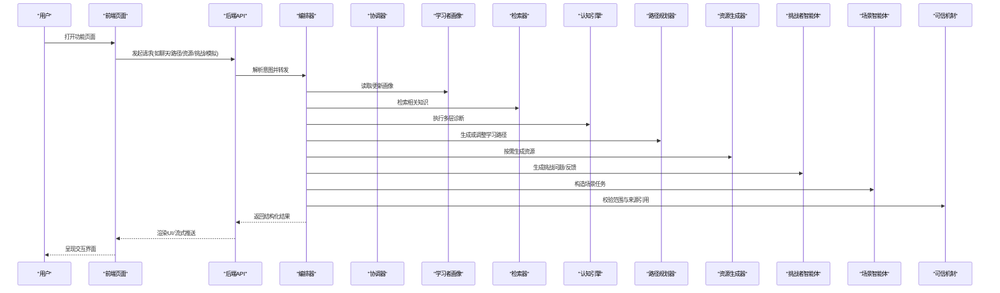

图表来源
- [src/loopse/api/chat.py](file://src/loopse/api/chat.py)
- [src/loopse/api/path.py](file://src/loopse/api/path.py)
- [src/loopse/api/resources.py](file://src/loopse/api/resources.py)
- [src/loopse/api/challenger.py](file://src/loopse/api/challenger.py)
- [src/loopse/api/simulator.py](file://src/loopse/api/simulator.py)
- [src/loopse/agent/orchestrator.py](file://src/loopse/agent/orchestrator.py)
- [src/loopse/agent/coordinator.py](file://src/loopse/agent/coordinator.py)
- [src/loopse/agent/profiler.py](file://src/loopse/agent/profiler.py)
- [src/loopse/agent/retriever.py](file://src/loopse/agent/retriever.py)
- [src/loopse/agent/cognitive_engine.py](file://src/loopse/agent/cognitive_engine.py)
- [src/loopse/agent/path_planner.py](file://src/loopse/agent/path_planner.py)
- [src/loopse/agent/resource_generator.py](file://src/loopse/agent/resource_generator.py)
- [src/loopse/agent/challenger.py](file://src/loopse/agent/challenger.py)
- [src/loopse/agent/scenario_agent.py](file://src/loopse/agent/scenario_agent.py)
- [src/loopse/core/trust_mechanism.py](file://src/loopse/core/trust_mechanism.py)

## 详细特性分析

### 1. 多智能体协作系统
- 功能价值：将复杂教学任务拆解给专业智能体协同完成，提高响应质量与稳定性。
- 技术亮点：
  - 编排器统一路由与任务编排，结合协调器实现状态同步与结果聚合。
  - 提示词集中管理，支持按角色与阶段动态注入上下文。
- 用户收益：更稳定、更专业的回答；复杂问题也能被准确分解与处理。
- 典型场景：学生提出综合问题，系统自动调用检索、诊断、路径规划与资源生成，最终整合成连贯回复。

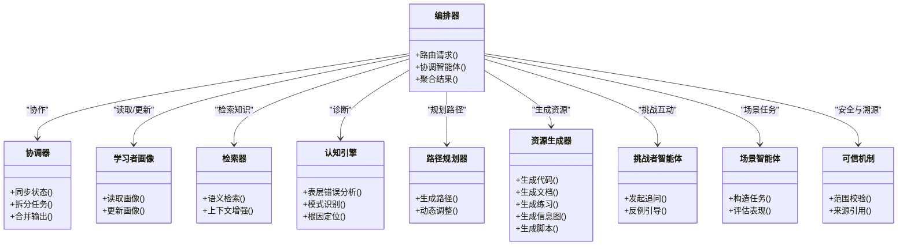

图表来源
- [src/loopse/agent/orchestrator.py](file://src/loopse/agent/orchestrator.py)
- [src/loopse/agent/coordinator.py](file://src/loopse/agent/coordinator.py)
- [src/loopse/agent/profiler.py](file://src/loopse/agent/profiler.py)
- [src/loopse/agent/retriever.py](file://src/loopse/agent/retriever.py)
- [src/loopse/agent/cognitive_engine.py](file://src/loopse/agent/cognitive_engine.py)
- [src/loopse/agent/path_planner.py](file://src/loopse/agent/path_planner.py)
- [src/loopse/agent/resource_generator.py](file://src/loopse/agent/resource_generator.py)
- [src/loopse/agent/challenger.py](file://src/loopse/agent/challenger.py)
- [src/loopse/agent/scenario_agent.py](file://src/loopse/agent/scenario_agent.py)
- [src/loopse/core/trust_mechanism.py](file://src/loopse/core/trust_mechanism.py)

章节来源
- [src/loopse/agent/orchestrator.py](file://src/loopse/agent/orchestrator.py)
- [src/loopse/agent/coordinator.py](file://src/loopse/agent/coordinator.py)
- [config/prompts/orchestrator/route.txt](file://config/prompts/orchestrator/route.txt)

### 2. 个性化学习路径规划
- 功能价值：根据学习者画像与诊断结果，自动生成或动态调整学习路线，确保“学在当下、练在合适”。
- 技术亮点：
  - 路径规划器结合画像与诊断，产出分阶段目标与活动序列。
  - 提示词模板化，支持按学科与难度定制。
- 用户收益：减少选择成本，获得清晰的学习计划与里程碑。
- 典型场景：入门阶段先补基础概念，随后进入应用练习与项目实战，路径随表现自适应调整。

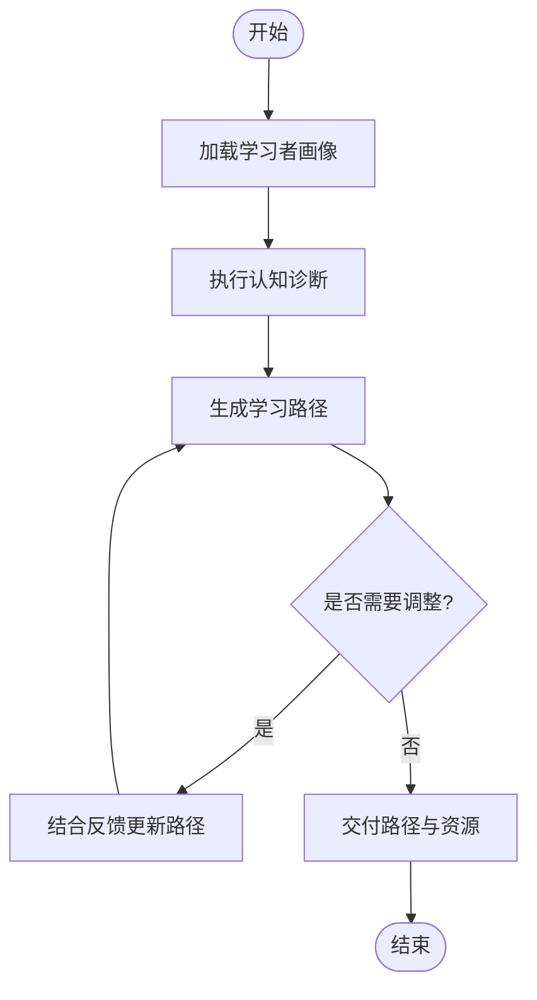

图表来源
- [src/loopse/agent/path_planner.py](file://src/loopse/agent/path_planner.py)
- [src/loopse/agent/profiler.py](file://src/loopse/agent/profiler.py)
- [src/loopse/agent/cognitive_engine.py](file://src/loopse/agent/cognitive_engine.py)
- [config/prompts/path_planner/plan_path.txt](file://config/prompts/path_planner/plan_path.txt)

章节来源
- [src/loopse/agent/path_planner.py](file://src/loopse/agent/path_planner.py)
- [src/loopse/agent/profiler.py](file://src/loopse/agent/profiler.py)
- [src/loopse/agent/cognitive_engine.py](file://src/loopse/agent/cognitive_engine.py)
- [config/prompts/path_planner/plan_path.txt](file://config/prompts/path_planner/plan_path.txt)

### 3. 多层认知诊断
- 功能价值：从“表面错误→常见模式→根因定位”逐层深入，精准定位薄弱点并给出干预建议。
- 技术亮点：
  - 三层诊断提示词分别聚焦现象、模式与根因，形成递进推理链。
  - 与路径规划联动，诊断结果直接驱动学习策略调整。
- 用户收益：不仅知道“错在哪”，还能理解“为什么错”和“如何改”。
- 典型场景：编程题提交失败，系统先指出语法错误，再归纳常见思维误区，最后给出针对性练习与讲解。

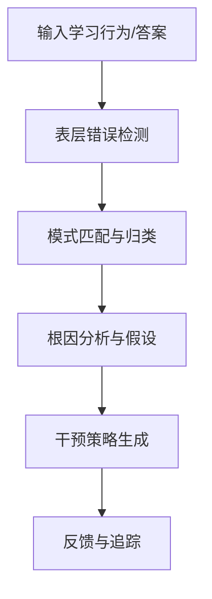

图表来源
- [src/loopse/agent/cognitive_engine.py](file://src/loopse/agent/cognitive_engine.py)
- [config/prompts/diagnosis/surface_error.txt](file://config/prompts/diagnosis/surface_error.txt)
- [config/prompts/diagnosis/pattern_match.txt](file://config/prompts/diagnosis/pattern_match.txt)
- [config/prompts/diagnosis/root_cause.txt](file://config/prompts/diagnosis/root_cause.txt)

章节来源
- [src/loopse/agent/cognitive_engine.py](file://src/loopse/agent/cognitive_engine.py)
- [config/prompts/diagnosis/surface_error.txt](file://config/prompts/diagnosis/surface_error.txt)
- [config/prompts/diagnosis/pattern_match.txt](file://config/prompts/diagnosis/pattern_match.txt)
- [config/prompts/diagnosis/root_cause.txt](file://config/prompts/diagnosis/root_cause.txt)

### 4. 智能资源生成
- 功能价值：按需生成代码片段、文档、练习题、信息图与脚本，覆盖多种学习材料形态。
- 技术亮点：
  - 资源生成器内置多类提示词模板，保证风格一致与质量可控。
  - 与检索器联动，确保内容与课程/知识点对齐。
- 用户收益：快速获取高质量、贴合当前学习阶段的素材，降低备课与自学成本。
- 典型场景：针对某知识点一键生成“概念图解+示例代码+配套练习”，并可导出用于课堂或复习。

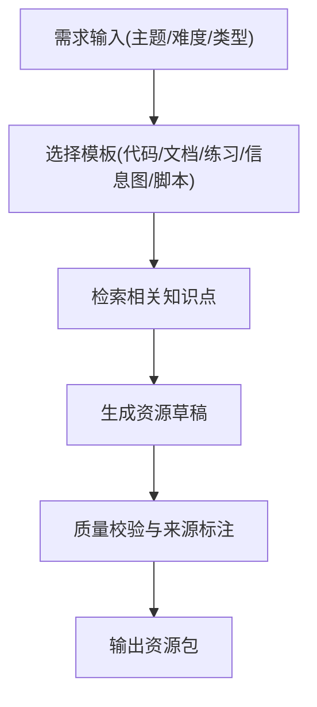

图表来源
- [src/loopse/agent/resource_generator.py](file://src/loopse/agent/resource_generator.py)
- [src/loopse/agent/retriever.py](file://src/loopse/agent/retriever.py)
- [config/prompts/resource_generator/generate_code.txt](file://config/prompts/resource_generator/generate_code.txt)
- [config/prompts/resource_generator/generate_doc.txt](file://config/prompts/resource_generator/generate_doc.txt)
- [config/prompts/resource_generator/generate_exercise.txt](file://config/prompts/resource_generator/generate_exercise.txt)
- [config/prompts/resource_generator/generate_infographic.txt](file://config/prompts/resource_generator/generate_infographic.txt)
- [config/prompts/resource_generator/generate_script.txt](file://config/prompts/resource_generator/generate_script.txt)

章节来源
- [src/loopse/agent/resource_generator.py](file://src/loopse/agent/resource_generator.py)
- [src/loopse/agent/retriever.py](file://src/loopse/agent/retriever.py)
- [config/prompts/resource_generator/generate_code.txt](file://config/prompts/resource_generator/generate_code.txt)
- [config/prompts/resource_generator/generate_doc.txt](file://config/prompts/resource_generator/generate_doc.txt)
- [config/prompts/resource_generator/generate_exercise.txt](file://config/prompts/resource_generator/generate_exercise.txt)
- [config/prompts/resource_generator/generate_infographic.txt](file://config/prompts/resource_generator/generate_infographic.txt)
- [config/prompts/resource_generator/generate_script.txt](file://config/prompts/resource_generator/generate_script.txt)

### 5. 3D可视化交互
- 功能价值：通过3D模型与知识图谱可视化，帮助学习者建立空间化认知，提升理解效率。
- 技术亮点：
  - 前端集成3D视图与知识图谱面板，支持缩放、旋转与节点关联跳转。
  - 与资源/路径模块打通，点击节点即可直达对应资源或路径步骤。
- 用户收益：抽象概念具象化，适合复杂系统、硬件结构与知识网络的理解。
- 典型场景：在设备/硬件3D视图中查看内部结构，同时右侧知识图谱高亮相关概念与前置知识。

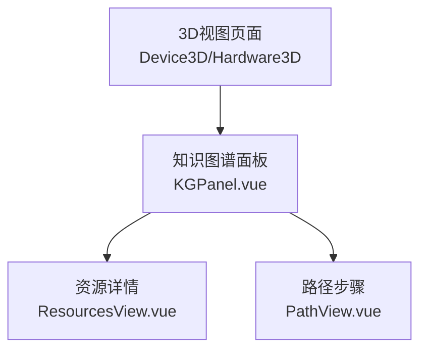

图表来源
- [frontend/src/components/KGPanel.vue](file://frontend/src/components/KGPanel.vue)
- [frontend/src/views/ResourcesView.vue](file://frontend/src/views/ResourcesView.vue)
- [frontend/src/views/PathView.vue](file://frontend/src/views/PathView.vue)

章节来源
- [frontend/src/components/KGPanel.vue](file://frontend/src/components/KGPanel.vue)
- [frontend/src/views/ResourcesView.vue](file://frontend/src/views/ResourcesView.vue)
- [frontend/src/views/PathView.vue](file://frontend/src/views/PathView.vue)

### 6. 实时对话辅导
- 功能价值：提供即时问答与引导式对话，帮助学生快速突破卡点。
- 技术亮点：
  - 聊天API对接编排器，结合检索与可信机制，保证回答有据可依。
  - 前端流式渲染，提升交互流畅度。
- 用户收益：随时提问、即时反馈，获得贴近人类教师的辅导体验。
- 典型场景：遇到难题时，向虚拟教师提问，系统逐步提示而非直接给答案，培养独立思考。

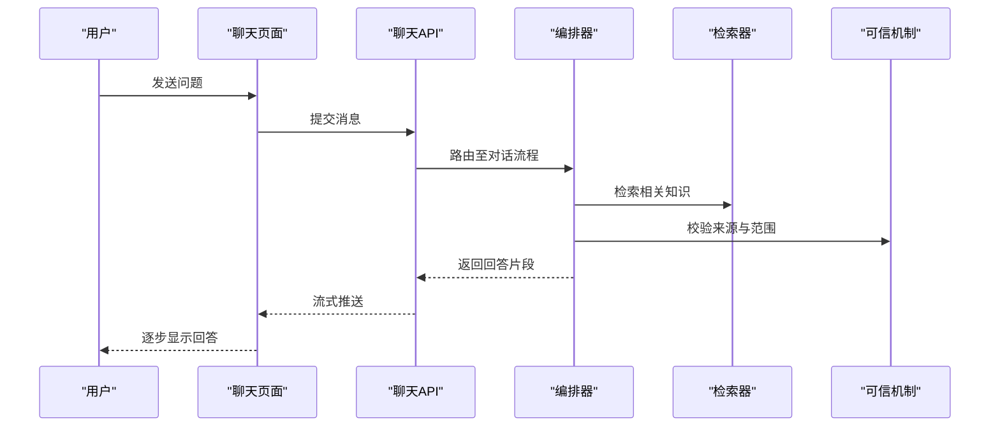

图表来源
- [src/loopse/api/chat.py](file://src/loopse/api/chat.py)
- [src/loopse/agent/orchestrator.py](file://src/loopse/agent/orchestrator.py)
- [src/loopse/agent/retriever.py](file://src/loopse/agent/retriever.py)
- [src/loopse/core/trust_mechanism.py](file://src/loopse/core/trust_mechanism.py)
- [frontend/src/views/ChatView.vue](file://frontend/src/views/ChatView.vue)
- [frontend/src/components/VirtualTeacherPanel.vue](file://frontend/src/components/VirtualTeacherPanel.vue)

章节来源
- [src/loopse/api/chat.py](file://src/loopse/api/chat.py)
- [src/loopse/agent/orchestrator.py](file://src/loopse/agent/orchestrator.py)
- [src/loopse/agent/retriever.py](file://src/loopse/agent/retriever.py)
- [src/loopse/core/trust_mechanism.py](file://src/loopse/core/trust_mechanism.py)
- [frontend/src/views/ChatView.vue](file://frontend/src/views/ChatView.vue)
- [frontend/src/components/VirtualTeacherPanel.vue](file://frontend/src/components/VirtualTeacherPanel.vue)

### 7. 挑战者模式
- 功能价值：通过追问、反例与压力测试，促使学习者反思与迁移，提升高阶思维能力。
- 技术亮点：
  - 挑战者智能体与编排器协作，结合诊断结果生成有针对性的挑战任务。
  - 前端挑战者面板支持交互式答题与即时反馈。
- 用户收益：在“被挑战”的过程中深化理解，形成更强的问题解决能力。
- 典型场景：完成基础练习后，系统抛出变式题与边界案例，引导学生总结规律。

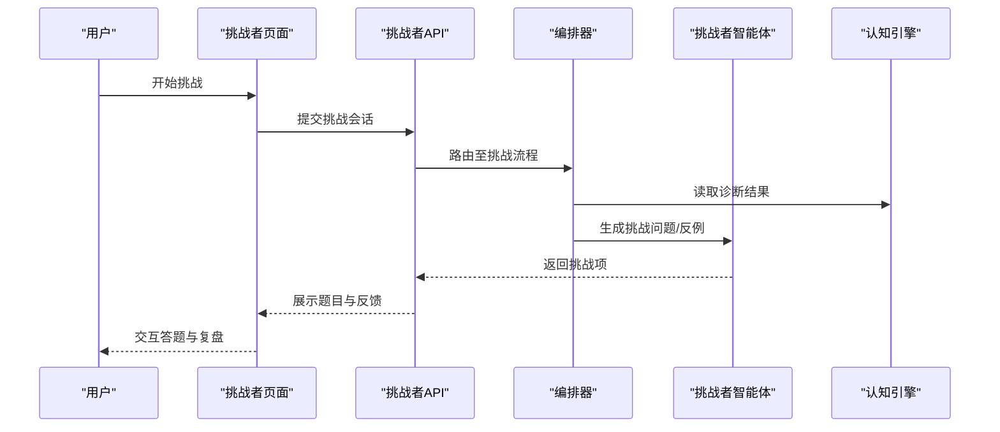

图表来源
- [src/loopse/api/challenger.py](file://src/loopse/api/challenger.py)
- [src/loopse/agent/orchestrator.py](file://src/loopse/agent/orchestrator.py)
- [src/loopse/agent/challenger.py](file://src/loopse/agent/challenger.py)
- [src/loopse/agent/cognitive_engine.py](file://src/loopse/agent/cognitive_engine.py)
- [frontend/src/views/ChallengerView.vue](file://frontend/src/views/ChallengerView.vue)

章节来源
- [src/loopse/api/challenger.py](file://src/loopse/api/challenger.py)
- [src/loopse/agent/orchestrator.py](file://src/loopse/agent/orchestrator.py)
- [src/loopse/agent/challenger.py](file://src/loopse/agent/challenger.py)
- [src/loopse/agent/cognitive_engine.py](file://src/loopse/agent/cognitive_engine.py)
- [frontend/src/views/ChallengerView.vue](file://frontend/src/views/ChallengerView.vue)

### 8. 虚拟实验环境
- 功能价值：提供在线仿真与参数调节的实验环境，让抽象理论在“做中学”中落地。
- 技术亮点：
  - 模拟器API对接场景智能体，动态生成实验任务与评估指标。
  - 前端模拟器视图支持参数面板与播放控制，直观观察结果变化。
- 用户收益：低成本试错，快速验证假设，强化实践动手能力。
- 典型场景：调整算法参数或电路元件值，观察系统行为变化，并获取分析报告。

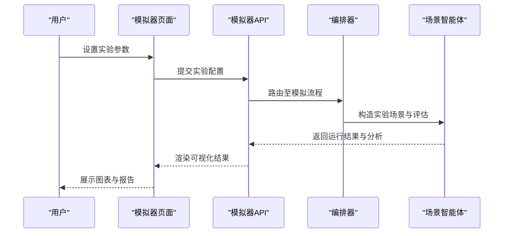

图表来源
- [src/loopse/api/simulator.py](file://src/loopse/api/simulator.py)
- [src/loopse/agent/orchestrator.py](file://src/loopse/agent/orchestrator.py)
- [src/loopse/agent/scenario_agent.py](file://src/loopse/agent/scenario_agent.py)
- [frontend/src/views/SimulatorView.vue](file://frontend/src/views/SimulatorView.vue)

章节来源
- [src/loopse/api/simulator.py](file://src/loopse/api/simulator.py)
- [src/loopse/agent/orchestrator.py](file://src/loopse/agent/orchestrator.py)
- [src/loopse/agent/scenario_agent.py](file://src/loopse/agent/scenario_agent.py)
- [frontend/src/views/SimulatorView.vue](file://frontend/src/views/SimulatorView.vue)

## 依赖关系分析
- 编排器作为中枢，依赖协调器、画像、检索、诊断、路径、资源、挑战、场景与可信机制等子模块。
- 前端页面通过API与后端交互，关键页面与API一一对应，职责清晰。
- 提示词配置与智能体强耦合，便于策略迭代与版本化管理。

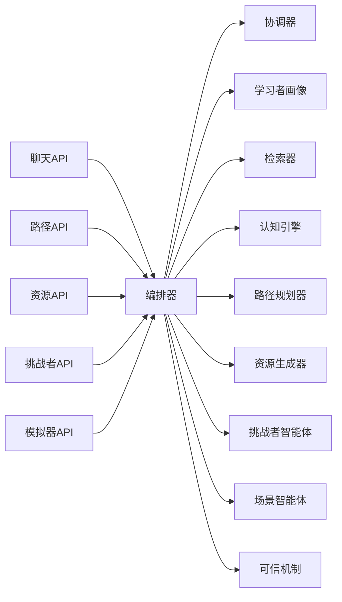

图表来源
- [src/loopse/api/chat.py](file://src/loopse/api/chat.py)
- [src/loopse/api/path.py](file://src/loopse/api/path.py)
- [src/loopse/api/resources.py](file://src/loopse/api/resources.py)
- [src/loopse/api/challenger.py](file://src/loopse/api/challenger.py)
- [src/loopse/api/simulator.py](file://src/loopse/api/simulator.py)
- [src/loopse/agent/orchestrator.py](file://src/loopse/agent/orchestrator.py)
- [src/loopse/agent/coordinator.py](file://src/loopse/agent/coordinator.py)
- [src/loopse/agent/profiler.py](file://src/loopse/agent/profiler.py)
- [src/loopse/agent/retriever.py](file://src/loopse/agent/retriever.py)
- [src/loopse/agent/cognitive_engine.py](file://src/loopse/agent/cognitive_engine.py)
- [src/loopse/agent/path_planner.py](file://src/loopse/agent/path_planner.py)
- [src/loopse/agent/resource_generator.py](file://src/loopse/agent/resource_generator.py)
- [src/loopse/agent/challenger.py](file://src/loopse/agent/challenger.py)
- [src/loopse/agent/scenario_agent.py](file://src/loopse/agent/scenario_agent.py)
- [src/loopse/core/trust_mechanism.py](file://src/loopse/core/trust_mechanism.py)

章节来源
- [src/loopse/agent/orchestrator.py](file://src/loopse/agent/orchestrator.py)
- [src/loopse/agent/coordinator.py](file://src/loopse/agent/coordinator.py)
- [src/loopse/agent/profiler.py](file://src/loopse/agent/profiler.py)
- [src/loopse/agent/retriever.py](file://src/loopse/agent/retriever.py)
- [src/loopse/agent/path_planner.py](file://src/loopse/agent/path_planner.py)
- [src/loopse/agent/cognitive_engine.py](file://src/loopse/agent/cognitive_engine.py)
- [src/loopse/agent/resource_generator.py](file://src/loopse/agent/resource_generator.py)
- [src/loopse/agent/challenger.py](file://src/loopse/agent/challenger.py)
- [src/loopse/agent/scenario_agent.py](file://src/loopse/agent/scenario_agent.py)
- [src/loopse/core/trust_mechanism.py](file://src/loopse/core/trust_mechanism.py)

## 性能与可扩展性
- 模块化设计：智能体职责单一，便于独立优化与替换。
- 提示词驱动：通过配置化提示词快速迭代策略，无需改动核心逻辑。
- 前后端解耦：API契约清晰，前端可并行加载不同功能模块。
- 可扩展方向：新增智能体只需注册到编排器与API层，即可无缝接入。

[本节为通用指导，不直接分析具体文件]

## 故障排查指南
- 对话延迟或断流：检查聊天API与编排器链路，确认检索与可信机制是否超时。
- 路径不更新：核对路径规划器与诊断结果一致性，确认画像数据是否正确写入。
- 资源生成异常：检查对应提示词模板是否存在缺失字段，确认资源生成器与检索器连通性。
- 挑战者无反馈：验证挑战者智能体与编排器通信，检查前端挑战者面板事件绑定。
- 模拟器无结果：确认模拟器API与场景智能体连接，检查参数面板输入合法性。

章节来源
- [src/loopse/api/chat.py](file://src/loopse/api/chat.py)
- [src/loopse/api/path.py](file://src/loopse/api/path.py)
- [src/loopse/api/resources.py](file://src/loopse/api/resources.py)
- [src/loopse/api/challenger.py](file://src/loopse/api/challenger.py)
- [src/loopse/api/simulator.py](file://src/loopse/api/simulator.py)
- [src/loopse/agent/orchestrator.py](file://src/loopse/agent/orchestrator.py)
- [src/loopse/agent/resource_generator.py](file://src/loopse/agent/resource_generator.py)
- [src/loopse/agent/challenger.py](file://src/loopse/agent/challenger.py)
- [src/loopse/agent/scenario_agent.py](file://src/loopse/agent/scenario_agent.py)
- [frontend/src/views/ChatView.vue](file://frontend/src/views/ChatView.vue)
- [frontend/src/views/PathView.vue](file://frontend/src/views/PathView.vue)
- [frontend/src/views/ResourcesView.vue](file://frontend/src/views/ResourcesView.vue)
- [frontend/src/views/ChallengerView.vue](file://frontend/src/views/ChallengerView.vue)
- [frontend/src/views/SimulatorView.vue](file://frontend/src/views/SimulatorView.vue)

## 结论
Socrates-Cube以多智能体协作为核心，围绕学习者画像与认知诊断，打通路径规划、资源生成、对话辅导、挑战者与虚拟实验等关键环节，形成完整的个性化学习闭环。其模块化架构与提示词驱动策略，既保证了系统的灵活性与可维护性，也为持续演进提供了良好基础。对不同层次用户而言，平台既能提供即时的学习支持，也能满足深度探索与实践的需求。