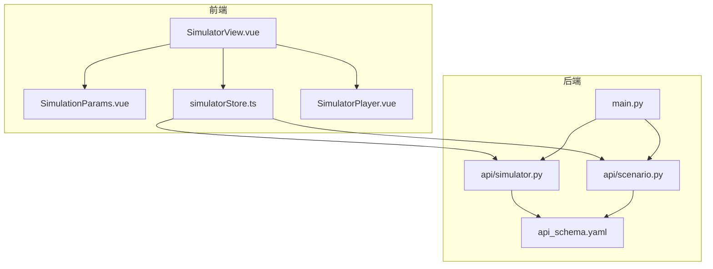
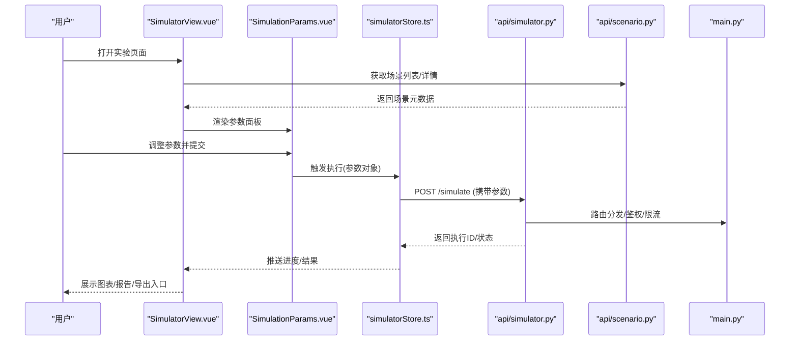
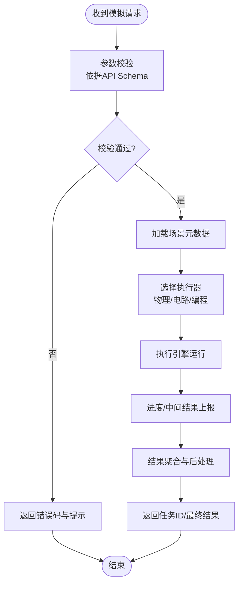
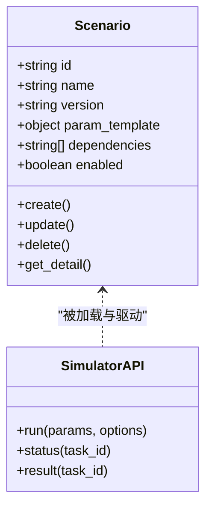
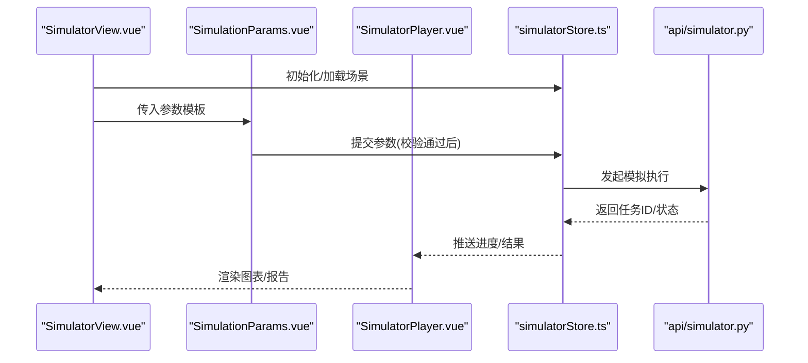
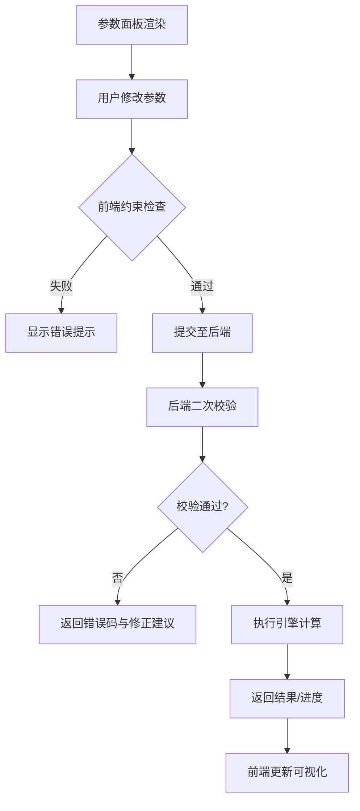
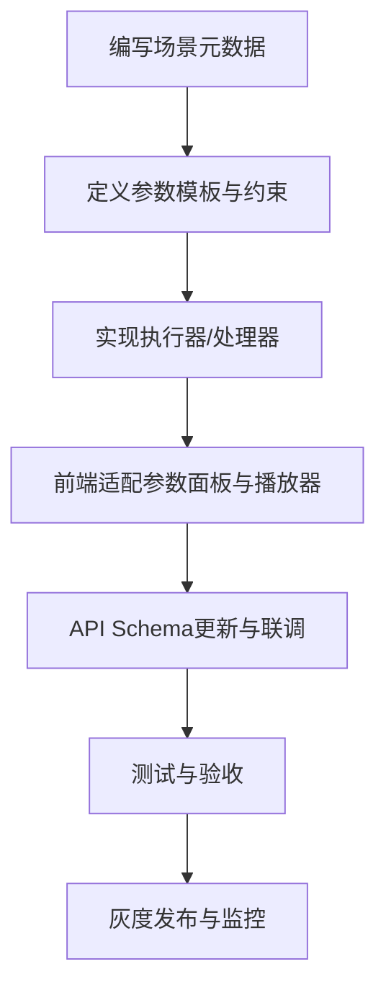
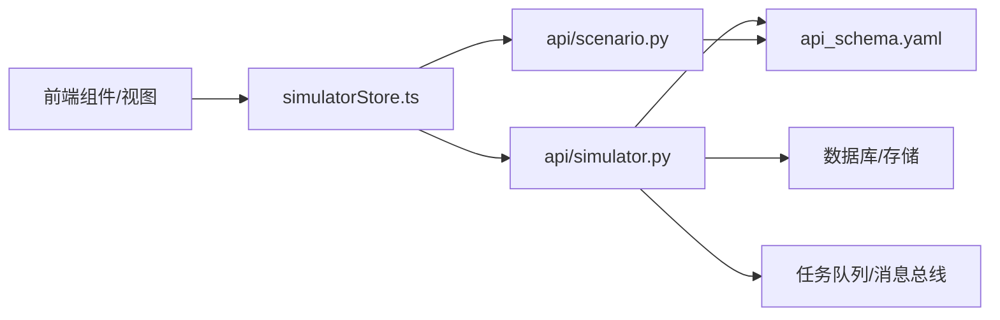

# 虚拟实验环境

<cite>
**本文引用的文件**   
- [src/loopse/api/simulator.py](file://src/loopse/api/simulator.py)
- [src/loopse/api/scenario.py](file://src/loopse/api/scenario.py)
- [frontend/src/components/SimulatorPlayer.vue](file://frontend/src/components/SimulatorPlayer.vue)
- [frontend/src/components/SimulationParams.vue](file://frontend/src/components/SimulationParams.vue)
- [frontend/src/stores/simulatorStore.ts](file://frontend/src/stores/simulatorStore.ts)
- [frontend/src/views/SimulatorView.vue](file://frontend/src/views/SimulatorView.vue)
- [config/api_schema.yaml](file://config/api_schema.yaml)
- [src/loopse/main.py](file://src/loopse/main.py)
</cite>

## 目录
1. [简介](#简介)
2. [项目结构](#项目结构)
3. [核心组件](#核心组件)
4. [架构总览](#架构总览)
5. [详细组件分析](#详细组件分析)
6. [依赖关系分析](#依赖关系分析)
7. [性能考虑](#性能考虑)
8. [故障排查指南](#故障排查指南)
9. [结论](#结论)
10. [附录](#附录)

## 简介
本技术文档面向Socrates-Cube的“虚拟实验环境”，聚焦模拟器系统的架构设计与实现，覆盖以下关键主题：
- 实验场景管理、参数配置与执行引擎
- 虚拟实验类型与实现方式（物理模拟、电路仿真、编程练习等）
- 实验参数的动态配置机制（变量调节、约束检查、实时计算）
- 结果可视化与分析（图表展示、数据导出、报告生成）
- 新实验场景的添加方法（场景定义、交互逻辑、验证规则）
- 性能优化策略（计算缓存、异步处理、内存管理）
- 教育价值与实践意义（技能训练与问题解决）

## 项目结构
围绕虚拟实验环境，前后端协作的关键位置如下：
- 后端API层：提供模拟器与场景相关的接口，承载参数校验、执行调度与结果返回。
- 前端视图与组件：负责用户交互、参数面板、播放器与控制流。
- API契约：统一前后端数据结构与字段约定，保障扩展性与一致性。
- 应用入口：注册路由与中间件，启动服务。

**图示来源** 
- [src/loopse/api/simulator.py](file://src/loopse/api/simulator.py)
- [src/loopse/api/scenario.py](file://src/loopse/api/scenario.py)
- [frontend/src/views/SimulatorView.vue](file://frontend/src/views/SimulatorView.vue)
- [frontend/src/components/SimulationParams.vue](file://frontend/src/components/SimulationParams.vue)
- [frontend/src/stores/simulatorStore.ts](file://frontend/src/stores/simulatorStore.ts)
- [frontend/src/components/SimulatorPlayer.vue](file://frontend/src/components/SimulatorPlayer.vue)
- [config/api_schema.yaml](file://config/api_schema.yaml)
- [src/loopse/main.py](file://src/loopse/main.py)

**章节来源**
- [src/loopse/api/simulator.py](file://src/loopse/api/simulator.py)
- [src/loopse/api/scenario.py](file://src/loopse/api/scenario.py)
- [frontend/src/views/SimulatorView.vue](file://frontend/src/views/SimulatorView.vue)
- [frontend/src/components/SimulationParams.vue](file://frontend/src/components/SimulationParams.vue)
- [frontend/src/stores/simulatorStore.ts](file://frontend/src/stores/simulatorStore.ts)
- [frontend/src/components/SimulatorPlayer.vue](file://frontend/src/components/SimulatorPlayer.vue)
- [config/api_schema.yaml](file://config/api_schema.yaml)
- [src/loopse/main.py](file://src/loopse/main.py)

## 核心组件
- 模拟器API（后端）
  - 职责：接收前端请求，解析并校验参数，调用执行引擎，返回运行状态与结果。
  - 关键点：参数校验、任务调度、结果序列化、错误码规范。
- 场景API（后端）
  - 职责：场景元数据管理（创建、查询、更新、删除），与模拟器API协同完成场景加载与初始化。
- 前端视图与组件
  - SimulatorView：页面编排、生命周期控制、与store通信。
  - SimulationParams：参数面板，支持变量调节、约束提示、提交触发。
  - SimulatorPlayer：播放/暂停/步进/重置等交互，渲染结果或进度。
  - simulatorStore：集中式状态管理，封装API调用与本地缓存。
- API契约
  - 统一字段命名、枚举值、分页与错误响应格式，降低前后端耦合度。

**章节来源**
- [src/loopse/api/simulator.py](file://src/loopse/api/simulator.py)
- [src/loopse/api/scenario.py](file://src/loopse/api/scenario.py)
- [frontend/src/views/SimulatorView.vue](file://frontend/src/views/SimulatorView.vue)
- [frontend/src/components/SimulationParams.vue](file://frontend/src/components/SimulationParams.vue)
- [frontend/src/stores/simulatorStore.ts](file://frontend/src/stores/simulatorStore.ts)
- [frontend/src/components/SimulatorPlayer.vue](file://frontend/src/components/SimulatorPlayer.vue)
- [config/api_schema.yaml](file://config/api_schema.yaml)

## 架构总览
系统采用前后端分离架构，前端通过HTTP/WebSocket与后端交互；后端以模块化API组织，按职责划分模拟器与场景能力，并通过统一的API Schema进行契约约束。

**图示来源**
- [frontend/src/views/SimulatorView.vue](file://frontend/src/views/SimulatorView.vue)
- [frontend/src/components/SimulationParams.vue](file://frontend/src/components/SimulationParams.vue)
- [frontend/src/stores/simulatorStore.ts](file://frontend/src/stores/simulatorStore.ts)
- [src/loopse/api/simulator.py](file://src/loopse/api/simulator.py)
- [src/loopse/api/scenario.py](file://src/loopse/api/scenario.py)
- [src/loopse/main.py](file://src/loopse/main.py)

## 详细组件分析

### 模拟器API（后端）
- 设计要点
  - 输入：场景标识、参数对象、执行选项（如是否异步、是否缓存）。
  - 输出：任务ID、状态机流转、阶段性结果、最终结果与指标。
  - 校验：基于API Schema对必填字段、取值范围、类型进行校验。
  - 调度：根据场景类型选择执行器（物理/电路/编程），必要时分片并行。
- 关键流程
  - 参数校验 → 场景加载 → 执行器选择 → 任务入队 → 进度上报 → 结果聚合 → 返回。

**图示来源**
- [src/loopse/api/simulator.py](file://src/loopse/api/simulator.py)
- [config/api_schema.yaml](file://config/api_schema.yaml)

**章节来源**
- [src/loopse/api/simulator.py](file://src/loopse/api/simulator.py)
- [config/api_schema.yaml](file://config/api_schema.yaml)

### 场景API（后端）
- 设计要点
  - 场景元数据：名称、描述、版本、参数模板、依赖资源、权限范围。
  - 生命周期：创建→启用→禁用→归档；支持热更新与灰度发布。
  - 与模拟器联动：场景变更时同步更新参数模板与校验规则。
- 典型操作
  - 列出/检索场景、获取详情、更新元数据、关联资源、版本回滚。

**图示来源**
- [src/loopse/api/scenario.py](file://src/loopse/api/scenario.py)
- [src/loopse/api/simulator.py](file://src/loopse/api/simulator.py)

**章节来源**
- [src/loopse/api/scenario.py](file://src/loopse/api/scenario.py)

### 前端视图与组件
- SimulatorView
  - 负责页面布局、生命周期钩子、与store和子组件通信。
  - 在挂载时拉取场景信息，在卸载时清理任务与监听。
- SimulationParams
  - 渲染参数表单，绑定变量与约束，提供即时反馈与提交入口。
- SimulatorPlayer
  - 控制播放/暂停/步进/重置，订阅进度事件，渲染可视化结果。
- simulatorStore
  - 集中管理执行状态、任务队列、结果缓存与重试策略。

**图示来源**
- [frontend/src/views/SimulatorView.vue](file://frontend/src/views/SimulatorView.vue)
- [frontend/src/components/SimulationParams.vue](file://frontend/src/components/SimulationParams.vue)
- [frontend/src/components/SimulatorPlayer.vue](file://frontend/src/components/SimulatorPlayer.vue)
- [frontend/src/stores/simulatorStore.ts](file://frontend/src/stores/simulatorStore.ts)
- [src/loopse/api/simulator.py](file://src/loopse/api/simulator.py)

**章节来源**
- [frontend/src/views/SimulatorView.vue](file://frontend/src/views/SimulatorView.vue)
- [frontend/src/components/SimulationParams.vue](file://frontend/src/components/SimulationParams.vue)
- [frontend/src/components/SimulatorPlayer.vue](file://frontend/src/components/SimulatorPlayer.vue)
- [frontend/src/stores/simulatorStore.ts](file://frontend/src/stores/simulatorStore.ts)

### 虚拟实验类型与实现方式
- 物理模拟
  - 示例：力学、电磁学、热学等。
  - 实现：基于参数驱动的数值求解器，支持时间步进与状态快照。
- 电路仿真
  - 示例：直流/交流电路、数字逻辑、信号链路。
  - 实现：拓扑解析、节点电压法/网孔电流法、频域分析。
- 编程练习
  - 示例：算法题、嵌入式脚本、数据处理流水线。
  - 实现：沙箱执行、单元测试集成、覆盖率与复杂度统计。

[本节为概念性说明，不直接分析具体文件]

### 实验参数的动态配置机制
- 变量调节
  - 前端参数面板绑定到场景参数模板，支持滑块、输入框、下拉等控件。
- 约束检查
  - 前端即时校验（范围、互斥、依赖），后端二次校验（类型、边界、业务规则）。
- 实时计算
  - 对轻量计算采用前端预览；复杂计算走后端异步执行，返回增量结果。

**图示来源**
- [frontend/src/components/SimulationParams.vue](file://frontend/src/components/SimulationParams.vue)
- [src/loopse/api/simulator.py](file://src/loopse/api/simulator.py)
- [config/api_schema.yaml](file://config/api_schema.yaml)

**章节来源**
- [frontend/src/components/SimulationParams.vue](file://frontend/src/components/SimulationParams.vue)
- [src/loopse/api/simulator.py](file://src/loopse/api/simulator.py)
- [config/api_schema.yaml](file://config/api_schema.yaml)

### 结果可视化与分析
- 图表展示
  - 折线/柱状/散点/热力图等，支持缩放、筛选、对比。
- 数据导出
  - CSV/JSON/Excel导出，支持分页与过滤条件。
- 报告生成
  - 自动汇总关键指标、异常检测、学习建议与下一步推荐。

[本节为通用功能说明，不直接分析具体文件]

### 新增实验场景的方法
- 场景定义
  - 在场景API中注册元数据与参数模板，声明依赖资源与权限。
- 交互逻辑
  - 在前端新增/复用参数面板与播放器组件，适配新的参数集。
- 验证规则
  - 在API Schema中补充字段约束，在后端增加业务校验与测试用例。
- 上线流程
  - 灰度发布、A/B测试、监控告警与回滚预案。

**图示来源**
- [src/loopse/api/scenario.py](file://src/loopse/api/scenario.py)
- [src/loopse/api/simulator.py](file://src/loopse/api/simulator.py)
- [config/api_schema.yaml](file://config/api_schema.yaml)
- [frontend/src/components/SimulationParams.vue](file://frontend/src/components/SimulationParams.vue)
- [frontend/src/components/SimulatorPlayer.vue](file://frontend/src/components/SimulatorPlayer.vue)

**章节来源**
- [src/loopse/api/scenario.py](file://src/loopse/api/scenario.py)
- [src/loopse/api/simulator.py](file://src/loopse/api/simulator.py)
- [config/api_schema.yaml](file://config/api_schema.yaml)
- [frontend/src/components/SimulationParams.vue](file://frontend/src/components/SimulationParams.vue)
- [frontend/src/components/SimulatorPlayer.vue](file://frontend/src/components/SimulatorPlayer.vue)

## 依赖关系分析
- 模块内聚与耦合
  - 模拟器API与场景API解耦，通过统一Schema与任务ID进行弱耦合协作。
  - 前端组件与store职责清晰，视图仅关注展示与交互，store负责状态与网络。
- 外部依赖
  - 数据库/存储用于持久化场景与结果；消息队列/任务队列用于异步执行。
  - 第三方库用于数值计算、绘图与导出。

**图示来源**
- [frontend/src/stores/simulatorStore.ts](file://frontend/src/stores/simulatorStore.ts)
- [src/loopse/api/simulator.py](file://src/loopse/api/simulator.py)
- [src/loopse/api/scenario.py](file://src/loopse/api/scenario.py)
- [config/api_schema.yaml](file://config/api_schema.yaml)

**章节来源**
- [frontend/src/stores/simulatorStore.ts](file://frontend/src/stores/simulatorStore.ts)
- [src/loopse/api/simulator.py](file://src/loopse/api/simulator.py)
- [src/loopse/api/scenario.py](file://src/loopse/api/scenario.py)
- [config/api_schema.yaml](file://config/api_schema.yaml)

## 性能考虑
- 计算缓存
  - 对相同参数组合的结果进行缓存，设置TTL与失效策略，减少重复计算。
- 异步处理
  - 长耗时任务采用异步执行与进度上报，避免阻塞主线程。
- 内存管理
  - 大对象及时释放，使用流式读取/写入，限制单次结果大小。
- 并发与限流
  - 基于场景与用户的并发配额，防止热点场景过载。
- 前端优化
  - 按需加载组件、虚拟化列表、增量更新图表数据。

[本节为通用指导，不直接分析具体文件]

## 故障排查指南
- 常见问题定位
  - 参数校验失败：检查前端约束与后端Schema一致性。
  - 执行超时：查看任务队列堆积情况与执行器日志。
  - 结果不一致：核对缓存键与参数哈希，确认幂等性。
- 诊断手段
  - 开启调试日志、追踪任务ID、回放参数快照。
  - 使用健康检查接口确认服务可用性。
- 恢复策略
  - 快速回滚场景版本、降级执行器、清空异常缓存。

**章节来源**
- [src/loopse/api/simulator.py](file://src/loopse/api/simulator.py)
- [src/loopse/api/scenario.py](file://src/loopse/api/scenario.py)
- [config/api_schema.yaml](file://config/api_schema.yaml)

## 结论
Socrates-Cube的虚拟实验环境通过清晰的API分层、统一的契约约束与前后端协作，实现了可扩展的实验场景管理与灵活的参数配置机制。结合异步执行、缓存与可视化分析，既满足教学实践中的多样化需求，也为后续引入更多实验类型与智能辅助提供了良好基础。

## 附录
- 术语表
  - 场景：一组可执行的实验定义，包含元数据、参数模板与依赖。
  - 执行器：针对特定实验类型的计算/仿真模块。
  - 任务：一次模拟执行的实例，具有唯一ID与状态机。
- 最佳实践
  - 优先在前端做轻量校验与预览，复杂计算交由后端异步处理。
  - 所有对外字段遵循API Schema，保持向后兼容。
  - 对热点场景实施缓存与限流，确保稳定性与公平性。