# 项目介绍与目标

<cite>
**本文引用的文件**   
- [src/agents/student/__init__.py](file://src/agents/student/__init__.py)
- [src/loopse/agent/orchestrator.py](file://src/loopse/agent/orchestrator.py)
- [src/loopse/agent/coordinator.py](file://src/loopse/agent/coordinator.py)
- [src/loopse/agent/cognitive_engine.py](file://src/loopse/agent/cognitive_engine.py)
- [src/loopse/agent/profiler.py](file://src/loopse/agent/profiler.py)
- [src/loopse/agent/path_planner.py](file://src/loopse/agent/path_planner.py)
- [src/loopse/agent/challenger.py](file://src/loopse/agent/challenger.py)
- [src/loopse/agent/resource_generator.py](file://src/loopse/agent/resource_generator.py)
- [src/loopse/agent/retriever.py](file://src/loopse/agent/retriever.py)
- [src/loopse/agent/memory_manager.py](file://src/loopse/agent/memory_manager.py)
- [src/loopse/agent/intervention_selector.py](file://src/loopse/agent/intervention_selector.py)
- [src/loopse/agent/scenario_agent.py](file://src/loopse/agent/scenario_agent.py)
- [config/prompts/orchestrator/route.txt](file://config/prompts/orchestrator/route.txt)
- [config/prompts/profiler/onboarding.txt](file://config/prompts/profiler/onboarding.txt)
- [config/prompts/profiler/update_profile.txt](file://config/prompts/profiler/update_profile.txt)
- [config/prompts/diagnosis/pattern_match.txt](file://config/prompts/diagnosis/pattern_match.txt)
- [config/prompts/diagnosis/root_cause.txt](file://config/prompts/diagnosis/root_cause.txt)
- [config/prompts/diagnosis/surface_error.txt](file://config/prompts/diagnosis/surface_error.txt)
- [config/prompts/path_planner/plan_path.txt](file://config/prompts/path_planner/plan_path.txt)
- [config/prompts/resource_generator/generate_exercise.txt](file://config/prompts/resource_generator/generate_exercise.txt)
- [config/prompts/resource_generator/generate_code.txt](file://config/prompts/resource_generator/generate_code.txt)
- [config/prompts/resource_generator/generate_doc.txt](file://config/prompts/resource_generator/generate_doc.txt)
- [config/prompts/resource_generator/generate_infographic.txt](file://config/prompts/resource_generator/generate_infographic.txt)
- [config/prompts/resource_generator/generate_script.txt](file://config/prompts/resource_generator/generate_script.txt)
- [config/prompts/retriever/search_query.txt](file://config/prompts/retriever/search_query.txt)
- [config/prompts/retriever/query_expansion.txt](file://config/prompts/retriever/query_expansion.txt)
- [config/prompts/trust/source_citation.txt](file://config/prompts/trust/source_citation.txt)
- [config/prompts/trust/scope_check.txt](file://config/prompts/trust/scope_check.txt)
- [config/agent_personas.json](file://config/agent_personas.json)
- [config/api_schema.yaml](file://config/api_schema.yaml)
- [src/loopse/core/llm_client.py](file://src/loopse/core/llm_client.py)
- [src/loopse/kb/knowledge_graph.py](file://src/loopse/kb/knowledge_graph.py)
- [src/loopse/kb/vector_store.py](file://src/loopse/kb/vector_store.py)
- [src/loopse/db/models.py](file://src/loopse/db/models.py)
- [src/loopse/db/repositories.py](file://src/loopse/db/repositories.py)
- [src/loopse/schema/profile.py](file://src/loopse/schema/profile.py)
- [src/loopse/schema/intervention.py](file://src/loopse/schema/intervention.py)
- [src/loopse/rl/contextual_bandit.py](file://src/loopse/rl/contextual_bandit.py)
- [src/loopse/rl/hmarl.py](file://src/loopse/rl/hmarl.py)
- [frontend/src/stores/chatStore.ts](file://frontend/src/stores/chatStore.ts)
- [frontend/src/stores/pathStore.ts](file://frontend/src/stores/pathStore.ts)
- [frontend/src/stores/resourceStore.ts](file://frontend/src/stores/resourceStore.ts)
- [frontend/src/views/ChatView.vue](file://frontend/src/views/ChatView.vue)
- [frontend/src/views/DiagnosisView.vue](file://frontend/src/views/DiagnosisView.vue)
- [frontend/src/views/PathView.vue](file://frontend/src/views/PathView.vue)
- [frontend/src/views/ResourcesView.vue](file://frontend/src/views/ResourcesView.vue)
- [scripts/init_db.py](file://scripts/init_db.py)
- [scripts/build_knowledge_base.py](file://scripts/build_knowledge_base.py)
</cite>

## 目录
1. [引言](#引言)
2. [项目结构](#项目结构)
3. [核心组件](#核心组件)
4. [架构总览](#架构总览)
5. [详细组件分析](#详细组件分析)
6. [依赖关系分析](#依赖关系分析)
7. [性能考量](#性能考量)
8. [故障排查指南](#故障排查指南)
9. [结论](#结论)
10. [附录](#附录)

## 引言
Socrates-Cube是一个以“苏格拉底式教学法”为核心的AI驱动多智能体教育平台。其愿景是通过“提问—反思—修正—再探索”的对话循环，帮助学习者从被动接收转向主动建构知识，实现个性化学习路径、认知诊断与自适应干预的闭环。平台面向初学者与进阶学习者，提供可解释的学习过程、可信的资源生成与引用溯源，以及可视化的学习轨迹与能力画像。

本项目解决的实际问题包括：
- 传统教学难以兼顾个体差异与即时反馈；
- 资源生成质量不稳定、缺乏来源可追溯；
- 学习诊断停留在表层错误识别，缺少根因分析与干预策略；
- 学习路径规划缺乏动态调整与证据支撑。

技术目标：
- 构建可扩展的多智能体系统，支持编排、协作与状态共享；
- 将LLM能力与知识库（向量检索+知识图谱）结合，提升准确性与可解释性；
- 引入强化学习与上下文博弈，优化干预策略与资源推荐；
- 提供前后端一体化体验，支持实时交互与可视化。

业务目标：
- 提升学习效率与深度理解，降低认知负荷；
- 为教师与管理者提供学情洞察与教学辅助；
- 形成可复用的教学资源与评估资产。

创新点与独特价值：
- 基于苏格拉底式对话的认知回路设计；
- 多智能体协同的“诊断—规划—生成—评估”流水线；
- 资源生成的可信溯源与范围控制；
- 面向教学场景的RL干预策略与个性化路径。

预期影响：
- 在K12与高等教育中落地，推动“以问促学”的教学范式；
- 沉淀高质量教育资源与学习数据资产；
- 为教育AI的可信、可解释与可评估提供工程化实践。

## 项目结构
仓库采用前后端分离与模块化组织方式：
- agents：学生代理与外部代理接口定义；
- src/loopse：后端核心，包含智能体、API、数据库、知识库、强化学习等模块；
- config：提示词模板、智能体人设与API契约；
- frontend：Vue3前端应用，提供聊天、诊断、路径、资源等页面；
- scripts：初始化、数据入库、评测脚本；
- docs：架构、需求、部署与测试文档。

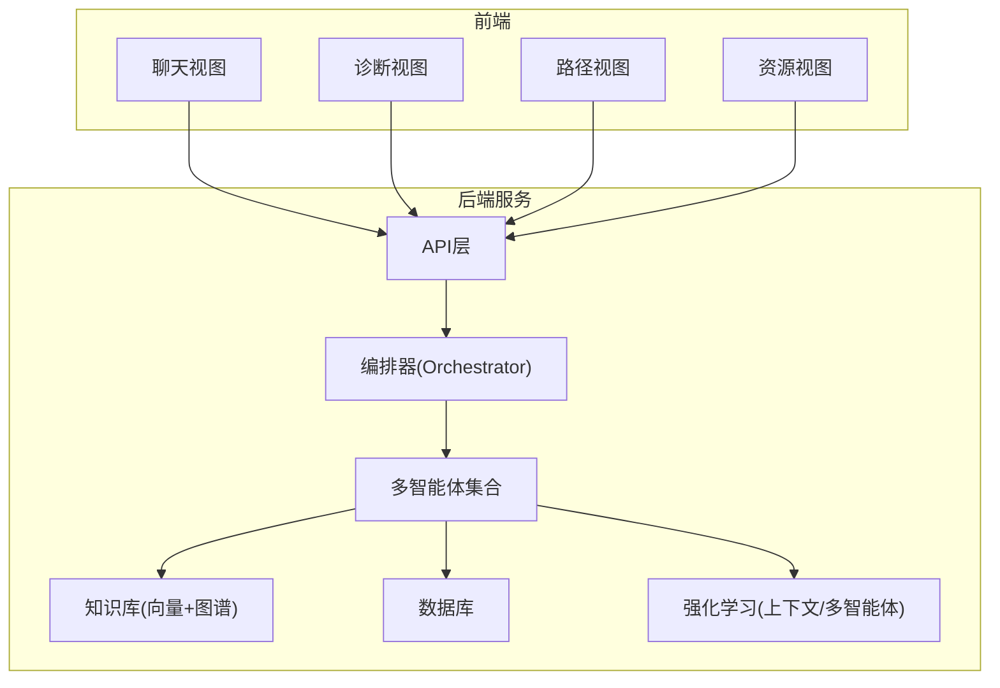

图表来源
- [src/loopse/agent/orchestrator.py](file://src/loopse/agent/orchestrator.py)
- [src/loopse/api/chat.py](file://src/loopse/api/chat.py)
- [src/loopse/kb/knowledge_graph.py](file://src/loopse/kb/knowledge_graph.py)
- [src/loopse/db/models.py](file://src/loopse/db/models.py)
- [frontend/src/views/ChatView.vue](file://frontend/src/views/ChatView.vue)

章节来源
- [src/loopse/agent/orchestrator.py](file://src/loopse/agent/orchestrator.py)
- [config/api_schema.yaml](file://config/api_schema.yaml)
- [frontend/src/views/ChatView.vue](file://frontend/src/views/ChatView.vue)

## 核心组件
- 编排器（Orchestrator）：统一入口，负责会话路由、任务分解与结果聚合。
- 协调器（Coordinator）：管理智能体生命周期、通信协议与状态同步。
- 认知引擎（Cognitive Engine）：维护学习者的认知状态、推理链与反思记录。
- 学习者画像（Profiler）：完成入项评估与持续更新，输出能力维度与薄弱点。
- 路径规划（Path Planner）：依据画像与目标生成个性化学习路径与里程碑。
- 挑战者（Challenger）：通过追问、反例与对比，推动深度思考。
- 资源生成（Resource Generator）：按类型生成练习、代码、文档、信息图、脚本等。
- 检索器（Retriever）：查询扩展与语义检索，连接知识库与用户意图。
- 记忆管理（Memory Manager）：会话记忆、长期记忆与上下文窗口管理。
- 干预选择（Intervention Selector）：基于证据与策略库选择最佳干预手段。
- 情景代理（Scenario Agent）：构造真实情境与角色扮演任务。

章节来源
- [src/loopse/agent/orchestrator.py](file://src/loopse/agent/orchestrator.py)
- [src/loopse/agent/coordinator.py](file://src/loopse/agent/coordinator.py)
- [src/loopse/agent/cognitive_engine.py](file://src/loopse/agent/cognitive_engine.py)
- [src/loopse/agent/profiler.py](file://src/loopse/agent/profiler.py)
- [src/loopse/agent/path_planner.py](file://src/loopse/agent/path_planner.py)
- [src/loopse/agent/challenger.py](file://src/loopse/agent/challenger.py)
- [src/loopse/agent/resource_generator.py](file://src/loopse/agent/resource_generator.py)
- [src/loopse/agent/retriever.py](file://src/loopse/agent/retriever.py)
- [src/loopse/agent/memory_manager.py](file://src/loopse/agent/memory_manager.py)
- [src/loopse/agent/intervention_selector.py](file://src/loopse/agent/intervention_selector.py)
- [src/loopse/agent/scenario_agent.py](file://src/loopse/agent/scenario_agent.py)

## 架构总览
系统采用“前端—API—编排器—多智能体—知识库/数据库/RL”的分层架构。编排器根据用户输入与当前状态，调用不同智能体完成诊断、规划、生成与评估，并通过记忆管理与认知引擎保持跨会话一致性。

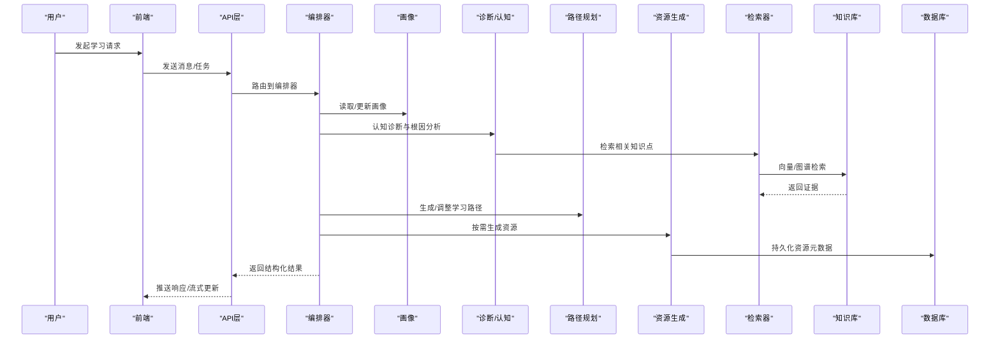

图表来源
- [src/loopse/agent/orchestrator.py](file://src/loopse/agent/orchestrator.py)
- [src/loopse/agent/profiler.py](file://src/loopse/agent/profiler.py)
- [src/loopse/agent/path_planner.py](file://src/loopse/agent/path_planner.py)
- [src/loopse/agent/resource_generator.py](file://src/loopse/agent/resource_generator.py)
- [src/loopse/agent/retriever.py](file://src/loopse/agent/retriever.py)
- [src/loopse/kb/knowledge_graph.py](file://src/loopse/kb/knowledge_graph.py)
- [src/loopse/db/models.py](file://src/loopse/db/models.py)

## 详细组件分析

### 编排器与协调器
- 编排器负责会话级路由、任务拆分与结果合并，结合提示词进行决策。
- 协调器管理智能体实例、通信通道与状态一致性。

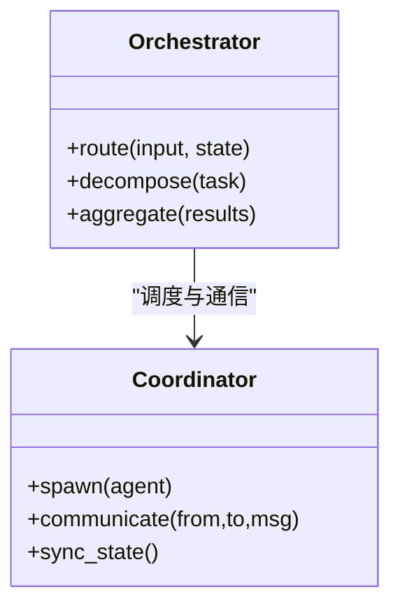

图表来源
- [src/loopse/agent/orchestrator.py](file://src/loopse/agent/orchestrator.py)
- [src/loopse/agent/coordinator.py](file://src/loopse/agent/coordinator.py)
- [config/prompts/orchestrator/route.txt](file://config/prompts/orchestrator/route.txt)

章节来源
- [src/loopse/agent/orchestrator.py](file://src/loopse/agent/orchestrator.py)
- [src/loopse/agent/coordinator.py](file://src/loopse/agent/coordinator.py)
- [config/prompts/orchestrator/route.txt](file://config/prompts/orchestrator/route.txt)

### 认知引擎与学习者画像
- 认知引擎维护推理链、反思与错误模式，驱动苏格拉底式对话。
- 画像模块完成入项评估与持续更新，输出多维能力指标。

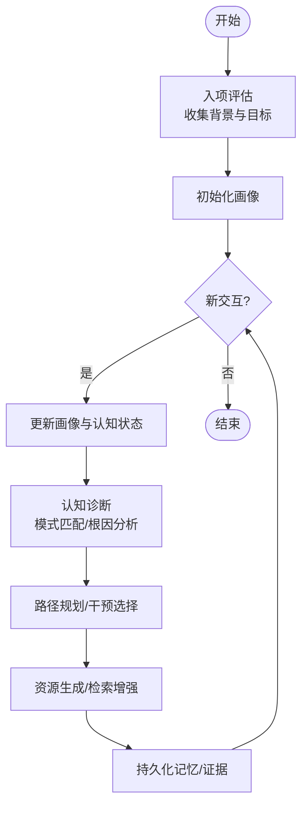

图表来源
- [src/loopse/agent/cognitive_engine.py](file://src/loopse/agent/cognitive_engine.py)
- [src/loopse/agent/profiler.py](file://src/loopse/agent/profiler.py)
- [config/prompts/profiler/onboarding.txt](file://config/prompts/profiler/onboarding.txt)
- [config/prompts/profiler/update_profile.txt](file://config/prompts/profiler/update_profile.txt)
- [config/prompts/diagnosis/pattern_match.txt](file://config/prompts/diagnosis/pattern_match.txt)
- [config/prompts/diagnosis/root_cause.txt](file://config/prompts/diagnosis/root_cause.txt)
- [config/prompts/diagnosis/surface_error.txt](file://config/prompts/diagnosis/surface_error.txt)

章节来源
- [src/loopse/agent/cognitive_engine.py](file://src/loopse/agent/cognitive_engine.py)
- [src/loopse/agent/profiler.py](file://src/loopse/agent/profiler.py)
- [config/prompts/profiler/onboarding.txt](file://config/prompts/profiler/onboarding.txt)
- [config/prompts/profiler/update_profile.txt](file://config/prompts/profiler/update_profile.txt)
- [config/prompts/diagnosis/pattern_match.txt](file://config/prompts/diagnosis/pattern_match.txt)
- [config/prompts/diagnosis/root_cause.txt](file://config/prompts/diagnosis/root_cause.txt)
- [config/prompts/diagnosis/surface_error.txt](file://config/prompts/diagnosis/surface_error.txt)

### 路径规划与干预选择
- 路径规划依据画像与目标生成阶段性计划，支持动态调整。
- 干预选择结合证据与策略库，选择最合适的教学动作。

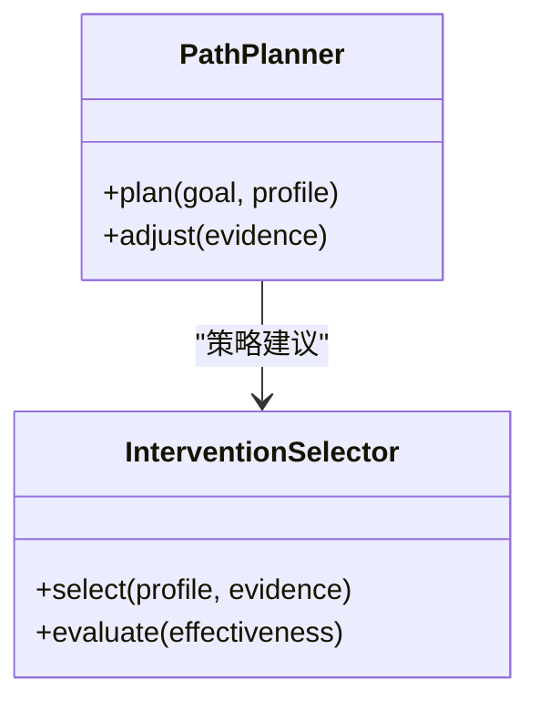

图表来源
- [src/loopse/agent/path_planner.py](file://src/loopse/agent/path_planner.py)
- [src/loopse/agent/intervention_selector.py](file://src/loopse/agent/intervention_selector.py)
- [config/prompts/path_planner/plan_path.txt](file://config/prompts/path_planner/plan_path.txt)

章节来源
- [src/loopse/agent/path_planner.py](file://src/loopse/agent/path_planner.py)
- [src/loopse/agent/intervention_selector.py](file://src/loopse/agent/intervention_selector.py)
- [config/prompts/path_planner/plan_path.txt](file://config/prompts/path_planner/plan_path.txt)

### 挑战者与情景代理
- 挑战者通过追问、反例与对比促进深度思考。
- 情景代理构造贴近真实的学习情境与角色任务。

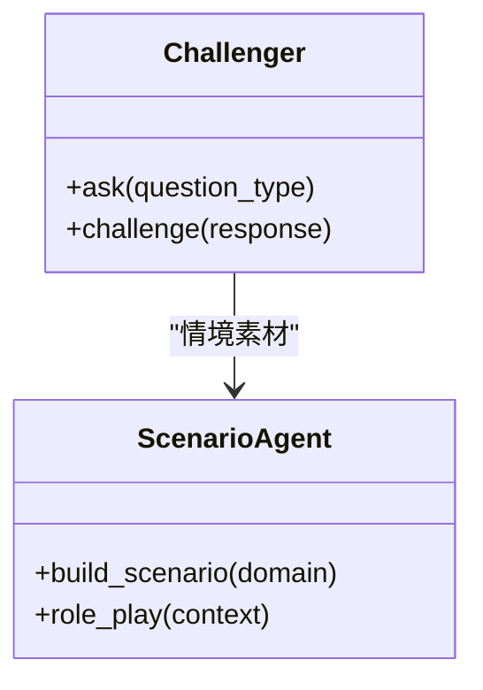

图表来源
- [src/loopse/agent/challenger.py](file://src/loopse/agent/challenger.py)
- [src/loopse/agent/scenario_agent.py](file://src/loopse/agent/scenario_agent.py)

章节来源
- [src/loopse/agent/challenger.py](file://src/loopse/agent/challenger.py)
- [src/loopse/agent/scenario_agent.py](file://src/loopse/agent/scenario_agent.py)

### 资源生成与检索增强
- 资源生成器按类型产出练习、代码、文档、信息图、脚本等，并附带可信引用。
- 检索器进行查询扩展与语义检索，连接知识库与用户意图。

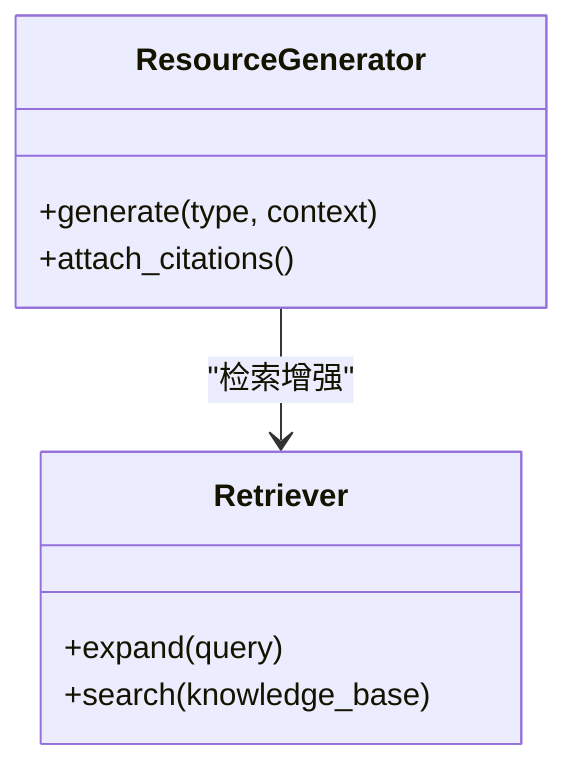

图表来源
- [src/loopse/agent/resource_generator.py](file://src/loopse/agent/resource_generator.py)
- [src/loopse/agent/retriever.py](file://src/loopse/agent/retriever.py)
- [config/prompts/resource_generator/generate_exercise.txt](file://config/prompts/resource_generator/generate_exercise.txt)
- [config/prompts/resource_generator/generate_code.txt](file://config/prompts/resource_generator/generate_code.txt)
- [config/prompts/resource_generator/generate_doc.txt](file://config/prompts/resource_generator/generate_doc.txt)
- [config/prompts/resource_generator/generate_infographic.txt](file://config/prompts/resource_generator/generate_infographic.txt)
- [config/prompts/resource_generator/generate_script.txt](file://config/prompts/resource_generator/generate_script.txt)
- [config/prompts/retriever/search_query.txt](file://config/prompts/retriever/search_query.txt)
- [config/prompts/retriever/query_expansion.txt](file://config/prompts/retriever/query_expansion.txt)
- [config/prompts/trust/source_citation.txt](file://config/prompts/trust/source_citation.txt)

章节来源
- [src/loopse/agent/resource_generator.py](file://src/loopse/agent/resource_generator.py)
- [src/loopse/agent/retriever.py](file://src/loopse/agent/retriever.py)
- [config/prompts/resource_generator/generate_exercise.txt](file://config/prompts/resource_generator/generate_exercise.txt)
- [config/prompts/resource_generator/generate_code.txt](file://config/prompts/resource_generator/generate_code.txt)
- [config/prompts/resource_generator/generate_doc.txt](file://config/prompts/resource_generator/generate_doc.txt)
- [config/prompts/resource_generator/generate_infographic.txt](file://config/prompts/resource_generator/generate_infographic.txt)
- [config/prompts/resource_generator/generate_script.txt](file://config/prompts/resource_generator/generate_script.txt)
- [config/prompts/retriever/search_query.txt](file://config/prompts/retriever/search_query.txt)
- [config/prompts/retriever/query_expansion.txt](file://config/prompts/retriever/query_expansion.txt)
- [config/prompts/trust/source_citation.txt](file://config/prompts/trust/source_citation.txt)

### 记忆管理与信任机制
- 记忆管理器维护会话与长期记忆，保障上下文一致性与隐私边界。
- 信任机制进行范围检查与来源引用，确保内容可信可控。

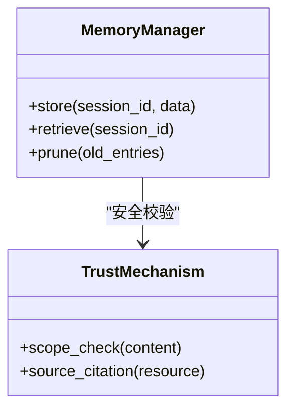

图表来源
- [src/loopse/agent/memory_manager.py](file://src/loopse/agent/memory_manager.py)
- [config/prompts/trust/scope_check.txt](file://config/prompts/trust/scope_check.txt)
- [config/prompts/trust/source_citation.txt](file://config/prompts/trust/source_citation.txt)

章节来源
- [src/loopse/agent/memory_manager.py](file://src/loopse/agent/memory_manager.py)
- [config/prompts/trust/scope_check.txt](file://config/prompts/trust/scope_check.txt)
- [config/prompts/trust/source_citation.txt](file://config/prompts/trust/source_citation.txt)

### 强化学习与多智能体策略
- 上下文博弈用于在线策略优化，平衡探索与利用。
- 多智能体强化学习支持协同干预与全局收益最大化。

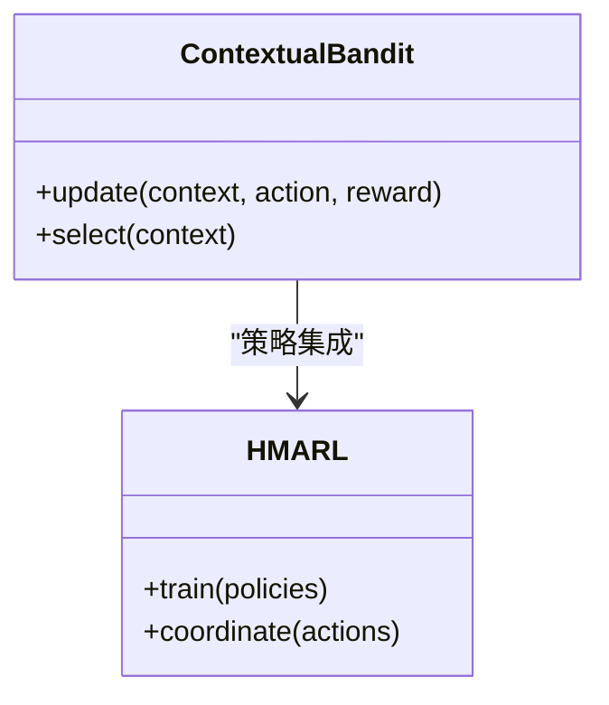

图表来源
- [src/loopse/rl/contextual_bandit.py](file://src/loopse/rl/contextual_bandit.py)
- [src/loopse/rl/hmarl.py](file://src/loopse/rl/hmarl.py)

章节来源
- [src/loopse/rl/contextual_bandit.py](file://src/loopse/rl/contextual_bandit.py)
- [src/loopse/rl/hmarl.py](file://src/loopse/rl/hmarl.py)

### 前端交互与数据绑定
- 聊天、诊断、路径与资源视图分别对应后端API，使用状态管理进行数据绑定与UI渲染。

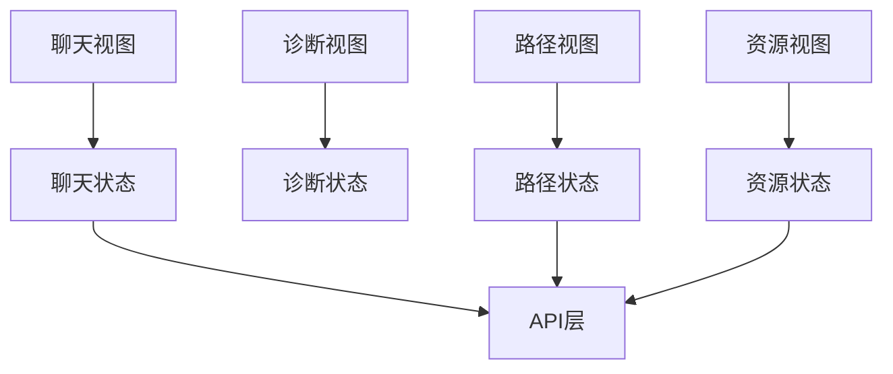

图表来源
- [frontend/src/views/ChatView.vue](file://frontend/src/views/ChatView.vue)
- [frontend/src/views/DiagnosisView.vue](file://frontend/src/views/DiagnosisView.vue)
- [frontend/src/views/PathView.vue](file://frontend/src/views/PathView.vue)
- [frontend/src/views/ResourcesView.vue](file://frontend/src/views/ResourcesView.vue)
- [frontend/src/stores/chatStore.ts](file://frontend/src/stores/chatStore.ts)
- [frontend/src/stores/pathStore.ts](file://frontend/src/stores/pathStore.ts)
- [frontend/src/stores/resourceStore.ts](file://frontend/src/stores/resourceStore.ts)

章节来源
- [frontend/src/views/ChatView.vue](file://frontend/src/views/ChatView.vue)
- [frontend/src/views/DiagnosisView.vue](file://frontend/src/views/DiagnosisView.vue)
- [frontend/src/views/PathView.vue](file://frontend/src/views/PathView.vue)
- [frontend/src/views/ResourcesView.vue](file://frontend/src/views/ResourcesView.vue)
- [frontend/src/stores/chatStore.ts](file://frontend/src/stores/chatStore.ts)
- [frontend/src/stores/pathStore.ts](file://frontend/src/stores/pathStore.ts)
- [frontend/src/stores/resourceStore.ts](file://frontend/src/stores/resourceStore.ts)

## 依赖关系分析
- 编排器依赖协调器与各智能体；智能体依赖LLM客户端、知识库与数据库；前端依赖API与状态管理。
- 提示词模板与人设配置集中管理，便于迭代与合规审计。

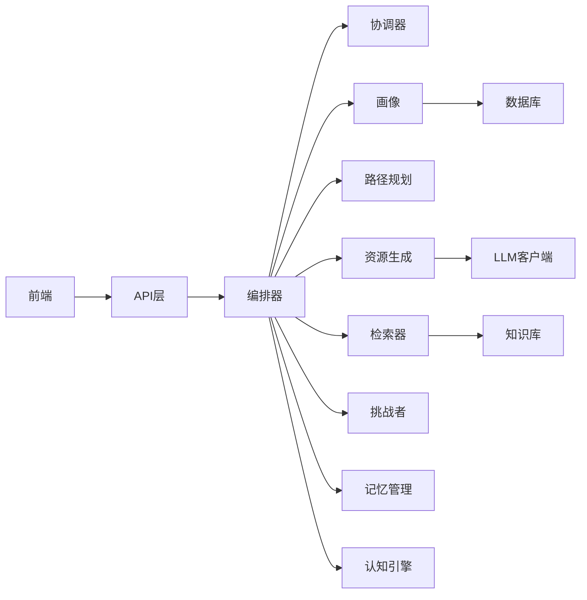

图表来源
- [src/loopse/agent/orchestrator.py](file://src/loopse/agent/orchestrator.py)
- [src/loopse/agent/coordinator.py](file://src/loopse/agent/coordinator.py)
- [src/loopse/core/llm_client.py](file://src/loopse/core/llm_client.py)
- [src/loopse/kb/knowledge_graph.py](file://src/loopse/kb/knowledge_graph.py)
- [src/loopse/db/models.py](file://src/loopse/db/models.py)
- [frontend/src/views/ChatView.vue](file://frontend/src/views/ChatView.vue)

章节来源
- [src/loopse/agent/orchestrator.py](file://src/loopse/agent/orchestrator.py)
- [src/loopse/core/llm_client.py](file://src/loopse/core/llm_client.py)
- [src/loopse/kb/knowledge_graph.py](file://src/loopse/kb/knowledge_graph.py)
- [src/loopse/db/models.py](file://src/loopse/db/models.py)
- [frontend/src/views/ChatView.vue](file://frontend/src/views/ChatView.vue)

## 性能考量
- 检索增强：优先使用向量检索与缓存命中，减少大模型调用次数。
- 流式响应：前端采用SSE或分块传输，提升交互流畅度。
- 批处理与异步：资源生成与索引构建采用异步队列与批处理。
- 内存管理：会话记忆定期清理与压缩，避免上下文溢出。
- 分层降级：当LLM不可用时回退到规则与模板，保证可用性。

[本节为通用指导，不直接分析具体文件]

## 故障排查指南
- 编排失败：检查编排器日志与路由提示词，确认任务分解是否合理。
- 诊断不准：核对诊断提示词与知识库覆盖度，必要时扩展误概念注册表。
- 资源质量不稳：审查生成提示词与引用溯源逻辑，增加范围检查。
- 路径漂移：查看路径规划与干预选择的证据链，调整权重与阈值。
- 前端无响应：检查API连通性与状态存储，确认SSE事件是否正确订阅。

章节来源
- [src/loopse/agent/orchestrator.py](file://src/loopse/agent/orchestrator.py)
- [config/prompts/orchestrator/route.txt](file://config/prompts/orchestrator/route.txt)
- [config/prompts/diagnosis/pattern_match.txt](file://config/prompts/diagnosis/pattern_match.txt)
- [config/prompts/diagnosis/root_cause.txt](file://config/prompts/diagnosis/root_cause.txt)
- [config/prompts/resource_generator/generate_exercise.txt](file://config/prompts/resource_generator/generate_exercise.txt)
- [config/prompts/trust/scope_check.txt](file://config/prompts/trust/scope_check.txt)
- [frontend/src/stores/chatStore.ts](file://frontend/src/stores/chatStore.ts)

## 结论
Socrates-Cube以苏格拉底式教学法为核心，借助多智能体架构实现个性化学习、认知诊断与自适应干预的闭环。通过检索增强、可信溯源与强化学习策略，系统在准确性、可解释性与教学效果上具备显著优势。未来可在更多学科领域扩展，并与现有教学系统深度融合，推动教育AI的工程化落地。

[本节为总结性内容，不直接分析具体文件]

## 附录
- 环境初始化与数据准备：参考初始化脚本与知识库构建流程。
- 人设与提示词管理：集中配置于提示词与人设文件，便于版本控制与审计。
- API契约：遵循统一的API Schema，确保前后端稳定对接。

章节来源
- [scripts/init_db.py](file://scripts/init_db.py)
- [scripts/build_knowledge_base.py](file://scripts/build_knowledge_base.py)
- [config/agent_personas.json](file://config/agent_personas.json)
- [config/api_schema.yaml](file://config/api_schema.yaml)