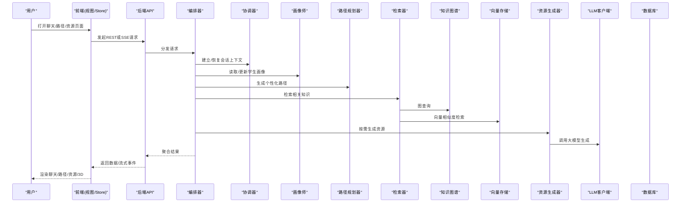
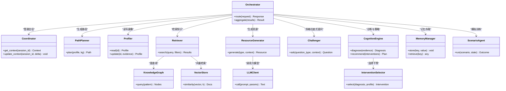
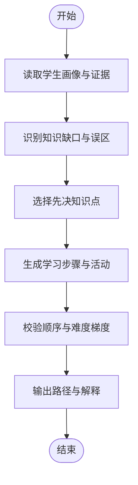
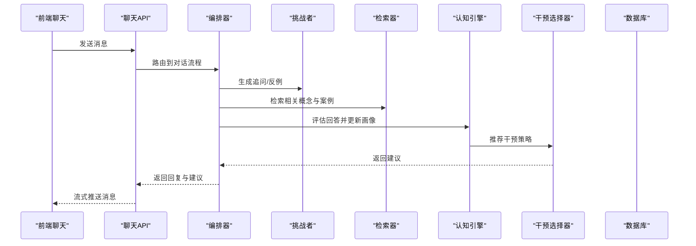
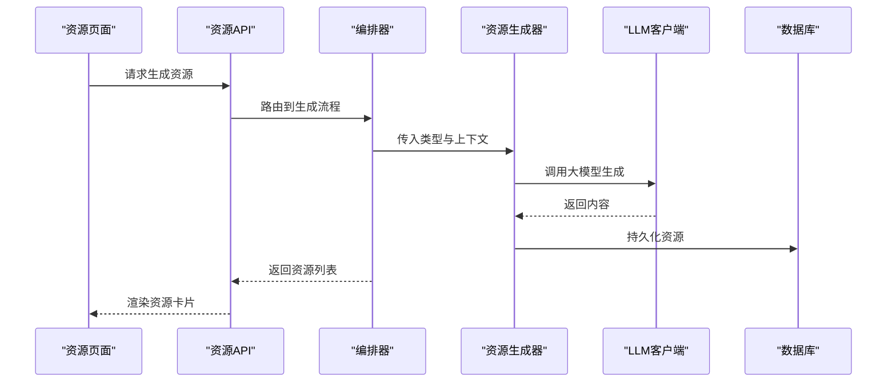
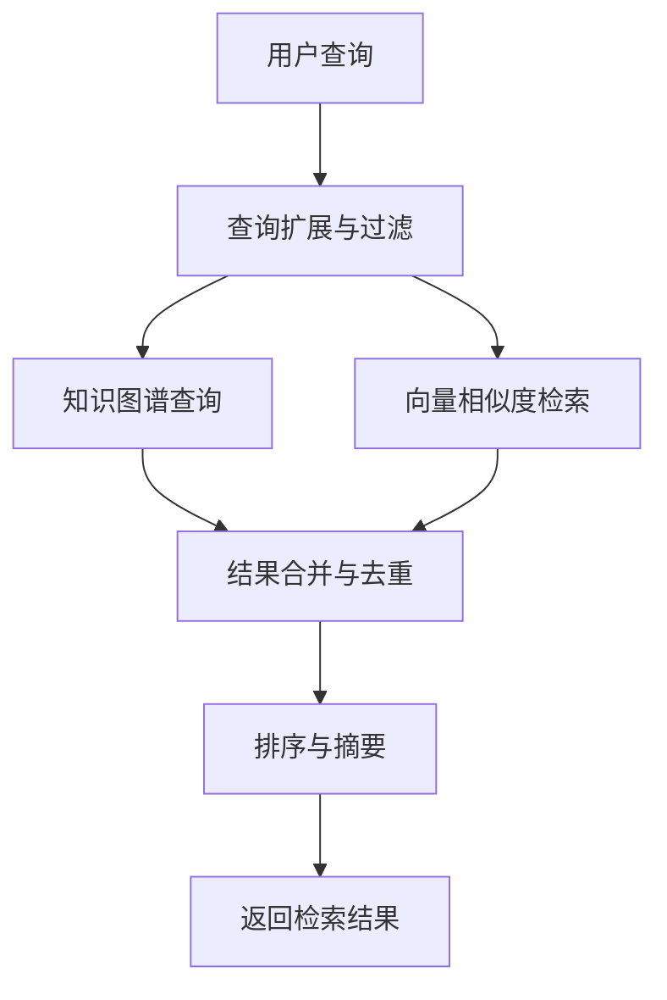
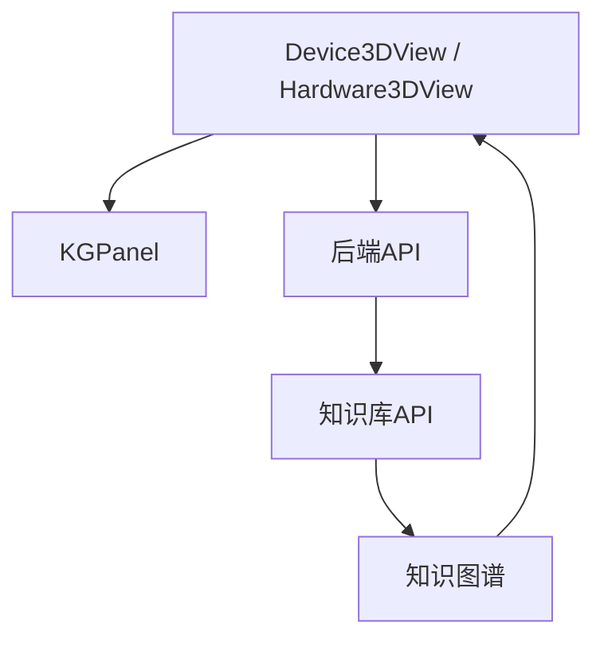
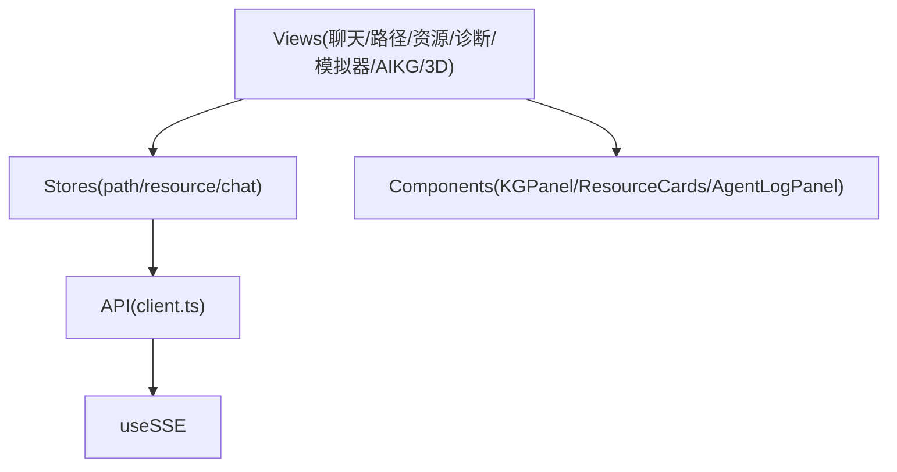
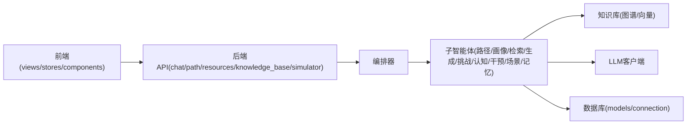

# 项目概述

<cite>
**本文引用的文件**   
- [src/agents/student/__init__.py](file://src/agents/student/__init__.py)
- [src/loopse/agent/orchestrator.py](file://src/loopse/agent/orchestrator.py)
- [src/loopse/agent/coordinator.py](file://src/loopse/agent/coordinator.py)
- [src/loopse/agent/path_planner.py](file://src/loopse/agent/path_planner.py)
- [src/loopse/agent/profiler.py](file://src/loopse/agent/profiler.py)
- [src/loopse/agent/challenger.py](file://src/loopse/agent/challenger.py)
- [src/loopse/agent/resource_generator.py](file://src/loopse/agent/resource_generator.py)
- [src/loopse/agent/retriever.py](file://src/loopse/agent/retriever.py)
- [src/loopse/agent/cognitive_engine.py](file://src/loopse/agent/cognitive_engine.py)
- [src/loopse/agent/memory_manager.py](file://src/loopse/agent/memory_manager.py)
- [src/loopse/agent/intervention_selector.py](file://src/loopse/agent/intervention_selector.py)
- [src/loopse/agent/scenario_agent.py](file://src/loopse/agent/scenario_agent.py)
- [src/loopse/api/chat.py](file://src/loopse/api/chat.py)
- [src/loopse/api/path.py](file://src/loopse/api/path.py)
- [src/loopse/api/resources.py](file://src/loopse/api/resources.py)
- [src/loopse/api/knowledge_base.py](file://src/loopse/api/knowledge_base.py)
- [src/loopse/api/simulator.py](file://src/loopse/api/simulator.py)
- [src/loopse/core/llm_client.py](file://src/loopse/core/llm_client.py)
- [src/loopse/db/models.py](file://src/loopse/db/models.py)
- [src/loopse/db/connection.py](file://src/loopse/db/connection.py)
- [src/loopse/kb/knowledge_graph.py](file://src/loopse/kb/knowledge_graph.py)
- [src/loopse/kb/vector_store.py](file://src/loopse/kb/vector_store.py)
- [config/prompts/orchestrator/route.txt](file://config/prompts/orchestrator/route.txt)
- [config/prompts/path_planner/plan_path.txt](file://config/prompts/path_planner/plan_path.txt)
- [config/prompts/profiler/update_profile.txt](file://config/prompts/profiler/update_profile.txt)
- [config/prompts/resource_generator/generate_exercise.txt](file://config/prompts/resource_generator/generate_exercise.txt)
- [config/prompts/retriever/search_query.txt](file://config/prompts/retriever/search_query.txt)
- [frontend/src/views/HomeView.vue](file://frontend/src/views/HomeView.vue)
- [frontend/src/views/ChatView.vue](file://frontend/src/views/ChatView.vue)
- [frontend/src/views/PathView.vue](file://frontend/src/views/PathView.vue)
- [frontend/src/views/ResourcesView.vue](file://frontend/src/views/ResourcesView.vue)
- [frontend/src/views/DiagnosisView.vue](file://frontend/src/views/DiagnosisView.vue)
- [frontend/src/views/SimulatorView.vue](file://frontend/src/views/SimulatorView.vue)
- [frontend/src/views/AIKGView.vue](file://frontend/src/views/AIKGView.vue)
- [frontend/src/views/Device3DView.vue](file://frontend/src/views/Device3DView.vue)
- [frontend/src/views/Hardware3DView.vue](file://frontend/src/views/Hardware3DView.vue)
- [frontend/src/components/KGPanel.vue](file://frontend/src/components/KGPanel.vue)
- [frontend/src/components/ResourceCards.vue](file://frontend/src/components/ResourceCards.vue)
- [frontend/src/components/AgentLogPanel.vue](file://frontend/src/components/AgentLogPanel.vue)
- [frontend/src/stores/pathStore.ts](file://frontend/src/stores/pathStore.ts)
- [frontend/src/stores/resourceStore.ts](file://frontend/src/stores/resourceStore.ts)
- [frontend/src/stores/chatStore.ts](file://frontend/src/stores/chatStore.ts)
- [frontend/src/api/client.ts](file://frontend/src/api/client.ts)
- [frontend/src/api/chat.ts](file://frontend/src/api/chat.ts)
- [frontend/src/api/path.ts](file://frontend/src/api/path.ts)
- [frontend/src/api/resources.ts](file://frontend/src/api/resources.ts)
- [frontend/src/composables/useSSE.ts](file://frontend/src/composables/useSSE.ts)
- [scripts/init_db.py](file://scripts/init_db.py)
- [scripts/build_knowledge_base.py](file://scripts/build_knowledge_base.py)
- [scripts/seed_resources.py](file://scripts/seed_resources.py)
- [requirements.txt](file://requirements.txt)
- [pyproject.toml](file://pyproject.toml)
</cite>

## 目录
1. [简介](#简介)
2. [项目结构](#项目结构)
3. [核心组件](#核心组件)
4. [架构总览](#架构总览)
5. [详细组件分析](#详细组件分析)
6. [依赖关系分析](#依赖关系分析)
7. [性能考量](#性能考量)
8. [故障排查指南](#故障排查指南)
9. [结论](#结论)
10. [附录](#附录)

## 简介
Socrates-Cube 是一个基于苏格拉底式教学法的 AI 驱动多智能体教育平台。其核心目标是通过“提问—反思—诊断—干预—生成”的闭环，为学习者提供个性化学习路径规划、认知诊断与资源自动生成能力。系统采用前后端分离架构，后端以 Python 多智能体编排为核心，前端以 Vue 3 + TypeScript 构建，并提供 3D 可视化（设备/硬件）与知识图谱交互界面，支持实时对话、模拟训练与多媒体资源生成。

设计理念要点：
- 苏格拉底式引导：通过追问、反例与情境化任务促进深度理解
- 多智能体协作：编排器协调诊断、路径规划、资源生成、检索等角色
- 数据驱动：学生画像、错误模式与知识图谱共同驱动个性化决策
- 可解释与可信：过程日志、来源引用与信任机制贯穿全流程

预期效果：
- 学习者获得与其当前认知状态匹配的学习路径与练习
- 教师与管理者获得可视化的学习分析与干预建议
- 平台具备可扩展的智能体生态与丰富的资源生成能力

## 项目结构
仓库采用前后端分离的组织方式：
- 后端（Python）：智能体实现、API 服务、知识库与数据库访问、LLM 客户端与工具脚本
- 前端（Vue 3 + TS）：页面视图、通用组件、状态管理、API 客户端与 SSE 流式通信
- 配置（Prompts & Schema）：提示词模板、Agent 人设与 API 契约
- 文档与测试：需求、架构、部署、验收与单元测试
- 脚本：初始化数据库、构建知识库、种子数据与验证流程

```mermaid
graph TB
subgraph "前端"
FE_Home["HomeView"]
FE_Chat["ChatView"]
FE_Path["PathView"]
FE_Resources["ResourcesView"]
FE_Diagnosis["DiagnosisView"]
FE_Simulator["SimulatorView"]
FE_AIKG["AIKGView"]
FE_Device3D["Device3DView"]
FE_Hardware3D["Hardware3DView"]
FE_KGPanel["KGPanel"]
FE_ResourceCards["ResourceCards"]
FE_AgentLog["AgentLogPanel"]
FE_PathStore["pathStore"]
FE_ResStore["resourceStore"]
FE_ChatStore["chatStore"]
FE_Client["api/client"]
FE_API_Chat["api/chat"]
FE_API_Path["api/path"]
FE_API_Res["api/resources"]
FE_SSE["composables/useSSE"]
end
subgraph "后端"
BE_Main["main.py"]
BE_API_Chat["api/chat"]
BE_API_Path["api/path"]
BE_API_Res["api/resources"]
BE_API_KB["api/knowledge_base"]
BE_API_Sim["api/simulator"]
BE_Orchestrator["agent/orchestrator"]
BE_Coordinator["agent/coordinator"]
BE_PathPlanner["agent/path_planner"]
BE_Profiler["agent/profiler"]
BE_Challenger["agent/challenger"]
BE_ResGen["agent/resource_generator"]
BE_Retriever["agent/retriever"]
BE_CogEngine["agent/cognitive_engine"]
BE_Memory["agent/memory_manager"]
BE_IntervSel["agent/intervention_selector"]
BE_Scenario["agent/scenario_agent"]
BE_LLM["core/llm_client"]
BE_DB_Models["db/models"]
BE_DB_Conn["db/connection"]
BE_KG["kb/knowledge_graph"]
BE_Vector["kb/vector_store"]
end
FE_Home --> FE_Chat
FE_Home --> FE_Path
FE_Home --> FE_Resources
FE_Home --> FE_Diagnosis
FE_Home --> FE_Simulator
FE_Home --> FE_AIKG
FE_Home --> FE_Device3D
FE_Home --> FE_Hardware3D
FE_Chat --> FE_ChatStore
FE_Path --> FE_PathStore
FE_Resources --> FE_ResStore
FE_Chat --> FE_API_Chat
FE_Path --> FE_API_Path
FE_Resources --> FE_API_Res
FE_Chat --> FE_SSE
FE_Client --> FE_API_Chat
FE_Client --> FE_API_Path
FE_Client --> FE_API_Res
FE_API_Chat --> BE_API_Chat
FE_API_Path --> BE_API_Path
FE_API_Res --> BE_API_Res
FE_API_Chat --> BE_Orchestrator
FE_API_Path --> BE_Orchestrator
FE_API_Res --> BE_Orchestrator
BE_Orchestrator --> BE_Coordinator
BE_Orchestrator --> BE_PathPlanner
BE_Orchestrator --> BE_Profiler
BE_Orchestrator --> BE_Challenger
BE_Orchestrator --> BE_ResGen
BE_Orchestrator --> BE_Retriever
BE_Orchestrator --> BE_CogEngine
BE_Orchestrator --> BE_Memory
BE_Orchestrator --> BE_IntervSel
BE_Orchestrator --> BE_Scenario
BE_Retriever --> BE_KG
BE_Retriever --> BE_Vector
BE_ResGen --> BE_LLM
BE_API_KB --> BE_KG
BE_API_KB --> BE_Vector
BE_API_Sim --> BE_Scenario
BE_API_Chat --> BE_LLM
BE_API_Path --> BE_LLM
BE_API_Res --> BE_LLM
BE_DB_Models --> BE_DB_Conn
```

图表来源
- [frontend/src/views/HomeView.vue](file://frontend/src/views/HomeView.vue)
- [frontend/src/views/ChatView.vue](file://frontend/src/views/ChatView.vue)
- [frontend/src/views/PathView.vue](file://frontend/src/views/PathView.vue)
- [frontend/src/views/ResourcesView.vue](file://frontend/src/views/ResourcesView.vue)
- [frontend/src/views/DiagnosisView.vue](file://frontend/src/views/DiagnosisView.vue)
- [frontend/src/views/SimulatorView.vue](file://frontend/src/views/SimulatorView.vue)
- [frontend/src/views/AIKGView.vue](file://frontend/src/views/AIKGView.vue)
- [frontend/src/views/Device3DView.vue](file://frontend/src/views/Device3DView.vue)
- [frontend/src/views/Hardware3DView.vue](file://frontend/src/views/Hardware3DView.vue)
- [frontend/src/components/KGPanel.vue](file://frontend/src/components/KGPanel.vue)
- [frontend/src/components/ResourceCards.vue](file://frontend/src/components/ResourceCards.vue)
- [frontend/src/components/AgentLogPanel.vue](file://frontend/src/components/AgentLogPanel.vue)
- [frontend/src/stores/pathStore.ts](file://frontend/src/stores/pathStore.ts)
- [frontend/src/stores/resourceStore.ts](file://frontend/src/stores/resourceStore.ts)
- [frontend/src/stores/chatStore.ts](file://frontend/src/stores/chatStore.ts)
- [frontend/src/api/client.ts](file://frontend/src/api/client.ts)
- [frontend/src/api/chat.ts](file://frontend/src/api/chat.ts)
- [frontend/src/api/path.ts](file://frontend/src/api/path.ts)
- [frontend/src/api/resources.ts](file://frontend/src/api/resources.ts)
- [frontend/src/composables/useSSE.ts](file://frontend/src/composables/useSSE.ts)
- [src/loopse/api/chat.py](file://src/loopse/api/chat.py)
- [src/loopse/api/path.py](file://src/loopse/api/path.py)
- [src/loopse/api/resources.py](file://src/loopse/api/resources.py)
- [src/loopse/api/knowledge_base.py](file://src/loopse/api/knowledge_base.py)
- [src/loopse/api/simulator.py](file://src/loopse/api/simulator.py)
- [src/loopse/agent/orchestrator.py](file://src/loopse/agent/orchestrator.py)
- [src/loopse/agent/coordinator.py](file://src/loopse/agent/coordinator.py)
- [src/loopse/agent/path_planner.py](file://src/loopse/agent/path_planner.py)
- [src/loopse/agent/profiler.py](file://src/loopse/agent/profiler.py)
- [src/loopse/agent/challenger.py](file://src/loopse/agent/challenger.py)
- [src/loopse/agent/resource_generator.py](file://src/loopse/agent/resource_generator.py)
- [src/loopse/agent/retriever.py](file://src/loopse/agent/retriever.py)
- [src/loopse/agent/cognitive_engine.py](file://src/loopse/agent/cognitive_engine.py)
- [src/loopse/agent/memory_manager.py](file://src/loopse/agent/memory_manager.py)
- [src/loopse/agent/intervention_selector.py](file://src/loopse/agent/intervention_selector.py)
- [src/loopse/agent/scenario_agent.py](file://src/loopse/agent/scenario_agent.py)
- [src/loopse/core/llm_client.py](file://src/loopse/core/llm_client.py)
- [src/loopse/db/models.py](file://src/loopse/db/models.py)
- [src/loopse/db/connection.py](file://src/loopse/db/connection.py)
- [src/loopse/kb/knowledge_graph.py](file://src/loopse/kb/knowledge_graph.py)
- [src/loopse/kb/vector_store.py](file://src/loopse/kb/vector_store.py)

章节来源
- [src/loopse/main.py](file://src/loopse/main.py)
- [frontend/src/App.vue](file://frontend/src/App.vue)
- [frontend/src/router/index.ts](file://frontend/src/router/index.ts)

## 核心组件
- 编排器（Orchestrator）：统一入口，负责路由请求到具体智能体并聚合结果
- 协调器（Coordinator）：维护会话上下文与跨智能体协作协议
- 路径规划器（Path Planner）：基于学生画像与知识图谱生成个性化学习路径
- 画像师（Profiler）：动态更新学习者画像与认知状态
- 挑战者（Challenger）：生成苏格拉底式问题与反例，推动反思
- 资源生成器（Resource Generator）：根据需求自动产出练习、文档、代码、脚本等
- 检索器（Retriever）：结合向量检索与知识图谱进行精准信息召回
- 认知引擎（Cognitive Engine）：整合诊断与干预策略，形成教学决策
- 记忆管理器（Memory Manager）：持久化与检索长期/短期记忆
- 干预选择器（Intervention Selector）：依据诊断结果选择最佳教学干预
- 场景智能体（Scenario Agent）：支撑模拟训练与情境化任务
- LLM 客户端（LLM Client）：封装大模型调用、重试与缓存
- 知识库（Knowledge Graph / Vector Store）：结构化知识与语义检索
- 数据库层（DB Models / Connection）：ORM 模型与连接管理
- 前端视图与组件：聊天、路径、资源、诊断、模拟器、知识图谱与 3D 展示
- 前端状态管理与 API 客户端：集中式状态与统一的 HTTP/SSE 通信

章节来源
- [src/loopse/agent/orchestrator.py](file://src/loopse/agent/orchestrator.py)
- [src/loopse/agent/coordinator.py](file://src/loopse/agent/coordinator.py)
- [src/loopse/agent/path_planner.py](file://src/loopse/agent/path_planner.py)
- [src/loopse/agent/profiler.py](file://src/loopse/agent/profiler.py)
- [src/loopse/agent/challenger.py](file://src/loopse/agent/challenger.py)
- [src/loopse/agent/resource_generator.py](file://src/loopse/agent/resource_generator.py)
- [src/loopse/agent/retriever.py](file://src/loopse/agent/retriever.py)
- [src/loopse/agent/cognitive_engine.py](file://src/loopse/agent/cognitive_engine.py)
- [src/loopse/agent/memory_manager.py](file://src/loopse/agent/memory_manager.py)
- [src/loopse/agent/intervention_selector.py](file://src/loopse/agent/intervention_selector.py)
- [src/loopse/agent/scenario_agent.py](file://src/loopse/agent/scenario_agent.py)
- [src/loopse/core/llm_client.py](file://src/loopse/core/llm_client.py)
- [src/loopse/kb/knowledge_graph.py](file://src/loopse/kb/knowledge_graph.py)
- [src/loopse/kb/vector_store.py](file://src/loopse/kb/vector_store.py)
- [src/loopse/db/models.py](file://src/loopse/db/models.py)
- [src/loopse/db/connection.py](file://src/loopse/db/connection.py)
- [frontend/src/views/ChatView.vue](file://frontend/src/views/ChatView.vue)
- [frontend/src/views/PathView.vue](file://frontend/src/views/PathView.vue)
- [frontend/src/views/ResourcesView.vue](file://frontend/src/views/ResourcesView.vue)
- [frontend/src/views/DiagnosisView.vue](file://frontend/src/views/DiagnosisView.vue)
- [frontend/src/views/SimulatorView.vue](file://frontend/src/views/SimulatorView.vue)
- [frontend/src/views/AIKGView.vue](file://frontend/src/views/AIKGView.vue)
- [frontend/src/views/Device3DView.vue](file://frontend/src/views/Device3DView.vue)
- [frontend/src/views/Hardware3DView.vue](file://frontend/src/views/Hardware3DView.vue)
- [frontend/src/components/KGPanel.vue](file://frontend/src/components/KGPanel.vue)
- [frontend/src/components/ResourceCards.vue](file://frontend/src/components/ResourceCards.vue)
- [frontend/src/components/AgentLogPanel.vue](file://frontend/src/components/AgentLogPanel.vue)
- [frontend/src/stores/pathStore.ts](file://frontend/src/stores/pathStore.ts)
- [frontend/src/stores/resourceStore.ts](file://frontend/src/stores/resourceStore.ts)
- [frontend/src/stores/chatStore.ts](file://frontend/src/stores/chatStore.ts)
- [frontend/src/api/client.ts](file://frontend/src/api/client.ts)
- [frontend/src/api/chat.ts](file://frontend/src/api/chat.ts)
- [frontend/src/api/path.ts](file://frontend/src/api/path.ts)
- [frontend/src/api/resources.ts](file://frontend/src/api/resources.ts)
- [frontend/src/composables/useSSE.ts](file://frontend/src/composables/useSSE.ts)

## 架构总览
系统采用前后端分离与多智能体编排的混合架构：
- 前端通过 REST 与 SSE 与后端交互，渲染聊天、路径、资源、诊断、模拟器与 3D 可视化
- 后端 API 将请求路由至编排器，由编排器协调各智能体完成复杂任务
- 检索器同时使用知识图谱与向量存储进行召回；资源生成器与 LLM 客户端协同产出内容
- 数据库层提供持久化能力，脚本用于初始化与构建知识库

图表来源
- [src/loopse/api/chat.py](file://src/loopse/api/chat.py)
- [src/loopse/api/path.py](file://src/loopse/api/path.py)
- [src/loopse/api/resources.py](file://src/loopse/api/resources.py)
- [src/loopse/agent/orchestrator.py](file://src/loopse/agent/orchestrator.py)
- [src/loopse/agent/coordinator.py](file://src/loopse/agent/coordinator.py)
- [src/loopse/agent/profiler.py](file://src/loopse/agent/profiler.py)
- [src/loopse/agent/path_planner.py](file://src/loopse/agent/path_planner.py)
- [src/loopse/agent/retriever.py](file://src/loopse/agent/retriever.py)
- [src/loopse/kb/knowledge_graph.py](file://src/loopse/kb/knowledge_graph.py)
- [src/loopse/kb/vector_store.py](file://src/loopse/kb/vector_store.py)
- [src/loopse/agent/resource_generator.py](file://src/loopse/agent/resource_generator.py)
- [src/loopse/core/llm_client.py](file://src/loopse/core/llm_client.py)
- [frontend/src/composables/useSSE.ts](file://frontend/src/composables/useSSE.ts)

## 详细组件分析

### 多智能体协作机制
- 编排器作为统一入口，解析意图并调度子智能体
- 协调器维护会话状态，确保跨智能体的上下文一致性
- 路径规划器结合画像与知识图谱输出阶段性学习目标与顺序
- 检索器融合图结构与向量检索，提高召回质量
- 资源生成器按类型（练习、文档、代码、脚本等）调用 LLM 生成
- 挑战者通过追问与反例推进苏格拉底式对话
- 认知引擎与干预选择器共同决定教学策略
- 记忆管理器提供长期/短期记忆的存取
- 场景智能体支撑模拟训练与情境任务

图表来源
- [src/loopse/agent/orchestrator.py](file://src/loopse/agent/orchestrator.py)
- [src/loopse/agent/coordinator.py](file://src/loopse/agent/coordinator.py)
- [src/loopse/agent/path_planner.py](file://src/loopse/agent/path_planner.py)
- [src/loopse/agent/profiler.py](file://src/loopse/agent/profiler.py)
- [src/loopse/agent/retriever.py](file://src/loopse/agent/retriever.py)
- [src/loopse/kb/knowledge_graph.py](file://src/loopse/kb/knowledge_graph.py)
- [src/loopse/kb/vector_store.py](file://src/loopse/kb/vector_store.py)
- [src/loopse/agent/resource_generator.py](file://src/loopse/agent/resource_generator.py)
- [src/loopse/core/llm_client.py](file://src/loopse/core/llm_client.py)
- [src/loopse/agent/challenger.py](file://src/loopse/agent/challenger.py)
- [src/loopse/agent/cognitive_engine.py](file://src/loopse/agent/cognitive_engine.py)
- [src/loopse/agent/intervention_selector.py](file://src/loopse/agent/intervention_selector.py)
- [src/loopse/agent/memory_manager.py](file://src/loopse/agent/memory_manager.py)
- [src/loopse/agent/scenario_agent.py](file://src/loopse/agent/scenario_agent.py)

章节来源
- [src/loopse/agent/orchestrator.py](file://src/loopse/agent/orchestrator.py)
- [src/loopse/agent/coordinator.py](file://src/loopse/agent/coordinator.py)
- [src/loopse/agent/path_planner.py](file://src/loopse/agent/path_planner.py)
- [src/loopse/agent/profiler.py](file://src/loopse/agent/profiler.py)
- [src/loopse/agent/retriever.py](file://src/loopse/agent/retriever.py)
- [src/loopse/agent/resource_generator.py](file://src/loopse/agent/resource_generator.py)
- [src/loopse/agent/challenger.py](file://src/loopse/agent/challenger.py)
- [src/loopse/agent/cognitive_engine.py](file://src/loopse/agent/cognitive_engine.py)
- [src/loopse/agent/intervention_selector.py](file://src/loopse/agent/intervention_selector.py)
- [src/loopse/agent/memory_manager.py](file://src/loopse/agent/memory_manager.py)
- [src/loopse/agent/scenario_agent.py](file://src/loopse/agent/scenario_agent.py)

### 个性化学习路径规划
路径规划流程：
- 读取学生画像与历史证据
- 结合知识图谱定位薄弱点与先决条件
- 生成阶段目标与活动序列
- 输出可视化时间线与解释说明

图表来源
- [src/loopse/agent/path_planner.py](file://src/loopse/agent/path_planner.py)
- [src/loopse/agent/profiler.py](file://src/loopse/agent/profiler.py)
- [src/loopse/kb/knowledge_graph.py](file://src/loopse/kb/knowledge_graph.py)
- [config/prompts/path_planner/plan_path.txt](file://config/prompts/path_planner/plan_path.txt)

章节来源
- [src/loopse/agent/path_planner.py](file://src/loopse/agent/path_planner.py)
- [src/loopse/agent/profiler.py](file://src/loopse/agent/profiler.py)
- [src/loopse/kb/knowledge_graph.py](file://src/loopse/kb/knowledge_graph.py)
- [config/prompts/path_planner/plan_path.txt](file://config/prompts/path_planner/plan_path.txt)

### 认知诊断与苏格拉底式对话
- 对话进入后，编排器协调挑战者与检索器生成追问与示例
- 认知引擎基于回答证据更新画像并给出诊断
- 干预选择器推荐下一步活动（练习、讲解、模拟等）

图表来源
- [src/loopse/api/chat.py](file://src/loopse/api/chat.py)
- [src/loopse/agent/orchestrator.py](file://src/loopse/agent/orchestrator.py)
- [src/loopse/agent/challenger.py](file://src/loopse/agent/challenger.py)
- [src/loopse/agent/retriever.py](file://src/loopse/agent/retriever.py)
- [src/loopse/agent/cognitive_engine.py](file://src/loopse/agent/cognitive_engine.py)
- [src/loopse/agent/intervention_selector.py](file://src/loopse/agent/intervention_selector.py)
- [frontend/src/composables/useSSE.ts](file://frontend/src/composables/useSSE.ts)

章节来源
- [src/loopse/api/chat.py](file://src/loopse/api/chat.py)
- [src/loopse/agent/challenger.py](file://src/loopse/agent/challenger.py)
- [src/loopse/agent/cognitive_engine.py](file://src/loopse/agent/cognitive_engine.py)
- [src/loopse/agent/intervention_selector.py](file://src/loopse/agent/intervention_selector.py)
- [frontend/src/composables/useSSE.ts](file://frontend/src/composables/useSSE.ts)

### 资源自动生成
- 资源生成器接收上下文与类型参数，调用 LLM 生成练习、文档、代码、脚本等
- 生成结果经校验与格式化后入库，前端以卡片形式呈现

图表来源
- [src/loopse/api/resources.py](file://src/loopse/api/resources.py)
- [src/loopse/agent/orchestrator.py](file://src/loopse/agent/orchestrator.py)
- [src/loopse/agent/resource_generator.py](file://src/loopse/agent/resource_generator.py)
- [src/loopse/core/llm_client.py](file://src/loopse/core/llm_client.py)
- [config/prompts/resource_generator/generate_exercise.txt](file://config/prompts/resource_generator/generate_exercise.txt)
- [frontend/src/components/ResourceCards.vue](file://frontend/src/components/ResourceCards.vue)

章节来源
- [src/loopse/api/resources.py](file://src/loopse/api/resources.py)
- [src/loopse/agent/resource_generator.py](file://src/loopse/agent/resource_generator.py)
- [src/loopse/core/llm_client.py](file://src/loopse/core/llm_client.py)
- [config/prompts/resource_generator/generate_exercise.txt](file://config/prompts/resource_generator/generate_exercise.txt)
- [frontend/src/components/ResourceCards.vue](file://frontend/src/components/ResourceCards.vue)

### 知识图谱与检索增强
- 检索器并行查询知识图谱与向量存储，融合结果提升准确性
- 前端提供知识图谱可视化面板，支持节点探索与关联查看

图表来源
- [src/loopse/agent/retriever.py](file://src/loopse/agent/retriever.py)
- [src/loopse/kb/knowledge_graph.py](file://src/loopse/kb/knowledge_graph.py)
- [src/loopse/kb/vector_store.py](file://src/loopse/kb/vector_store.py)
- [config/prompts/retriever/search_query.txt](file://config/prompts/retriever/search_query.txt)
- [frontend/src/components/KGPanel.vue](file://frontend/src/components/KGPanel.vue)

章节来源
- [src/loopse/agent/retriever.py](file://src/loopse/agent/retriever.py)
- [src/loopse/kb/knowledge_graph.py](file://src/loopse/kb/knowledge_graph.py)
- [src/loopse/kb/vector_store.py](file://src/loopse/kb/vector_store.py)
- [config/prompts/retriever/search_query.txt](file://config/prompts/retriever/search_query.txt)
- [frontend/src/components/KGPanel.vue](file://frontend/src/components/KGPanel.vue)

### 3D 可视化特性
- 设备与硬件 3D 视图用于沉浸式学习与操作演示
- 与知识图谱联动，支持在 3D 场景中导航与标注关键部件

图表来源
- [frontend/src/views/Device3DView.vue](file://frontend/src/views/Device3DView.vue)
- [frontend/src/views/Hardware3DView.vue](file://frontend/src/views/Hardware3DView.vue)
- [frontend/src/components/KGPanel.vue](file://frontend/src/components/KGPanel.vue)
- [src/loopse/api/knowledge_base.py](file://src/loopse/api/knowledge_base.py)
- [src/loopse/kb/knowledge_graph.py](file://src/loopse/kb/knowledge_graph.py)

章节来源
- [frontend/src/views/Device3DView.vue](file://frontend/src/views/Device3DView.vue)
- [frontend/src/views/Hardware3DView.vue](file://frontend/src/views/Hardware3DView.vue)
- [frontend/src/components/KGPanel.vue](file://frontend/src/components/KGPanel.vue)
- [src/loopse/api/knowledge_base.py](file://src/loopse/api/knowledge_base.py)
- [src/loopse/kb/knowledge_graph.py](file://src/loopse/kb/knowledge_graph.py)

### 前端架构与状态管理
- 视图层：聊天、路径、资源、诊断、模拟器、知识图谱与 3D 页面
- 状态层：pathStore、resourceStore、chatStore 分别管理对应领域状态
- API 层：client 统一封装请求，useSSE 处理流式事件
- 组件层：KGPanel、ResourceCards、AgentLogPanel 等复用组件

图表来源
- [frontend/src/views/ChatView.vue](file://frontend/src/views/ChatView.vue)
- [frontend/src/views/PathView.vue](file://frontend/src/views/PathView.vue)
- [frontend/src/views/ResourcesView.vue](file://frontend/src/views/ResourcesView.vue)
- [frontend/src/views/DiagnosisView.vue](file://frontend/src/views/DiagnosisView.vue)
- [frontend/src/views/SimulatorView.vue](file://frontend/src/views/SimulatorView.vue)
- [frontend/src/views/AIKGView.vue](file://frontend/src/views/AIKGView.vue)
- [frontend/src/views/Device3DView.vue](file://frontend/src/views/Device3DView.vue)
- [frontend/src/views/Hardware3DView.vue](file://frontend/src/views/Hardware3DView.vue)
- [frontend/src/stores/pathStore.ts](file://frontend/src/stores/pathStore.ts)
- [frontend/src/stores/resourceStore.ts](file://frontend/src/stores/resourceStore.ts)
- [frontend/src/stores/chatStore.ts](file://frontend/src/stores/chatStore.ts)
- [frontend/src/api/client.ts](file://frontend/src/api/client.ts)
- [frontend/src/composables/useSSE.ts](file://frontend/src/composables/useSSE.ts)
- [frontend/src/components/KGPanel.vue](file://frontend/src/components/KGPanel.vue)
- [frontend/src/components/ResourceCards.vue](file://frontend/src/components/ResourceCards.vue)
- [frontend/src/components/AgentLogPanel.vue](file://frontend/src/components/AgentLogPanel.vue)

章节来源
- [frontend/src/views/ChatView.vue](file://frontend/src/views/ChatView.vue)
- [frontend/src/views/PathView.vue](file://frontend/src/views/PathView.vue)
- [frontend/src/views/ResourcesView.vue](file://frontend/src/views/ResourcesView.vue)
- [frontend/src/views/DiagnosisView.vue](file://frontend/src/views/DiagnosisView.vue)
- [frontend/src/views/SimulatorView.vue](file://frontend/src/views/SimulatorView.vue)
- [frontend/src/views/AIKGView.vue](file://frontend/src/views/AIKGView.vue)
- [frontend/src/views/Device3DView.vue](file://frontend/src/views/Device3DView.vue)
- [frontend/src/views/Hardware3DView.vue](file://frontend/src/views/Hardware3DView.vue)
- [frontend/src/stores/pathStore.ts](file://frontend/src/stores/pathStore.ts)
- [frontend/src/stores/resourceStore.ts](file://frontend/src/stores/resourceStore.ts)
- [frontend/src/stores/chatStore.ts](file://frontend/src/stores/chatStore.ts)
- [frontend/src/api/client.ts](file://frontend/src/api/client.ts)
- [frontend/src/composables/useSSE.ts](file://frontend/src/composables/useSSE.ts)
- [frontend/src/components/KGPanel.vue](file://frontend/src/components/KGPanel.vue)
- [frontend/src/components/ResourceCards.vue](file://frontend/src/components/ResourceCards.vue)
- [frontend/src/components/AgentLogPanel.vue](file://frontend/src/components/AgentLogPanel.vue)

## 依赖关系分析
- 后端依赖：
  - 智能体模块：orchestrator、coordinator、path_planner、profiler、challenger、resource_generator、retriever、cognitive_engine、memory_manager、intervention_selector、scenario_agent
  - 基础设施：llm_client、knowledge_graph、vector_store、db/models、db/connection
  - API 层：chat、path、resources、knowledge_base、simulator
- 前端依赖：
  - 视图与组件：ChatView、PathView、ResourcesView、DiagnosisView、SimulatorView、AIKGView、Device3DView、Hardware3DView、KGPanel、ResourceCards、AgentLogPanel
  - 状态与通信：pathStore、resourceStore、chatStore、client、useSSE
- 外部依赖：
  - 大语言模型（通过 llm_client 抽象）
  - 向量数据库与图数据库（通过 vector_store 与 knowledge_graph 抽象）
  - 关系型数据库（通过 db/connection 与 models）

图表来源
- [src/loopse/api/chat.py](file://src/loopse/api/chat.py)
- [src/loopse/api/path.py](file://src/loopse/api/path.py)
- [src/loopse/api/resources.py](file://src/loopse/api/resources.py)
- [src/loopse/api/knowledge_base.py](file://src/loopse/api/knowledge_base.py)
- [src/loopse/api/simulator.py](file://src/loopse/api/simulator.py)
- [src/loopse/agent/orchestrator.py](file://src/loopse/agent/orchestrator.py)
- [src/loopse/agent/path_planner.py](file://src/loopse/agent/path_planner.py)
- [src/loopse/agent/profiler.py](file://src/loopse/agent/profiler.py)
- [src/loopse/agent/retriever.py](file://src/loopse/agent/retriever.py)
- [src/loopse/agent/resource_generator.py](file://src/loopse/agent/resource_generator.py)
- [src/loopse/agent/cognitive_engine.py](file://src/loopse/agent/cognitive_engine.py)
- [src/loopse/agent/intervention_selector.py](file://src/loopse/agent/intervention_selector.py)
- [src/loopse/agent/scenario_agent.py](file://src/loopse/agent/scenario_agent.py)
- [src/loopse/agent/memory_manager.py](file://src/loopse/agent/memory_manager.py)
- [src/loopse/core/llm_client.py](file://src/loopse/core/llm_client.py)
- [src/loopse/kb/knowledge_graph.py](file://src/loopse/kb/knowledge_graph.py)
- [src/loopse/kb/vector_store.py](file://src/loopse/kb/vector_store.py)
- [src/loopse/db/models.py](file://src/loopse/db/models.py)
- [src/loopse/db/connection.py](file://src/loopse/db/connection.py)
- [frontend/src/views/ChatView.vue](file://frontend/src/views/ChatView.vue)
- [frontend/src/views/PathView.vue](file://frontend/src/views/PathView.vue)
- [frontend/src/views/ResourcesView.vue](file://frontend/src/views/ResourcesView.vue)
- [frontend/src/views/DiagnosisView.vue](file://frontend/src/views/DiagnosisView.vue)
- [frontend/src/views/SimulatorView.vue](file://frontend/src/views/SimulatorView.vue)
- [frontend/src/views/AIKGView.vue](file://frontend/src/views/AIKGView.vue)
- [frontend/src/views/Device3DView.vue](file://frontend/src/views/Device3DView.vue)
- [frontend/src/views/Hardware3DView.vue](file://frontend/src/views/Hardware3DView.vue)
- [frontend/src/stores/pathStore.ts](file://frontend/src/stores/pathStore.ts)
- [frontend/src/stores/resourceStore.ts](file://frontend/src/stores/resourceStore.ts)
- [frontend/src/stores/chatStore.ts](file://frontend/src/stores/chatStore.ts)
- [frontend/src/api/client.ts](file://frontend/src/api/client.ts)
- [frontend/src/composables/useSSE.ts](file://frontend/src/composables/useSSE.ts)

章节来源
- [src/loopse/agent/orchestrator.py](file://src/loopse/agent/orchestrator.py)
- [src/loopse/core/llm_client.py](file://src/loopse/core/llm_client.py)
- [src/loopse/kb/knowledge_graph.py](file://src/loopse/kb/knowledge_graph.py)
- [src/loopse/kb/vector_store.py](file://src/loopse/kb/vector_store.py)
- [src/loopse/db/models.py](file://src/loopse/db/models.py)
- [src/loopse/db/connection.py](file://src/loopse/db/connection.py)
- [frontend/src/api/client.ts](file://frontend/src/api/client.ts)
- [frontend/src/composables/useSSE.ts](file://frontend/src/composables/useSSE.ts)

## 性能考量
- 并发与异步：API 层与智能体编排应充分利用异步 I/O，减少阻塞等待
- 缓存策略：对高频检索结果与 LLM 响应进行缓存，降低重复计算
- 批处理与分页：资源列表与图谱查询采用分页与批量加载，避免一次性传输过大
- 流式输出：对话与长任务使用 SSE 分片推送，提升用户体验
- 索引优化：向量检索与图查询需合理设置索引与过滤条件，控制延迟
- 资源生成节流：限制并发生成任务数量，防止 LLM 过载

[本节为通用指导，不直接分析具体文件]

## 故障排查指南
- 常见问题
  - LLM 调用失败：检查网络、密钥与限流策略，确认重试与降级逻辑
  - 检索结果为空：核对向量索引是否构建成功，图谱查询条件是否正确
  - 路径规划异常：检查学生画像字段完整性与先决条件约束
  - 资源生成超时：调整生成任务队列与超时阈值，观察 LLM 负载
  - SSE 断连：检查前端 useSSE 重连逻辑与后端事件源稳定性
- 调试建议
  - 启用 Agent 日志面板，追踪编排器与各智能体调用链
  - 使用知识库 API 单独验证检索与图谱查询
  - 对路径与资源接口进行独立压测，定位瓶颈
- 初始化与数据
  - 数据库初始化：参考 init_db 脚本
  - 知识库构建：参考 build_knowledge_base 脚本
  - 种子数据：参考 seed_resources 脚本

章节来源
- [scripts/init_db.py](file://scripts/init_db.py)
- [scripts/build_knowledge_base.py](file://scripts/build_knowledge_base.py)
- [scripts/seed_resources.py](file://scripts/seed_resources.py)
- [frontend/src/components/AgentLogPanel.vue](file://frontend/src/components/AgentLogPanel.vue)
- [src/loopse/api/knowledge_base.py](file://src/loopse/api/knowledge_base.py)
- [src/loopse/agent/orchestrator.py](file://src/loopse/agent/orchestrator.py)
- [frontend/src/composables/useSSE.ts](file://frontend/src/composables/useSSE.ts)

## 结论
Socrates-Cube 通过多智能体协作与苏格拉底式教学法，实现了从诊断到路径规划再到资源生成的完整闭环。前后端分离与 3D 可视化增强了系统的可拓展性与沉浸感。建议在后续迭代中持续优化检索与生成性能，完善监控与可观测性，并扩展更多智能体角色以满足多样化教学场景。

[本节为总结性内容，不直接分析具体文件]

## 附录
- 技术栈概览
  - 后端：Python、FastAPI（推测）、SQLAlchemy（推测）、向量库、图数据库、LLM 客户端
  - 前端：Vue 3、TypeScript、Vite、Tailwind CSS、SSE
  - 工具与脚本：数据库初始化、知识库构建、种子数据、验证脚本
- 配置文件
  - 提示词模板：编排器路由、路径规划、画像更新、资源生成、检索查询等
  - 智能体人设与 API 契约：位于 config 目录

章节来源
- [requirements.txt](file://requirements.txt)
- [pyproject.toml](file://pyproject.toml)
- [config/prompts/orchestrator/route.txt](file://config/prompts/orchestrator/route.txt)
- [config/prompts/path_planner/plan_path.txt](file://config/prompts/path_planner/plan_path.txt)
- [config/prompts/profiler/update_profile.txt](file://config/prompts/profiler/update_profile.txt)
- [config/prompts/resource_generator/generate_exercise.txt](file://config/prompts/resource_generator/generate_exercise.txt)
- [config/prompts/retriever/search_query.txt](file://config/prompts/retriever/search_query.txt)