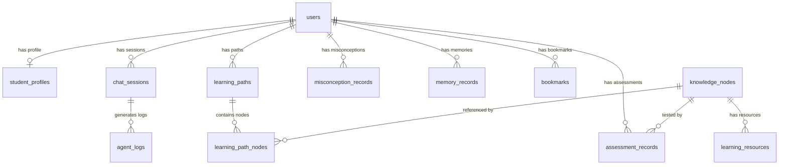

# 系统开发说明书

| 项目 | 内容 |
|------|------|
| 项目名称 | Socrates-Cube 多智能体自适应计算机网络学习系统 |
| 文档版本 | v1.0 |
| 编制日期 | 2026-07-20 |
| 适用阶段 | 第十五届中国软件杯 A3 赛题参赛版本 |
| 参考规范 | GB/T 8567-2006《计算机软件文档编制规范》 |
| 出题企业 | 科大讯飞股份有限公司 |

---

## 一、引言

### 1.1 编写目的

本文档是 Socrates-Cube 多智能体自适应计算机网络学习系统的系统开发说明书，依据 GB/T 8567-2006 编制，涵盖软件需求规格、系统概要设计及关键详细设计内容。文档旨在：

1. 明确系统功能需求与非功能需求，为开发和测试提供基准；
2. 描述系统总体架构及各模块职责；
3. 说明 AI 多智能体技术在系统中的融合应用方案；
4. 为软件杯评审提供完整的技术文档支撑。

### 1.2 项目背景

在高等教育数字化转型进程中，计算机网络课程因涉及协议栈复杂、概念抽象等特点，学生普遍存在以下学习困境：

- **认知盲区难以量化**：传统问答系统仅判断对错，无法诊断"为什么答错"的深层根因；
- **资源适配性不足**：统一教学资源忽视学生个体差异，知识背景、认知风格各异的学生无法获得针对性学习材料；
- **路径规划缺乏科学依据**：学生不了解知识依赖关系，无法制定合理的学习顺序。

本系统以第十五届中国软件杯 A3 赛题"基于大模型的个性化资源生成与学习多智能体系统开发"为背景，结合讯飞星火大模型与多智能体技术，提出"三层认知诊断—个性化资源生成—知识图谱路径规划"完整解决方案。

### 1.3 术语与缩略语

| 术语/缩写 | 说明 |
|-----------|------|
| Agent | 智能体，指具备感知-决策-行动能力的自主软件模块 |
| Orchestrator | 编排器，负责协调多 Agent 执行顺序的中枢 Agent |
| RAG | Retrieval-Augmented Generation，检索增强生成 |
| SSE | Server-Sent Events，服务器推送事件，HTTP 长连接单向流 |
| LLM | Large Language Model，大语言模型 |
| KP | Knowledge Point，课程知识节点（宏观） |
| ACU | Atomic Comprehension Unit，原子认知理解单元（微观） |
| ChromaDB | 开源向量数据库，用于语义相似度检索 |
| Pinia | Vue 3 官方状态管理库 |
| JWT | JSON Web Token，用于无状态身份认证 |
| Kahn 算法 | 基于入度的有向无环图拓扑排序算法 |
| Mock 模式 | 不调用真实 LLM API，使用本地预置响应的离线运行模式 |
| TTL 缓存 | Time-To-Live Cache，带过期时间的内存缓存 |
| DQN | Deep Q-Network，基于深度学习的强化学习算法 |
| LinUCB | 线性上置信界算法，一种上下文赌博机强化学习方法 |
| ER 图 | Entity-Relationship Diagram，实体关系图 |
| bcrypt | 密码哈希算法，用于安全存储用户密码 |
| TLS | Transport Layer Security，传输层安全协议 |
| RFC | Request for Comments，互联网标准规范文件 |

### 1.4 参考资料

1. GB/T 8567-2006《计算机软件文档编制规范》
2. 第十五届中国软件杯 A3 赛题说明（www.cnsoftbei.com）
3. RFC 9293 - Transmission Control Protocol (TCP)
4. RFC 8446 - The Transport Layer Security (TLS) Protocol Version 1.3
5. RFC 9110 - HTTP Semantics
6. RFC 1034/1035 - Domain Names
7. FastAPI 官方文档 (fastapi.tiangolo.com)
8. Vue 3 官方文档 (vuejs.org)

---

## 二、总体描述

### 2.1 产品概述

Socrates-Cube（苏格拉底方块）是面向高校《计算机网络》课程的多智能体自适应学习系统。系统以讯飞星火大模型为核心，通过 8 个专业 Agent 协同工作，提供**三层认知诊断—个性化资源生成—知识图谱路径规划**的完整闭环学习体验。

系统核心价值在于：将 AI 的角色从"对错判断者"升级为"认知教练"——不仅判断答案正误，更深入理解学生的知识盲区，并提供个性化、多表征的学习支持。

### 2.2 用户特征

| 用户角色 | 描述 | 核心使用场景 |
|----------|------|-------------|
| 学生 | 修读《计算机网络》课程的高校学生 | 课前预习、课后练习、备考冲刺、知识查漏补缺 |
| 助教 | 负责课程辅导的助教或研究生 | 查看学生诊断结果、了解班级共性问题、评估知识掌握情况 |
| 管理员 | 系统管理人员 | 知识库维护、用户管理、系统监控 |

**典型使用场景**：学生在课后通过系统提问，AI 发现其对"TCP 三次握手与四次挥手"混淆，自动触发三层诊断定位根因（缺失"TCP 连接状态机"前置知识），生成针对性练习题和思维导图，并更新学习路径，引导学生先补充状态机基础再回到握手协议学习。

### 2.3 产品功能概述

| 功能编号 | 功能名称 | 赛题对应 |
|----------|----------|----------|
| F01 | 用户认证与 5 步式画像初始化 | 基础设施 |
| F02 | 多人格流式智能对话 | 智能辅导答疑（加分项） |
| F03 | 三层认知诊断 | 学习效果评估（加分项） |
| F04 | 8 维动态学习画像 | ≥6维动态画像（必选） |
| F05 | 5 类个性化学习资源生成 | ≥5类资源（必选） |
| F06 | 知识图谱路径规划 | 个性化路径规划（必选） |
| F07 | 7 场景协议交互仿真 | 功能增强项 |
| F08 | 苏格拉底式概念挑战 | 智能辅导（加分项） |
| F09 | RAG 知识检索与引用溯源 | 多智能体协同（必选） |

### 2.4 运行环境

**服务端运行环境：**

| 类别 | 要求 |
|------|------|
| 操作系统 | Windows 10/11、Ubuntu 20.04+、macOS 12+ |
| Python 版本 | 3.10.x（严格约束，aiosqlite 兼容性要求） |
| 内存 | ≥ 4GB（推荐 8GB） |
| 数据库 | SQLite（开发）/ MySQL 8.0+（生产） |
| 网络 | 需可访问 wss://spark-api.xf-yun.com（或启用 Mock 模式） |

**客户端运行环境：**

- 现代浏览器：Chrome 100+、Firefox 100+、Safari 15+、Edge 100+
- 支持 HTML5 WebSocket、SSE、Canvas API

### 2.5 假设与依赖

1. **LLM 依赖（可选）**：系统主要依赖讯飞星火 Spark-X API。若环境变量 `XUNFEI_APP_ID` 等未配置，系统自动进入 Mock 模式，使用本地预置响应，保证演示功能完整运行。
2. **ChromaDB 依赖（可选）**：向量检索功能依赖 ChromaDB。ChromaDB 不可用时自动降级至 `data/vector_db/local_index.json` 关键词检索。
3. **RL 优化（软依赖）**：LinUCB 资源排序和 DQN 路径选择已设计接入点，当依赖库不可用时自动降级为规则策略，核心功能不受影响。
4. **数据库**：默认使用 SQLite（`./edu_agent.db`），生产环境可通过 `DATABASE_URL` 环境变量切换至 MySQL/TDSQL-C Serverless。

---

## 三、功能需求

> 每项功能需求包含：描述 / 输入 / 处理逻辑 / 输出 / 验收标准 五要素。

### F01：用户认证与 5 步式画像初始化

**描述**：系统提供 JWT 令牌认证，新用户首次登录时通过 5 步引导完成基础画像收集。

**输入**：用户名、密码（登录）；专业方向、学习目标、薄弱知识点、认知风格偏好、学习时间安排（引导问卷）

**处理逻辑**：
1. 登录：bcrypt 密码哈希验证，签发有效期 JWT 令牌；
2. 新用户标记 `is_first_login=True`，引导至 `/onboarding`；
3. 收集 5 步信息，通过 ProfilerAgent 初始化 8 维画像基线值。

**输出**：JWT 令牌（用于后续所有 API 请求）；初始化的学生画像 JSON

**验收标准**：登录响应时间 < 1s；5 步引导完成后画像 8 个维度均有基线值；重复登录不触发引导。

---

### F02：多人格流式智能对话

**描述**：核心对话功能，支持 4 种虚拟教师人格，通过 SSE 流式输出 AI 回复，同步触发诊断、画像更新、资源生成等子 Agent。

**输入**：`session_id`（会话 ID）、`user_id`（用户 ID）、`message`（用户输入文本）、`agent_persona`（人格，可选，默认 professor）

**处理逻辑**：
1. OrchestratorAgent 接收消息，判断是否为计算机网络范围内问题（trust_mechanism 越界检测）；
2. 调用 RetrieverAgent 检索三库相关知识；
3. 根据人格选择对应系统提示词，调用 LLM 生成流式回复；
4. 并发触发 DiagnosisAgent（若检测到答案输入）、ProfilerAgent 更新；
5. 通过 SSE 逐步推送 11 种事件类型；每 15 秒发送心跳。

**输出**：SSE 事件流（agent_start / token / diagnosis / resource / path_update / done 等）

**验收标准**：SSE 首字输出延迟 < 500ms；越界问题在 scope_notice 事件中提示；心跳事件每 15s 发送一次；会话记录写入 `chat_sessions` 表。

---

### F03：三层认知诊断

**描述**：对学生答案进行三层递进诊断，从表层错误识别到根因分析再到误区模式匹配，输出结构化诊断报告。

**输入**：学生答案文本、当前知识点上下文、对话历史

**处理逻辑**：
1. **L1 — 表层错误识别**：LLM 提示词 + 关键词规则双引擎，将错误分类至 9 种类型之一（layer_misplacement / flow_omission / concept_confusion / field_misunderstanding / reasoning_breakdown / factual / security_misconception / performance_confusion / over_simplification）；
2. **L2 — 根因分析**：基于 L1 错误类型，通过知识图谱反向遍历定位 `missing_prerequisites`（缺失前置知识节点）；
3. **L3 — 误区模式匹配**：对 misconceptions 集合进行向量检索，匹配最相似的误解模式，生成 `intervention_suggestion`。

**输出**：诊断报告（JSON），包含 10 个字段：is_correct / confidence / surface_error / error_type / root_causes / missing_prerequisites / pattern / intervention_suggestion / related_node_ids / agent_trace

**验收标准**：诊断响应时间 < 3s；输出字段完整（10 个字段均有值）；正确答案时 is_correct=True，confidence ≥ 0.8；参照 RFC 标准的错误归类准确。

---

### F04：8 维动态学习画像

**描述**：维护学生的多维学习能力画像，支持实时增量更新和周期性 LLM 全量校准。

**输入**：每轮诊断结果（自动触发增量更新）；每 5 轮对话（触发 LLM 全量校准）

**处理逻辑（混合更新策略）**：
1. **确定性增量更新**（每轮，< 50ms）：根据诊断结果的 error_type 和 is_correct，按预设规则调整对应能力维度的分值（无需 LLM 调用）；
2. **LLM 全量校准**（每 5 轮，带 10 秒去抖窗口）：将对话历史和当前画像传给 LLM，综合评估并更新 8 维分值及认知风格判断。

**8 个能力维度**：conceptual_understanding / protocol_analysis / calculation_ability / error_diagnosis / system_design / knowledge_connection / expression_clarity / self_correction

**输出**：更新后的画像 JSON（含 8 维分值 0-1、mastery_map[20个KP节点掌握度]、cognitive_style）

**验收标准**：增量更新延迟 < 50ms；画像数据写入 `student_profiles` 表；前端雷达图实时刷新；mastery_map 包含所有 20 个 KP 节点。

---

### F05：5 类个性化学习资源生成

**描述**：根据学生的诊断结果、认知风格和知识点，生成 5 类多表征学习资源。

**输入**：`knowledge_point`（知识点名称）、诊断结果（含 error_type）、学生认知风格（来自画像）

**处理逻辑**：
1. 根据认知风格查 STYLE_PRIORITY 映射表确定生成顺序；
2. 根据 error_type 进行 ERROR_BOOST（如 flow_omission 追加 simulator 类型，layer_misplacement 追加 mindmap）；
3. 调用 LLM 逐一生成对应类型资源内容；
4. 生成结果存入 `learning_resources` 表。

**5 类资源类型**：doc（知识讲解文档）/ exercise（练习题目）/ code（代码示例）/ mindmap（Mermaid 思维导图）/ script（教学视频脚本）

**输出**：资源列表（含 resource_id / resource_type / knowledge_point / title / content / metadata / quality_score / created_at）

**验收标准**：5 类资源均可正常生成；资源内容与知识点高度相关；认知风格为 visual 时 mindmap 排在前列；生成响应时间 < 10s（含 LLM 调用）。

---

### F06：知识图谱引导的学习路径规划

**描述**：基于 KP-ACU 双层知识图谱，结合诊断结果和认知风格，为学生规划个性化、可解释的学习路径。

**输入**：用户 ID、诊断结果中的 missing_prerequisites、学生 mastery_map

**处理逻辑**：
1. 从 missing_prerequisites 出发，DFS 反向遍历知识图谱查找所有前置依赖节点；
2. 对收集到的节点集合执行 Kahn 拓扑排序，确定学习顺序；
3. 为每个节点生成三维推荐理由：graph_dependency（知识依赖）/ diagnosis_result（诊断关联）/ cognitive_style（风格匹配）；
4. 生成路径对象存入 `learning_paths` 和 `learning_path_nodes` 表。

**输出**：学习路径（含 title / description / status / total_estimated_time / 路径节点列表，每节点含 status / current_mastery / recommendation_reason）

**验收标准**：路径节点遵循拓扑顺序（前置节点排序靠前）；每节点有 recommendation_reason；路径可视化为时间线和知识图谱联动；动态调整在诊断后自动触发。

---

### F07：7 场景协议交互仿真

**描述**：提供 7 个网络协议的交互式 Canvas 动画仿真，支持步进控制和参数调节。

**输入**：仿真场景名称（scene 参数）；用户点击/控制操作

**7 个仿真场景**：tcp_handshake（三次握手）/ tcp_close（四次挥手）/ sliding_window（滑动窗口）/ http_request（HTTP 请求/响应）/ dns_resolution（DNS 递归查询）/ congestion_control（拥塞控制/慢启动）/ arp_resolution（ARP 解析）

**处理逻辑**：ScenarioAgent 提供各场景的状态机数据（节点状态、转换条件、时序信息），前端 Canvas 按帧渲染动画。

**输出**：仿真动画（Canvas 渲染）；步骤说明文字；参数调节控件

**验收标准**：7 个场景均可正常启动；动画逻辑符合 RFC 标准规范；支持暂停/步进/重置操作。

---

### F08：苏格拉底式概念挑战追问

**描述**：在特定条件下触发自适应概念挑战，通过苏格拉底式追问引导学生自主发现知识盲点。

**输入**：诊断结果（is_correct=False 时触发）或学习轮次计数（≥5 轮时触发）

**处理逻辑**：
1. ChallengerAgent 根据当前知识点生成初始挑战问题（中等难度）；
2. 学生答对：提升难度，深挖更复杂场景；
3. 学生答错：降维引导，从基础概念重建；
4. 轮次约束：最少 2 轮（确保交互深度），最多 5 轮（控制疲劳感）；
5. 结果更新学生画像的 error_diagnosis 和 self_correction 维度。

**输出**：追问问题序列；每轮反馈与引导；最终知识点掌握度评估

**验收标准**：正确触发（诊断错误或5轮后）；难度调节逻辑正确；轮次在 2-5 范围内；内置 3 道 fallback 题目保证离线可用。

---

### F09：RAG 知识检索与引用溯源

**描述**：通过 RAG 架构从三库检索相关知识，并在 LLM 回复中标注引用来源，防止知识幻觉。

**输入**：用户问题文本；当前会话上下文

**三库结构**：
- `course_docs`：30+ 条课程文档（5章 Markdown 教材）
- `protocol_specs`：200+ 条 RFC 规范（16个RFC文档）
- `misconceptions`：24+ 条误解记录

**处理逻辑**：RetrieverAgent 对三库分别执行向量相似度检索，合并 TopK 结果，拼接为 LLM 上下文；输出中包含来源标注；TTL 缓存（5分钟，200条上限）提升重复查询响应速度。

**输出**：检索到的相关知识片段（含来源 ID）；LLM 输出中的引用标注；ChromaDB 不可用时的降级检索结果

**验收标准**：相关度高（检索内容与问题匹配）；输出包含引用来源；缓存命中时响应时间 < 100ms；ChromaDB 不可用时降级无感知。

---

## 四、非功能需求

### 4.1 性能需求

| 指标 | 要求 | 实现方案 |
|------|------|----------|
| SSE 首字延迟 | < 500ms | 流式输出，不等待完整响应 |
| 诊断响应时间 | < 3s | 并发执行 L1/L2/L3（部分可并行） |
| 画像增量更新 | < 50ms | 规则计算，无需 LLM |
| 心跳间隔 | 15s | sse-starlette 心跳机制 |
| 缓存命中响应 | < 100ms | TTL 内存缓存 |

### 4.2 安全需求

1. **身份认证**：JWT 令牌（python-jose），访问敏感接口必须携带有效令牌；
2. **密码安全**：bcrypt 哈希存储，禁止明文密码；
3. **域外问题拦截**：trust_mechanism 模块检测非计算机网络问题，返回 scope_notice 事件，拒绝回答；
4. **内容安全**：LLM 调用层过滤明显违规内容；
5. **输入校验**：Pydantic 2.7 对所有请求参数进行类型和范围校验。

### 4.3 可用性需求

1. **Mock 离线模式**：不配置 LLM API Key 时自动激活，保证演示环境可用；
2. **ChromaDB 降级**：向量库不可用时自动切换本地索引，检索功能保持可用；
3. **双 LLM 备切**：讯飞星火不可用时可切换至 ARK/Doubao（OpenAI 兼容接口）；
4. **健康检查**：`GET /health` 端点实时反馈服务状态。

### 4.4 可维护性需求

1. **模块化 Agent 设计**：每个 Agent 独立文件，单一职责，便于扩展；
2. **测试体系**：pytest 8.2 + pytest-asyncio，覆盖所有核心 Agent；
3. **日志追踪**：`agent_logs` 表记录每次 Agent 调用详情，支持回放和调试；
4. **环境配置**：`.env` 文件管理所有可配置项，`scripts/verify_env.py` 提供环境自检。

---

## 五、系统总体架构

### 5.1 部署架构

系统采用前后端分离架构，支持单机部署和 Docker 容器化部署：

```
┌─────────────────────────────────────────────────────────┐
│  客户端浏览器                                            │
│  Vue3 SPA (http://localhost:5173)                       │
└────────────────────┬────────────────────────────────────┘
                     │ HTTP REST / SSE (port 8000)
┌────────────────────▼────────────────────────────────────┐
│  后端服务 (FastAPI + Uvicorn)                            │
│  http://localhost:8000                                  │
└────────────────────┬────────────────────────────────────┘
         ┌───────────┼──────────────┐
         ▼           ▼              ▼
    SQLite/MySQL  ChromaDB    知识图谱JSON
    (关系数据)    (向量数据)   (data/知识图谱)
```

**Docker Compose 部署**：`docker-compose.yml` 定义后端服务和前端 Nginx 服务，通过 `docker-compose up -d` 一键启动。

### 5.2 逻辑分层架构

```
┌──────────── 表现层 ────────────────────────────────────┐
│  Vue3 + TypeScript + Element Plus + TailwindCSS       │
│  Pinia 状态管理 | 25 个视图页面                         │
└─────────────────── SSE / REST ─────────────────────────┘
                           ↕
┌──────────── API 层 ────────────────────────────────────┐
│  FastAPI 路由（23 个模块）                              │
│  auth / chat / profile / resources / path / simulator │
└────────────────────────────────────────────────────────┘
                           ↕
┌──────────── Agent 层 ──────────────────────────────────┐
│  OrchestratorAgent（调度中枢）                          │
│  ├─ DiagnosisAgent    ├─ ProfilerAgent                 │
│  ├─ RetrieverAgent    ├─ ResourceGeneratorAgent        │
│  ├─ PathPlannerAgent  ├─ ChallengerAgent               │
│  └─ ScenarioAgent                                      │
└────────────────────────────────────────────────────────┘
                           ↕
┌──────────── 知识层 ────────────────────────────────────┐
│  ChromaDB 向量库（3集合）                               │
│  SQLite/MySQL 关系库（11张表）                          │
│  知识图谱 JSON（20KP + 48ACU + 87边）                   │
│  误解库 JSON（24+ 条）                                  │
└────────────────────────────────────────────────────────┘
                           ↕
┌──────────── LLM 层 ────────────────────────────────────┐
│  讯飞星火 Spark-X（主，wss://spark-api.xf-yun.com/x2） │
│  ARK/Doubao（备，OpenAI 兼容接口）                      │
│  Mock 模式（离线，本地预置响应）                         │
└────────────────────────────────────────────────────────┘
```

### 5.3 技术选型决策

| 技术 | 选型理由 |
|------|----------|
| FastAPI | 原生异步支持（asyncio），天然适配 SSE 流式推送；Pydantic 集成保证类型安全；性能优于 Django/Flask |
| Vue 3 + TypeScript | Composition API 便于复杂响应式逻辑（SSE 事件消费）；TypeScript 在大规模前端中保证类型安全 |
| ChromaDB | 轻量级本地部署，无需独立服务进程；Python-native，与 FastAPI 集成简便；支持多集合隔离 |
| SQLAlchemy 2.0 | 异步 ORM（AsyncSession），与 FastAPI 异步路由兼容；双数据库支持（aiosqlite/PyMySQL）无缝切换 |
| sse-starlette | Starlette 原生 SSE 扩展，与 FastAPI 兼容最佳；支持心跳、生成器模式 |
| Pinia | Vue 3 官方状态管理，响应式设计与 Composition API 完美配合；支持持久化（SSE 断线重连后状态恢复） |

### 5.4 SSE 通信协议设计

SSE 是系统的核心实时通信机制，`POST /api/v1/chat/stream` 返回 `text/event-stream`。

**11 种 SSE 事件类型规范：**

| 事件类型 | 触发时机 | 数据内容 |
|----------|----------|----------|
| agent_start | Agent 开始执行 | agent 名称、时间戳 |
| agent_end | Agent 执行完成 | agent 名称、耗时 |
| token | LLM 流式输出片段 | content 字符串 |
| diagnosis | 诊断完成 | 完整诊断报告 JSON |
| resource | 资源生成完成 | 资源列表 |
| path_update | 学习路径更新 | 路径节点列表 |
| state_change | 对话状态机切换 | from_state / to_state |
| done | 本次请求处理完成 | 统计信息 |
| error | 处理异常 | 错误码、错误信息 |
| persona_set | 人格切换确认 | persona 名称 |
| scope_notice | 越界问题拦截提示 | 提示文本 |

**心跳机制**：每 15 秒发送 `: heartbeat\n\n`，防止代理服务器（如 Nginx）超时断连。

### 5.5 前后端模块划分

**后端模块**（`src/loopse/`）：

| 模块目录 | 职责 |
|----------|------|
| `agent/` | 8 个 Agent 实现文件 |
| `api/` | 23 个 FastAPI 路由模块 |
| `core/` | LLM 客户端（spark + mock 降级） |
| `db/` | SQLAlchemy 模型、连接池、仓库层 |
| `kb/` | 知识库管理（ChromaDB + 知识图谱） |

**前端模块**（`frontend/src/`）：

| 模块目录 | 职责 |
|----------|------|
| `views/` | 25 个页面视图组件 |
| `stores/` | 6 个 Pinia 状态模块（chat/user/path/resource/session/profile） |
| `api/` | 12 个 Axios API 封装模块 |
| `composables/` | 3 个可复用逻辑钩子（含 useEventSource SSE 消费） |
| `components/` | 31 个 UI 组件（资源卡片、路径时间线、雷达图等） |
| `types/` | 8 个 TypeScript 类型定义文件 |

---

## 六、AI 系统专项架构

### 6.1 多 Agent 协同框架

系统采用 **Orchestrator 模式**：OrchestratorAgent 作为唯一调度入口，负责理解意图、选择 Agent、管理执行流、推送 SSE 事件。其余 7 个 Agent 为无状态专业执行器，通过 session_id 共享上下文状态。

```
用户消息
    │
    ▼
OrchestratorAgent（async_stream_reply）
    ├─ [越界检测] → scope_notice 事件
    ├─ RetrieverAgent → 三库检索（知识上下文）
    ├─ LLM 流式生成 → token 事件
    ├─ DiagnosisAgent → diagnosis 事件（异步触发）
    ├─ ProfilerAgent → 更新画像（后台触发）
    ├─ ResourceGeneratorAgent → resource 事件（条件触发）
    ├─ PathPlannerAgent → path_update 事件（诊断后触发）
    └─ ChallengerAgent → 追问交互（条件触发）
```

**对话状态机**（4个状态）：

| 状态 | 描述 | 转换条件 |
|------|------|----------|
| idle | 空闲等待 | 用户发送消息 → learning |
| learning | 正在学习对话 | 连续 5 轮 → consolidation |
| consolidation | 知识巩固阶段 | ChallengerAgent 触发 | 5 轮 → planning |
| planning | 路径规划阶段 | PathPlannerAgent 生成新路径后 → learning |

### 6.2 RAG 知识库三层架构

```
用户问题
    │
    ▼（向量嵌入）
ChromaDB 三库并行检索
    ├─ course_docs：课程文档相关性匹配
    ├─ protocol_specs：RFC 协议规范检索
    └─ misconceptions：误解模式相似度匹配
    │
    ▼（TopK 结果合并 + 重排序）
LLM 上下文拼接（[检索内容] + [用户问题] + [对话历史]）
    │
    ▼
LLM 生成回复（带来源引用标注）
    │
    ▼（降级路径：local_index.json 关键词匹配）
```

### 6.3 Prompt 工程设计原则

1. **角色型 Prompt**：在系统提示词中明确虚拟教师人格特征（4 种），约束回答风格、专业深度和表达方式；
2. **任务型 Prompt**：诊断、资源生成等功能性 Agent 的提示词明确指定任务目标和操作步骤；
3. **输出约束型 Prompt**：DiagnosisAgent 等 Prompt 中包含 JSON Schema 约束，强制 LLM 输出结构化数据，减少解析错误；
4. **防幻觉设计**：在检索上下文前明确指示"仅基于以下知识回答"，配合 trust_mechanism 越界拦截。

### 6.4 容错降级机制

| 场景 | 降级策略 |
|------|----------|
| 讯飞 API 不可用 | 切换 ARK/Doubao；若均不可用则启用 Mock 模式返回预置响应 |
| ChromaDB 不可用 | 自动切换 `local_index.json` 关键词检索，功能可用但相关性略低 |
| RL 依赖不可用 | LinUCB/DQN 降级为 STYLE_PRIORITY 规则策略，资源排序功能正常 |
| 网络超时 | LLM 客户端设置超时，超时后返回错误事件并提示用户重试 |

---

## 七、数据库设计

### 7.1 数据架构总览

本系统采用多类型数据存储并行策略：

| 类型 | 技术 | 用途 |
|------|------|------|
| 关系型数据库 | SQLite（开发）/ MySQL（生产） | 用户数据、会话记录、资源、路径等结构化数据 |
| 向量数据库 | ChromaDB（3集合） | 课程文档、RFC规范、误解库的语义检索 |
| 图型数据 | JSON（knowledge_graph.json） | 知识节点依赖关系、ACU 认知单元 |
| 非结构化 | JSON（misconceptions.json） | 误解模式库（24+ 条） |

### 7.2 核心 ER 关系图



### 7.3 数据表详细说明（11张表）

**表 7.1 users — 用户信息表**

| 字段名 | 类型 | 约束 | 说明 |
|--------|------|------|------|
| id | VARCHAR(64) | PK | 用户唯一 ID（UUID） |
| username | VARCHAR(64) | UNIQUE, NOT NULL | 登录用户名 |
| password_hash | VARCHAR(128) | NOT NULL | bcrypt 密码哈希 |
| email | VARCHAR(128) | UNIQUE | 电子邮件（可选） |
| phone | VARCHAR(32) | — | 手机号（可选） |
| role_type | VARCHAR(16) | DEFAULT 'student' | 角色：student/teacher/admin |
| meta_json | TEXT | — | 扩展信息 JSON |
| is_first_login | BOOLEAN | DEFAULT True | 首次登录标记（控制引导流程） |
| onboarded | BOOLEAN | DEFAULT False | 引导完成标记 |

**表 7.2 student_profiles — 学生画像表**

| 字段名 | 类型 | 约束 | 说明 |
|--------|------|------|------|
| user_id | VARCHAR(64) | PK, FK→users | 用户 ID |
| profile_json | TEXT | NOT NULL | 8维画像+mastery_map JSON |
| update_time | DATETIME | AUTO UPDATE | 最后更新时间 |

**表 7.3 chat_sessions — 对话会话表**

| 字段名 | 类型 | 约束 | 说明 |
|--------|------|------|------|
| session_id | VARCHAR(64) | PK | 会话唯一 ID |
| user_id | VARCHAR(64) | FK→users | 用户 ID |
| messages | TEXT | — | 消息历史 JSON 数组 |
| create_time | DATETIME | — | 创建时间 |

**表 7.4 agent_logs — Agent 执行日志表**

| 字段名 | 类型 | 约束 | 说明 |
|--------|------|------|------|
| log_id | VARCHAR(64) | PK | 日志 ID |
| session_id | VARCHAR(64) | FK→chat_sessions | 所属会话 |
| agent_name | VARCHAR(64) | NOT NULL | Agent 名称 |
| action | VARCHAR(64) | — | 执行动作描述 |
| state | VARCHAR(32) | — | 对话状态机状态 |
| timestamp | DATETIME | — | 执行时间 |
| result | TEXT | — | 执行结果摘要 |

**表 7.5 knowledge_nodes — 知识节点表**

| 字段名 | 类型 | 约束 | 说明 |
|--------|------|------|------|
| node_id | VARCHAR(32) | PK | 节点 ID（kp_001~kp_020）|
| name | VARCHAR(128) | NOT NULL | 知识点名称 |
| chapter | VARCHAR(32) | — | 所属章节 |
| node_type | VARCHAR(16) | — | 类型：concept/protocol/calculation |
| difficulty | INTEGER | 1-5 | 难度等级 |
| estimated_time | INTEGER | — | 预计学习时间（分钟） |
| keywords_json | TEXT | — | 关键词列表 JSON |
| description | TEXT | — | 知识点描述 |
| prerequisite_ids_json | TEXT | — | 前置节点 ID 列表 JSON |

**表 7.6 learning_resources — 学习资源表**

| 字段名 | 类型 | 约束 | 说明 |
|--------|------|------|------|
| resource_id | VARCHAR(64) | PK | 资源 ID |
| knowledge_node_id | VARCHAR(32) | FK→knowledge_nodes | 关联知识节点 |
| knowledge_point | VARCHAR(128) | — | 知识点名称（冗余字段） |
| resource_type | VARCHAR(16) | — | 类型：doc/exercise/code/mindmap/script |
| difficulty | INTEGER | 1-5 | 资源难度 |
| title | VARCHAR(256) | — | 资源标题 |
| content | TEXT | — | 资源内容 |
| metadata_json | TEXT | — | 元数据（生成参数、风格等） |
| quality_score | FLOAT | 0-1 | 质量评分 |

**表 7.7 learning_paths — 学习路径表**

| 字段名 | 类型 | 约束 | 说明 |
|--------|------|------|------|
| path_id | VARCHAR(64) | PK | 路径 ID |
| user_id | VARCHAR(64) | FK→users | 用户 ID |
| title | VARCHAR(256) | — | 路径标题 |
| description | TEXT | — | 路径描述 |
| status | VARCHAR(16) | — | 状态：active/completed/archived |
| total_estimated_time | INTEGER | — | 总预计时间（分钟） |
| plan_json | TEXT | — | 路径规划详情 JSON |

**表 7.8 learning_path_nodes — 路径节点表**

| 字段名 | 类型 | 约束 | 说明 |
|--------|------|------|------|
| id | INTEGER | PK AUTO_INCREMENT | 自增 ID |
| path_id | VARCHAR(64) | FK→learning_paths | 所属路径 |
| node_id | VARCHAR(32) | FK→knowledge_nodes | 知识节点 ID |
| sequence | INTEGER | — | 学习顺序 |
| status | VARCHAR(16) | — | completed/in_progress/pending/locked |
| current_mastery | FLOAT | 0-1 | 当前掌握度 |
| recommendation_reason | TEXT | — | 三维推荐理由 JSON |

**表 7.9 assessment_records — 测评记录表**

| 字段名 | 类型 | 约束 | 说明 |
|--------|------|------|------|
| assessment_id | VARCHAR(64) | PK | 测评 ID |
| user_id | VARCHAR(64) | FK→users | 用户 ID |
| knowledge_node_id | VARCHAR(32) | FK | 关联知识节点 |
| question_type | VARCHAR(32) | — | 题目类型 |
| score | FLOAT | — | 得分 |
| max_score | FLOAT | — | 满分 |
| answer_json | TEXT | — | 答题详情 |
| diagnosis_json | TEXT | — | 诊断结果 JSON |

**表 7.10 misconception_records — 用户误解记录表**

| 字段名 | 类型 | 约束 | 说明 |
|--------|------|------|------|
| id | INTEGER | PK | 自增 ID |
| user_id | VARCHAR(64) | FK→users | 用户 ID |
| knowledge_node_id | VARCHAR(32) | FK | 关联知识节点 |
| pattern | VARCHAR(64) | — | 误解模式名称 |
| severity | VARCHAR(16) | — | 严重程度：low/medium/high |
| evidence | TEXT | — | 误解证据（答案摘要） |
| intervention | TEXT | — | 干预建议 |
| last_seen | DATETIME | — | 最近出现时间 |

**表 7.11 memory_records — Agent 记忆表**

| 字段名 | 类型 | 约束 | 说明 |
|--------|------|------|------|
| id | INTEGER | PK | 自增 ID |
| user_id | VARCHAR(64) | FK→users | 用户 ID |
| persona | VARCHAR(32) | — | 关联 Agent 人格 |
| memory_type | VARCHAR(32) | — | 记忆类型 |
| content | TEXT | — | 记忆内容 |
| created_at | DATETIME | — | 创建时间 |
| archived_at | DATETIME | — | 归档时间（NULL 表示激活） |

### 7.4 ChromaDB 三集合设计

| 集合名 | 文档来源 | 数量 | 用途 |
|--------|----------|------|------|
| course_docs | 5章 Markdown 教材（谢希仁版） | 30+ 块 | 课程概念检索 |
| protocol_specs | 16个 RFC 文档清洗后 | 200+ 块 | 协议规范检索 |
| misconceptions | data/misconceptions.json | 24+ 条 | 误解模式匹配 |

**降级方案**：`data/vector_db/local_index.json` 存储关键词索引，ChromaDB 不可用时自动切换，采用关键词 BM25 匹配代替向量相似度。

---

## 八、接口设计

### 8.1 核心 API 端点清单

| 路由模块 | 路径 | 方法 | 功能 |
|----------|------|------|------|
| auth | /api/v1/auth/login | POST | JWT 登录 |
| auth | /api/v1/auth/register | POST | 用户注册 |
| chat | /api/v1/chat/stream | POST | **SSE 流式对话（核心）** |
| profile | /api/v1/profile/{uid} | GET | 获取学习画像 |
| profile | /api/v1/profile/{uid} | POST | 更新学习画像 |
| profile | /api/v1/profile/{uid}/report | GET | 学习成长报告 |
| resources | /api/v1/resources/generate-all | POST | 一键生成5类资源 |
| resources | /api/v1/resources/generate | POST | 生成指定类型资源 |
| path | /api/v1/path/plan | POST | 规划学习路径 |
| simulator | /api/v1/simulator/{scene} | GET | 获取仿真场景数据 |
| challenger | /api/v1/challenge | POST | 概念挑战追问 |
| question | /api/v1/question/batch | POST | 批量题目生成 |
| kb | /api/v1/kb/upload-pdf | POST | PDF 上传至知识库 |
| health | /health | GET | 健康检查 |

### 8.2 核心接口详细规范

**POST /api/v1/chat/stream — SSE 流式对话**

```
请求头：
  Authorization: Bearer {jwt_token}
  Content-Type: application/json

请求体：
{
  "session_id": "string（必填，会话ID）",
  "user_id":    "string（必填，用户ID）",
  "message":    "string（必填，用户输入）",
  "agent_persona": "professor|engineer|peer|interviewer（可选，默认professor）"
}

响应：Content-Type: text/event-stream

事件格式示例：
  data: {"event": "agent_start", "agent": "DiagnosisAgent", "ts": 1720000000}
  data: {"event": "token", "content": "TCP三次握手是..."}
  data: {"event": "diagnosis", "result": {...诊断报告10字段...}}
  data: {"event": "done", "total_tokens": 256, "elapsed_ms": 2340}

心跳：每15秒发送 ": heartbeat"

错误处理：
  401 Unauthorized - JWT 无效或过期
  422 Unprocessable Entity - 请求参数格式错误
  500 Internal Server Error - LLM 调用异常（自动降级Mock模式）
```

---

## 九、需求跟踪矩阵

| 功能需求 | 实现 Agent | 主要 API | 测试文件 | 验收状态 |
|----------|-----------|---------|---------|---------|
| F01 用户认证与引导 | — | /auth/login, /auth/register | — | ✅ |
| F02 多人格流式对话 | OrchestratorAgent | /chat/stream | test_orchestrator.py | ✅ |
| F03 三层认知诊断 | DiagnosisAgent | /chat/stream(diagnosis事件) | test_diagnosis_agent.py | ✅ |
| F04 8维学习画像 | ProfilerAgent | /profile/{uid} | test_profiler_agent.py | ✅ |
| F05 5类资源生成 | ResourceGeneratorAgent | /resources/generate-all | test_resource_generator.py | ✅ |
| F06 知识图谱路径 | PathPlannerAgent | /path/plan | test_path_planner.py | ✅ |
| F07 协议仿真 | ScenarioAgent | /simulator/{scene} | — | ✅ |
| F08 概念挑战 | ChallengerAgent | /challenge | test_challenger_agent.py | ✅ |
| F09 RAG 检索 | RetrieverAgent | /chat/stream(内嵌) | test_retriever_agent.py | ✅ |

---

*文档版本：v1.0 · 编制依据：GB/T 8567-2006 · 参赛：第十五届中国软件杯 A3 赛道*
