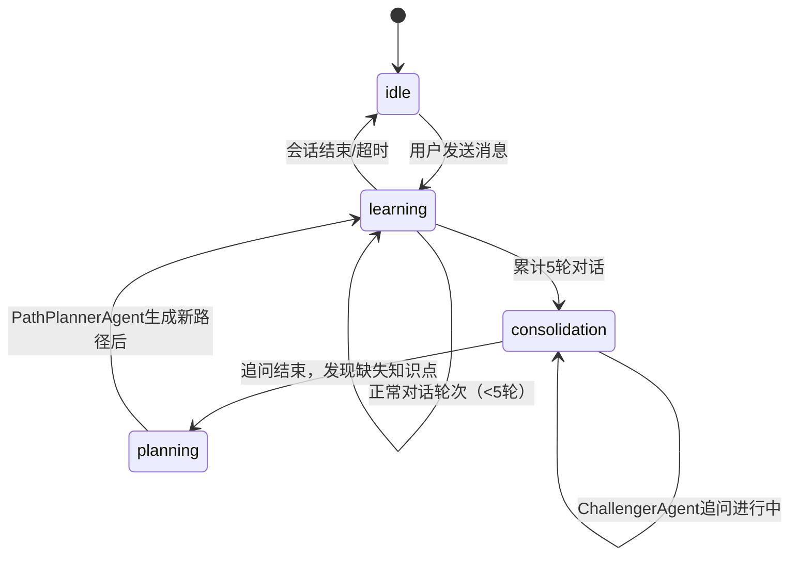
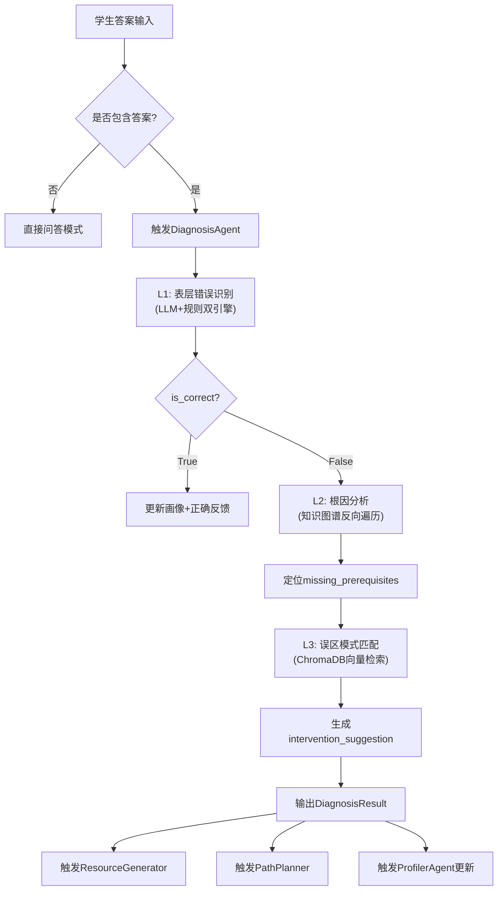
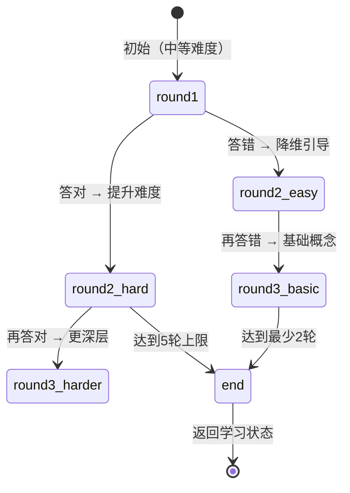

# AI 智能体架构设计说明书

| 项目 | 内容 |
|------|------|
| 项目名称 | Socrates-Cube 多智能体自适应计算机网络学习系统 |
| 文档版本 | v1.0 |
| 编制日期 | 2026-07-20 |
| 文档定位 | A3 赛道 AI 技术专项说明，对应"多智能体协同框架"核心要求 |
| 参考规范 | GB/T 8567-2006；RFC 9293/8446/791/1034/9110 |

---

## 一、概述

### 1.1 从"对错判断"到"认知理解"的范式转变

传统教育类 AI 问答系统的局限在于：系统只能告诉学生"对了"或"错了"，却无法解释：

- 这个错误属于哪一类认知偏差？
- 错误背后缺失的前置知识是什么？
- 这个学生历史上是否反复犯过同类错误？

Socrates-Cube 的核心设计理念是将 AI 的角色从**对错判断者**升级为**认知教练**：通过三层递进诊断深入理解学生的知识盲区，再通过个性化资源生成和路径规划给出有针对性的改进方案。

### 1.2 多 Agent 协同框架总体设计

系统选择 **Orchestrator 模式**而非 Pipeline 模式或完全自治 Agent 模式，核心原因如下：

| 设计选择 | 选择理由 |
|----------|----------|
| Orchestrator 集中调度 | 教学对话有明确的意图和状态，集中调度比 Agent 自主协商更可控 |
| 无状态专业 Agent | 每个 Agent 专注单一职责，便于独立测试和替换 |
| SSE 流式事件驱动 | 前端实时可见 Agent 执行链路，提升系统透明度 |
| session_id 共享上下文 | 多 Agent 通过同一会话 ID 读取共享状态，避免重复计算 |

**8 Agent 职责矩阵：**

| Agent | 核心职责 | 实现文件 | 代码规模 |
|-------|---------|---------|---------|
| OrchestratorAgent | 调度中枢、状态机、SSE管理 | orchestrator.py | 572行 |
| DiagnosisAgent | 三层认知诊断 | diagnosis.py | 381行 |
| ProfilerAgent | 8维画像、混合更新 | profiler.py | 362行 |
| RetrieverAgent | 三库向量检索、缓存 | retriever.py | — |
| ResourceGeneratorAgent | 5类资源生成、风格适配 | resource_generator.py | 660行 |
| PathPlannerAgent | 知识图谱路径规划 | path_planner.py | 304行 |
| ChallengerAgent | 苏格拉底追问、难度自适应 | challenger.py | 517行 |
| ScenarioAgent | 7场景协议仿真数据 | scenario.py | — |

---

## 二、OrchestratorAgent — 编排中枢

### 2.1 职责边界与设计动机

OrchestratorAgent 是唯一的外部入口，承担以下职责：

1. **意图理解**：判断用户消息类型（提问/答题/指令）；
2. **越界检测**：调用 `trust_mechanism.check_question_scope()` 检查是否为计算机网络范围内的问题；
3. **Agent 调度**：根据消息类型决定调用哪些 Agent、以何种顺序；
4. **状态机管理**：维护对话状态（idle/learning/consolidation/planning）；
5. **SSE 流管理**：将各 Agent 输出封装为 11 种标准 SSE 事件推送至前端；
6. **人格路由**：根据 `agent_persona` 参数选择对应系统提示词。

**核心方法签名：**
```
async def async_stream_reply(
    session_id: str,
    user_id: str,
    user_message: str,
    agent_persona: str = "professor"
) -> AsyncGenerator[str, None]
```

### 2.2 对话状态机设计



| 状态 | 触发 Agent | 主要行为 |
|------|-----------|---------|
| learning | Orchestrator, Diagnosis, Profiler, Retriever | 正常问答、实时诊断、画像更新 |
| consolidation | ChallengerAgent | 苏格拉底追问，2-5轮深度追问 |
| planning | PathPlannerAgent | 基于诊断生成/更新学习路径 |

### 2.3 Agent 调度决策逻辑

| 消息特征 | 触发 Agent 组合 | 说明 |
|----------|----------------|------|
| 普通提问 | Retriever → LLM → Profiler | 检索增强问答，后台更新画像 |
| 包含学生答案 | Retriever → LLM → Diagnosis → Profiler → Resource → Path | 完整诊断流程 |
| 越界问题 | trust_mechanism 拦截 | 返回 scope_notice 事件 |
| 5轮后触发 | Challenger | 状态切换至 consolidation |
| 诊断发现缺失节点 | PathPlanner | 状态切换至 planning |

### 2.4 SSE 事件流生命周期

```
请求到达
  │ → agent_start (OrchestratorAgent)
  │ → agent_start (RetrieverAgent)
  │ → agent_end (RetrieverAgent)
  │ → token × N（LLM流式输出片段）
  │ → agent_start (DiagnosisAgent) [条件]
  │ → diagnosis {完整诊断报告} [条件]
  │ → agent_end (DiagnosisAgent)
  │ → resource {资源列表} [条件]
  │ → path_update {路径节点} [条件]
  │ → state_change {状态转换} [条件]
  │ → agent_end (OrchestratorAgent)
  └ → done {统计信息}
```

---

## 三、DiagnosisAgent — 三层认知诊断引擎

### 3.1 设计动机

传统问答 AI 通过"答案对比"判断正误，这种方式的认知盲区在于：

- 学生可能"猜对了"（知道正确答案但不理解机制）；
- 学生可能"答错了但逻辑方向正确"（仅表述有偏差）；
- 同样是"答错"，可能是概念混淆、流程遗漏、协议层误判……不同错误类型需要完全不同的干预策略。

三层诊断框架的设计目标是：**不只判断对错，而是精确理解"为什么错"**。

### 3.2 L1 层：表面错误识别

**方法**：`_detect_surface_error(answer: str, context: str) -> SurfaceError`

**双引擎机制**：
1. **LLM 判断**：通过结构化 Prompt 让 LLM 将错误分类至 9 种类型并给出置信度；
2. **关键词规则**：基于错误类型关键词库进行快速预判，作为 LLM 结果的校验层。

**9 种错误类型枚举：**

| 错误类型 | 描述 | 典型例子 |
|----------|------|---------|
| layer_misplacement | 协议层归属错误 | 将 ARP 归类为传输层协议 |
| flow_omission | 流程步骤遗漏 | TCP 握手只说了 2 步 |
| concept_confusion | 概念混淆 | 将 TCP 连接与 UDP 连接混用 |
| field_misunderstanding | 协议字段理解错误 | 误解 TCP 序号为报文编号 |
| reasoning_breakdown | 推理逻辑断裂 | 拥塞控制结论与前提矛盾 |
| factual | 事实性错误 | TCP 端口范围填写错误 |
| security_misconception | 安全机制误解 | 误解 TLS 握手时机 |
| performance_confusion | 性能特征混淆 | UDP 延迟特征与 TCP 混淆 |
| over_simplification | 过度简化 | "HTTP 就是传 HTML" |

### 3.3 L2 层：根因分析

**方法**：`_analyze_root_cause(surface_error: SurfaceError, kg: KnowledgeGraph) -> RootCause`

**知识图谱反向遍历算法：**

```
输入：错误类型 + 相关知识节点 IDs
    │
    ▼
step1: 在知识图谱中定位当前知识节点
    │
    ▼
step2: 反向遍历有向边（向前置节点方向）
        对每个前置节点检查：mastery_map[node_id] < threshold
    │
    ▼
step3: 收集掌握度不足的前置节点 → missing_prerequisites
    │
    ▼
step4: 综合 LLM 推理：从缺失节点中选出最可能的根因
    │
    ▼
输出：root_causes 列表（按可能性降序排列）
```

**与 RFC 标准的关联**：诊断 TCP 相关错误时，DiagnosisAgent 引用 RFC 9293 中的连接状态机定义；诊断 TLS 错误时引用 RFC 8446；诊断 HTTP 错误时引用 RFC 9110。这确保了诊断的权威性和可解释性。

### 3.4 L3 层：误区模式匹配

**方法**：`_match_pattern(answer: str, error_type: str) -> MisconceptionPattern`

**向量检索流程：**
```
用户错误答案 → 向量化
    │
    ▼
ChromaDB misconceptions 集合相似度检索（TopK=3）
    │
    ▼
从24+条误解记录中匹配最相似的误解模式
    │
    ▼
返回：pattern 名称 + intervention_suggestion（干预建议）
```

**误解库字段结构：**
```json
{
  "id": "mc_001",
  "knowledge_point": "TCP连接建立",
  "misconception": "认为TCP三次握手是客户端单方面决定的",
  "error_type": "concept_confusion",
  "correct_answer": "三次握手是客户端与服务端双向协商...",
  "chapter": "第3章",
  "knowledge_node_ids": ["kp_007"],
  "weak_prerequisites": ["kp_005", "kp_006"],
  "interventions": ["重新理解TCP状态机", "对比分析SYN与SYN-ACK的方向性"],
  "kp_node_ids": ["kp_007", "kp_005"]
}
```

### 3.5 诊断输出报告结构

**完整的 10 字段诊断报告（DiagnosisResult）：**

| 字段 | 类型 | 说明 |
|------|------|------|
| is_correct | bool | 是否正确 |
| confidence | float (0-1) | 诊断置信度 |
| surface_error | str | 表层错误描述（自然语言） |
| error_type | str | 错误类型枚举值（9种之一） |
| root_causes | List[str] | 根因列表（按可能性排序） |
| missing_prerequisites | List[str] | 缺失前置知识节点 ID 列表 |
| pattern | str | 匹配到的误解模式名称 |
| intervention_suggestion | str | 干预建议（来自误解库） |
| related_node_ids | List[str] | 诊断涉及的知识节点 |
| agent_trace | List[dict] | L1/L2/L3 执行链路记录 |

### 3.6 三层诊断流程图



---

## 四、ProfilerAgent — 8 维动态学习画像

### 4.1 8 个能力维度定义

| 维度编号 | 维度名称 | 测量方式 | 更新触发 |
|----------|---------|---------|---------|
| D1 | conceptual_understanding | 概念题正确率及错误类型 | 每轮诊断 |
| D2 | protocol_analysis | 协议流程题表现 | 诊断含 flow_omission 时 |
| D3 | calculation_ability | 计算类题目准确度 | 计算题作答后 |
| D4 | error_diagnosis | 自我发现错误的能力 | challenger 追问结果 |
| D5 | system_design | 综合设计题表现 | 复杂问题回答质量 |
| D6 | knowledge_connection | 跨知识点关联能力 | L2根因多节点场景 |
| D7 | expression_clarity | 回答表述清晰度 | LLM评估 |
| D8 | self_correction | 自我纠错比率 | challenger 追问后的纠正率 |

**数值范围**：各维度值 ∈ [0, 1]，初始值通过 5 步引导问卷设定基线。

### 4.2 混合更新策略设计原理

**设计出发点**：纯 LLM 更新（每轮调用）成本高、延迟大；纯规则更新（无 LLM）不够智能，无法捕捉复杂认知状态变化。混合策略取两者之长：

```
每轮对话结束
    │
    ▼（无需LLM，< 50ms）
确定性增量更新
    - is_correct=True → 对应维度 × 1.05（上限1.0）
    - is_correct=False, error_type=flow_omission → D2 × 0.9
    - is_correct=False, error_type=concept_confusion → D1 × 0.88
    - ...（各错误类型对应不同维度的调整系数）
    │
    ▼
计数器 += 1
    │（满足条件：轮次 % 5 == 0 且未在去抖窗口内）
    ▼（每5轮，10秒去抖）
LLM 全量校准
    - 输入：最近5轮对话记录 + 当前画像
    - LLM 综合评估所有8维数值
    - 更新认知风格判断（visual/practical/textual/analogical）
    - 更新 mastery_map（20个KP节点掌握度）
```

**去抖机制**：10 秒去抖窗口防止在高并发场景下重复触发 LLM 全量更新。

### 4.3 认知风格识别

系统识别 4 种认知风格，并将其映射到资源类型偏好：

| 认知风格 | 描述 | 典型行为特征 |
|----------|------|-------------|
| visual | 视觉型 | 喜欢图表，问"能画图吗" |
| practical | 实践型 | 关注代码实现，问"怎么用" |
| textual | 文字型 | 喜欢文字说明，需要详细解释 |
| analogical | 类比型 | 喜欢用比喻理解概念 |

认知风格在 LLM 全量校准时由 LLM 综合判断，初次引导通过问卷收集偏好。

### 4.4 mastery_map 知识掌握度图

`mastery_map` 是 20 个 KP 节点（kp_001~kp_020）到掌握度分值（0-1）的映射：

```json
{
  "mastery_map": {
    "kp_001": 0.85,  "kp_002": 0.72,  "kp_003": 0.60,
    "kp_004": 0.91,  "kp_005": 0.45,  "kp_006": 0.38,
    ...
    "kp_020": 0.78
  }
}
```

掌握度更新逻辑：当 DiagnosisAgent 的 `related_node_ids` 包含某 KP 时，根据诊断结果（is_correct + confidence）更新该节点掌握度；PathPlannerAgent 使用掌握度识别薄弱节点优先规划。

---

## 五、RetrieverAgent — 知识检索

### 5.1 三库向量检索设计

RetrieverAgent 对三个 ChromaDB 集合分别执行向量检索，合并结果：

```python
# 并行检索三库（伪代码）
results_course = chroma.query(collection="course_docs", text=query, n=3)
results_rfc    = chroma.query(collection="protocol_specs", text=query, n=3)
results_misc   = chroma.query(collection="misconceptions", text=query, n=2)
# 合并去重，按相关度排序
context = merge_and_rank(results_course + results_rfc + results_misc)
```

| 集合 | 检索数量 | 内容特点 |
|------|---------|---------|
| course_docs | TopK=3 | 教材文字，适合概念解释 |
| protocol_specs | TopK=3 | RFC 规范，适合精确定义 |
| misconceptions | TopK=2 | 误解模式，适合错误分析 |

### 5.2 TTL 缓存机制

**设计动机**：同一用户在短时间内可能反复询问相似问题（如备考场景），TTL 缓存避免重复向量检索调用。

**缓存策略：**
- **Key**：查询文本的哈希值
- **TTL**：5 分钟（300秒）
- **容量上限**：200 条（LRU 淘汰）
- **缓存失效**：知识库更新时主动清除相关 Key

### 5.3 本地索引降级方案

`data/vector_db/local_index.json` 维护关键词倒排索引，当 ChromaDB 不可用时自动切换：

```json
{
  "index": {
    "TCP": ["course_docs_chunk_001", "course_docs_chunk_015", "rfc9293_chunk_003"],
    "三次握手": ["course_docs_chunk_001", "misconceptions_mc_003"],
    ...
  }
}
```

降级检索使用 BM25 关键词匹配代替向量相似度，相关性略低但功能可用。

---

## 六、ResourceGeneratorAgent — 多表征资源生成

### 6.1 5 类资源类型设计逻辑

| 资源类型 | 生成目标 | LLM Prompt 特点 |
|----------|---------|----------------|
| doc | 知识讲解文档（500-800字） | 结构化、术语准确、引用RFC |
| exercise | 练习题（3-5道，含答案解析） | 涵盖基础/理解/应用3个层次 |
| code | 代码示例（含注释） | 可运行、含关键逻辑说明 |
| mindmap | Mermaid 思维导图脚本 | mindmap 语法，3-4层结构 |
| script | 教学视频讲解脚本 | 口语化、分段、含演示指引 |

### 6.2 STYLE_PRIORITY 认知风格适配映射表

```python
STYLE_PRIORITY = {
    "visual":      ["mindmap", "script", "doc",      "exercise", "code"],
    "practical":   ["code",    "exercise","doc",      "mindmap",  "script"],
    "textual":     ["doc",     "exercise","mindmap",  "script",   "code"],
    "analogical":  ["doc",     "script",  "exercise", "mindmap",  "code"],
}
```

资源生成时按认知风格对应的顺序优先生成前 N 种，确保最相关的资源优先呈现。

### 6.3 诊断结果增强策略（ERROR_BOOST）

```python
ERROR_BOOST = {
    "flow_omission":       ["simulator"],   # 流程遗漏 → 追加协议仿真
    "layer_misplacement":  ["mindmap"],     # 层次错误 → 追加思维导图
    "concept_confusion":   ["exercise"],    # 概念混淆 → 追加练习题
    "factual":             ["doc"],         # 事实错误 → 追加文档说明
    "security_misconception": ["doc"],      # 安全误解 → 追加规范文档
}
```

ERROR_BOOST 在 STYLE_PRIORITY 基础上追加特定类型资源，确保针对性干预。

### 6.4 强化学习软依赖（LinUCB）

系统为 ResourceGeneratorAgent 设计了 LinUCB 上下文赌博机，用于学习用户对不同资源类型的历史偏好，进一步优化资源排序。当前实现为软依赖：

- LinUCB 可用时：根据用户历史交互数据（资源点击/收藏）优化排序；
- LinUCB 不可用时：自动降级使用 STYLE_PRIORITY 规则策略，功能正常但无个性化学习。

---

## 七、PathPlannerAgent — 可解释学习路径规划

### 7.1 KP-ACU 双层知识图谱建模

**设计理念**：单层知识图谱粒度不足（KP 太粗）或计算量过大（纯 ACU 太细）。KP-ACU 双层架构在两个粒度上协同：

| 层次 | 规模 | 作用 |
|------|------|------|
| KP 层（宏观） | 20节点，按1-7章组织 | 路径规划的基本单元，控制学习粒度 |
| ACU 层（微观） | 48节点，知识点的原子分解 | 精确定位误解，支持 L2 根因分析 |
| 依赖边 | 87条有向边 | KP→KP 前置依赖关系，驱动 Kahn 排序 |

**KP 节点示例（部分）：**

| 节点 ID | 名称 | 章节 | 难度 | 前置节点 |
|---------|------|------|------|---------|
| kp_001 | 计算机网络概述 | 第1章 | 1 | — |
| kp_005 | TCP/IP 协议族 | 第3章 | 2 | kp_001, kp_004 |
| kp_007 | TCP 连接管理 | 第3章 | 4 | kp_005, kp_006 |
| kp_012 | IP 地址与子网 | 第4章 | 3 | kp_005 |
| kp_019 | DNS 域名系统 | 第6章 | 3 | kp_012, kp_015 |

### 7.2 Kahn 拓扑排序算法

**算法步骤：**

```
输入：待学习节点集合 S（来自 missing_prerequisites）

step1: 将 S 中所有节点加入队列
step2: 对 S 中每个节点，DFS 搜索其前置依赖节点，
       将未掌握的前置节点（mastery < 0.6）加入 S
step3: 构建 S 的子图（只含 S 内部的有向边）
step4: 计算每个节点的入度（in-degree）
step5: 将入度为0的节点入队（学习起点）
step6: 循环：
       从队头取节点 u，加入路径列表
       对 u 的所有后继节点 v：
         in-degree[v] -= 1
         if in-degree[v] == 0: 入队
step7: 输出排好序的路径节点列表
```

**时间复杂度**：O(V + E)，V = 路径节点数，E = 依赖边数；在 20 节点规模下响应时间 < 50ms。

### 7.3 三维推荐理由生成

每个路径节点的 `recommendation_reason` 包含 3 个维度：

```json
{
  "graph_dependency": "该节点是 TCP连接管理(kp_007) 的前置知识，必须先掌握",
  "diagnosis_result": "诊断发现您在 flow_omission 类错误中涉及此节点(L2根因)",
  "cognitive_style": "根据您的实践型认知风格，此节点提供代码演示资源"
}
```

三维推荐理由使学习路径对学生透明可解释，增强学习自主性。

### 7.4 DQN 路径选择器（软依赖）

系统为 PathPlannerAgent 设计了 DQN（Deep Q-Network）强化学习优化器，用于在多条可行路径中选择最优学习顺序。当前为软依赖：

- DQN 可用时：基于学生历史学习数据（完成率、时间分布）动态优化路径顺序；
- DQN 不可用时：使用 Kahn 拓扑排序 + 掌握度加权的确定性策略，路径规划功能完整可用。

---

## 八、ChallengerAgent — 苏格拉底式概念挑战

### 8.1 苏格拉底式提问设计原则

苏格拉底式教学的核心在于"通过引导性问题让学习者自主发现真理"，而非直接给出答案。ChallengerAgent 的 Prompt 设计遵循以下原则：

1. **不直接指出错误**：问题形式为"你认为...的原因是什么？"而非"你答错了，正确答案是..."；
2. **渐进式引导**：从具体现象出发，引导学生向抽象原理归纳；
3. **自主发现**：通过追问让学生自己说出正确答案（教学效果更持久）；
4. **认知冲突**：故意提出边界情况，激发学生思考。

### 8.2 触发逻辑

```python
def should_trigger_challenger(state: DialogState) -> bool:
    # 条件1：诊断结果为错误
    if state.last_diagnosis and not state.last_diagnosis.is_correct:
        return True
    # 条件2：连续学习达到5轮
    if state.round_count >= 5 and state.state == "learning":
        return True
    return False
```

### 8.3 自适应难度状态机



### 8.4 轮次控制约束

- **最少 2 轮**：保证追问有足够深度，1 轮追问不足以产生认知突破；
- **最多 5 轮**：避免学生疲劳，超过 5 轮的追问收益递减；
- **fallback 题库**：内置 3 道预置挑战题（TCP握手/UDP vs TCP/ARP与MAC），在 LLM 不可用时保证功能。

---

## 九、ScenarioAgent — 协议交互仿真

### 9.1 7 个仿真场景设计

| 场景 ID | 名称 | 参考标准 | 可视化重点 |
|---------|------|---------|----------|
| tcp_handshake | TCP 三次握手 | RFC 9293 | SYN/SYN-ACK/ACK 时序图 |
| tcp_close | TCP 四次挥手 | RFC 9293 | FIN/ACK 双向关闭状态机 |
| sliding_window | 滑动窗口 | RFC 9293 | 发送窗口/接收窗口动态变化 |
| http_request | HTTP 请求/响应 | RFC 9110 | Request-Response 报文解析 |
| dns_resolution | DNS 递归查询 | RFC 1034/1035 | 查询树（根→TLD→权威服务器） |
| congestion_control | TCP 拥塞控制 | RFC 9293 | cwnd 慢启动/拥塞避免/快重传曲线 |
| arp_resolution | ARP 地址解析 | RFC 826 | 广播→响应的以太网帧流 |

### 9.2 Canvas 动画状态机原理

ScenarioAgent 向前端提供每个场景的状态机数据（JSON 格式），前端 Canvas 按帧渲染：

```json
{
  "scene": "tcp_handshake",
  "states": ["CLOSED", "SYN_SENT", "SYN_RECEIVED", "ESTABLISHED"],
  "transitions": [
    {"from": "CLOSED", "to": "SYN_SENT", "event": "客户端发送SYN", "packet": {...}},
    {"from": "SYN_SENT", "to": "SYN_RECEIVED", "event": "服务端发送SYN-ACK", ...},
    {"from": "SYN_RECEIVED", "to": "ESTABLISHED", "event": "客户端发送ACK", ...}
  ],
  "frames": [...]
}
```

前端通过 `useAnimationFrame` 消费状态机，支持暂停/步进/重置/速度调节。

---

## 十、多 Agent 协同机制

### 10.1 协同调用序列示例

**场景：学生回答 TCP 握手问题出现 flow_omission 错误**

```
用户: "TCP三次握手第二步是服务端发SYN"（遗漏了ACK字段）

→ [agent_start: OrchestratorAgent]
→ [agent_start: RetrieverAgent]
     检索 course_docs："TCP握手流程" TopK=3
     检索 protocol_specs：RFC 9293 相关段落 TopK=2
→ [agent_end: RetrieverAgent]
→ [token × N]: LLM流式输出答复（含引用来源）
→ [agent_start: DiagnosisAgent]
     L1: error_type = flow_omission (置信度 0.92)
     L2: 反向遍历 → missing: kp_007 (TCP连接状态机)
     L3: 匹配 mc_003 "握手忽略ACK字段"
→ [diagnosis: {is_correct:false, error_type:"flow_omission", ...}]
→ [agent_end: DiagnosisAgent]
→ [agent_start: ResourceGeneratorAgent]
     STYLE_PRIORITY(visual) + ERROR_BOOST(flow_omission→simulator)
     生成: mindmap(TCP握手) + simulator + doc
→ [resource: [{type:"mindmap",...}, {type:"simulator",...}]]
→ [agent_start: PathPlannerAgent]
     kp_007 未掌握 → DFS前置搜索 → kp_005, kp_006
     Kahn排序 → [kp_005, kp_006, kp_007]
→ [path_update: {nodes: [{id:"kp_005",...}, ...]，reason:{...三维理由...}}]
→ [agent_end: OrchestratorAgent]
→ [done: {elapsed_ms: 2840, tokens: 312}]
```

### 10.2 状态共享机制

各 Agent 通过 `session_id` 共享状态，核心数据通过数据库（agent_logs、student_profiles）持久化，无需 Agent 间直接通信：

| 数据 | 生产 Agent | 消费 Agent | 存储位置 |
|------|-----------|-----------|---------|
| 诊断结果 | DiagnosisAgent | PathPlanner, ResourceGenerator | agent_logs |
| 画像更新 | ProfilerAgent | OrchestratorAgent, ResourceGenerator | student_profiles |
| mastery_map | ProfilerAgent | PathPlannerAgent | student_profiles |
| 路径节点 | PathPlannerAgent | 前端 | learning_paths |

### 10.3 错误传播与降级策略

| 异常场景 | 处理策略 |
|----------|---------|
| LLM 调用超时 | 返回 error 事件，提示用户重试；同时激活 Mock 响应 |
| DiagnosisAgent 异常 | 跳过诊断，继续正常对话流，不中断用户体验 |
| ResourceGeneratorAgent 异常 | 返回空资源列表，前端显示"生成失败，请重试" |
| PathPlannerAgent 异常 | 保持当前路径不变，不触发 path_update 事件 |
| 全部 Agent 异常 | 降级为纯 LLM 问答模式，保证基本对话可用 |

---

## 十一、Prompt 工程设计

### 11.1 Prompt 架构分类

系统共维护 12 个 Prompt 模板文件（`config/prompts/` 目录），按功能分 3 类：

| 类型 | 模板文件 | 作用 |
|------|---------|------|
| 角色型 | `profiler/` (3个) | 定义不同教师人格的回答风格 |
| 任务型 | `diagnosis/` (3个), `resource_generator/` (6个) | 功能性任务指令 |
| 输出约束型 | `orchestrator/` (1个), `trust/` (2个) | JSON结构化输出、边界控制 |

### 11.2 4 种虚拟教师人格设计策略

| 人格 | 核心设计要点 | 典型输出风格 |
|------|-------------|-------------|
| professor（教授） | 结构严谨，引用RFC标准，强调学术准确性 | "根据RFC 9293第3.3节，TCP状态机定义..." |
| engineer（工程师） | 实战导向，给出代码，关注可执行性 | "在Linux下可以用ss命令观察TCP状态：`ss -tn`..." |
| peer（同学） | 口语化，共情，鼓励探索 | "这个我当初也搞混过，你可以这样理解..." |
| interviewer（面试官） | 反向追问，施加压力，暴露盲点 | "你说是三次握手，那为什么不能是两次？" |

### 11.3 诊断型 Prompt 的 JSON 结构化输出约束

DiagnosisAgent 的 Prompt 中包含严格的 JSON 输出约束，示例：

```
请以以下 JSON 格式输出诊断结果，不得添加额外文字：
{
  "is_correct": <boolean>,
  "confidence": <0.0-1.0>,
  "surface_error": "<一句话描述表层错误>",
  "error_type": "<从以下选一：layer_misplacement|flow_omission|concept_confusion|
                  field_misunderstanding|reasoning_breakdown|factual|
                  security_misconception|performance_confusion|over_simplification>",
  "root_causes": ["<根因1>", "<根因2>"],
  "intervention_suggestion": "<建议>"
}
```

这种结构化约束大幅降低了 LLM 输出解析失败率。

### 11.4 越界防护（trust_mechanism）

`src/loopse/core/trust_mechanism.py` 实现问题范围检测：

- **检测范围**：仅回答计算机网络相关问题（协议、拓扑、安全、性能等）；
- **越界判断**：LLM 判断 + 关键词规则双重验证；
- **响应行为**：发送 `scope_notice` SSE 事件，提示学生问题超出系统专业范围；
- **防止绕过**：在每个 Agent 的系统提示词中重申领域限制。

---

## 十二、设计局限与后续改进方向

### 12.1 强化学习优化（当前状态）

当前 RL 组件为软依赖，尚未在生产环境中完整验证：

| RL 组件 | 当前状态 | 后续改进方向 |
|---------|---------|-------------|
| LinUCB（资源排序） | 软依赖，降级规则策略 | 收集用户交互数据后激活 |
| DQN（路径选择） | 软依赖，降级 Kahn 算法 | 积累学习效果数据后训练 |

### 12.2 域外检测精细化

当前 trust_mechanism 基于 LLM 判断 + 规则，存在边界情况（如计算机网络与软件工程交叉问题）判断不够精确，后续可通过：
- 构建更精细的计算机网络概念词典；
- 引入分类模型替代 LLM 判断（降低延迟和成本）。

### 12.3 多模态能力扩展

当前 script 资源类型仅生成文字脚本，赛题要求的"多模态视频/动画"生成（如集成 SeeDance 等工具）可作为后续扩展方向，当前版本以协议仿真 Canvas 动画作为多模态的实现形式。

---

*文档版本：v1.0 · A3赛道AI技术专项文档 · 参赛：第十五届中国软件杯*
