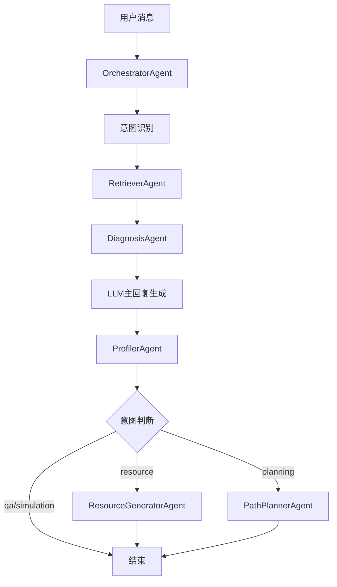

# 软件概要设计说明书（SDD）
# Software Design Description

| 文档标识 | SC-SDD-001 |
|:---:|:---|
| 项目名称 | Socrates-Cube 多智能体自适应《计算机网络》学习系统 |
| 版本号 | v1.0 |
| 编制日期 | 2026-07-20 |
| 参考标准 | GB/T 8567-2006《计算机软件文档编制规范》 |
| 依赖文档 | SC-SRS-001（软件需求规格说明书） |

---

## 第一章 引言

### 1.1 设计目标

本文档描述 Socrates-Cube 系统的整体架构设计，包括系统分层结构、模块划分、技术选型理由、AI系统专项设计（多Agent协同、SSE通信、RAG知识库）、接口设计和安全设计。

设计遵循以下原则：
- **关注点分离**：前端/API/Agent/知识库/LLM五层各司其职
- **可降级性**：关键外部依赖（LLM、ChromaDB）均有降级方案
- **可观测性**：SSE事件流提供Agent执行链路的实时可视化
- **可扩展性**：Agent模块独立，新增专业Agent无需修改现有代码

### 1.2 参考文档

1. SC-SRS-001 软件需求规格说明书
2. GB/T 8567-2006 计算机软件文档编制规范
3. FastAPI 官方文档；ChromaDB 官方文档；sparkai SDK 文档

---

## 第二章 系统总体架构

### 2.1 五层逻辑架构

```
┌─────────────────────────────────────────────────────────────┐
│  Layer 1 - 前端层（Frontend Layer）                          │
│  Vue3 3.5.29 | Vue Router 4.6.4 | Pinia 2.3.1              │
│  ECharts 5.6.0 | Element Plus 2.13.2 | TypeScript 5.9.3    │
│  9个业务视图页面 | SSE事件消费 | 实时图表渲染                 │
├─────────────────────────────────────────────────────────────┤
│  Layer 2 - API层（API Gateway Layer）                        │
│  FastAPI 0.111.0 | Uvicorn 0.29.0 | sse-starlette 2.1.0   │
│  10个REST/SSE端点 | Pydantic数据验证 | CORS跨域配置          │
├─────────────────────────────────────────────────────────────┤
│  Layer 3 - Agent层（Multi-Agent Layer）                      │
│  OrchestratorAgent（编排中枢）                               │
│  ├─ DiagnosisAgent  ├─ ProfilerAgent  ├─ RetrieverAgent    │
│  ├─ ResourceGeneratorAgent  └─ PathPlannerAgent            │
│  CognitiveAgentMixin（plan-act-reflect基类）                 │
├─────────────────────────────────────────────────────────────┤
│  Layer 4 - 知识层（Knowledge Layer）                         │
│  ChromaDB 0.5.0（向量库，3个集合）                           │
│  KnowledgeGraph（图谱，KP/ACU双层节点）                      │
│  误解库 JSON（150条，23种错误类型）                           │
│  本地TF-IDF索引（降级）                                      │
├─────────────────────────────────────────────────────────────┤
│  Layer 5 - LLM层（LLM Layer）                               │
│  讯飞星火（sparkai 0.1.8，wss WebSocket）                    │
│  LangChain 0.2.1（RAG管道）                                 │
│  Mock客户端（离线降级）                                      │
└─────────────────────────────────────────────────────────────┘
```

### 2.2 部署架构

系统采用**前后端分离**的单机部署架构：

```
用户浏览器
    ↓ HTTP + SSE（localhost:5173 开发 | nginx代理 生产）
Vue3前端（Vite开发服务器 / nginx静态托管）
    ↓ REST API + SSE（POST /api/v1/chat/stream）
FastAPI后端（uvicorn，port 8000）
    ├─ SQLite（edu_agent.db，开发环境）/ MySQL（生产环境）
    ├─ ChromaDB（本地持久化，data/vector_db/）
    └─ 讯飞星火API（wss://spark-api.xf-yun.com，外网）
```

**容器化支持**：项目提供 Dockerfile（后端）和 docker-compose.yml，支持容器化部署。Windows环境下提供 start.bat 一键启动脚本（同时启动后端Uvicorn和前端Vite）。

### 2.3 技术选型理由

| 技术 | 选型理由 |
|---|---|
| FastAPI | 原生异步支持（async/await），与sse-starlette完美配合实现SSE流式响应；自动生成OpenAPI文档；Pydantic数据验证 |
| Vue3 + Composition API | 响应式系统高效，Composition API便于封装SSE消费逻辑（useSSE Composable）；配合Pinia实现跨组件状态共享 |
| ChromaDB | 轻量级本地向量数据库，无需额外服务进程，支持余弦相似度检索；开发环境零配置；内置Python SDK |
| SQLAlchemy + aiosqlite | 异步SQLite驱动，与FastAPI异步生态兼容；SQLAlchemy ORM支持生产环境无缝切换到MySQL |
| 讯飞星火（sparkai） | 国内LLM API，合规性强；WebSocket流式接口天然适配SSE事件流设计；免费配额满足演示需求 |
| LangChain | 提供标准的RAG管道抽象（文档加载、文本分割、向量化、检索链）；生态成熟，便于扩展 |
| TF-IDF本地降级 | 当ChromaDB不可用时，纯Python实现的关键词检索保证零外部依赖的降级能力 |

### 2.4 数据流说明

**标准对话请求的完整数据流**：

```
① 用户输入消息（ChatView前端）
      ↓ POST /api/v1/chat/stream（JSON）
② FastAPI路由（chat.py）创建SSE响应生成器
      ↓ 调用 OrchestratorAgent.async_stream_reply()
③ Orchestrator → 推送 agent_start 事件（"Orchestrator"）
      ↓
④ Orchestrator 调用 RetrieverAgent.search_all()
   ├─ LLM扩展查询关键词
   ├─ 向量检索（course_docs/protocol_specs/misconceptions）
   └─ 知识图谱关键词匹配
      ↓ 推送 agent_start/agent_end 事件（"Retriever"）
⑤ Orchestrator 调用 DiagnosisAgent.diagnose()
   ├─ L1: _detect_surface_error()（LLM + 硬规则）
   ├─ L2: _analyze_root_cause()（LLM，条件执行）
   └─ L3: _match_pattern()（LLM + 误解库，条件执行）
      ↓ 推送 diagnosis + agent_end 事件（"Diagnosis"）
⑥ Orchestrator 调用 LLM 生成主回复
   └─ 逐token 推送 token 事件
      ↓ 推送 agent_end 事件（"Orchestrator"）
⑦ Orchestrator 调用 ProfilerAgent.update_from_dialogue()
      ↓ 推送 agent_end 事件（"Profiler"）
⑧ 按意图触发（可选）：
   ├─ resource意图 → ResourceGeneratorAgent.generate() → 推送 resource 事件
   └─ planning意图 → PathPlannerAgent.plan() → 推送 path_update 事件
⑨ 持久化：SessionRepository + AgentLogRepository
      ↓ 推送 done 事件（含session_id和总耗时）
⑩ 前端接收完成，更新UI（聊天消息/诊断面板/画像图表）
```

---

## 第三章 模块划分与职责

### 3.1 后端模块

```
src/loopse/
├── main.py              # FastAPI应用入口，Router注册，CORS，DB初始化
├── api/                 # API层（路由处理）
│   ├── chat.py          # POST /api/v1/chat/stream（SSE流式对话）
│   ├── profile.py       # GET/POST /api/v1/profile/{user_id}
│   ├── path.py          # GET/POST /api/v1/path/**（路径规划）
│   ├── resources.py     # GET/POST /api/v1/resources/**（资源生成）
│   └── logs.py          # GET /api/v1/logs/session/{session_id}
├── agents/              # Agent层
│   ├── orchestrator.py  # OrchestratorAgent（编排中枢）
│   ├── diagnosis.py     # DiagnosisAgent（三层认知诊断）
│   ├── profiler.py      # ProfilerAgent（8维画像更新）
│   ├── retriever.py     # RetrieverAgent（多库检索）
│   ├── resource_generator.py  # ResourceGeneratorAgent（三类资源生成）
│   ├── path_planner.py  # PathPlannerAgent（路径规划）
│   └── cognitive_engine.py    # CognitiveAgentMixin基类
├── kb/                  # 知识层
│   ├── knowledge_graph.py  # KnowledgeGraph（图谱操作，Kahn排序等）
│   └── vector_store.py     # VectorStore（ChromaDB + TF-IDF降级）
├── db/                  # 数据层
│   ├── models.py        # SQLAlchemy ORM模型（10张表）
│   ├── repositories.py  # Repository模式数据访问层
│   └── connection.py    # 数据库连接与初始化
└── core/
    └── llm_client.py    # LLM客户端（讯飞星火 + Mock降级）
```

### 3.2 前端模块

```
frontend/src/
├── views/               # 9个业务视图页面
│   ├── HomeView.vue     # 首页与功能导航
│   ├── ChatView.vue     # SSE流式对话 + Agent链路可视化
│   ├── ProfileView.vue  # 8维能力画像（ECharts雷达图）
│   ├── SimulatorView.vue # 协议仿真实验室
│   ├── DiagnosisView.vue # 诊断结果面板
│   ├── ResourcesView.vue # 学习资源管理
│   ├── PathView.vue     # 学习路径展示
│   ├── LogsView.vue     # Agent执行日志
│   └── ChallengerView.vue # 概念挑战问答
├── stores/              # Pinia状态管理
├── composables/         # 可复用逻辑（SSE消费等）
├── api/                 # Axios HTTP客户端封装
├── components/          # 通用UI组件
├── router/index.ts      # Vue Router路由配置
└── types/               # TypeScript类型定义
```

### 3.3 数据层

| 存储类型 | 技术 | 用途 |
|---|---|---|
| 关系数据库 | SQLite（开发）/ MySQL（生产） | 用户、画像、会话、日志、路径等结构化数据 |
| 向量数据库 | ChromaDB 0.5.0 | course_docs/protocol_specs/misconceptions三集合语义检索 |
| 本地JSON索引 | TF-IDF（local_index.json） | ChromaDB降级后的关键词检索 |
| 知识图谱 | 内存中 KnowledgeGraph 对象 | 拓扑排序、前置查询、关键词匹配 |
| 误解库 | data/misconceptions.json（150条） | 误区模式匹配的数据源 |

---

## 第四章 AI系统专项设计

### 4.1 多Agent协同架构（Orchestrator模式）

系统采用**中心化编排（Centralized Orchestration）**模式，OrchestratorAgent作为唯一入口，通过同步调用管理各专业Agent的执行顺序。



**设计要点**：
- 各Agent之间无直接依赖，通过Orchestrator传递数据
- 每个Agent调用使用 `use_tool()` 包装，自动记录执行追踪（AgentTrace）
- Agent执行失败时，Orchestrator捕获异常并推送error事件，不影响其他Agent

### 4.2 SSE事件流设计

系统使用 `sse-starlette` 库实现 Server-Sent Events，`text/event-stream` MIME类型。

**SSE数据包格式（JSON）**：
```json
{
  "event": "diagnosis",
  "agent_name": "Diagnosis",
  "data": {
    "is_correct": false,
    "surface_error": "把TCP三次握手误认为两次握手",
    "error_type": "flow_omission",
    "confidence": 0.9
  },
  "timestamp": "2026-07-20T10:05:23.456Z"
}
```

**事件类型定义**：

| 事件类型 | 触发时机 | data字段含义 |
|---|---|---|
| agent_start | Agent开始执行前 | {"message": "执行说明文字"} |
| agent_end | Agent执行完毕后 | {"message": "摘要", "is_correct": bool（可选）} |
| diagnosis | DiagnosisAgent完成后 | 完整DiagnosisResult（10字段）|
| token | LLM生成每个token时 | {"token": "文字片段"} |
| resource | ResourceGeneratorAgent完成后 | 完整资源对象 |
| path_update | PathPlannerAgent完成后 | 完整路径对象（path_id + nodes）|
| done | 整个工作流完成后 | {"session_id": str, "total_time_ms": int, "trace": dict} |
| error | 任意Agent发生未处理异常时 | {"error": "错误描述"} |

### 4.3 RAG知识库架构

**三库分工设计**：

| 集合 | 内容 | 使用场景 |
|---|---|---|
| course_docs | 课程章节讲义（5章），已向量化 | 所有QA问答的背景知识检索 |
| protocol_specs | 11个RFC协议规范摘要 | 协议相关问题的权威来源 |
| misconceptions | 150条误解记录（全文） | DiagnosisAgent的L3层误区匹配 |

**检索流程**：
1. LLM扩展查询关键词（`_expand_query`，max_tokens=80）
2. 并发检索3个集合，各取top-5相关文档
3. 向量检索优先（ChromaDB余弦相似度）；降级时使用TF-IDF关键词匹配
4. 知识图谱关键词匹配补充（`search_by_keyword`，取前5节点）

**降级方案**：`VectorStore` 在初始化时尝试连接ChromaDB，失败时设置 `available=False`，所有查询自动路由至 `_search_local()`（TF-IDF）。降级状态对调用方透明。

### 4.4 Prompt工程设计原则

系统中所有Agent的Prompt模板存储在 `config/prompts/` 目录，支持运行时热加载（`_load_prompt()`）。

**Prompt设计原则**：
1. **角色定义**：每个Prompt开头明确LLM扮演的角色（如"你是计算机网络课程助教"）
2. **约束注入**：在Prompt中明确输出格式（JSON），减少LLM自由发挥
3. **JSON结构化输出**：诊断类Prompt要求返回严格JSON，通过 `_parse_json()` 提取
4. **容错设计**：`_format_prompt()` 捕获KeyError，确保Prompt模板缺少占位符时不崩溃
5. **苏格拉底式**：主回复Prompt要求LLM给出"可操作的理解框架+追问"而非直接给结论

**主回复Prompt结构**：
```
角色定义（苏格拉底助教）+ 参考知识（检索文档）+ 诊断提示（错误干预）
+ 对话历史（最近8条）+ Agent推理轨迹（JSON，限1200字符）
+ 学生问题 → 要求中文、结构清晰、友好
```

### 4.5 LLM容错降级机制

| 降级场景 | 触发条件 | 降级行为 |
|---|---|---|
| LLM API连接失败 | XUNFEI_APP_ID 未配置或网络异常 | 使用 Mock 客户端返回预设内容 |
| 诊断LLM调用失败 | `llm_client.chat()` 抛出异常 | 返回空数据，诊断结果标记为低置信度 |
| 画像LLM调用失败 | ProfilerAgent LLM调用异常 | delta为空，仅执行确定性mastery_map更新 |
| ChromaDB不可用 | ChromaDB初始化失败 | 自动切换TF-IDF本地索引 |

---

## 第五章 接口设计

### 5.1 前后端接口约定

- **REST接口**：JSON请求体，JSON响应，Content-Type: application/json
- **SSE接口**：`POST /api/v1/chat/stream` 响应 Content-Type: text/event-stream
- **错误响应**：统一使用 FastAPI HTTPException，格式：`{"detail": "错误描述"}`
- **日期时间**：ISO 8601格式（UTC，以Z结尾）

### 5.2 外部API接口

**讯飞星火API**：
- 协议：WebSocket（wss://spark-api.xf-yun.com/v3.5/chat）
- 认证：HMAC-SHA256签名（APP_ID + API_KEY + timestamp + nonce）
- 请求体：spark Chat Completions格式（含messages数组）
- 响应：流式token输出

---

## 第六章 安全设计

### 6.1 身份认证

当前版本使用用户名（username字符串）作为身份标识，通过 `UserRepository.get_or_create()` 实现账号自动创建。生产环境建议在此基础上增加JWT令牌机制（passlib bcrypt密码哈希）。

### 6.2 域外问题处理

OrchestratorAgent通过意图识别 `_detect_intent()` 对用户消息分类。系统可扩展trust_mechanism模块对非计算机网络领域问题进行拦截提示（当前版本对域外问题不强制拦截，但LLM主回复Prompt中已注入领域约束）。

### 6.3 数据安全

- 讯飞星火API密钥存储在 `.env` 文件（已加入 `.gitignore`，不提交到版本控制）
- 数据库连接字符串通过环境变量 `DATABASE_URL` 注入
- 会话消息保留最近80条，超出自动裁剪，防止内存溢出

---

## 第七章 数据架构概述

### 7.1 关系数据库（10张表）

| 表名 | 用途 | 主键类型 |
|---|---|---|
| users | 用户账号 | String UUID |
| student_profiles | 8维画像+mastery_map（JSON存储）| FK→users.id |
| chat_sessions | 对话会话（含消息历史JSON）| String UUID |
| agent_logs | Agent执行日志 | String UUID |
| knowledge_nodes | 知识节点记录 | String（kn_xxx格式）|
| learning_resources | 生成的学习资源 | String UUID |
| learning_paths | 学习路径 | String UUID |
| learning_path_nodes | 路径节点详情 | String（path_id:node_id）|
| assessment_records | 测评记录 | String UUID |
| misconception_records | 用户误解记录 | String UUID |

### 7.2 向量数据库

ChromaDB存储3个集合，每个文档包含：
- `document`：文本内容（向量化依据）
- `metadata`：元数据（source/chapter/type等）
- `id`：文档唯一标识

### 7.3 非结构化数据

- **知识图谱**（内存加载）：KP/ACU双层节点 + 有向边（前置依赖关系）
- **误解库**（data/misconceptions.json）：150条，23种错误类型，含interventions策略
- **学生画像**（student_profiles.profile_json）：8维float分数 + mastery_map字典 + weak/strong_points列表 + turn_count整数

---

*本文档遵循 GB/T 8567-2006 SDD 规范编制。架构图使用 Mermaid 语法，可在支持 Mermaid 的 Markdown 渲染器中查看。*
