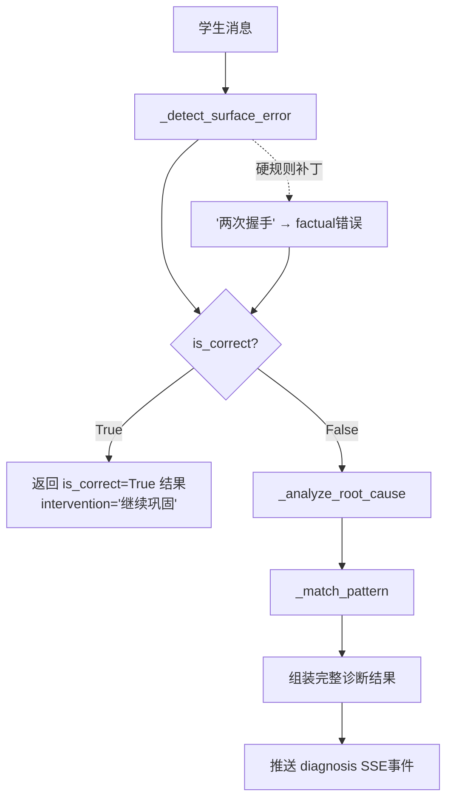

# AI Agent 架构设计说明书
# AI Agent Architecture Design Document

| 文档标识 | SC-AIARCH-001 |
|:---:|:---|
| 项目名称 | Socrates-Cube 多智能体自适应《计算机网络》学习系统 |
| 版本号 | v1.0 |
| 编制日期 | 2026-07-20 |
| 参考标准 | GB/T 8567-2006；第十五届中国软件杯A3赛题技术要求 |
| 依赖文档 | SC-SRS-001；SC-SDD-001 |

---

## 第一章 概述

### 1.1 设计目标

传统智能教学系统的核心局限在于：**只能判断"对错"，不能告知"为什么错"**。学生得到一个红叉后，既不知道错误的性质，也不知道根本原因，更不知道如何修正。

Socrates-Cube 的 AI Agent 架构围绕一个核心范式转变而设计：

> 从"判断对错（right/wrong binary）"到"理解认知过程（cognitive process understanding）"

具体体现为：
1. **三层递进诊断**：表面错误 → 根本原因 → 误区模式，层层深入
2. **持续学习建模**：每轮对话都更新8维学习画像，实现真正个性化
3. **知识图谱驱动**：路径规划基于知识点前置依赖，而非固定课程顺序
4. **苏格拉底式交互**：系统不直接给答案，而是通过追问引导学生自我修正

### 1.2 Agent总体框架

系统采用**中心化编排（Centralized Orchestration）**架构，由1个编排中枢和5个专业Agent组成：

```
                    用户消息
                        ↓
              ┌─────────────────┐
              │  OrchestratorAgent │  意图识别 + 工作流编排 + SSE推送
              └────────┬────────┘
                       │ 调度（同步串行，按需并选）
         ┌─────────────┼──────────────────┐
         ↓             ↓                  ↓
┌──────────────┐ ┌──────────────┐ ┌──────────────┐
│RetrieverAgent│ │DiagnosisAgent│ │ ProfilerAgent│
│  知识检索    │ │  三层诊断    │ │  8维画像更新 │
└──────────────┘ └──────────────┘ └──────────────┘
         ↓（按意图触发）
┌──────────────┐  ┌──────────────┐
│ResourceGen   │  │ PathPlanner  │
│  资源生成    │  │  路径规划    │
└──────────────┘  └──────────────┘
```

所有Agent继承自 `CognitiveAgentMixin`，具备 plan-act-reflect 三阶段认知工作流（`make_trace()` / `use_tool()` / `reflect()`）。

---

## 第二章 OrchestratorAgent（编排中枢）

### 2.1 职责范围

文件：`src/loopse/agents/orchestrator.py`（217行）

OrchestratorAgent 是系统的唯一入口，负责：
1. **意图识别**：基于关键词匹配将用户消息分类为 qa / resource / planning / simulation 四种意图
2. **工作流编排**：按固定顺序调度各专业Agent（Retriever → Diagnosis → LLM主回复 → Profiler → 可选资源/路径）
3. **SSE事件发布**：将每个Agent的执行状态通过 `_sse()` 方法格式化并推送给前端
4. **数据持久化**：会话消息和Agent日志写入数据库

### 2.2 意图识别逻辑

```python
_SIMULATION_KW = ["步骤", "过程", "握手", "挥手", "流程", "演示", "模拟"]
_PLANNING_KW = ["先学什么", "学习计划", "学习路径", "我该", "建议我", "学习顺序"]
_RESOURCE_KW = ["给我", "生成", "总结", "思维导图", "练习题", "代码示例", "代码", "例题"]
```

判断逻辑：`_detect_intent()` 检查关键词存在性，优先级 planning > resource > simulation > qa。

### 2.3 SSE事件流管理

`_sse()` 方法生成标准格式的SSE数据字符串：

```python
def _sse(event: str, agent_name: str, data: Any) -> str:
    payload = {
        "event": event,
        "agent_name": agent_name,
        "data": data,
        "timestamp": datetime.utcnow().isoformat()
    }
    return f"data: {json.dumps(payload, ensure_ascii=False, default=str)}\n\n"
```

**心跳机制**：由 sse-starlette 框架自动维护，超时断开后客户端重连。

### 2.4 AgentTrace追踪系统

每次 `async_stream_reply()` 调用都创建一个 `AgentTrace` 对象，记录完整的推理轨迹：

```python
trace.add_step("intent", user_message[:120], intent, confidence=0.82)
trace.add_step("diagnosis_policy", surface_error_str, policy, confidence)
trace.add_step("final_reflection", f"reply_len={len(reply)}, intent={intent}", "complete", 0.9)
```

trace 最终通过 done 事件推送给前端，供调试和教学分析使用。

---

## 第三章 DiagnosisAgent（三层认知诊断引擎）

### 3.1 设计背景

传统教学系统对学生回答的处理方式是：调用LLM → 得到"正确"/"错误"结论 → 展示给学生。这种方式的问题是：
- 学生不知道"错在哪里"（无表面错误定位）
- 更不知道"为什么会错"（无根因分析）
- 反复犯同类错误也没有干预（无误区模式识别）

三层诊断框架针对这三个缺口设计，层层深入。

**文件**：`src/loopse/agents/diagnosis.py`（241行）

### 3.2 L1层：表面错误检测（_detect_surface_error）

**设计目标**：确定学生回答是否包含事实性错误、概念混淆或逻辑错误，给出初步分类。

**实现机制**：
1. 构建Prompt（surface_error.txt 或默认模板），调用 `llm_client.chat(prompt, max_tokens=300)`
2. LLM返回JSON，提取 is_correct / surface_error / error_type / confidence 字段
3. **硬规则补丁**（`_normalize_surface()`）：
   - 检测到"两次握手"或"二次握手" → 强制 `is_correct=False`，`error_type="factual"`
   - 确保高频错误的零漏判率

**L1输出字段**：

| 字段 | 类型 | 说明 |
|---|---|---|
| is_correct | bool | 回答是否正确 |
| surface_error | str \| None | 表面错误的自然语言描述 |
| error_type | str | 23种错误类型之一（如flow_omission/concept_confusion）|
| confidence | float | 判断置信度 0~1 |
| has_error | bool | 是否检测到错误（与 is_correct 互补）|
| related_node_ids | list[str] | 相关知识节点ID（如["kn_005"]）|

### 3.3 L2层：根因分析（_analyze_root_cause）

**设计目标**：在L1确认存在错误后，深挖错误的认知根源——学生是因为缺乏哪些前置知识才出现这个错误。

**实现机制**：
1. 以L1的 surface_error 为输入，构建 root_cause.txt Prompt
2. 调用LLM，要求返回 root_causes（根因列表）和 missing_prerequisites（缺失前置知识ID列表）
3. 解析响应，兼容数组格式和对象格式（`_analyze_root_cause()` 中的 isinstance 判断）

**L2输出字段**：

| 字段 | 类型 | 说明 |
|---|---|---|
| root_causes | list[str] | 根本原因文字描述列表 |
| missing_prerequisites | list[str] | 缺失前置知识节点ID列表 |

### 3.4 L3层：误区模式匹配（_match_pattern）

**设计目标**：将学生的具体错误归类到已知的误区模式库中，输出标准化的干预策略。

**实现机制**：
1. 以L1的 surface_error 和 L2的 root_causes 为输入，构建 pattern_match.txt Prompt
2. 调用LLM，匹配最接近的误区模式名称（pattern）和干预建议（intervention_suggestion）
3. 干预策略类型：simulation（仿真演示）/ doc（参考文档）/ exercise（练习题）/ follow_up_question（追问引导）/ contrast_table（对比表格）

**L3输出字段**：

| 字段 | 类型 | 说明 |
|---|---|---|
| pattern | str | 误区模式名称（如"握手次数混淆"）|
| intervention_suggestion | str | 具体干预建议文字 |

### 3.5 完整诊断结果（10字段）

```python
{
    "is_correct": False,
    "confidence": 0.9,
    "surface_error": "把TCP三次握手误认为两次握手",
    "error_type": "flow_omission",
    "root_causes": ["对TCP连接建立的目的理解不足"],
    "missing_prerequisites": ["kn_005"],
    "pattern": "握手次数混淆",
    "intervention_suggestion": "通过TCP握手仿真动画演示，让学生观察第三次ACK的作用",
    "related_node_ids": ["kn_005"],
    "agent_trace": { ... }  # 三层执行轨迹
}
```

### 3.6 三层诊断流程图



---

## 第四章 ProfilerAgent（8维学习画像）

### 4.1 8个能力维度定义与测量方法

**文件**：`src/loopse/agents/profiler.py`（158行）

| 维度 | 英文标识 | 测量角度 |
|---|---|---|
| 概念理解 | conceptual_understanding | 能否准确描述协议概念和机制 |
| 协议分析 | protocol_analysis | 能否分析协议执行过程和状态变化 |
| 计算能力 | calculation_ability | 能否正确推导序号、窗口大小等数值 |
| 错误诊断 | error_diagnosis | 能否识别并纠正网络问题 |
| 系统设计 | system_design | 能否设计或评估网络架构方案 |
| 知识关联 | knowledge_connection | 能否建立跨协议层的知识联系 |
| 表达清晰 | expression_clarity | 回答的结构性和准确性 |
| 自我纠正 | self_correction | 被追问后能否主动修正错误 |

初始值：所有维度默认 0.5（中等水平）

### 4.2 混合更新策略设计

**策略A：LLM增量校准**（每轮对话触发）

```
输入：当前8维分数 + 最新对话内容（user_msg + agent_reply + diagnosis_json）
LLM Prompt → 返回JSON：
{
  "conceptual_understanding": 0.05,    # 正增量：本轮表现较好
  "protocol_analysis": -0.10,          # 负增量：协议分析出现错误
  "calculation_ability": 0.0,          # 无证据：不更新
  ...                                  # 其他维度同理
}
更新公式：dim_score = clamp(old_score + delta, 0.1, 1.0)
delta ∈ [-0.2, +0.2]（_parse_delta中边界约束）
```

**策略B：确定性掌握度更新**（基于诊断结果，每次诊断后触发）

```python
for node_id in diagnosis_result["related_node_ids"]:
    old_mastery = mastery_map.get(node_id, 0.5)
    change = +0.05 if diagnosis_result["is_correct"] else -0.07
    mastery_map[node_id] = clamp(old_mastery + change, 0.0, 1.0)
```

**降级设计**：LLM调用失败时（`except Exception`），delta为空字典，仅执行策略B的确定性更新。确保画像始终有合理更新。

### 4.3 mastery_map 与 weak_points

`mastery_map`：字典，键为知识节点ID，值为掌握度浮点数（0~1）

每次画像更新后重新计算：
```python
profile["weak_points"] = [nid for nid, score in mastery_map.items() if score < 0.5]
profile["strong_points"] = [nid for nid, score in mastery_map.items() if score >= 0.8]
```

`weak_points` 直接输入给 PathPlannerAgent，作为学习路径规划的目标节点来源。

---

## 第五章 RetrieverAgent（知识检索）

### 5.1 三库向量检索设计

**文件**：`src/loopse/agents/retriever.py`（141行）

`search_all()` 方法的完整检索流程：

```
用户问题
    ↓ _expand_query()：LLM生成检索关键词
查询扩展（expanded_query = original_question + first_keyword）
    ↓ 并发检索（各自调用VectorStore.search()）
课程文档集合（course_docs, top-5）
协议规范集合（protocol_specs, top-5）
误解库集合（misconceptions, top-5）
    ↓ 知识图谱关键词检索
search_by_keyword（基于分词+TF-IDF评分，返回前5节点）
    ↓ 合并返回
{query, docs, protocols, misconceptions, graph_nodes}
```

### 5.2 向量检索降级方案

`VectorStore._search_local()` 实现完整的TF-IDF关键词检索：

1. `_tokenize(query)` 分词：Latin单词 + CJK词汇（正则提取）
2. 计算各查询词的文档频率（doc_freq）
3. TF-IDF评分：`score += (1 + log(tf)) * (log((N+1)/(df+1)) + 1)`
4. 按分数降序排列，取前n_results条

---

## 第六章 ResourceGeneratorAgent（多表征资源生成）

### 6.1 三类资源类型设计

**文件**：`src/loopse/agents/resource_generator.py`（244行）

| 资源类型 | 标识 | LLM max_tokens | 主要内容 |
|---|---|---|---|
| 知识文档 | doc | 1000 | 定义、核心原理、要点总结（Markdown格式）|
| 练习题 | exercise | 800 | 选择题1道 + 判断题1道 + 简答题1道，含答案解析 |
| 代码示例 | code | 800 | Python代码，含详细注释，演示核心逻辑 |

### 6.2 资源质量评估

每个生成的资源经过 `CognitiveAgentMixin.reflect()` 质量检查：

```python
checks = {
    "has_content": len(resource["content"]) >= 30,  # 内容长度
    "has_title": bool(resource["title"]),            # 标题存在
    "type_matched": resource["resource_type"] == resource_type  # 类型匹配
}
quality_score = 0.6 + 0.4 * (passed_count / total_checks)
# quality_score ∈ [0.6, 1.0]
```

### 6.3 知识点提取逻辑

Orchestrator调用资源生成时，通过 `_extract_knowledge_point()` 提取知识点：
1. 优先使用 RetrieverAgent 检索到的知识图谱节点名称（graph_nodes[0]["name"]）
2. 关键词匹配：TCP三次握手/TCP四次挥手/滑动窗口/HTTP/DNS/子网划分
3. 默认值："TCP三次握手"

---

## 第七章 PathPlannerAgent（学习路径规划）

### 7.1 Kahn拓扑排序算法

**文件**：`src/loopse/agents/path_planner.py`（111行）

**核心算法**（`KnowledgeGraph.topological_sort()`）：

```
输入：目标节点ID列表 target_ids（子集）
1. 计算子图内各节点入度：
   in_degree[nid] = count(predecessors ∈ target_ids)
2. 初始化队列：queue = {nid | in_degree[nid] == 0}，按(chapter, difficulty, id)排序
3. 循环：
   current = queue.pop(0)
   sorted_nodes.append(current)
   for succ in successors[current]:
       if succ in in_degree:
           in_degree[succ] -= 1
           if in_degree[succ] == 0:
               queue.append(succ)
   queue.sort(by=(chapter, difficulty, id))
输出：拓扑有序的节点列表
```

**时间复杂度**：O(V + E)，V为节点数，E为边数

### 7.2 薄弱前置知识发现

`find_weak_prerequisites()` 方法：

```
对每个目标节点，递归DFS找到所有前置节点
对所有前置节点，检查 mastery_map 中的掌握度
筛选条件：estimate_mastery(node_id, mastery_map) < 0.65
返回：薄弱前置节点列表（KnowledgeNode对象）
```

`estimate_mastery()` 的估算公式：
- 若有直接掌握度记录：`mastery = 0.75 * direct + 0.25 * avg(prerequisites)`
- 若无直接记录：`mastery = avg(prerequisites) * 0.85`
- 无前置节点且无记录：`mastery = 0.35`（默认中低水平）

### 7.3 路径节点状态分配

```python
if mastery >= 0.82:
    status = "completed"
elif index == 0 or prereqs_met:
    status = "in_progress"  # 第一个节点，或前置满足
elif all(prereq in completed for prereq in prereqs):
    status = "pending"
else:
    status = "locked"
```

### 7.4 三维推荐理由生成

每个路径节点附带人类可读的推荐理由（`_reason()`）：
- 目标节点 + 掌握度低：`"{name}是本轮核心目标，当前掌握度约{mastery}，需要优先补齐"`
- 前置未满足：`"{name}依赖的前置知识尚未完全达标，先排入可降低断层"`
- 掌握度偏低：`"{name}掌握度约{mastery}，适合通过对比题和流程追问巩固"`
- 默认：`"{name}与目标主题强相关，建议快速复习并用一组变式题确认迁移"`

---

## 第八章 CognitiveAgentMixin（认知工作流基类）

### 8.1 基类职责

**文件**：`src/loopse/agents/cognitive_engine.py`（94行）

所有Agent继承 `CognitiveAgentMixin`，获得：
1. `make_trace(goal)` → 创建 `AgentTrace` 对象（含goal/steps/tool_calls）
2. `use_tool(trace, tool_name, fn, *args)` → 包装工具调用，自动记录到 trace
3. `reflect(trace, quality_checks)` → 自反思，计算置信度（通过检查项 / 总检查项）

### 8.2 数据类

```python
@dataclass
class ReasoningStep:
    name: str        # 推理步骤名称
    observation: str # 观察到的输入
    decision: str    # 做出的决策
    confidence: float  # 该步置信度 [0, 1]
    evidence: list[str]  # 支持证据

@dataclass
class AgentTrace:
    goal: str                        # 本次调用的目标描述
    steps: list[ReasoningStep]       # 推理步骤列表
    tool_calls: list[dict]           # 工具调用记录
```

### 8.3 AwaitableDict

为兼容旧版本异步测试，所有Agent的dict返回值使用 `AwaitableDict`（继承dict，支持 `await`）：

```python
class AwaitableDict(dict):
    def __await__(self):
        async def _wrap(): return self
        return _wrap().__await__()
```

---

## 第九章 Agent间协同机制

### 9.1 典型调用序列

以"学生提问TCP三次握手（含错误）并请求生成资源"为例：

```
① OrchestratorAgent.async_stream_reply()
   ├─ 检测意图 → "resource"
   ├─ [SSE: agent_start "Retriever"]
   ├─ RetrieverAgent.search_all("TCP三次握手 两次握手")
   │    └─ 返回相关文档、协议片段、误解条目
   ├─ [SSE: agent_end "Retriever"]
   ├─ [SSE: agent_start "Diagnosis"]
   ├─ DiagnosisAgent.diagnose("TCP两次握手就够了", context)
   │    ├─ L1: 检测到"两次握手" → is_correct=False, error_type="flow_omission"
   │    ├─ L2: root_causes=["TCP连接目的不清楚"], missing=["kn_005"]
   │    └─ L3: pattern="握手次数混淆", suggestion="仿真演示"
   ├─ [SSE: diagnosis 事件（完整10字段）]
   ├─ [SSE: agent_end "Diagnosis"]
   ├─ [SSE: agent_start "Orchestrator"] ← 生成主回复
   ├─ LLM流式生成主回复（含苏格拉底追问）
   ├─ [SSE: token * N]
   ├─ [SSE: agent_end "Orchestrator"]
   ├─ ProfilerAgent.update_from_dialogue(user_id, msg, reply, diag)
   │    └─ mastery_map["kn_005"] -= 0.07
   ├─ [SSE: agent_end "Profiler"]
   ├─ ResourceGeneratorAgent.generate("doc", "TCP三次握手", docs)
   │    └─ 返回 resource_id + content
   ├─ [SSE: resource 事件]
   ├─ [SSE: agent_end "ResourceGenerator"]
   └─ [SSE: done 事件（session_id + total_time_ms）]
```

### 9.2 状态共享机制

各Agent之间通过两种方式共享数据：
1. **函数参数传递**：Orchestrator显式传递 retrieval 数据给 DiagnosisAgent
2. **数据库持久化**：ProfilerAgent写入 student_profiles 表，PathPlannerAgent通过 `profiler.get_profile()` 读取

`session_id` 是数据隔离的核心标识：
- ChatSession 表以 session_id 为主键
- AgentLog 表以 session_id 为索引键
- 同一 session_id 的请求共享历史上下文（最近8条消息）

### 9.3 错误传播与降级策略

```python
try:
    profile = profiler.update_from_dialogue(...)
except Exception as exc:
    logger.warning("[Orchestrator] profile update skipped: %s", exc)
    profile = profiler.get_profile(user_id)  # 使用旧画像继续
    yield _sse("agent_end", "Profiler", {"message": "画像更新跳过"})
# 注意：不会推送 error 事件，系统继续运行
```

整体原则：单个Agent失败不触发全局错误，仅记录警告日志并降级处理；只有未捕获的顶层异常才推送 error 事件。

---

## 第十章 Prompt工程设计

### 10.1 四类Prompt文件（config/prompts/）

```
config/prompts/
├── diagnosis/
│   ├── surface_error.txt    # L1表面错误检测Prompt
│   ├── root_cause.txt       # L2根因分析Prompt
│   └── pattern_match.txt    # L3误区匹配Prompt
├── profiler/
│   └── update_profile.txt   # 画像更新增量Prompt
├── resource_generator/
│   ├── generate_doc.txt     # 知识文档生成Prompt
│   ├── generate_exercise.txt # 练习题生成Prompt
│   └── generate_code.txt    # 代码示例生成Prompt
├── orchestrator/
│   └── route.txt            # 主回复Prompt（含苏格拉底风格）
├── path_planner/
│   └── plan_path.txt        # 路径规划辅助Prompt
├── retriever/
│   └── search_query.txt     # 查询扩展Prompt
└── simulator/
    └── simulate.txt         # 仿真描述Prompt
```

### 10.2 JSON结构化输出约束设计

诊断类Prompt要求LLM返回严格JSON，通过 `_parse_json()` 提取：

```python
@staticmethod
def _parse_json(text: str, default: Any) -> Any:
    try:
        start = text.find("{"); end = text.rfind("}") + 1
        if start >= 0 and end > start:
            return json.loads(text[start:end])
        start = text.find("["); end = text.rfind("]") + 1
        if start >= 0 and end > start:
            return json.loads(text[start:end])
    except Exception:
        pass
    return default  # JSON解析失败时返回默认值
```

**容错设计**：JSON提取失败时返回默认值（如 `{}`），保证程序不崩溃。

---

## 第十一章 知识库与RAG架构

### 11.1 三库设计逻辑

| 集合 | 内容来源 | 向量化方式 | 设计动机 |
|---|---|---|---|
| course_docs | 5个课程章节（data/cleaned/*.md）| scripts/ingest_docs.py | 提供课程级知识背景，支持通用QA |
| protocol_specs | 11个RFC规范（data/cleaned/rfc*.md）| scripts/ingest_docs.py | 提供协议权威来源，减少LLM幻觉 |
| misconceptions | 150条误解记录 | scripts/reingest_misconceptions.py | 支持L3层精准误区匹配 |

### 11.2 RAG检索流程

```
1. 查询扩展：LLM生成关键词 → 拼接为 expanded_query
2. 向量检索：chromadb.query(query_texts=[expanded_query], n_results=5)
   返回：documents[], metadatas[], distances[]
3. 降级路由：若ChromaDB返回空或失败 → _search_local(TF-IDF)
4. 知识图谱补充：search_by_keyword(query) → 前5个相关节点
5. 结果合并：docs + protocols + misconceptions + graph_nodes
```

### 11.3 KP-ACU双层知识图谱建模

**KP层**（Knowledge Point，知识概念层）：
- 粒度：课程级知识点（如"TCP三次握手"、"拥塞控制"）
- 用途：学习路径规划（前置依赖计算、掌握度估算）
- 典型ID：kn_001 ~ kn_010（init_db.py中的TOPICS列表）

**ACU层**（Atomic Cognitive Unit，原子认知层）：
- 粒度：与具体误解条目精确对应的细粒度单元
- 用途：误解诊断中的精确节点定位
- 典型ID：acu_001 ~ acu_048+（misconceptions.json中的knowledge_node_ids字段）

**边关系**：有向边，表示前置依赖（from → to：from 是 to 的前置知识）。知识图谱加载时同时建立 _predecessors（入边图）和 _successors（出边图）两个反向索引，支持高效的前置查询和拓扑排序。

---

## 第十二章 设计局限与待改进项

### 12.1 知识图谱规模

当前知识图谱基于 10 个核心KP节点（TOPICS列表），通过 `init_db.py` 种子脚本扩展。尚未引入自动知识图谱构建管道，节点数量有限，覆盖的计算机网络知识点以TCP/IP协议栈为主。

**改进方向**：基于课程大纲自动构建更完整的知识图谱（使用LangChain文档解析 + LLM提取实体关系）。

### 12.2 Prompt工程精细化

当前Prompt模板采用"要求返回JSON"的方式约束LLM输出，LLM可能偶发返回非JSON格式（通过 `_parse_json` 容错处理）。诊断置信度依赖LLM自报值，未经独立校准。

**改进方向**：引入 LangChain OutputParser / 结构化输出 schema，提升JSON解析可靠性；建立诊断准确率评估数据集。

### 12.3 多轮对话上下文长度限制

当前每个会话保留最近80条消息，Prompt中仅使用最近8条作为历史上下文（`recent[-8:]`）。对话历史过长时，早期学习轨迹无法被LLM感知。

**改进方向**：引入会话摘要机制，将长对话压缩为结构化摘要注入Prompt。

---

*本文档为 Socrates-Cube 系统核心AI技术文档，所有设计描述均基于实际代码实现，不含未开发功能。*
