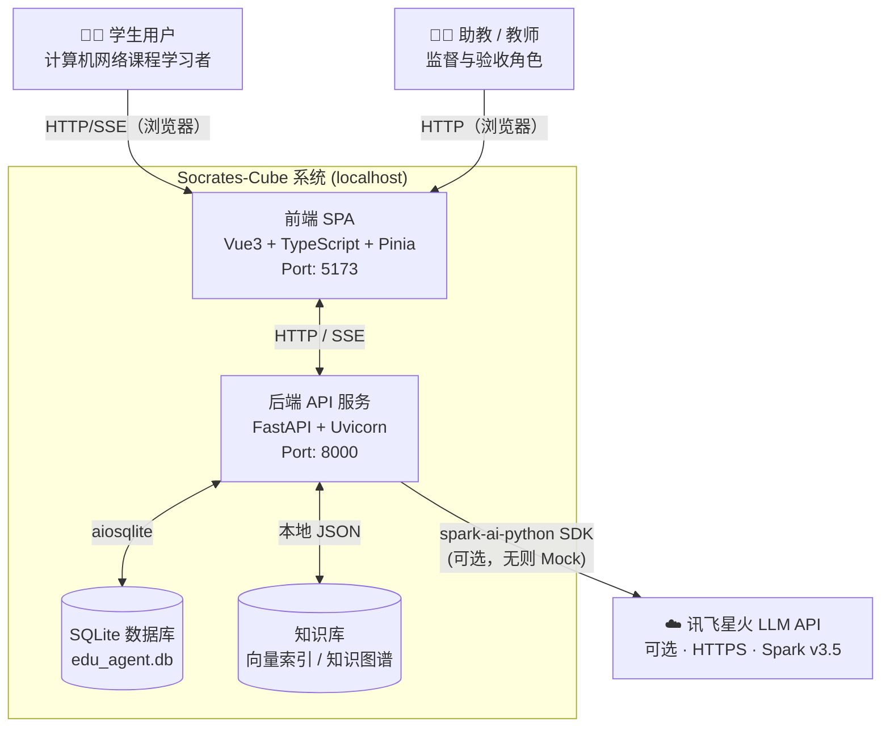
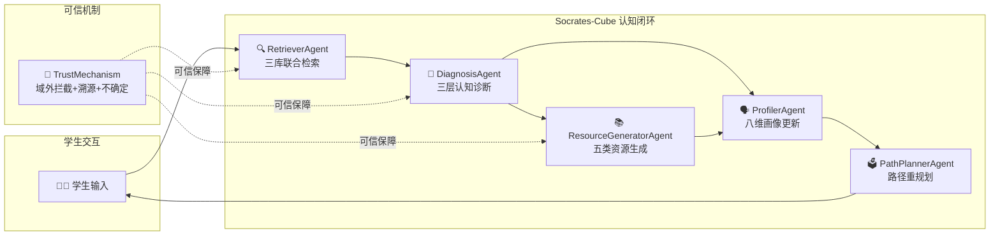
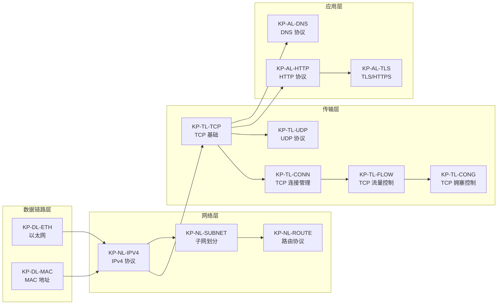

# 软件需求规格说明书

---

| 项目名称 | Socrates-Cube 多智能体自适应网络协议学习系统 |
|----------|----------------------------------------------|
| 文档编号 | SC-SRS-2026-001 |
| 版本号   | V2.0 |
| 编制日期 | 2026-07-20 |
| 文档状态 | 正式发布 |
| 保密级别 | 内部资料 |
| 编制依据 | GB/T 8567-2006《计算机软件文档编制规范》 |

---

## 变更历史

| 版本 | 日期 | 变更说明 | 编制人 |
|------|------|----------|--------|
| V1.0 | 2026-05-17 | 初稿，建立基础需求框架 | A |
| V1.1 | 2026-07-13 | 按标准结构重排，补齐 F01–F08 详细需求 | A |
| V2.0 | 2026-07-20 | 依据 GB/T 8567-2006 全面升级，增加可追溯性矩阵、质量属性与约束 | A+B |

---

## 目录

1. 引言
2. 总体描述
3. 功能需求
4. 外部接口需求
5. 非功能需求（质量属性）
6. 约束与假设
7. 需求可追溯性矩阵
8. 附录

---

## 1 引言

### 1.1 编写目的

本文档是 Socrates-Cube 多智能体自适应网络协议学习系统的软件需求规格说明书，依据 GB/T 8567-2006 编制。文档明确规定系统应具备的全部功能性需求与非功能性需求，作为系统设计、开发、测试及验收的基线依据，供参赛团队成员、评审专家及指导教师使用。

### 1.2 背景

**系统名称：** Socrates-Cube（苏格拉底方块）  
**参赛赛项：** 第十五届"中国软件杯"A3 赛题——基于大模型的个性化资源生成与学习多智能体系统开发  
**出题单位：** 科大讯飞股份有限公司  
**开发背景：**

在高等教育数字化转型背景下，《计算机网络》课程因知识体系庞大、协议机制抽象、学生认知差异显著等特点，传统教学模式难以实现因材施教。本系统以计算机网络协议学习为切入点，融合大语言模型（LLM）、检索增强生成（RAG）、知识图谱、多智能体协同等前沿 AI 技术，构建具备"诊断→检索→生成→规划"完整认知闭环的智能学习系统。

**系统主要特性摘要：**
- 8 个智能体（Agent）协同工作，实现多模态个性化辅学
- 三层递进式认知诊断引擎（表面错误 → 根因分析 → 误区模式）
- 基于知识图谱的可解释学习路径规划
- 5 类多表征学习资源自适应生成
- 7 种协议仿真可视化场景
- 支持在线星火 API 与离线 Mock 双模式运行

### 1.3 定义、首字母缩略词与缩略词

| 术语/缩略词 | 定义 |
|-------------|------|
| Agent | 智能体，具备单一职责的 AI 模块，可感知输入、推理并输出结果 |
| SSE | Server-Sent Events，服务器向客户端推送实时事件流的 HTTP 协议扩展 |
| RAG | Retrieval-Augmented Generation，检索增强生成，将知识库检索与 LLM 生成相结合 |
| LLM | Large Language Model，大语言模型 |
| 三层诊断 | 表面错误识别（L1）→ 根因分析（L2）→ 误区模式匹配（L3）三层递进式认知诊断 |
| 八维画像 | 系统为每位学生维护的知识储备、认知风格、学习进度、协议理解、动手能力、常见错误、学习偏好、综合水平 8 个维度的动态学习画像 |
| KG | Knowledge Graph，知识图谱，描述知识点间前置依赖关系的有向图 |
| Mock 模式 | 系统在未配置外部 LLM API 密钥时自动启用的本地模拟响应模式 |
| SQLite | 轻量级嵌入式关系数据库，用于持久化存储用户、会话、画像等业务数据 |
| ChromaDB | 向量数据库，用于存储和检索嵌入向量化的知识库文档 |
| Vue3 SPA | 基于 Vue 3 框架构建的单页前端应用 |
| Orchestrator | 总协调者 Agent，负责意图识别、多 Agent 调度编排与 SSE 事件发射 |

### 1.4 参考资料

1. GB/T 8567-2006《计算机软件文档编制规范》
2. GB/T 9385-2008《计算机软件用户文档的编制指南》
3. GB/T 15532-2008《计算机软件测试规范》
4. 第十五届"中国软件杯"A3 赛题说明书（科大讯飞，2026）
5. IEEE Std 830-1998《IEEE Recommended Practice for Software Requirements Specifications》
6. 谢希仁《计算机网络》第 8 版，电子工业出版社
7. RFC 793 TCP, RFC 791 IPv4, RFC 1034/1035 DNS, RFC 9293 TCP（更新版）
8. 讯飞开放平台星火大模型 API 文档（https://www.xfyun.cn/doc/spark/）

---

## 2 总体描述

### 2.1 产品视角

Socrates-Cube 是一个独立运行的 Web 应用系统，不依赖任何现有教务系统。系统由前端 SPA、后端 API 服务、多智能体引擎与知识库四部分构成，通过 HTTP/SSE 协议交互。系统外部依赖讯飞星火大模型 API 提供语言理解与生成能力；当 API 不可用时，系统自动降级至 Mock 模式，保证演示稳定性。

**图 1：系统上下文关系图（C4 Level 1）**



> **注**：系统支持完全离线运行（Mock 模式），不强依赖讯飞星火 API。

### 2.2 产品功能概述

系统提供以下八大核心功能模块：

| 功能模块 | 功能摘要 |
|----------|----------|
| **F01 流式智能对话** | 基于 SSE 的实时流式问答，支持多 Agent 协作过程可视化 |
| **F02 知识库联合检索** | 三库联合（课程文档+协议规范+误区库）RAG 检索 |
| **F03 三层认知诊断** | 识别表面错误、根因薄弱点与典型误区模式 |
| **F04 八维学习画像** | 动态维护学生 8 个认知维度的个性化画像 |
| **F05 多 Agent 编排日志** | Orchestrator 调度 7 个专业 Agent，记录执行链路 |
| **F06 五类资源生成** | 一键生成文档/练习/代码/思维导图/视频脚本 5 类资源 |
| **F07 可解释学习路径** | 知识图谱驱动、含三维推荐理由的个性化学习路径 |
| **F08 协议仿真演示** | 7 种网络协议场景的 Canvas 动画交互仿真 |
| **F09 内容可信机制** | 域外拦截 + 引用溯源 + 不确定性声明三重保障 |

**图 2：认知闭环驱动架构图**



**图 3：知识图谱核心结构（部分）**



> **图说**：知识图谱共 100 个节点、82 条依赖边，导向边表示“学习前置关系”。

### 2.3 用户类和特征

| 用户类 | 技术背景 | 主要使用场景 | 优先级 |
|--------|----------|-------------|--------|
| **在校学生** | 计算机网络课程学习者，具备基础网络知识 | 课前预习、课后复习、错题诊断、资源学习 | 主要用户 |
| **课程助教** | 熟悉网络课程内容，有一定技术能力 | 验证系统诊断准确性、查看 Agent 日志 | 次要用户 |
| **授课教师** | 精通计算机网络，关注教学辅助效果 | 评估系统知识库质量、验证创新性 | 评审角色 |
| **大赛评审专家** | 软件工程与 AI 领域专家 | 评估系统完整性、创新价值、技术深度 | 验收角色 |

### 2.4 运行环境约束

| 约束项 | 说明 |
|--------|------|
| 操作系统 | Windows 10/11、Ubuntu 20.04+、macOS 12+（均已验证） |
| Python | 3.10+ |
| Node.js | 18.0+，用于前端构建 |
| 浏览器 | Chrome 90+ / Edge 90+，支持 Canvas 2D API 与 SSE |
| 网络 | 在线模式需能访问讯飞开放平台；离线 Mock 模式无网络要求 |
| 存储 | 最低 2 GB 可用磁盘空间（知识库 + 向量库 + SQLite） |

### 2.5 设计和实现约束

1. 后端使用 Python 异步框架（FastAPI + asyncio），不得使用同步阻塞 I/O。
2. 前端使用 Vue 3 Composition API 与 TypeScript，组件间通信通过 Pinia 状态管理。
3. LLM 调用必须通过 `src/loopse/core/llm_client.py` 统一入口，禁止在 Agent 内直接调用 API。
4. Prompt 模板统一存放 `config/prompts/`，禁止硬编码进业务逻辑。
5. 知识库数据仅用于系统内部教学演示，不得对外商业分发。
6. `.env` 文件及 API 密钥禁止提交至版本库。

### 2.6 假设与依赖

| 假设/依赖 | 说明 |
|-----------|------|
| 网络协议课程范围 | 系统以谢希仁《计算机网络》第 8 版第 1、3、4、5、6 章为知识边界 |
| LLM 服务 | 首选讯飞星火 Spark v3.5；不可用时降级 Mock 模式 |
| 知识库构建 | 首次部署需执行知识库构建脚本，下载 RFC/教材内容 |
| 浏览器兼容 | 假设用户使用现代浏览器，支持 ES2020 与 Canvas 2D |

---

## 3 功能需求

### 3.1 F01 流式智能对话

**需求标识：** F01  
**优先级：** P0（必须实现）

#### 3.1.1 功能描述

系统接收学生自然语言问题，通过 OrchestratorAgent 调度多个专业 Agent 协作处理，以 SSE（Server-Sent Events）事件流方式实时向前端推送处理过程与最终回答。

#### 3.1.2 输入/输出规格

| 项目 | 说明 |
|------|------|
| 输入 | `message`（字符串，不超过 2000 字符）、`user_id`（整数）、`session_id`（UUID 字符串） |
| 输出 | JSON SSE 事件流，包含 `agent_start`、`token`、`diagnosis`、`resource`、`path_update`、`done`、`error` 等事件类型 |
| 接口路径 | `POST /api/v1/chat/stream` |

#### 3.1.3 处理规则

1. 系统根据学生消息意图，由 `AgentCoordinator` 判断需激活的 Agent 子集。
2. 每个 Agent 启动时发送 `agent_start` 事件，完成时发送 `agent_end` 事件，前端可实时展示调用链。
3. LLM 生成的文本通过 `token` 事件逐词推送，实现打字机效果。
4. 整轮处理结束时发送 `done` 事件；出现异常时发送 `error` 事件，不得泄露 API 密钥或完整堆栈。
5. 若讯飞 API 未配置或调用失败，系统自动切换 Mock LLM 响应，不得导致服务崩溃。

#### 3.1.4 验收标准

| 编号 | 验收项 | 通过准则 |
|------|--------|----------|
| AC-F01-1 | 流式输出 | 输入「什么是 TCP 三次握手」后可看到 token 事件逐字输出 |
| AC-F01-2 | Mock 降级 | 未配置 API Key 时仍可收到 Mock 回复，不报 500 错误 |
| AC-F01-3 | 事件完整性 | SSE 流中存在 `agent_start`、`token`、`done` 事件 |
| AC-F01-4 | 错误安全 | 模拟 API 超时场景，`error` 事件不包含密钥信息 |

---

### 3.2 F02 知识库联合检索

**需求标识：** F02  
**优先级：** P0

#### 3.2.1 功能描述

系统构建计算机网络领域专属知识库，包含课程文档、协议规范、误区库三类集合，支持语义向量检索与关键词检索联合召回。

#### 3.2.2 知识库组成规格

| 知识库集合 | 数据来源 | 最低数量要求 | 实际数量 |
|-----------|---------|------------|--------|
| `course_docs` | 谢希仁《计算机网络》第 8 版 5 章 | ≥ 30 文档块 | ≥ 50 块 |
| `protocol_specs` | RFC 793/791/1034/768/8446/9000 等 16 份规范 | ≥ 10 文档块 | ≥ 200 块 |
| `misconceptions` | 人工整理 150 条计算机网络典型误区 | ≥ 20 条 | 150 条 |

#### 3.2.3 检索能力要求

1. **向量检索**：使用 ChromaDB 向量数据库，不可用时自动降级至 `data/vector_db/local_index.json` 本地 JSON 索引。
2. **查询扩展**：对用户问题进行同义词和缩略词扩展后再检索（如 TCP→Transmission Control Protocol）。
3. **知识图谱命中**：当检索词命中知识图谱节点时，同时返回前置依赖节点信息。
4. **结果数量**：单次检索返回 `course_docs` ≥ 3 条、`protocol_specs` ≥ 2 条（如有）、`misconceptions` ≥ 2 条（如有）。

#### 3.2.4 验收标准

| 编号 | 验收项 | 通过准则 |
|------|--------|----------|
| AC-F02-1 | 三库联合检索 | 检索「TCP 三次握手」时三类集合均有返回结果 |
| AC-F02-2 | 降级切换 | 停用 ChromaDB 后系统自动使用本地 JSON 索引，不影响功能 |
| AC-F02-3 | 最低数量 | `misconceptions` 集合 ≥ 20 条，`course_docs` ≥ 30 块 |

---

### 3.3 F03 三层认知诊断

**需求标识：** F03  
**优先级：** P0

#### 3.3.1 功能描述

系统对学生回答进行三层递进式认知诊断，从识别具体错误事实到定位根因知识点、再到归类典型误区模式，形成结构化诊断报告，驱动后续资源生成和路径规划。

#### 3.3.2 三层诊断模型

**第一层 — 表面错误识别（Surface Error Detection）**

| 输出字段 | 类型 | 说明 |
|---------|------|------|
| `is_correct` | Boolean | 学生当前回答是否正确 |
| `surface_error` | String | 具体错误描述（≥ 10 字） |
| `error_type` | Enum | 错误分类：`concept_confusion`（概念混淆）/ `flow_omission`（流程遗漏）/ `factual_error`（事实错误）/ `layer_misplacement`（层次错位）/ `none` |
| `confidence` | Float[0,1] | 诊断置信度 |

**第二层 — 根因分析（Root Cause Analysis）**

| 输出字段 | 类型 | 说明 |
|---------|------|------|
| `root_causes` | List[String] | 导致错误的薄弱前置知识点列表（≥ 1 项） |
| `missing_prerequisites` | List[String] | 需补充的前置知识点 |
| `trigger` | String | 触发诊断的关键语句 |

根因分析必须结合知识库检索证据与知识图谱前置依赖关系，不得凭空生成。

**第三层 — 误区模式匹配（Misconception Pattern Matching）**

| 输出字段 | 类型 | 说明 |
|---------|------|------|
| `pattern` | String/Null | 匹配到的已知误区模式名称 |
| `intervention_suggestion` | String | 可执行的学习干预建议（≥ 20 字） |
| `related_node_ids` | List[String] | 相关知识图谱节点 ID |

优先从 `misconceptions` 集合（150 条）中匹配已知模式；未匹配时允许 LLM 归纳新模式。

#### 3.3.3 诊断输出完整结构

诊断结果必须符合以下 JSON Schema，并同步写入 `agent_logs` 表：

```json
{
  "is_correct": false,
  "confidence": 0.92,
  "surface_error": "学生误认为 TCP 两次握手即可建立连接",
  "error_type": "flow_omission",
  "root_causes": ["TCP 连接管理", "可靠传输机制"],
  "missing_prerequisites": ["全双工通信原理"],
  "trigger": "TCP 需要两次握手",
  "pattern": "握手次数混淆型误区",
  "intervention_suggestion": "建议复习 TCP 连接建立流程，重点理解第三次握手的必要性——服务端需要验证客户端接收能力",
  "related_node_ids": ["KP-TCP-HANDSHAKE", "KP-RELIABLE-TRANSFER"]
}
```

#### 3.3.4 诊断准确率要求

| 错误类型 | 目标准确率 |
|----------|-----------|
| 概念混淆（concept_confusion） | ≥ 85% |
| 流程遗漏（flow_omission） | ≥ 80% |
| 层次错位（layer_misplacement） | ≥ 80% |
| 整体准确率 | ≥ 82% |

#### 3.3.5 验收标准

| 编号 | 验收项 | 通过准则 |
|------|--------|----------|
| AC-F03-1 | 三层结构完整 | 诊断结果包含 `surface_error`、`root_causes`、`pattern` 全部三层字段 |
| AC-F03-2 | 正确识别 | 输入「TCP 两次握手就够了」触发错误诊断；输入正确答案不触发 |
| AC-F03-3 | 误区匹配 | 典型误区输入可匹配到 `misconceptions` 中的已知模式 |
| AC-F03-4 | 诊断写入 | 诊断结果写入 `agent_logs` 表，可通过日志 API 查询 |

---

### 3.4 F04 八维学习画像

**需求标识：** F04  
**优先级：** P0

#### 3.4.1 画像维度规格

| 维度编号 | 维度名称 | 字段名 | 取值范围 | 数据来源 |
|----------|---------|-------|---------|--------|
| D01 | 知识储备 | `knowledge_depth` | 0.0–1.0 | 对话内容分析 |
| D02 | 认知风格 | `cognitive_style` | `visual`/`textual`/`practice`/`mixed` | 资源选择行为 |
| D03 | 学习进度 | `learning_progress` | 0.0–1.0 | 知识图谱完成度 |
| D04 | 协议理解 | `protocol_understanding` | 0.0–1.0 | 诊断结果累积 |
| D05 | 动手能力 | `practical_skill` | 0.0–1.0 | 代码类资源交互 |
| D06 | 常见错误 | `common_mistakes` | 错误类型列表 | 三层诊断积累 |
| D07 | 学习偏好 | `learning_preference` | 资源类型偏好 | 资源使用统计 |
| D08 | 综合水平 | `overall_level` | `beginner`/`intermediate`/`advanced` | 加权综合评估 |

#### 3.4.2 画像更新规则

1. **增量更新**：每轮对话结束后，`ProfilerAgent` 提取对话中的有效信号，增量叠加更新对应维度。
2. **LLM 深度校准**：每 5 轮对话触发一次全量 LLM 校准，对画像进行深层修正。
3. **持久化**：画像以 JSON 格式存储于 SQLite `student_profiles` 表，支持跨会话访问。
4. **知识掌握度地图**：`mastery_map` 字段记录每个知识图谱节点的掌握程度（0.0–1.0）。

#### 3.4.3 验收标准

| 编号 | 验收项 | 通过准则 |
|------|--------|----------|
| AC-F04-1 | 八维完整 | `GET /api/v1/profile/{user_id}` 返回含 8 个维度字段的 JSON |
| AC-F04-2 | 雷达图渲染 | 前端 ProfileRadar 组件可正常渲染雷达图 |
| AC-F04-3 | 增量更新 | 对话后重新查询画像，相关维度数值发生变化 |
| AC-F04-4 | 初始化 | 新用户首次访问画像 API 返回默认值，不报错 |

---

### 3.5 F05 多 Agent 编排与日志

**需求标识：** F05  
**优先级：** P0

#### 3.5.1 Agent 体系

系统包含 8 个智能体，构成以 Orchestrator 为中枢的星形协作架构：

| Agent | 标识 | 主要职责 | 触发条件 |
|-------|------|---------|---------|
| Orchestrator | ORCH | 意图识别、多 Agent 调度、SSE 编排 | 每次对话自动 |
| AgentCoordinator | COORD | 细粒度意图路由，决定激活 Agent 子集 | 由 Orchestrator 调用 |
| Profiler | PROF | 八维画像提取与增量更新 | 每轮对话结束 |
| Retriever | RETR | 三库向量检索与查询扩展 | 需要知识支撑时 |
| Diagnosis | DIAG | 三层认知诊断 | 检测到学生错误时 |
| ResourceGenerator | RGEN | 5 类个性化资源生成 | 诊断完成/用户请求资源 |
| PathPlanner | PATH | 知识图谱驱动路径规划 | 画像更新后/用户请求路径 |
| Challenger | CHAL | 苏格拉底式追问 | 对话中适时追问 |
| Simulator | SIM | 7 种协议仿真场景生成 | 用户请求仿真 |

#### 3.5.2 SSE 事件规格

| 事件类型 | 发送者 | 内容说明 |
|---------|--------|---------|
| `agent_start` | Orchestrator | Agent 开始工作，包含 agent_id、agent_name、timestamp |
| `agent_end` | Orchestrator | Agent 完成工作，包含耗时 |
| `tool_call` | 各 Agent | 调用外部工具（检索/LLM）时 |
| `token` | Orchestrator | LLM 生成的文本 token（流式） |
| `diagnosis` | Diagnosis | 三层诊断结果 JSON |
| `resource` | ResourceGenerator | 资源生成结果 |
| `path_update` | PathPlanner | 路径规划结果 |
| `done` | Orchestrator | 整轮处理完成 |
| `error` | Orchestrator | 异常信息（脱敏后） |

#### 3.5.3 日志要求

1. 每个 Agent 的调用记录（入参摘要、出参摘要、耗时、状态）须写入 `agent_logs` 表。
2. 日志 API `GET /api/v1/logs/session/{session_id}` 可按会话查询。
3. 前端 `AgentLogPanel` 展示日志列表，支持按 Agent 类型筛选与详情展开。

#### 3.5.4 验收标准

| 编号 | 验收项 | 通过准则 |
|------|--------|----------|
| AC-F05-1 | 调用链可见 | SSE 流中可见 Orchestrator → Retriever → Diagnosis 调用链 |
| AC-F05-2 | 日志写入 | 对话后 `agent_logs` 表有对应记录 |
| AC-F05-3 | 日志查询 | 日志 API 可返回该会话的 Agent 调用记录列表 |
| AC-F05-4 | 前端展示 | AgentLogPanel 展示当前会话日志，颜色区分 8 个 Agent |

---

### 3.6 F06 五类学习资源生成

**需求标识：** F06  
**优先级：** P1

#### 3.6.1 资源类型规格

| 资源类型 | 标识 | 适用认知风格 | 生成策略 |
|---------|------|------------|---------|
| 知识文档 | `doc` | `textual` 型学习者 | LLM + RAG 知识增强，含引用溯源 |
| 练习题 | `exercise` | `practice` 型学习者 | 依据 `error_type` 映射题型，难度与掌握度自适应 |
| 代码示例 | `code` | `practice`/`visual` | 协议实现代码 + 注释，语言优先 Python |
| 思维导图 | `mindmap` | `visual` 型学习者 | Mermaid 格式知识点结构图，含层级关系 |
| 视频脚本 | `script` | 全类型 | 分步讲解脚本，含时间轴和关键帧说明 |

#### 3.6.2 生成接口

| 接口 | 说明 |
|------|------|
| `POST /api/v1/resources/generate` | 生成单类资源 |
| `POST /api/v1/resources/generate-all` | 一次性生成全部 5 类资源 |

#### 3.6.3 资源结构规格

每种资源生成结果必须包含以下字段：

```json
{
  "resource_id": "UUID",
  "resource_type": "doc|exercise|code|mindmap|script",
  "knowledge_point": "TCP 三次握手",
  "title": "资源标题",
  "content": "资源正文（Markdown 格式）",
  "metadata": {
    "difficulty": 3,
    "cognitive_style": "textual",
    "source_references": ["谢希仁§5.2", "RFC 793 §3.4"]
  },
  "created_at": "ISO 8601 时间戳"
}
```

#### 3.6.4 验收标准

| 编号 | 验收项 | 通过准则 |
|------|--------|----------|
| AC-F06-1 | 5 类均可生成 | `generate-all` 接口返回含 5 类资源的 JSON 对象 |
| AC-F06-2 | 字段完整 | 每类资源包含 `resource_id`、`content`、`metadata` |
| AC-F06-3 | 内容非空 | `content` 字段长度 ≥ 100 字符 |
| AC-F06-4 | 前端展示 | DocCard/ExerciseCard/CodeCard/MindmapCard/ScriptCard 可正常渲染 |

---

### 3.7 F07 可解释学习路径规划

**需求标识：** F07  
**优先级：** P1

#### 3.7.1 功能描述

系统基于 100 节点 × 82 条有向边的计算机网络知识图谱，采用拓扑排序（Kahn 算法）结合 DFS 前置依赖搜索，为每位学生生成"最短补偿学习路径"。

#### 3.7.2 路径节点规格

每个路径节点须包含：

| 字段 | 类型 | 说明 |
|------|------|------|
| `node_id` | String | 知识图谱节点 ID |
| `name` | String | 知识点名称 |
| `status` | Enum | `completed`/`in_progress`/`pending`/`locked` |
| `current_mastery` | Float[0,1] | 当前掌握度 |
| `recommendation_reason` | String | 推荐理由，不少于 20 字 |
| `reason_sources` | Object | 三维推荐理由（见下） |
| `prerequisites` | List | 前置节点 ID 列表 |
| `prerequisites_met` | Boolean | 前置条件是否已满足 |
| `suggested_resources` | List | 推荐资源 ID 列表 |

**三维推荐理由结构：**

```json
{
  "graph_dependency": "该知识点是TCP拥塞控制的必要前置知识",
  "diagnosis_result": "诊断显示学生在滑动窗口机制上存在概念混淆",
  "cognitive_style": "学生偏好实践类资源，已为此节点推荐代码示例"
}
```

#### 3.7.3 路径规划约束

- 默认路径节点数量 3–6 个，可通过 `max_nodes` 参数配置，最大不超过 20。
- 当学生某节点掌握度 ≥ 0.82 时，触发进阶学习目标推荐。
- 路径规划对空画像不报错，返回基于默认画像的初始路径。

#### 3.7.4 验收标准

| 编号 | 验收项 | 通过准则 |
|------|--------|----------|
| AC-F07-1 | 路径生成 | `POST /api/v1/path/plan` 返回含 ≥ 3 个节点的路径 |
| AC-F07-2 | 三维理由 | 每个节点的 `reason_sources` 包含三个维度 |
| AC-F07-3 | 空画像容错 | 新用户调用路径 API 不报错 |
| AC-F07-4 | 前端渲染 | PathTimeline 与 PathReasonModal 正常展示 |

---

### 3.8 F08 协议仿真演示

**需求标识：** F08  
**优先级：** P1

#### 3.8.1 仿真场景规格

| 场景编号 | 场景名称 | 核心动画要素 |
|---------|---------|------------|
| SIM-01 | TCP 三次握手 | SYN → SYN+ACK → ACK 三步报文交互 |
| SIM-02 | TCP 四次挥手 | FIN → ACK → FIN → ACK 四步终止流程 |
| SIM-03 | TCP 滑动窗口 | 发送窗口滑动、确认机制、超时重传 |
| SIM-04 | HTTP 请求响应 | GET/POST 请求 → 服务器响应完整流程 |
| SIM-05 | HTTP 分层封装 | 应用层 → 传输层 → 网络层 → 数据链路层封装过程 |
| SIM-06 | DNS 解析过程 | 递归查询：客户端 → 本地 DNS → 根 DNS → TLD → 权威 DNS |
| SIM-07 | TCP 拥塞控制 | 慢开始 → 拥塞避免 → 快重传 → 快恢复 状态机 |

#### 3.8.2 交互功能要求

仿真播放器须支持以下交互：

| 功能 | 说明 |
|------|------|
| 播放/暂停 | 控制动画播放 |
| 单步步进 | 按帧推进，方便教学讲解 |
| 速度调节 | 0.5×、1×、2× 三档 |
| 重置 | 回到初始状态 |
| 进度拖拽 | 跳转到指定帧 |
| 参数调节 | TCP 场景支持调节窗口大小（512–65535B）、RTT（1–1000ms） |
| 报文详情 | 点击报文显示字段详情弹窗 |

#### 3.8.3 验收标准

| 编号 | 验收项 | 通过准则 |
|------|--------|----------|
| AC-F08-1 | 7 场景可用 | 全部 7 个场景动画可正常播放 |
| AC-F08-2 | 步进控制 | 步进功能正常，每帧转换流畅 |
| AC-F08-3 | 参数影响 | 调节窗口大小后仿真结果发生对应变化 |
| AC-F08-4 | 报文详情 | 点击报文气泡弹出报文字段详情 |

---

### 3.9 F09 内容可信机制

**需求标识：** F09  
**优先级：** P0

#### 3.9.1 三重可信保障

**（1）域外拦截**

系统识别非计算机网络课程相关问题并拒绝回答：

| 规则 | 处理方式 |
|------|---------|
| 消息含 ≥ 2 个网络关键词 | 放行 |
| 匹配编程问答、娱乐、翻译等越界模式 | 拒答，提示课程范围 |
| 无法确定类型 | 宽松放行（避免误拦） |

**（2）引用溯源**

- LLM 生成回答末尾自动追加"参考来源"列表，包含来源名称与关键片段。
- 回答中适当位置插入 [1][2] 格式引用标记。
- 单条回答最多引用 5 个来源。

**（3）不确定性声明**

| 触发条件 | 处理方式 |
|---------|---------|
| 诊断置信度 < 0.6 | 自动追加「以上内容仅供参考」声明 |
| LLM 质量评分 < 0.5 | 追加质量警告 |
| 知识库检索结果为空 | 提示「未找到相关知识点」 |

#### 3.9.2 验收标准

| 编号 | 验收项 | 通过准则 |
|------|--------|----------|
| AC-F09-1 | 域外拦截 | 输入「帮我写排序算法」被拦截，输入网络问题正常回答 |
| AC-F09-2 | 引用溯源 | 回答末尾出现「参考来源」章节，含来源名称 |
| AC-F09-3 | 不确定性声明 | 低置信度回答包含相应声明 |

---

## 4 外部接口需求

### 4.1 用户界面

系统前端为基于 Vue 3 的单页应用（SPA），提供以下主要页面：

| 页面路由 | 页面名称 | 主要功能 |
|---------|---------|---------|
| `/` 或 `/chat` | 智能对话主页 | 问答输入、SSE 流式回答、Agent 状态栏、附属面板 |
| `/profile` | 学习画像 | 八维雷达图、成长曲线、知识掌握度地图 |
| `/diagnosis` | 认知诊断 | 三层诊断触发与结果展示 |
| `/resources` | 学习资源 | 5 类资源生成与展示 |
| `/path` | 学习路径 | 知识图谱路径时间轴与推荐理由 |
| `/simulator` | 协议仿真 | 7 场景仿真播放器 |
| `/challenger` | 概念挑战 | 苏格拉底式追问对话 |
| `/logs` | Agent 日志 | 多 Agent 执行日志面板 |

界面需满足：流式输出（打字机效果）、Markdown 渲染、多模态内容卡片化展示，最低支持 1280px 宽度。

### 4.2 硬件接口

系统为 Web 应用，无特殊硬件接口要求，通过标准键鼠和屏幕操作。

### 4.3 软件接口

| 外部软件 | 接口类型 | 说明 |
|---------|---------|------|
| 讯飞星火 API | HTTPS WebSocket | LLM 推理，可选，未配置时 Mock 降级 |
| ChromaDB | 本地 Python API | 向量检索，可选，未安装时 JSON 降级 |
| SQLite | Python SQLAlchemy ORM | 数据持久化，必选 |
| Vue 前端 | HTTP REST + SSE | 前后端通信 |

### 4.4 通信接口

| 协议 | 用途 |
|------|------|
| HTTP/1.1 | 常规 REST API 调用 |
| SSE (text/event-stream) | 流式对话推送 |
| WebSocket（可选） | 讯飞星火 API 连接 |

---

## 5 非功能需求（质量属性）

### 5.1 性能需求

| 编号 | 需求描述 | 目标值 |
|------|---------|-------|
| NFR-P01 | 健康检查响应时间 | < 100 ms |
| NFR-P02 | SSE 首个 token 延迟（Mock 模式） | < 500 ms |
| NFR-P03 | 知识库单次检索时间 | < 200 ms（本地 JSON 模式）|
| NFR-P04 | 5 类资源全量生成时间（Mock 模式） | < 3 s |
| NFR-P05 | 协议仿真场景加载时间 | < 1 s |
| NFR-P06 | 前端首屏加载（CDN 已缓存） | < 2 s |

### 5.2 可靠性需求

| 编号 | 需求描述 |
|------|---------|
| NFR-R01 | ChromaDB 不可用时自动降级本地 JSON 索引，不中断服务 |
| NFR-R02 | 讯飞 API 超时/失败时自动切换 Mock 模式，不崩溃 |
| NFR-R03 | 单 Agent 执行失败时 Orchestrator 继续执行，返回部分结果 |
| NFR-R04 | SSE 连接中断时前端自动重连（最多 3 次） |
| NFR-R05 | 数据库写入失败时事务回滚，日志记录完整 |

### 5.3 安全需求

| 编号 | 需求描述 |
|------|---------|
| NFR-S01 | `.env`、数据库文件禁止提交至 Git |
| NFR-S02 | SSE `error` 事件禁止泄露 API Key 或完整堆栈信息 |
| NFR-S03 | JWT Token（如已实现）有效期 ≤ 24 小时 |
| NFR-S04 | 用户密码使用 bcrypt 哈希存储 |
| NFR-S05 | 知识库内容仅用于教学演示，不作商业分发 |

### 5.4 可维护性需求

| 编号 | 需求描述 |
|------|---------|
| NFR-M01 | Prompt 模板外置于 `config/prompts/`，支持无需改动代码热更新 |
| NFR-M02 | 单元测试覆盖 DiagnosisAgent、ResourceGenerator、LLM Client 等核心模块 |
| NFR-M03 | 新环境克隆项目后按 README 操作，可在 30 分钟内完成部署 |
| NFR-M04 | Python 代码遵循 PEP 8，核心 Agent 模块补充 docstring |

### 5.5 可移植性需求

| 编号 | 需求描述 |
|------|---------|
| NFR-PT01 | 支持 Windows / macOS / Linux 三种操作系统 |
| NFR-PT02 | 核心 Python 依赖不包含 C 扩展编译要求（ChromaDB 为可选） |
| NFR-PT03 | 前端构建产物静态文件可通过任意 Web 服务器（Nginx/Node）托管 |

---

## 6 约束与假设

### 6.1 标准符合性

- 本系统按 GB/T 8567-2006 进行软件文档管理。
- 软件开发过程符合软件工程基本规范（版本控制、代码审查、单元测试）。
- AI 工具使用符合赛题要求：核心 AI 能力使用科大讯飞相关工具（讯飞星火）。

### 6.2 技术约束

- 多智能体框架为自研实现，参考清华 OpenMAIC 架构模式；不依赖 LangChain 等重型框架（已移除）。
- 知识库构建脚本需在有网络的环境下首次执行（下载 RFC 等公开资料）。
- 视频生成功能（VideoGen）依赖 Seedance API，为可选加分项，不影响核心功能评估。

### 6.3 假设条件

1. 系统演示环境运行在普通笔记本电脑（8GB RAM+，无 GPU 要求）。
2. Mock 模式可完全替代真实 LLM，覆盖所有核心评审场景。
3. 知识图谱包含 100 个节点、82 条边，覆盖计算机网络 6 个章节。

---

## 7 需求可追溯性矩阵

| 功能需求 | 对应 A3 赛题硬指标 | 对应系统模块 | 对应测试用例前缀 |
|---------|-----------------|------------|--------------|
| F01 流式对话 | 多智能体协同机制 | OrchestratorAgent, SSE | TC-CHAT |
| F02 知识库检索 | 自建课程知识库 | RetrieverAgent, KB | TC-RETR |
| F03 三层认知诊断 | 学习效果评估（加分项）| DiagnosisAgent | TC-DIAG |
| F04 八维学习画像 | ≥6 维学生画像 | ProfilerAgent | TC-PROF |
| F05 多 Agent 编排 | 多智能体协同机制 | OrchestratorAgent | TC-ORCH |
| F06 五类资源生成 | ≥5 类个性化资源 | ResourceGeneratorAgent | TC-RGEN |
| F07 学习路径规划 | 个性化学习路径规划 | PathPlannerAgent | TC-PATH |
| F08 协议仿真 | 功能实现及技术要求（创新项）| SimulatorPlayer | TC-SIM |
| F09 可信机制 | 防幻觉与内容安全 | TrustMechanism | TC-TRUST |

---

## 8 附录

### 附录 A 术语表

| 术语 | 定义 |
|------|------|
| Agent | 具备单一职责的 AI 模块，可感知输入并输出结构化结果 |
| SSE | Server-Sent Events，基于 HTTP 的服务端推送协议 |
| RAG | 检索增强生成，将向量检索与大语言模型生成结合的技术架构 |
| 认知诊断 | 对学习者知识理解状态的系统性评估，包含错误识别、根因分析和误区归类 |
| 知识图谱 | 描述计算机网络知识点及其前置依赖关系的有向无环图 |
| Mock 模式 | 无外部 LLM API 时的本地模拟响应模式，用于离线演示 |
| 误区库 | 收录 150 条计算机网络典型学生误解与错误模式的结构化数据库 |

### 附录 B 变更历史

| 版本 | 日期 | 变更说明 |
|------|------|---------|
| V1.0 | 2026-05-17 | 初稿 |
| V1.1 | 2026-07-13 | 标准结构重排，补齐 F01–F08 |
| V2.0 | 2026-07-20 | 依据 GB/T 8567-2006 全面升级：增加可追溯性矩阵、质量属性、完整接口规格与 JSON Schema |
